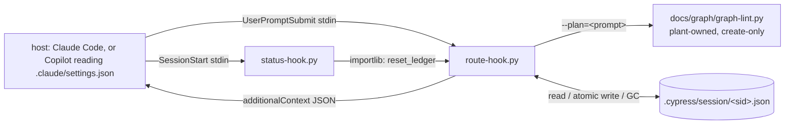

# grill — context residency (7.28.0)

**Status:** planned, nothing implemented. The ADR this plan calls for is not
written yet (§10, close slice).
**Baseline commit:** `5a1ca2c` (7.26.0). This increment lands **after** 7.27.0
(host support tiers, [ADR-0009](../decisions/adr-0009-host-support-tiers.md),
branch `hosts/support-tiers`) and reads its tier table as settled.
**Tier:** T3. It changes the text two hooks inject into every session, adds
persisted runtime state inside a plant, and records a method rule.
**Harvest:** owner-authorized, "Context Residency": how information enters a
session and how long it stays there.

This file is the plan-of-record and the ledger for the harvest. §2 is the
ledger of every text source that can enter a session. §4 is the hook contract
the tester writes RED tests against and the implementer makes green. §8 and §9
are the test changes. A slice that lands without updating §14 is a defect in
the slice.

Line numbers were read at `5a1ca2c` and will drift as edits land.

## §0 Baseline record (Phase 0)

Every figure below was verified in the Phase 0 session. The measurement scripts
live in the session scratchpad under `measure/` and are disposable; they are
named so the implementing session can re-run them, not so anything depends on
them.

### §0.1 Gate

`bash tests/run.sh` at `5a1ca2c`, non-root: **48/48 steps pass, 34 s.** The
`test-install-adoption` case `case_check_broken`, known red in an earlier
session, passes, so no fix is planned for it.

### §0.2 Eager surface

| Surface | Bytes |
|---|---|
| claude-code, opencode, codex (the codex figure is a ceiling, matrix footnote 4) | 26,261 |
| prime-agent | 24,094 |
| github-copilot | 31,905 |
| kernel `core/AGENTS.md` | 7,752 |
| agent `description` total | 10,079 |
| skill `description` total | 8,430 |

35 items, median 548 B, mean vocabulary overlap 0.691. Two derived figures used
in §2: the Prime Agent `APPEND_SYSTEM.md` overlay is 24,094 − 7,752 − 8,430 =
**7,912 B**, and Copilot's pointer boilerplate is 31,905 − 26,261 = **5,644 B**.
Both are subtractions over the formula in `check_eager_surface`, not separate
measurements.

**This plan claims no eager saving.** The eager surface stays at 26,261 B on
claude-code (§1.1, decision 1).

### §0.3 Per-prompt injection

A scripted 20-prompt session (`measure/prompts.json`, drawn from plant commits,
grill increments and one real session prompt), driven through an installed
plant's `.claude/route-hook.py` by `measure/session.py`:

| Measure | Value |
|---|---|
| total injected over 20 prompts | **69,408 B** |
| per non-trivial prompt | about 3.5 KB (2,298 to 4,561 B in the rows read) |
| trivial prompts | 1, injecting 0 B |
| exit codes | all 0 |

Every non-trivial row repeats the same mandate paragraph (about 0.5 KB by
inspection; the script gives the exact count). The router's LOAD set repeats
across rows: `root` and `skill.knowledge-graph` appear in 14 of the 15 rows
read, `subsystem.graph-linters` in most. The NOT LOADED list is the largest
block in most rows and repeats the same peers.

### §0.4 Defects found

1. **Prompt echo.** `route-hook.py:144` strips two lines of
   `graph-lint --plan` output (`out.stdout.split("\n", 2)[-1]`). `--plan`
   prints `task: <prompt>` followed by a blank line
   (`templates/knowledge-graph/graph-lint.py:1225`), so a prompt of k lines
   leaves k − 1 lines of itself in the injection. A 6,010 B multi-line prompt
   produced a 10,070 B injection carrying the prompt verbatim. Several 12 to
   25 KB injections were observed in-session. The Prime Agent twin has the same
   defect: `route-extension.ts:89` takes `.slice(2)` of the lines.
2. **The mandate restates the kernel.** `route-hook.py:127-136` and
   `route-extension.ts:50-58` restate kernel FIRST MOVE and the §0 tier table on
   every prompt. That violates I-8 (§3).
3. **`status-hook.py` ignores `source`.** It injects on every `SessionStart`
   whatever the source (`status-hook.py:84-100`). For the status summary this
   is correct, since context was lost; it matters here because nothing resets
   per-session state today.

### §0.5 Host facts this plan relies on

From the Phase 0 host research pass. The seed's own home for per-host facts is
`documentation/host-capability-matrix.md`; this is the subset the design uses.

| Host | Session id on the per-prompt hook | Reset signal |
|---|---|---|
| claude-code | `session_id`, a common field on every hook | `SessionStart.source` ∈ `startup`, `resume`, `clear`, `compact`, `fork`; `PreCompact` and `PostCompact` also exist |
| github-copilot (reads `.claude/settings.json`) | `session_id` documented as **optional** | `SessionStart.source` is always `"new"` |
| prime-agent | none on `before_agent_start` | `session_start` with `reason` ∈ `startup`, `reload`, `new`, `resume`, `fork`; compaction is a separate `session_compact` event |
| opencode | no per-prompt hook ships; the plugin API documents session events but no per-prompt injection with an id | not applicable |
| codex | upstream documents `session_id` and a `source` enum | frozen by ADR-0009; nothing wired |

Not stated upstream for Claude Code: whether `session_id` keeps its value
across `/clear`. The design does not depend on it (§4.5).

### §0.6 Is `.cypress/` gitignored in an installed plant?

**No.** Verified from `install.sh`:

- The installer never writes the target's `.gitignore`. No write site names it.
- `.cypress/seed.json` is meant to be committed. `install.sh:2263` logs
  "seed stamp … commit it", and `install.sh:2122-2123` says the stamp is
  "Tracked, like the coverage record beside it; `.cypress/growth/` is the
  transient scratch and stays ignored".
- The `.gitignore` that carries `.cypress/` is the **seed's own**
  (`.gitignore:17`), which `install.sh:1731` and `:1746` refer to. The plant
  this harvest came from ignores `.cypress/growth/` only and tracks the rest.

So a ledger written to `.cypress/session/` would show up as untracked files in
every plant. **What must change:** the hook makes the directory ignore itself.
On first creation it writes `.cypress/session/.gitignore` containing `*`. That
keeps I-7 without editing a plant-owned `.gitignore` and without a new
installer write site. The alternative, appending to the plant's `.gitignore`
from `install.sh`, is rejected in §4.6.

## §1 Owner decisions and the ledger they open

### §1.1 Decisions already taken

These are transcribed from the owner and are not re-opened here.

1. **Re-scope: Slices B and C are parked.** B would have shortened agent
   `description`s to pointers, C skill `description`s. The evidence:
   `integrations/claude-code/agent-lint.py` scores the agent `description`
   (`score()` `:718-745`, `_overlap` `:1024`). Truncating every agent
   description to 120 characters in memory moved `--eval` from rc 0 to rc 1.
   Paraphrase confident-correct fell 4 → 2, below `PARAPHRASE_FLOOR` 4.
   Adversarial confident-wrong rose 3 → 4, over its budget of 3. That breaks
   I-5. `check_charter_vocabulary` (`tests/seed-lint.py:721-748`,
   `CHARTER_VOCAB_DEBT = 12`, zero slack) also depends on the description: 14
   words are covered only by it. Three options are recorded for later and not
   chosen: (a) the router scores a body section the description moves into;
   (b) skills only; (c) leave both.
2. **In scope:** Slice A (route-hook session ledger, dedup, prompt-echo fix),
   Slice D (host reach, reduced by ADR-0009), Slice E (the Residency Rule in
   `skills/context-router/SKILL.md`, provided its `owns:` covers context
   economics; no new node, no kernel edit).
3. **Slice D under ADR-0009.** prime-agent and opencode get the equivalent only
   where the host natively exposes a session id and a reset signal; otherwise
   the gap is recorded in `documentation/host-capability-matrix.md`. codex and
   github-copilot are frozen and get nothing new, but the Claude Code hooks must
   keep failing open for Copilot, which reads `.claude/settings.json`.
   *Amended 2026-09-23 for prime-agent by a later owner decision; see §16.*
4. **Harness-native selection measurement: proposed NOT RUN.** Neither the eager
   surface nor the first-prompt router suggestion changes materially. The only
   first-prompt change is the mandate becoming a pointer. Recorded as an absence
   in §11. The owner may override.

### §1.2 Entries

| # | Entry | Disposition |
|---|---|---|
| CR-1 | multi-line prompts are echoed back into the injection | Slice A (claude-code), Slice D (prime-agent) |
| CR-2 | the per-prompt mandate restates kernel FIRST MOVE and §0 | Slice A, Slice D |
| CR-3 | the router suggestion re-injects nodes already surfaced this session | Slice A |
| CR-4 | nothing resets per-session state on resume, clear or compaction | Slice A (`status-hook.py`) |
| CR-5 | no written rule says how long text should stay in a session | Slice E |
| CR-6 | Prime Agent has no session id on its per-prompt event | recorded gap (§5); owner question §13.1 |
| CR-7 | the plant's `spec-lint` lost three contract slugs in `tests/test-seed-lint.sh` | Slice P0 |
| CR-8 | agent and skill descriptions as pointers | parked (§1.1, decision 1) |

## §2 The context ledger

### §2.1 Residency classes, and the test that places a source

A source is placed by answering these in order and stopping at the first yes.

| Class | Name | Placing test | Consequence |
|---|---|---|---|
| 1 | **Resident** | Does every turn need it, and would a missing copy fail silently? | In view all session. Kept small; never restated elsewhere. |
| 2 | **Pointer** | Must the model see it before the task is known, to choose what to open? | One line per item, eager, naming where the depth lives. |
| 3 | **Once per session** | Is it derived from the task or the plant, and stable for the rest of the session? | Surfaced once, then referred to by id; surfaced again after a reset. |
| 4 | **On demand** | Otherwise. | Enters only when the task routes to it. |

**Spawn-boundary exception.** A spawned worker starts with an empty context and
receives no hook output (hooks do not cross the spawn boundary,
`status-hook.py:13-15`). Text that crosses into a spawn is Class 1 for that
context and is sent in full every time. Dedup never applies across the
boundary, which is why I-2 exists.

### §2.2 Table

"Size" is bytes where Phase 0 measured it, and "not recorded" where it did not.

| # | Source | Surface | Hosts | Size | Frequency | Duplicates | Consumers | Class (placing test) | Disposition | Verification | Status |
|---|---|---|---|---|---|---|---|---|---|---|---|
| L-1 | Kernel | `CLAUDE.md` / `AGENTS.md` / `.github/copilot-instructions.md` | all five | 7,752 B | session start, resident | none of its own; restated by L-4 | main session | 1: every turn needs the tier table and rule anchors, and a missing copy fails silently | keep, untouched | `KERNEL_BUDGET` in `tests/seed-lint.py` | out-of-scope: the kernel is not edited by this harvest |
| L-2 | Agent descriptions | roster frontmatter projected per host | claude-code, opencode, codex (reach unknown), copilot; not prime-agent (no roster) | 10,079 B | session start | overlaps each charter's `routing_triggers` | host auto-delegation, `agent-lint --route` and `--eval`, `check_charter_vocabulary` | 2: routing reads it before the task is known | keep as is | I-5: `--eval` output identical to `measure/eval-baseline.txt` | parked (Slice B, §1.1 decision 1) |
| L-3 | Skill descriptions | skill listing | all five (codex listing behaviour unknown) | 8,430 B | session start | none measured | host skill selection | 2: selection reads it before the task is known | keep as is | eager figures via `check_eager_surface` | parked (Slice C, §1.1 decision 1) |
| L-4 | Per-prompt mandate | `route-hook.py:127-136`, `route-extension.ts:50-58` | claude-code, copilot (via settings.json), prime-agent | about 0.5 KB | every non-trivial prompt | restates kernel FIRST MOVE and §0 (L-1) | main session | 3 at most, and only as a pointer; the rule itself is Class 1 in L-1 | replace with a one-line pointer to kernel FIRST MOVE and §0 | I-8 check (§8, `HOOK_TEXT_RESTATES_NO_KERNEL_RULE`) and the golden outputs in §4.3 | open (A, D) |
| L-5 | Router suggestion | `graph-lint --plan` output via the hook | claude-code, copilot, prime-agent | 2.3 to 4.6 KB per prompt | every non-trivial prompt | node lines repeat across prompts (§0.3) | main session | 3 per node id: task-derived, and a node's title does not change within a session | dedup by the session ledger; full refresh every N prompts and after any reset | contracts `LEDGER_*` in §4.3 | open (A) |
| L-6 | Prompt echo | leftover `task:` lines of `--plan` | claude-code, copilot, prime-agent | 0 for one line; up to the whole prompt for multi-line (6,010 B prompt → 10,070 B) | every multi-line prompt | the user's own prompt, already in context | nobody | none: text that already resides must not re-enter | remove | `ROUTE_HOOK_STRIPS_MULTILINE_PROMPT_ECHO` | open (A, D) |
| L-7 | Status summary | `status-hook.py`, `status-extension.ts` | claude-code, copilot, prime-agent | not recorded | each `SessionStart` (prime-agent: once per process) | none | main session | 3: plant-derived, stable within a session | keep; its re-fire after resume, clear and compaction is correct under the rule | existing fail-open test (ADR-0009 `CLAUDE_HOOKS_FAIL_OPEN_ON_COPILOT_ENVELOPE`) | open (A: the hook gains the ledger reset only) |
| L-8 | Protocol and skill bodies | `docs/graph/**` nodes | all five | per node `est_tokens`; total not recorded here | on demand | one home per fact, linted | main session and workers | 4 | keep | `graph-lint` fact-key uniqueness | out-of-scope: already on demand |
| L-9 | Corpora | corpus pages | all five | not recorded | on demand | one home per entry | `legal`, `research-scout`, others | 4 | keep | corpus lints | out-of-scope: already on demand |
| L-10 | Delegation brief block | `templates/prompts/graph-session-bootstrap.md`, embedded in every brief | all hosts that spawn | not recorded; hashes in `measure/brief-baseline.sha` | once per spawn | by design, once per spawn | spawned worker | 1 inside the spawn (spawn-boundary exception) | keep byte-identical | I-2: sha256 equal to `measure/brief-baseline.sha`; existing canonical-block identity check | out-of-scope: no change |
| L-11 | Handback template | `templates/prompts/handback-payload.md`, named in every brief | all hosts that spawn | not recorded | once per spawn | by design | spawned worker, then the orchestrator | 1 inside the spawn (exception) | keep | I-2 as L-10 | out-of-scope: no change |
| L-12 | Prime Agent `APPEND_SYSTEM.md` overlay | `.prime/agent/APPEND_SYSTEM.md` | prime-agent | 7,912 B (derived, §0.2) | session start | not audited against the kernel | main session | 1 | keep | eager figure via `check_eager_surface` | out-of-scope: an I-8 audit of an eager surface is its own pass (§12) |
| L-13 | Copilot pointer files | `.github/instructions/*-skill.instructions.md` | github-copilot | 5,644 B boilerplate (derived, §0.2) | session start | one boilerplate block per skill | Copilot | 2 | keep | eager figure via `check_eager_surface` | out-of-scope: frozen host (ADR-0009) |
| L-14 | "No knowledge graph found" message | `route-hook.py:121-124`, `route-extension.ts:68-77` | claude-code, copilot, prime-agent | about 0.2 KB | every non-trivial prompt, only while no graph exists | repeats per prompt | main session | 3 | keep; the ledger is not used without a graph, since there are no router ids to key on | `test-entry-paths.sh` fork co-occurrence (unchanged) | out-of-scope: pre-graph only |

## §3 Invariants, and where each is enforced

No new linter, tool or gate. Each invariant lands in a suite already wired into
`tests/run.sh`, or in `tests/seed-lint.py`.

| Id | Invariant | Enforced by |
|---|---|---|
| I-1 | Dedup fails toward inclusion. No session id, an unusable ledger (corrupt, unknown version, expired, oversized, wrong session), or a reset each produce a full injection. | `LEDGER_ABSENT_SESSION_ID_FULL`, `LEDGER_INVALID_SESSION_ID_FULL`, `LEDGER_CORRUPT_FULL`, `LEDGER_UNKNOWN_VERSION_FULL`, `LEDGER_EXPIRED_FULL`, `STATUS_HOOK_RESETS_LEDGER` in `tests/test-bound-hook.sh` |
| I-2 | Spawn briefs are byte-identical to baseline. | existing canonical-block identity check in `tests/seed-lint.py`, plus a sha256 comparison against `measure/brief-baseline.sha` recorded at verify. No slice edits `templates/prompts/`. |
| I-3 | Nothing loses discoverability. | `LEDGER_EVERY_LOAD_ID_NAMED` |
| I-4 | One home per text. | the ledger contract lives only in `route-hook.py` (§4.1); the rule text only in the skill (§6); existing one-home checks in `seed-lint.py` |
| I-5 | `agent-lint --eval --dir agents` output is identical to baseline. | the existing `--eval` gate step, plus a diff against `measure/eval-baseline.txt` recorded at verify. No agent file changes. |
| I-6 | The hook says "surfaced earlier this session", never "loaded". | exact golden output in `LEDGER_LATER_PROMPT_REMINDER` |
| I-7 | The ledger lives only at `<plant>/.cypress/session/<session_id>.json`, gitignored, bounded, garbage-collected by the hook, written atomically, and never read as instructions. | `LEDGER_GITIGNORED`, `LEDGER_GC_BOUNDED`, `LEDGER_SYMLINK_REFUSED`, `LEDGER_NEVER_EMITS_UNROUTED_ID`, `LEDGER_WRITE_FAILURE_FAILS_OPEN` |
| I-8 | No per-prompt text restates a kernel rule. | new `check_hook_text_restates_no_kernel_rule` in `tests/seed-lint.py`, with a planted case in `tests/test-seed-lint.sh` |

The router's own words `LOAD` and `NOT LOADED` stay in the full injection. They
are the router's recommendation vocabulary, not a claim by the hook about what
the model has read, so I-6 does not reach them.

## §4 Slice A: the route-hook session ledger

### §4.1 Boundaries



Crossings: **UI/transport** (the hook stdin and stdout envelope, unchanged in
shape); **persistence** (the ledger, new); **domain** (the dedup decision, pure);
**external** (`graph-lint.py` stdout, a text contract with a plant-owned file).

- **One owner for the ledger.** `route-hook.py` owns the path rule, the schema,
  validation, GC and reset. `status-hook.py` loads `reset_ledger` from its
  sibling `route-hook.py` with `importlib` (both sit side by side in
  `.claude/`, and in `.github/hooks/` for the frozen Copilot projection) and
  calls it. It does not carry a second copy of the path rule or the id regex.
  If the import fails, `status-hook.py` writes one stderr line and goes on with
  its summary.
- **The dedup decision is a pure function** of (router ids, ledger, N), kept
  apart from file I/O in the script so the RED tests can pin it through the CLI
  without timing races.
- **`graph-lint.py` is not changed.** It is placed add-if-missing and only
  reconciled by graft, so a flag added there would not reach existing plants.
  The hook must work with the output format at `graph-lint.py:1225-1239`.
- **`settings.json` is not changed.** No new hook event is wired (§4.5).

### §4.2 Data shapes

**Ledger file, version 1.** Path: `<ROOT>/.cypress/session/<session_id>.json`,
where `ROOT` is the directory `find_lint()` already resolves.

```json
{
  "version": 1,
  "session_id": "3b9f1c2e-5d4a-4e8b-9a61-0c7f2d8e1a44",
  "prompt_count": 4,
  "surfaced": ["root", "skill.knowledge-graph", "subsystem.graph-linters"],
  "peers_seen": ["agent.implementer", "domain.frontmatter"],
  "last_reset": {"source": "compact", "at": "2026-09-23T10:00:00Z"}
}
```

| Field | Rule |
|---|---|
| `version` | integer, exactly `1`. Any other value is an unknown version. |
| `session_id` | equals the filename stem and the stdin `session_id`. A mismatch makes the ledger unusable. |
| `prompt_count` | integer ≥ 0: non-trivial prompts answered since the last full injection, that one included. `0` means a reset was recorded and nothing has been injected since. |
| `surfaced` | ids that appeared in a LOAD block of an injection, so their title line was shown. Sorted, unique, at most `SURFACED_MAX` = 512. |
| `peers_seen` | ids that appeared only in a NOT LOADED block. Same bounds. |
| `last_reset` | `null`, or `{source, at}`: `source` is the stdin `source` (at most 32 characters of `[a-z_-]`, else `"unknown"`), `at` is ISO-8601 UTC. Informational. |

Validation. Every id matches `^[a-z][a-z0-9_.-]{0,127}$`. The key set is
exactly the six above. The file is a regular file (checked with `lstat`) of at
most `LEDGER_MAX_BYTES` = 64 KiB. Failing any rule makes the ledger
**unusable**, and an unusable ledger is treated as absent (I-1).

**Session id acceptance.** The stdin `session_id` is used only if it matches
`^[A-Za-z0-9][A-Za-z0-9_-]{0,127}$`. Anything else, `../x` included, counts as
no session id. This rule is what keeps a hostile or malformed id from naming a
path outside the session directory.

**Constants, one home each, in `route-hook.py`:** `LEDGER_VERSION = 1`,
`REFRESH_EVERY` (N, §4.7), `LEDGER_TTL` = 12 h, `GC_MAX_AGE` = 7 days,
`GC_MAX_FILES` = 32, `LEDGER_MAX_BYTES` = 64 KiB, `SURFACED_MAX` = 512.

**Router output, parsed.** From `graph-lint --plan` stdout, once the exact
prefix `task: <prompt>\n\n` is removed: notice lines (`  ! …`), the
`LOAD (…):` header and its entry lines (`  <id> <title>` plus an optional
`   <- composed by …`), then an optional `NOT LOADED (…):` header and its entry
lines (`  <id> <reason>`). The id is the first whitespace-delimited token of an
entry line and must match the id regex.

**Injection texts.** These are exact; the RED tests compare against them.

- Pointer line, used in every mode that has a graph:
  `Route first: the kernel's FIRST MOVE and §0 apply to this prompt.`
- Full mode: the pointer line, a blank line,
  `Router suggestion (a keyword heuristic — reason over it):`, then the router
  output with the prompt echo removed.
- Reminder mode, in this order, leaving out any empty part:
  1. the pointer line;
  2. the router's notice lines, verbatim;
  3. `New for this task: <ids>`, followed by each of those ids' LOAD entry lines
     verbatim;
  4. `Surfaced earlier this session: <ids> — re-open if not in view.`;
  5. `Not loaded, not listed before:` followed by the NOT LOADED entry lines
     whose id is in neither `surfaced` nor `peers_seen`.

  Ids are comma-separated in the router's sorted order.

### §4.3 Functional contracts

All contracts run the shipped `integrations/claude-code/route-hook.py` (or
`status-hook.py`) in a temp plant: a directory with `.git/`, `.cypress/`, and
a stub `docs/graph/graph-lint.py` that prints fixed `--plan` output. The stub
keeps the router's ranking out of the test, so each test pins the hook alone.

#### Contract: ROUTE_HOOK_STRIPS_MULTILINE_PROMPT_ECHO
- Given a six-line prompt whose fourth line is a unique sentinel
- When the hook runs with a real `graph-lint.py` from `templates/knowledge-graph/`
- Then the injection does not contain the sentinel
- And the router's LOAD header is present

#### Contract: ROUTE_HOOK_PASSES_PROMPT_AS_ONE_OPTION_VALUE
- Given a prompt of 8 or more characters that starts with `--` and has no space
- When the hook runs
- Then the stub receives it as the value of `--plan=`, and the injection carries the router body

#### Contract: ROUTE_HOOK_POINTS_AT_KERNEL
- Given any non-trivial prompt with a graph present
- When the hook runs
- Then the injection's first line is the pointer line of §4.2
- And it carries none of the kernel §0 tier-table cells (I-8)

#### Contract: LEDGER_FIRST_PROMPT_FULL
- Given a valid session id and no ledger
- When the hook runs on a non-trivial prompt
- Then the injection is full mode
- And the ledger exists with `prompt_count` 1, `surfaced` equal to the LOAD ids, and `peers_seen` equal to the NOT LOADED ids that are not in LOAD

#### Contract: LEDGER_LATER_PROMPT_REMINDER
- Given a ledger from the first contract and a second prompt whose router LOAD set is a subset of `surfaced` and whose NOT LOADED ids were all seen before
- When the hook runs
- Then the injection is exactly two lines: the pointer line, and `Surfaced earlier this session: <ids> — re-open if not in view.`
- And the text does not contain the word "loaded" (I-6)

#### Contract: LEDGER_NEW_IDS_LISTED
- Given a ledger, and a prompt whose LOAD set holds one id outside `surfaced`
- When the hook runs
- Then `New for this task: <that id>` is present, followed by that id's LOAD entry line verbatim
- And the id is added to `surfaced`

#### Contract: LEDGER_EVERY_LOAD_ID_NAMED
- Given any ledger state and any stubbed router output
- When the hook injects
- Then every id in the router's LOAD block appears in the injection (I-3)

#### Contract: LEDGER_REFRESH_EVERY_N
- Given a session that has answered `REFRESH_EVERY` non-trivial prompts
- When the next non-trivial prompt arrives
- Then the injection is full mode and `prompt_count` is 1 again

#### Contract: LEDGER_TRIVIAL_PROMPT_UNTOUCHED
- Given a ledger
- When a trivial prompt arrives
- Then nothing is injected and the ledger file is byte-identical

#### Contract: LEDGER_ABSENT_SESSION_ID_FULL
- Given a Copilot-shaped stdin: no `session_id`, an unknown extra field
- When the hook runs on the same prompt twice
- Then both injections are full mode, and no file is created under `.cypress/session/`

#### Contract: LEDGER_INVALID_SESSION_ID_FULL
- Given `session_id` `../../escape`
- When the hook runs
- Then the injection is full mode, and no file is created anywhere outside the temp plant or under `.cypress/session/`

#### Contract: LEDGER_CORRUPT_FULL
- Given a ledger file holding invalid JSON, or valid JSON with an extra key, or an id that fails the regex
- When the hook runs
- Then the injection is full mode and the ledger is replaced by a valid one

#### Contract: LEDGER_UNKNOWN_VERSION_FULL
- Given a ledger with `version` 2
- When the hook runs
- Then the injection is full mode

#### Contract: LEDGER_EXPIRED_FULL
- Given a valid ledger whose mtime is older than `LEDGER_TTL`
- When the hook runs
- Then the injection is full mode

#### Contract: STATUS_HOOK_RESETS_LEDGER
- Given a ledger with `prompt_count` 3, and for each `source` in `startup`, `resume`, `clear`, `compact`, `fork`, `new` and an unknown value
- When `status-hook.py` runs with that `source` and the same `session_id`
- Then the ledger has `prompt_count` 0 and `last_reset.source` recorded
- And the next non-trivial prompt gets a full injection

#### Contract: STATUS_HOOK_RESETS_WITHOUT_REGISTER
- Given a plant with no `status-register.py`
- When `status-hook.py` runs on `SessionStart`
- Then the ledger is still reset, and nothing is injected

#### Contract: LEDGER_GITIGNORED
- Given the temp plant is a git repository with a commit and no `.gitignore`
- When the hook writes a ledger
- Then `git status --porcelain` lists nothing under `.cypress/session/`

#### Contract: LEDGER_SYMLINK_REFUSED
- Given `.cypress/session` is a symlink to a directory outside the temp plant
- When the hook runs
- Then nothing is written through the link, the injection is full mode, the exit code is 0, and stderr has exactly one line

#### Contract: LEDGER_NO_CYPRESS_DIR_NO_WRITE
- Given a plant root with no `.cypress/` directory
- When the hook runs
- Then `.cypress/` is not created and the injection is full mode

#### Contract: LEDGER_GC_BOUNDED
- Given 40 ledger files older than `GC_MAX_AGE` and 40 fresh ones in `.cypress/session/`
- When the hook writes a ledger
- Then no file older than `GC_MAX_AGE` remains, at most `GC_MAX_FILES` ledger files remain, the current session's ledger is among them, and `.gitignore` is untouched

#### Contract: LEDGER_WRITE_FAILURE_FAILS_OPEN
- Given `.cypress/session/` is read-only
- When the hook runs
- Then the exit code is 0, the injection is full mode, and stderr has exactly one line

#### Contract: LEDGER_NEVER_EMITS_UNROUTED_ID
- Given a valid ledger whose `surfaced` contains a well-formed id the current router output does not name
- When the hook runs
- Then that id does not appear in the injection

#### Contract: UNPARSEABLE_ROUTER_OUTPUT_FULL
- Given a stub router whose output has no recognisable LOAD block
- When the hook runs with a valid ledger
- Then the router output is injected verbatim in full mode and the ledger file is byte-identical

### §4.4 Failure modes

#### Failure: ROUTER_FAILED
- Trigger: `graph-lint.py` exits non-zero, times out after 15 s, or prints nothing.
- Response: the pointer line alone, as the mandate alone is today.
- Side effects: the ledger is not read or written.
- Recovery: the next prompt tries again.

#### Failure: LEDGER_UNUSABLE
- Trigger: any rule in §4.2 fails: missing, corrupt, unknown version, wrong session, expired, oversized, not a regular file.
- Response: full mode.
- Side effects: a fresh ledger is written atomically in its place, if the directory is usable.
- Recovery: automatic.

#### Failure: LEDGER_DIR_UNUSABLE
- Trigger: `.cypress/` missing; `.cypress` or `.cypress/session` is a symlink or not a directory; permission denied.
- Response: full mode; exit 0; one stderr line naming the path.
- Side effects: nothing written. The hook never creates `.cypress/`, because that directory marks a plant root for `_is_plant_root`.
- Recovery: none needed. Every prompt gets a full injection, as at 7.26.0 without the echo.

#### Failure: RESET_NOT_WRITTEN
- Trigger: `status-hook.py` cannot load `reset_ledger`, or the reset write fails.
- Response: the status summary is still injected; one stderr line.
- Side effects: `reset_ledger` falls back to unlinking the file. If that fails too, a stale ledger stays in place.
- Recovery: bounded by `REFRESH_EVERY` and `LEDGER_TTL`. This is the one residual path where dedup can err toward omission, for at most N − 1 prompts after a compaction. Recorded, not closed.

#### Failure: UNEXPECTED_EXCEPTION
- Trigger: any other exception in the hook.
- Response: exit 0 with one stderr line, and a full-mode injection if the router output was already in hand, otherwise nothing.
- Side effects: none beyond an atomic write that either completed or did not.
- Recovery: none needed.

### §4.5 Reset signal: `SessionStart`, on every source

**Chosen:** `status-hook.py` resets the ledger on **every** `SessionStart`,
whatever the `source`, including values it does not recognise. This is a
superset of the brief's `resume`, `clear` and `compact`.

- `SessionStart` with `compact` fires **after** compaction, which is when
  context has actually gone. `PreCompact` fires before, and a compaction can
  still be blocked or fail after it, which would reset without cause.
- `PreCompact` covers compaction only. `resume` and `clear` would still need
  `SessionStart`, so choosing it would mean two reset paths for one concern.
- `PreCompact` would be a new hook entry in `.claude/settings.json`, a file
  Copilot also reads. `SessionStart` is already wired.
- Resetting on `startup`, `fork`, `new` and unknown sources costs one full
  injection each. It also removes any dependence on whether `session_id`
  survives `/clear` (unstated upstream, §0.5), on the `fork` value that was
  reported as `resume` before Claude Code v2.1.214, and on Copilot's source
  always being `"new"`.

Reversibility: `reversible`. Narrowing the set later is a one-line change.

### §4.6 Keeping the ledger out of git

**Chosen:** the hook makes the directory ignore itself. It creates
`.cypress/session/` with mode 0700 and, when missing, writes
`.cypress/session/.gitignore` with the content `*`, atomically.

Rejected: having `install.sh` append `.cypress/session/` to the plant's
`.gitignore`. That file is plant-owned, the installer has no write site for it,
and adding one would put an edit to a team file inside the placement contract
(SPEC-0001). A plant that has never run the hook would also carry a rule for a
directory it does not have.

Reversibility: `reversible`.

### §4.7 Choosing N

The plan proposes `REFRESH_EVERY` = **10**. The implementing session fixes the
final value from the scripted session before Slice A closes:

1. Run `measure/session.py` against a plant installed from the Slice A branch
   with N ∈ {5, 10, 20}, once without resets and once with
   `--resets 8,15`.
2. Record the six totals and the per-prompt bytes in §14 beside the 69,408 B
   baseline.
3. Take N = 10, unless N = 5 costs less than 10 % more bytes than N = 10 on
   both runs. In that case take N = 5, since a shorter window leans toward
   inclusion.

No byte saving is claimed here before that run.

### §4.8 Timeout

The router subprocess keeps its 15 s timeout (`route-hook.py:141`). The seed's
`settings.json` sets no hook timeout, so the host default applies; its value is
not recorded in this plan. Ledger work adds no subprocess and no network call.
It is bounded by one `listdir` of at most `GC_MAX_FILES` plus the expired files,
one read of at most 64 KiB, and one atomic write.

## §5 Slice D: host reach under ADR-0009

| Host | Tier | What ships | Why |
|---|---|---|---|
| claude-code | first-class | all of Slice A | session id and reset signal both native |
| prime-agent | first-class | the echo fix (strip the exact `task: <prompt>\n\n` prefix, pass `--plan=<prompt>`) and the pointer line, in `route-extension.ts`. **No dedup.** | `before_agent_start` carries no session id (§0.5). Under decision 3 in §1.1 this is a recorded gap, and under ADR-0009 a first-class gap is a defect to close. See §13.1 for the native option. |
| opencode | supported | nothing | opencode ships no per-prompt injection (matrix "Routing hook": `unsupported`), so there is nothing to dedup. The plugin API documents session events but no per-prompt injection with an id. Gap recorded, no workaround. |
| github-copilot | frozen | nothing new. Slice A reaches it through `.claude/settings.json`, and through the `.github/hooks/` copies where those are installed. | Without `session_id` every prompt is full mode (I-1), and `source: "new"` resets. Pinned by `LEDGER_ABSENT_SESSION_ID_FULL` and ADR-0009's fail-open test. |
| codex | frozen | nothing | ADR-0009. The upstream hooks contradiction stays recorded and not acted on (§12). |

**Matrix edit.** `documentation/host-capability-matrix.md` gains one row,
"Per-session injection dedup", using the matrix's own cell classes. Proposed
cells: claude-code `mechanically enforced`; opencode `unsupported` (no
per-prompt injection ships); codex `unsupported` (frozen); github-copilot
reaches it through the Claude Code hook, degraded to full mode without
`session_id`; prime-agent `unsupported`, with an evidence line naming the
missing id and ADR-0009's defect clause. At RED the tester confirms whether
any check parses the matrix rows, including `check_host_tiers` from 7.27.0.

**Prime Agent tests are structural.** The gate has no TypeScript runtime: no
suite runs `route-extension.ts`, only greps and parses its source
(`tests/test-install-placement.sh:835`). The echo fix there is therefore
pinned by a source assertion, not by behaviour, and §14 records it at that
strength.

*Amended 2026-09-23 (§16):* the prime-agent row still ships no dedup in
`route-extension.ts`, which injects in full on every prompt. The owner added a
model-kept surfaced set in the IPython kernel, instructed by the
`APPEND_SYSTEM.md` overlay, at enforcement class soft.

## §6 Slice E: the Residency Rule

**Does `skill.context-router` own context economics? Yes.** Its `owns:` is
`rule.knowledge`, `context-router.method` and `context-router.declaration`.
`rule.knowledge` is "the graph is the source of truth … loaded minimally", its
body already has a "Cost discipline" section (`SKILL.md:252-270`), and its
`load_when:` includes "context budget for a change". The Residency Rule
extends "load minimally" from *which* text enters to *how long it stays*.

**Edit:** one short subsection, "Residency", at the end of "Cost discipline".
It states the rule in two sentences (text enters a session once, at the lowest
class that serves it, and stays by reference until a reset), the class table
from §2.1, and the spawn-boundary exception in one sentence, and it links the
ADR for the reasoning. No new node, no kernel edit. The skill's `description`
does not change, so the eager surface does not move.

**Fact key.** Add `context-router.residency` to `owns:` so the rule has a
linkable home that `graph-lint` holds unique. This is a key inside the existing
node, not a new node (§13.5).

**Checks it must pass:** `est_tokens` updated within `graph-lint`'s 2×
honesty bound; `MACHINERY_BODY_CEILING` = 1,000 lines (the file is 295);
`tools/prose-lint.py --file skills/context-router/SKILL.md`. The rule text is
prose, and no gate asserts that it stays, so §14 will record it as
`fixed · unpinned`, the 7.15.0 vocabulary.

## §7 Slice P0: restore three contract slugs

**Finding.** The plant's `spec-lint` is red. Three contracts in the plant's
`SPEC-0001-gate-assertion-floor`,
`SHELL_FLOOR_CLAIM_MATCHES_THE_SHEBANG`,
`AGNOSTICISM_GATE_SCANS_DOCS_PLANS_TOOLS_INSTALLER` and
`AGNOSTICISM_GATE_SCANS_PY_AND_SH`, no longer occur in
`tests/test-seed-lint.sh`. 7.23.0 (`a4d1e14`) renamed the `caseX()` functions
that carried them to `case_shell_floor` (`:594`), `case_agn_docs` (`:626`) and
`case_agn_py_sh` (`:646`).

**Edit.** Add each slug to the comment above its case:

- `:593` `# 20. SPEC-0001-gate-assertion-floor SHELL_FLOOR_CLAIM_MATCHES_THE_SHEBANG: …`
- `:625` `# 21. ADR-0004 AGNOSTICISM_GATE_SCANS_DOCS_PLANS_TOOLS_INSTALLER: …`
- `:645` `# 22. ADR-0004 AGNOSTICISM_GATE_SCANS_PY_AND_SH: …`

Comments only. No function is renamed back, and no behaviour changes.

**Verdict against harvest gate G2 (agnosticism): passes.** The seed already
names the owning spec at `:593` (`# 20. SPEC-0001-gate-assertion-floor`). The
slugs are generic contract names with no project, estate or person in them.
Before 7.23.0 the same strings sat in this file as function names
(`caseSHELL_FLOOR_CLAIM_MATCHES_THE_SHEBANG` and the two others), so the edit
returns the file to its 7.19.0 content for these three strings. The 7.19.0
state comes from the Phase 0 finding; this plan did not re-read that commit.
The implementing session runs `tools/agnosticism-lint.py` after the edit and
records the result.

**Plant side, outside this worktree.** The plant spec's §10 rows still name
the old functions (`caseSHELL_FLOOR_CLAIM_MATCHES_THE_SHEBANG` and the two
others). P0 makes `spec-lint` green on slug occurrence. It does not make those
cells true, and correcting them is a plant edit (§13.6). One more thing to
note: the seed's own `docs/specs/SPEC-0001-install-placement.md` shares the
number `SPEC-0001` with the plant spec named in this comment. That is not new,
and P0 does not change it.

Tier: T1-shaped (comments only), carried inside this T3 increment so the
baseline is green before Slice A starts.

## §8 RED checks (Phase 3)

No new test file and no new gate. After 7.27.0, `tests/test-bound-hook.sh`
covers every Claude Code hook (ADR-0009 plan, S-2), so the ledger contracts go
there.

| Contract | Suite | RED today because |
|---|---|---|
| `ROUTE_HOOK_STRIPS_MULTILINE_PROMPT_ECHO` | `tests/test-bound-hook.sh` | the two-line strip (`route-hook.py:144`) |
| `ROUTE_HOOK_PASSES_PROMPT_AS_ONE_OPTION_VALUE` | same | prompt passed as a separate argv item |
| `ROUTE_HOOK_POINTS_AT_KERNEL` | same | the mandate restates §0 |
| the 17 `LEDGER_*` contracts and `UNPARSEABLE_ROUTER_OUTPUT_FULL` (§4.3, 18 in all) | same | no ledger exists. `LEDGER_ABSENT_SESSION_ID_FULL`, `LEDGER_TRIVIAL_PROMPT_UNTOUCHED` and `LEDGER_NO_CYPRESS_DIR_NO_WRITE` may be green on arrival; the tester shows RED on each with a mutation and records which mutation. |
| `STATUS_HOOK_RESETS_LEDGER`, `STATUS_HOOK_RESETS_WITHOUT_REGISTER` | same | `status-hook.py` knows nothing of the ledger |
| `ROUTE_EXTENSION_STRIPS_EXACT_ECHO_PREFIX` (structural: the source removes the exact `task: ` prefix and has no `.slice(2)` over `--plan` output) | same, a Python block reading `integrations/prime-agent/route-extension.ts` in the style of `test-install-placement.sh:835` | `route-extension.ts:89` |
| `HOOK_TEXT_RESTATES_NO_KERNEL_RULE` | `tests/seed-lint.py` new `check_hook_text_restates_no_kernel_rule`, with a planted case in `tests/test-seed-lint.sh` (`# exercises: check_hook_text_restates_no_kernel_rule`) and an entry in `COVERED` in `tests/check-coverage-binder.py` | both mandates carry the §0 tier text |

`check_hook_text_restates_no_kernel_rule` derives what it looks for from
`core/AGENTS.md` rather than from a phrase list: the cells of the §0 "The task
is…" column and the FIRST MOVE numbered steps, normalised, where a fragment of
four or more words appearing in `integrations/claude-code/route-hook.py` or
`integrations/prime-agent/route-extension.ts` fails the check. A phrase list
would pass the next rewording (the reasoning `test-entry-paths.sh:100-103`
gives for its own co-occurrence check).

The contracts in §4.3 belong to no existing spec. SPEC-0001 covers placement.
Their authority is this plan and the ADR from §10. See §13.4.

## §9 Existing tests that must change

| File:line | Today | Why it breaks | Change |
|---|---|---|---|
| `tests/test-tier-lanes.sh:70-83` | requires `route-hook.py` and `route-extension.ts` to mention "contained" | the pointer line no longer restates the tier table, so both files lose the word. This is I-8 working, not a regression. | drop both from the list, with a comment: per-prompt text points at kernel §0 (I-8), and the kernel is asserted at `:66` |
| `tests/test-entry-paths.sh:104-114` | the no-graph message must name the entry fork | unaffected: L-14 does not change | none; the tester confirms at RED |
| `tests/test-nested-checkout.sh:62`, `:78` | resolves `find_lint` / `find_register` from a nested checkout | unaffected. `status-hook.py` now also loads its sibling, so the tester adds one assertion that the nested case still resolves inside the plant. | one assertion |
| `tests/test-install-placement.sh:826-840` | reads `CANDIDATES` from both hook sources | unaffected as long as `CANDIDATES` stays a literal tuple or array | none |
| `tests/seed-lint.py:1212-1225` | plant-root boundary is present in each resolver | `reset_ledger` must not add an unbounded walk | none, if the ledger uses the `ROOT` that `find_lint()` returns |

## §10 Slice sequence and close

| # | Slice | Contracts | Depends on |
|---|---|---|---|
| P0 | Restore three slugs as comments; run `agnosticism-lint` | none; the plant's `spec-lint` goes green on arrival | — |
| A | Echo fix, `--plan=`, pointer line, ledger, reset in `status-hook.py`; measure N (§4.7) | §4.3 in full, `HOOK_TEXT_RESTATES_NO_KERNEL_RULE`, and the §9 change to `test-tier-lanes.sh` in the same commit | P0, and 7.27.0 merged |
| D | `route-extension.ts` echo fix and pointer; matrix row | `ROUTE_EXTENSION_STRIPS_EXACT_ECHO_PREFIX` | A |
| E | Residency subsection and fact key in `skills/context-router/SKILL.md` | none; prose | A (the rule cites A's classes) |
| close | see below | — | P0, A, D, E |

**Close:**

- **ADR-0010** (next free number after ADR-0009), in the shape of
  `docs/decisions/`. It records the Residency Rule, the four classes with their
  placing test, the spawn-boundary exception, the choice of `SessionStart` over
  `PreCompact`, and the self-ignoring directory. Alternatives: description
  pointers (parked, with the §1.1 evidence), `PreCompact`, and the plant
  `.gitignore` edit. It is `accepted` when A through E are green.
  `docs/decisions/index.md` gains its row.
- **Ratchets:** add or lower only what changed. None is expected to move:
  kernel, descriptions, eval corpus and eager surface are all untouched. If
  `tools/ratchet-lint.py --show` differs from baseline at close, the moved limit
  is lowered, never raised, and the move is recorded in §14.
  *Amended 2026-09-23 (§16):* the prime-agent eager surface does move. The
  overlay gains a `## Surfaced nodes` section of at most 512 B, and the matrix
  and README figures move with it.
- **`CHANGELOG.md`:** a `## 7.28.0` entry: echo fix, pointer line, session
  ledger and its reset, the Copilot behaviour, the Prime Agent gap, the
  Residency Rule, the parked slices and why.
- **`manifest.json`:** `"version": "7.28.0"`.
- **Verify records:** the full gate result; a diff of `--eval` output against
  `measure/eval-baseline.txt` (I-5); sha256 of the brief templates against
  `measure/brief-baseline.sha` (I-2); the §4.7 measurement.
- The canonize close-out spawn follows, as the kernel requires.

## §11 Recorded absences

| What | Status | Reason |
|---|---|---|
| Harness-native selection measurement (does the host still pick the right agent and skill?) | **not run**, proposed | Neither input to selection changes: descriptions are untouched (B and C parked), and the first-prompt router suggestion is the same text minus the echo. The only first-prompt change is the mandate paragraph becoming the pointer line. The owner may override (§13.3). |
| Byte saving of Slice A | not measured yet | measured by §4.7 before A closes. No figure is claimed before then. |
| Status summary size (L-7) | not recorded | Phase 0 did not measure it. It does not change. |
| Brief block and handback template sizes (L-10, L-11) | not recorded | hashes only; they do not change |
| Claude Code default hook timeout | not recorded | the seed sets none, and the design does not depend on its value (§4.8) |
| `graph-lint --plan` and `prose-lint` runs by the author of this plan | not run | the authoring session had no shell. The orchestrator runs both before accepting this file. |

## §12 Out of scope, for the owner

1. **Slices B and C, parked.** Evidence in §1.1, decision 1: `--eval` rc 0 → 1
   with agent descriptions cut to 120 characters (paraphrase confident-correct
   4 → 2 against a floor of 4, adversarial confident-wrong 3 → 4 against a
   budget of 3), and 14 charter words covered only by the description under
   `CHARTER_VOCAB_DEBT = 12` at zero slack. The measured evidence concerns
   agent descriptions; C was parked with B by the same decision. Options kept
   for later: the router scores a moved body section; skills only; leave.
2. **The Codex hooks contradiction.** Upstream Codex documents `SessionStart`
   with a `source` enum, `UserPromptSubmit` with `session_id`, and
   `PreCompact`. The matrix says "no hook surface". The host is frozen, so
   nothing is wired (ADR-0009).
3. **Three live-fetched sources, not ingested.** `https://opencode.ai/docs/plugins/`,
   `https://learn.chatgpt.com/docs/hooks`, and
   `https://code.visualstudio.com/docs/agents/reference/hooks-reference` with
   `https://code.visualstudio.com/docs/agent-customization/hooks`, all fetched
   2026-09-23 by the host research pass and not snapshotted into the plant's
   `docs/graph/sources/`. Facts in §0.5 that rest on them are the Copilot and
   Codex rows and the opencode plugin note.
4. **`templates/agent.template.md:46`** tells authors to write the
   `description` as "One paragraph … and a pushy 'Use whenever …' clause". That
   contradicts any future pointer-description slice. It stays until B or C is
   un-parked, because changing it now would change what new charters look like
   while the evidence says long descriptions carry routing.
5. **An I-8 audit of the Prime Agent `APPEND_SYSTEM.md` overlay** (L-12,
   7,912 B, eager). This plan applies I-8 to per-prompt text only.
   *Amended 2026-09-23 (§16):* plus the one new `## Surfaced nodes` section,
   which SPEC-0003 holds to I-6 and I-8. The rest of the overlay stays out of
   scope.
6. **`route-extension.ts` `findLint` has no plant-root boundary.** It walks up
   seven levels without the `_is_plant_root` stop the Python hooks carry
   (`route-extension.ts:36-48` against `route-hook.py:43-58`). This is the
   7.15.0 U-11 defect in the TypeScript twin, found while reading for Slice D
   and not fixed here.

## §13 Open questions only the owner can answer

1. **Prime Agent dedup.** Decision 3 in §1.1 gives dedup only where the host
   exposes a session id, and `before_agent_start` does not, so this plan records
   a gap. ADR-0009 calls a first-class gap a defect to close. There is a native
   route that needs no id: the extension is in-process, so it can hold the
   ledger in memory, reset it on every `session_start` (any `reason`) and on
   `session_compact`, and fall back to full injection until it has seen a
   `session_start`. It uses only documented events and writes no file.
   **Recommendation:** accept it as a follow-up slice. It would be pinned only
   structurally, since the gate has no TypeScript runtime. Default if the owner
   is silent: the recorded gap.
   **Answered 2026-09-23 (§16):** neither option. The recommendation above is
   not taken.
2. **Reset on every `SessionStart` source** (§4.5) rather than only `resume`,
   `clear` and `compact`. This goes further than the brief, toward inclusion.
   Confirm.
3. **Harness-native selection measurement** stays not run (§11) unless the
   owner overrides.
4. **Spec home for the hook contracts.** They sit in this plan and the ADR.
   The alternative is a new seed spec, `SPEC-0003`, for the hooks, which would
   put §10 rows under `spec-lint`. **Recommendation:** a new spec, because the
   contracts are forward-written and there are 20 or more of them. The cost is
   one more document and a slower Slice A.
5. **Fact key `context-router.residency`** in the skill's `owns:` (§6).
   Confirm, or keep the rule under `rule.knowledge` without a key of its own.
6. **Plant spec §10 cells** that name the renamed `caseX` functions (§7). That
   is a plant edit, outside the seed. Who makes it, and when?
7. **Omitting NOT LOADED peers already shown.** Reminder mode drops peer lines
   whose id was already surfaced (§4.2), which removes most of the repeated
   bytes. The ids stay reachable through `docs/graph/index.md` and come back at
   every full refresh and reset. Confirm this is within I-3.

## §14 Slice records

Empty until P0 lands.

## §15 Review rounds

Empty.

## §16 Decisions of 2026-09-23: the Prime Agent surfaced set and SPEC-0003 status

Appended; the earlier sections keep their text, with amendment notes that
point here.

**Owner decision on Prime Agent (after the host research pass).** The Prime
Agent record of surfaced nodes is a Python variable, `_cypress_surfaced`, in
the session's IPython kernel, kept by the model under a new `## Surfaced
nodes` section of `integrations/prime-agent/APPEND_SYSTEM.md`. It replaces the
module-scope `let` in `route-extension.ts` that SPEC-0003's first draft
specified, and it answers §13.1 with neither the recorded gap nor the
in-memory ledger recommended there.

Research facts it rests on, with the research pass's classifications (the
sources and line numbers are in SPEC-0003 §6):

- one kernel per session, created lazily; kernel state survives compaction;
  `rlm()` children get their own kernel (Documented)
- no extension API reads or writes the kernel, and no Python-side per-prompt
  hook exists (Documented absence)
- `session_start` reason ∈ `startup`, `reload`, `new`, `resume`, `fork`; the
  compaction events carry reason `manual`, `threshold` or `overflow`
  (Documented). This confirms the `session_compact` name in §0.5, which the
  design no longer needs

Consequences, specified in SPEC-0003:

| # | Consequence | Where |
|---|---|---|
| 1 | Enforcement class is soft under ADR-0003; nothing calls it enforced | SPEC-0003 §4 Prime Agent heading, §6 |
| 2 | `route-extension.ts` keeps injecting in full on every prompt, with the echo fix and the pointer line at parity with `route-hook.py`. Its injection-byte saving is a recorded gap | `ROUTE_EXTENSION_HOLDS_NO_LEDGER_STATE`, §5 Cost |
| 3 | An id in the set means "surfaced earlier this session; re-open it if its content is not in view", never "loaded" | `PRIME_OVERLAY_KEEPS_SURFACED_SET`, `PRIME_OVERLAY_NEVER_SAYS_LOADED`, `PRIME_OVERLAY_RESTATES_NO_KERNEL_RULE` |
| 4 | The section is brief and counted in the prime-agent eager surface | `PRIME_OVERLAY_SECTION_WITHIN_CEILING` (512 B), `PRIME_EAGER_SURFACE_WITHIN_BUDGET` |
| 5 | An `rlm()` child starts with its own empty kernel and re-reads what it needs, inside the spawn-boundary exception (I-2) | SPEC-0003 §6 |
| 6 | The four `ROUTE_EXTENSION_*` state and reset contracts and `PRIME_RESET_EVENT_MISSED` are removed; `PRIME_MODEL_IGNORES_SURFACED_INSTRUCTION` and `PRIME_SURFACED_SET_TRUSTED_WHILE_STALE` are added | SPEC-0003 §4, §7, §12 |

Cells elsewhere in this plan that this decision overtakes, left in place:
§1.2 CR-6 ("recorded gap"); §5 matrix-edit prime-agent cell, which stays
`unsupported` for injection dedup, while the class of the model-kept set is
for the matrix row's author to place in the matrix's own vocabulary; §10
slice D's contract list, which is now the eight Prime Agent structural
contracts plus `PRIME_EAGER_SURFACE_WITHIN_BUDGET`. I-7 in §3 describes the
Claude Code file ledger only. The seed writes no Prime Agent state, and the
host may snapshot the kernel namespace, set included, outside the plant.

**Reversibility:** `reversible`. The section is one block of an overlay the
installer places, and the extension loses no capability it had shipped.

**Draft-status decision (orchestrator).** SPEC-0003 stays uncommitted in the
worktree until the commit that lands its RED cases and moves it to `active`.
No `seed-lint` change. Recorded as resolved in SPEC-0003 §11.

## §17 SPEC-0003 sign-off round 1 (2026-09-23): what changes in this plan

Appended. The product, security and tester reviews of SPEC-0003, and the
orchestrator's decisions on the points they left open, change the plan cells
below. The earlier sections keep their text; SPEC-0003 is the home of each
rule, and this table only says which plan cell it overtakes.

| # | Change | Plan cell overtaken | Reversibility |
|---|---|---|---|
| 1 | Reminder header `Not suggested, not listed before (cross only if needed):` (product C3); Claude Code reminder tail `— open if not in view.`, Prime Agent keeps "re-open" (product C6) | §4.2 injection texts, items 4 and 5 | reversible |
| 2 | Router output without the exact `task: <prompt>` and blank-line prefix, or whose remainder contains the prompt, is a router failure: the pointer line alone, never raw output (security F3, tester R1, orchestrator decision 1) | §4.2 "Router output, parsed" | reversible |
| 3 | Ledger I/O through directory descriptors opened `O_NOFOLLOW`; the session directory and ledger refused when owned by another user or writable by group or others; `.gitignore` created only when absent and never rewritten (security F1, F2) | §4.2 validation ("checked with `lstat`"); §4.6 ("writes … atomically") | reversible |
| 4 | GC runs only when a ledger is created, reads at most `GC_SCAN_MAX` = 256 entries, and sweeps temp files older than `TEMP_MAX_AGE` = 1 h; new constants `ROUTER_TIMEOUT`, `GC_SCAN_MAX`, `TEMP_PREFIX`, `TEMP_MAX_AGE` (security F4, tester R16) | §4.2 constants; §4.8 bound | reversible |
| 5 | `SessionStart` with no ledger writes nothing; an absent `source` is stored as `"unknown"` (tester R9, orchestrator decision 2) | §4.5 | reversible |
| 6 | `REFRESH_EVERY` is a module-level integer literal ≥ 2, set to 10; the §4.7 measurement record may change it without re-opening SPEC-0003 (orchestrator decision 5). §4.7 is also the evidence of SPEC-0003 AC-9 | §4.7 | reversible |
| 7 | The I-2 verify record is `git diff --quiet` of the two brief templates against the 7.27.0 release commit, the parent of Slice A's first commit, not a sha256 against `measure/brief-baseline.sha` (tester R17, orchestrator decision 9) | §10 close, "Verify records" | reversible |
| 8 | Test home stays `tests/test-bound-hook.sh` with fixed-width labels `X101` on, and `X201` on in `tests/test-seed-lint.sh`. The tester's recommended Python unittest module is declined: the harvest forbids new gate files, and a new module would need a new `run.sh` step (orchestrator decision 4) | §8 | reversible |
| 9 | The threat model security owes for the ledger is written into ADR-0010 at close (orchestrator decision 7) | §10 close, ADR-0010 | reversible |
| 10 | SPEC-0003 grows from 39 to 45 contracts; the RED commit carries all 45 slugs or `SPEC_UNCOVERED_BUDGET` fails | §8 RED table, §10 slice A | reversible |

Sign-off state after this round: architect ticked; product, tester and
security re-check their own items and tick in a follow-up pass. SPEC-0003
stays `draft` until its RED commit.

*Amended 2026-09-23, final pass (security S1):* row 2's clause "or whose
remainder contains the prompt" is retracted. It fired on short prompts that
are substrings of node ids and suppressed routing, against I-1. The exact
prefix check alone decides a router failure. All four SPEC-0003 sign-offs are
ticked, the tester's conditional on E1 to E3 (SPEC-0003 §12).
