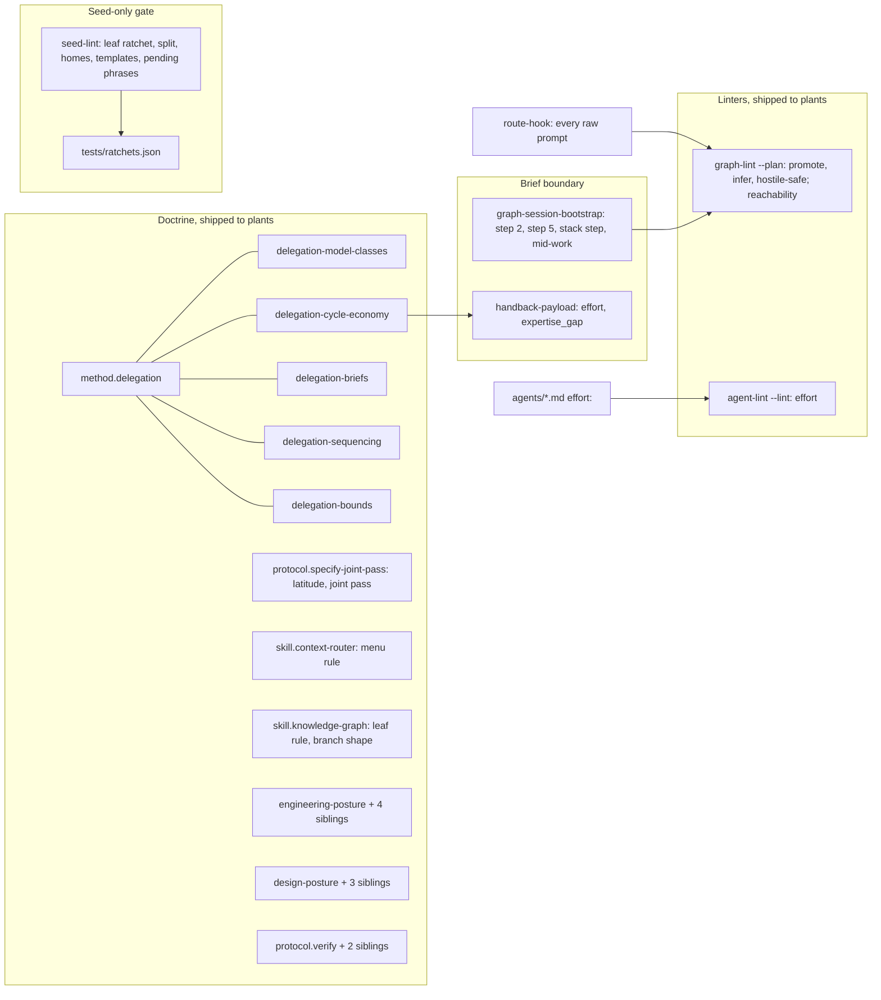

# grill.md — Plan of Record: cycle economy, the delegation split and expertise routing (7.30.0, round 2)

## 0. Metadata
- Project: CYPRESS seed
- Feature or goal: implement the owner's adopted cycle-economy decisions as seed text and checks: the delegation split into sibling leaves, effort-sized batches, the shared question file and ruling pass, regulated spawn effort, expertise promotion and stack inference in `--plan`, the menu and leaf rules, three bloat-audit splits, and the small adopted boundaries
- Date: 2026-09-26
- Owner: the steward (the owner's decisions are kept with the harvest's working records, outside the seed); the orchestrating session plans and briefs
- Current phase: closed; SPEC-0005 `active`, every contract row green
- Related files: `core/method/delegation.md` and its five new siblings; `core/method/{engineering-posture,design-posture}.md` and their seven new siblings; `protocols/verify.md` and its two new siblings; new `protocols/specify-joint-pass.md`; `templates/knowledge-graph/graph-lint.py`, `integrations/claude-code/agent-lint.py`, `tests/seed-lint.py`, `tests/ratchets.json`, `tools/ratchet-lint.py`, `agents/*.md`, `templates/prompts/*.md`, `protocols/{specify,grill,test-first,recover,harvest}.md`, `skills/{context-router,knowledge-graph,test-first}/SKILL.md`, `templates/knowledge-graph/{index.md,_schema.md}`, `templates/grill.template.md`, `templates/agent.template.md`, `integrations/{claude-code,opencode,codex}/README.md`, `manifest.json`, `documentation/*.md`
- Related documentation: `protocols/harvest.md` (the flow this round runs under); the joint specify and grill pass this plan is written in
- Related ADRs: adr-0003-enforcement-layering-honesty, adr-0004-pure-graph-architecture, adr-0007-lifecycle-protocol-ceiling (cited by file name)
- Related specs: [SPEC-0005](../specs/SPEC-0005-cycle-economy.md); SPEC-0003 (its `BRIEF_TEMPLATES_BYTE_IDENTICAL`, §12); SPEC-0004 (the body figures, §11)
- Related libraries: none (stdlib Python, POSIX shell and Markdown only)
- Baseline: seed branch `harvest/7.30.0` as it stood when batch 1 was briefed

## 1. Artifact Discovery
Every line cites the paths read, or reads `none — <reason>`. Read by the architect on 2026-09-26.
- Existing files inspected: `core/method/delegation.md` (543 lines; 13 owned keys; sections at 47, 55, 80, 116, 164, 213, 239, 309, 341, 430, 449, 488, 512, 533, 539), `core/AGENTS.md` (FIRST MOVE :5-17, §1 :54-69), `templates/prompts/graph-session-bootstrap.md` (step 2 :24; "recommended rather than required" :59), `templates/prompts/handback-payload.md`, `agents/00-orchestrator.md` (:155-160 light-variant "pending"; :214-215 stack step "recommends"), `agents/02-implementer.md`, `agents/04-tester.md` (:47-53 one increment per spawn), `core/method/engineering-posture.md` §13 (:390-436)
- Existing docs inspected: `protocols/specify.md` (`specify.flow` :77-137), `protocols/grill.md` (`grill.flow` :82-155, increment shape :177-242, plan approval :275-303), `protocols/test-first.md` (cycle table :85-107, exit conditions :282-292), `protocols/recover.md` (Ambiguity row :58), `protocols/verify.md` (section list), `skills/knowledge-graph/SKILL.md` §4 (:153-161), `templates/knowledge-graph/_schema.md`, `templates/docs/nodes/_expertise.template.md`, `templates/knowledge-graph/index.md` (Method table :61-104); the product, security and tester reviews and the bloat audit, kept with the harvest's working records outside the seed
- Existing tests inspected: `tests/test_graph_lint.py` (`expertise_family`, `DescentTests`, `ReachabilityBoundaryTests`, `SeedAndPlantCopyAgreeTests`), `tests/test_router_reach.py`, `tests/test_agent_lint.py`, `tests/seed-lint.py` (`REGISTRATION_HOME` :244, machinery body check :2727-2748, manifest catalog check :2993-3007, protocols-reference mirror :451-549, bootstrap identity check :3058-3087), `tests/test-seed-lint.sh` (registration cases :193-212), `tests/ratchets.json`, `tests/run.sh`
- Existing specs inspected: `docs/specs/SPEC-0003-per-prompt-injection.md` (`BRIEF_TEMPLATES_BYTE_IDENTICAL` :517-525), `docs/specs/SPEC-0004-front-door.md`
- Existing architecture signals: `templates/knowledge-graph/graph-lint.py` `resolve()` :1044-1160 (entry cut `entries[:3]`, a literal), `check_reachability()` :595-643, `main()` :1222-1240; `integrations/claude-code/agent-lint.py` `cmd_lint()` :873-934; `templates/knowledge-graph/grill-lint.py`; `templates/knowledge-graph/spec-lint.py`; `integrations/claude-code/route-hook.py` (every prompt to `--plan`, fails open; per the security review)
- Libraries already wikified: none — no library is involved
- External sources downloaded: Claude Code sub-agents page, https://code.claude.com/docs/en/sub-agents, fetched 2026-09-26 (frontmatter `effort`). Not stored; cited in SPEC-0005 §6
- Constraints discovered: no router budget key in `tests/ratchets.json`; `index.md` stays plant-owned under graft; `agent-lint.py` ships into plants; seed-lint catalogs `protocols/*.md` in `manifest.json` and mirrors protocol and skill frontmatter in `documentation/`; `protocols/specify.md` is 162 body lines (measured by the tester); grill-lint resolves specs under `docs/graph/`, so it cannot lint this seed-side plan in place

## 2. Shared Understanding
The owner judged the seed's development cycle too expensive: too many spawns, full-suite runs per increment, strong-class workers on mechanical steps, and nodes so large that every turn loads far more than it needs. The owner's brainstorm adopted a set of rules (effort-sized batches, GREEN run by the implementer, a tip-only suite, mutation at the end, light variants, a shared question file with one architect ruling pass per batch, the architect writing its own amendment, the joint specify and grill pass, the design-latitude guard, a mandatory stack-expertise brief step, router expertise promotion and stack inference, mid-work expertise discovery, and four boundaries). During the joint pass the owner added four more: regulated per-spawn effort, "a node's list is a menu", and the leaf and branch shapes (later corrected: protocols, postures and delegation are leaves, and only the branch layer is a menu). Ruling pass 0 applied the product, security and tester reviews and approved three bloat-audit splits.

Success: each adopted rule has exactly one home in the seed; delegation is six sibling leaves, engineering posture five, design posture four, verify three; a session planning a batch loads the cycle-economy and model-class leaves; `--plan` loads expertise on a phrase hit or a named file, safely on hostile input; every agent carries a default effort and every spawn records the effort it ran at; the seed's own method surface can no longer gain an oversized leaf. Out of scope: everything the owner did not adopt (among them the test writer's candidate as GREEN, a thin spec grown by slice, a walking skeleton first, standing grants, an environment-parity read, a RED ahead of its GREEN, and a standard plan-approval step), new gates, node kinds or agents, the kernel, and the lifecycle protocols' splits.

## 3. User Goal
- Primary user: the orchestrating session and the workers it spawns, running the seed's method in any plant; and the owner who pays for their tokens
- Primary outcome: the same invariants (observed RED, independent review, one writer per file set, spec before code) at fewer spawns, fewer full-suite runs, right-sized effort per spawn, and fewer tokens loaded per turn
- Job to be done: plan and run a spec's increments in effort-sized batches with one ruling pass per batch, with expertise found when it is needed
- Acceptance criteria (link to spec §9): [SPEC-0005 §9](../specs/SPEC-0005-cycle-economy.md)
- Non-goals: measuring the savings (no metric is claimed beyond AC-20's before-and-after figures); changing any invariant the owner did not change

## 4. Operating Constraints
- Runtime constraints: checks run inside `tests/run.sh` under the existing steps; stdlib Python 3 and bash 3.2-compatible shell only
- Security constraints: no secret, host, user path or donor-plant identifier in any seed file (harvest gate G1 with the donor forbid list); no production data in fixtures. **Increment 6 is a security surface** (it changes the parser that turns every raw user prompt into hook-injected context: prompt construction and external input, per `agent.security`'s "When to invoke"): a GREEN batch of one at high effort, a `security` review at high before it lands, and mandatory mutation for its two contracts
- Privacy constraints: the donor plant is never named in seed text; provenance stays in the harvest's working records outside the seed
- Data constraints: none — documentation and lint code only
- Cost constraints: design latitude SIMPLE (§6). Batches sized by the owner's scale (SPEC-0005 §6). GREEN has no separate tester spawn. Targeted tests plus cross-cutting gates per increment; `tests/run.sh` once per batch tip, by the orchestrator. Mutation once, after the last code batch. Ruling pass once per batch boundary
- Latency constraints: new checks must not measurably slow `tests/run.sh`
- Compliance constraints: none
- Maintenance constraints: split, never compress; moved text is verbatim; no limit widens (harvest gate G11); the ledger is never re-derived to fit text; workers make no git writes and write only their named files; the orchestrator commits each writer's file set by pathspec; every increment that adds a protocol or changes a protocol's or skill's mirrored frontmatter updates its `manifest.json` and `documentation/*-reference.md` rows in its own file set

## 5. Research Summary
no external dependency — the work is documentation plus stdlib lint code. One host fact was retrieved for the effort key: the Claude Code sub-agents page (§1, External sources). Whether opencode, Codex or GitHub Copilot read an `effort:` key is not recorded; the fresh-install gate at the tip observes their behaviour (§10, §11).

## 6. Decisions Made
| Decision | Rationale | Evidence | Reversibility | ADR | Date |
|---|---|---|---|---|---|
| Design latitude: simple | The owner's goal was "implement the planned seed changes — make this a spec"; the scope is exactly the adopted items and the approved next-round plan, with no new gates, node kinds, agents or renamed concepts | recorded by the orchestrator from the owner's goal; the guard itself is an owner decision from the brainstorm | reversible | none | 2026-09-26 |
| Split delegation into six sibling leaves by topic, with no branch parent; `method.delegation` keeps the roster, routing and spec-authoring sections and its id | the owner asked for delegation to be split so each subagent loads only what it needs, and later ruled delegation a leaf, not a branch; keeping the id keeps the kernel's §1 pointer and every index row valid without a kernel edit | `core/method/delegation.md`; SPEC-0005 §6 "Delegation leaves" | reversible now → expensive after 7.30.0 ships | none | 2026-09-26 |
| Light variants go to the model-class sibling | A light variant is a budget (class plus effort) | ruling pass 0 | reversible | none | 2026-09-26 |
| Siblings are reachable through `method.delegation`'s `peers:`, and graph-lint follows an index-listed node's edges | a grafted plant's index lists only `method.delegation` | ruling pass 0; `graph-lint.py` :623-643 | reversible | none | 2026-09-26 |
| Expertise promotion bypasses the entry cut for expertise nodes only, uncapped on every path; stack inference reads file patterns from `load_when` | the owner decided promotion past the node budget; `load_when` already admits globs | ruling pass 0; `tests/ratchets.json` | reversible | none | 2026-09-26 |
| No `--files` flag | smallest input | ruling pass 0 | reversible | none | 2026-09-26 |
| Agent `effort:` closed set low, medium, high, required by agent-lint on every agent | Claude Code reads the key; the owner asked for regulated spawn effort | ruling pass 0 | reversible | none | 2026-09-26 |
| Leaf ceiling 170 over `core/method/`, `protocols/`, `skills/`, with a tighten-only `OVERSIZED_LEAVES` ledger | the owner's leaf rule, and the seed's own method surface held to it | `tests/seed-lint.py` :60-93 | reversible | none | 2026-09-26 |
| No kernel edit | FIRST MOVE already limits reads to the closure | ruling pass 0 (held for the owner) | reversible | none | 2026-09-26 |
| ~~RED is observed and not committed alone; an increment commits once, RED and GREEN together, when its GREEN lands~~ (superseded 2026-09-26 at ruling pass 0 by the next row) | — | — | — | — | 2026-09-26 |
| RED is observed and not committed alone; at RED observation the orchestrator records a `sha256sum` of every test and fixture file the RED spawn wrote; each increment commits once when its GREEN lands, after the hashes re-check; a GREEN writer's pathspec never includes a test or fixture path | fail closed: an uncommitted RED file edited by the GREEN is otherwise indistinguishable from the RED | ruling pass 0, from the security review | reversible | none | 2026-09-26 |
| Increment 6 (router GREEN) is a security surface: batch of one, high effort, `security` review at high before it lands, mandatory mutation for its contracts | the parser turns every raw prompt into injected context | ruling pass 0, from the security review | reversible | none | 2026-09-26 |
| The `## Leaves` lint check is withdrawn; the branch shape is doctrine | not asked by the owner; plant-facing | ruling pass 0 (a removed contract, so held for the owner) | reversible | none | 2026-09-26 |
| The joint pass and the latitude guard live in a new protocol leaf `protocols/specify-joint-pass.md` | `protocols/specify.md` is at 162 of 170 body lines; the ledger is never re-derived to fit text | ruling pass 0 | reversible | none | 2026-09-26 |
| The RED for the rule-homes, handback, step-2 and pending checks runs right before their GREEN, not in batch 1 | their cases would ride a batch-2 commit red until batch 4 | ruling pass 0 | reversible | none | 2026-09-26 |
| Bloat-audit splits approved: engineering posture → 4 siblings, design posture → 3, verify → 2; the humanizer kept whole; the lifecycle protocols held | the audit's topic analysis; the lifecycle protocols' ceiling is an owner decision (adr-0007) | the bloat audit (outside the seed); ruling pass 0 | reversible now → expensive after 7.30.0 ships | none | 2026-09-26 |

## 7. Options Considered
| Option | Pros | Cons | Chosen / Rejected | Why |
|---|---|---|---|---|
| A thin `method.delegation` parent holding only a `## Leaves` menu | one entry point | the owner ruled delegation a leaf, not a branch | Rejected | owner correction |
| Keep `delegation.harness-registration` in `method.delegation` | no constant change | 69 rarely needed lines in the most-loaded sibling | Rejected | one small edit |
| A new frontmatter key (`stack_files:`) for inference | explicit | a new schema key | Rejected | design latitude simple |
| A standing test that a split is verbatim | mechanical | freezes doctrine | Rejected | one-time verify record |
| Lower `MACHINERY_BODY_CEILING` step by step | no new key | binds nothing new | Rejected | the ledger binds every new file |
| A mechanical `## Leaves` check | holds the shape | plant-facing obligation nobody asked for | Rejected at ruling pass 0 | not an owner decision |
| Cap promotion on the route hook | bounds per-prompt cost | contradicts the owner's uncapped-promotion decision | Rejected | offered to the owner |
| Re-derive `OVERSIZED_LEAVES` after batch 3 so specify can grow | fewer files | "never to fit new text" | Rejected | the joint pass moved to its own leaf instead |
| Commit each RED alone with an expected-failure ledger | green commits | new pending machinery | Rejected | RED hashes instead |

## 8. Architecture Plan
Boundaries this change crosses:

- The router's canonical stemmer and stopword blocks stay untouched; promotion and inference are new steps inside `resolve()`, string matching only, never raising.
- Contracts: SPEC-0005 §4, twelve; data shapes §6; failure modes §7.

## 9. Implementation Plan

**Revision at ruling pass 0 (2026-09-26).** This §9 supersedes the creation-pass §9 (23 increments), which is in the plan's first commit. Increments are renumbered 1 to 27. Old → new: 1→1; 2→2 (branch check removed); 3→3; 4→4; 5→5 (split half) and 23 (rule-homes half); 6→24; 7→6; 8→7 (reachability only); 9→8; 12→9; 10→10; 11→11; 13→12; 14→13; 15→14; 16→16; 17→17; 18→18; 19→20 and 22; 20→25; 21→15, 19, 21 (the verify, engineering-posture and design-posture splits); 22→26; 23→27. Increments 28 to 44 were added at later ruling passes.

**Batch plan.** Batches are sized from each increment's `Effort:` by the owner's scale (SPEC-0005 §6): tester RED per spawn hard 5, medium-hard 5, medium 6, medium-low 7, low 7 or more; implementer GREEN per spawn low 5, medium-low 3, medium 3, medium-hard 2, hard 1, security or concurrency 1; prose writers one per disjoint file set. A spawn is sized by its hardest increment. A RED never shares a spawn with its own GREEN. Each spawn's effort comes from SPEC-0005 §6 "Effort", and its brief carries the line.

| Batch | Phase | Spawn: role (file set) | Increments | Size check | Effort line |
|---|---|---|---|---|---|
| **Ruling pass 0** | — | architect | the joint pass's questions, the reviews, the bloat audit | — | high (row 1: rulings) |
| 1 | RED | tester {`tests/test_graph_lint.py`} | 1, 2 | medium-hard → up to 5 | high (row 3: medium-hard); host applies definition default medium: recorded departure |
| 1 | RED | tester {`tests/test_agent_lint.py`, `tests/test-seed-lint.sh`, `tests/check-coverage-binder.py`}, parallel with the first | 3, 4, 5 | medium → up to 6 | medium (row 3: medium) |
| **Ruling pass 1** | — | architect | batch 1 questions | — | high (row 1) |
| 1b | RED | tester {`tests/test-seed-lint.sh`, `tests/check-coverage-binder.py`} (moved from batch 4 at ruling pass 1, so the spec could go `active` with every contract covered): increments 23 and 24, plus the §10 label comments `# X336`…`# X346` on the batch-1 shell cases. SPEC-0005 v0.3 (`active`) commits in the same change as this RED | 23, 24 | medium → up to 6 | medium (row 3: medium) |
| 2 | GREEN | implementer {`templates/knowledge-graph/graph-lint.py`} | 6 | security surface → batch of one | high (row 1: security surface, prompt construction); host applies definition default medium, so the security review below is required |
| 2 | review | security review {read-only over increment 6's diff}, after that implementer, before increment 6 commits | 6 | — | high (row 1) |
| 2 | GREEN | implementer {`templates/knowledge-graph/graph-lint.py`}, after increment 6 (same file) | 7 | medium-low → up to 3 | low (row 3: medium-low); host applies definition default medium: recorded departure |
| 2 | GREEN | implementer {`integrations/claude-code/agent-lint.py`, `agents/*.md`, `templates/agent.template.md`, `install.sh`, `integrations/claude-code/status-hook.py`}, parallel | 8, 9 | medium-low → up to 3 | low (row 3: medium-low); recorded departure |
| 2 | GREEN | implementer {`tests/seed-lint.py`, `tests/ratchets.json`, `tools/ratchet-lint.py`, `core/method/delegation*.md`, `templates/knowledge-graph/index.md`}, parallel | 10, 11 | medium → up to 3 | medium (row 3: medium) |
| **Ruling pass 2** | — | architect | batch 2 questions | — | high (row 1) |
| 3 | prose | docs-librarian {all six `core/method/delegation*.md`; the other four siblings join for the cross-file pointer repairs} | 12 | one set | high (row 3: medium-hard) |
| 3 | prose | docs-librarian {`protocols/specify-joint-pass.md` (new), `protocols/specify.md`, `protocols/grill.md`, `templates/grill.template.md`, `protocols/test-first.md`, `protocols/recover.md`, `protocols/verify.md`, `protocols/verify-new-gates.md` (new), `protocols/verify-disagreement.md` (new), `manifest.json`, `documentation/protocols-reference.md`} | 13, 14, 15 | one set | medium (row 3: medium) |
| 3 | prose | docs-librarian {`templates/prompts/graph-session-bootstrap.md`, the five embedding templates, `templates/prompts/handback-payload.md`} | 16 | one set | low (row 3: medium-low) |
| 3 | prose | docs-librarian {`skills/context-router/SKILL.md`, `skills/knowledge-graph/SKILL.md`, `skills/test-first/SKILL.md`, `templates/knowledge-graph/_schema.md`, `templates/knowledge-graph/index.md`, `documentation/skills-and-templates-reference.md`} | 17 | one set | medium |
| 3 | prose | docs-librarian {`agents/00-orchestrator.md`, `01-architect.md`, `02-implementer.md`, `03-reviewer.md`, `04-tester.md`, `templates/agent.template.md`} | 18 | one set | medium |
| 3 | prose | docs-librarian {`core/method/engineering-posture.md`, and new `minimum-sufficient-work.md`, `decision-economy.md`, `host-parity.md`, `bounded-execution.md` under `core/method/`} | 19, 20 | one set | medium |
| 3 | prose | docs-librarian {`core/method/design-posture.md`, and new `restrictive-policy.md`, `maintenance-contracts.md`, `design-governance.md` under `core/method/`} | 21 | one set | medium |
| 3 | prose | docs-librarian {`integrations/claude-code/README.md`, `integrations/opencode/README.md`, `integrations/codex/README.md`, `protocols/harvest.md`, `tool-corpus/ops/session-cost-profiler.md`} | 22 | one set | low (row 3: medium-low) |
| 3t | fixture review | tester {`tests/fixtures/router/stem-collisions.json` only}, parallel with batch 3: reviews the five collision groups `('end', 'ending')`, `('increment', 'increments')`, `('land', 'landed', 'landing', 'lands')`, `('landed', 'landing')`, `('rule', 'rules', 'ruling')` into the fixture, each one word's inflections; a collision a batch-3 writer adds is a question for ruling pass 3 | — | one set | low (row 3: low); a light variant is allowed (mechanical, no security surface) |
| **Ruling pass 3** | — | architect | batch 3 questions | — | high (row 1) |
| ~~4~~ | ~~RED~~ | ~~tester~~ (moved to batch 1b at ruling pass 1) | ~~23, 24~~ | — | — |
| ~~**Ruling pass 4**~~ | — | (none: batch 4 is empty since ruling pass 1) | — | — | — |
| 4r | prose | docs-librarian {`protocols/from-scratch.md`, `protocols/grow.md`, `protocols/canonize.md`, `protocols/ingest-library.md`, `protocols/initialize.md`, `protocols/graft.md`, `protocols/deliver.md`, `protocols/verify.md`, `protocols/verify-new-gates.md`, `protocols/harvest.md`}, added at ruling pass 3, must land before batch 5 | 28 | one set | low (row 3: medium-low); recorded departure from the medium default |
| 4r | prose | docs-librarian {`agents/02-implementer.md`, `agents/04-tester.md`, `agents/03-reviewer.md`, `agents/00-orchestrator.md`, `agents/growth-orchestrator.md`, `agents/13-ui-ux-designer.md`, `agents/tool-smith.md`, `templates/agent.template.md`, `core/method/delegation-cycle-economy.md`}, parallel | 29 | one set | low (row 3: medium-low); recorded departure |
| 4r | prose | docs-librarian {`skills/toolcraft/SKILL.md`, `skills/context-router/SKILL.md`, `skill-corpus/drive-hosted-cicd-cli.md`, `library-corpus/platform/azure-devops-rest.md`}, parallel | 30 | one set | low (row 3: low) |
| 4r | test maintenance | tester {`tests/test-lint-audibility.sh` only}, parallel: the expected count is derived from the clean-copy run (its count − 1) in the same test, never a pinned literal, because the splits legitimately added nodes; no increment (not a SPEC-0005 contract), recorded in §15 | — | one set | low; a light variant is allowed |
| **Ruling pass 4r** | — | architect | batch-4r questions; skipped when empty | — | high (row 1) |
| 5 | GREEN | implementer {`tests/seed-lint.py`} | 25 | medium → up to 3 | medium (row 3: medium) |
| — | mutation | mutation pass, tester light variant on the investigation class (sonnet), read-only on the tree, every mutant in a scratch copy (the copy-to-scratchpad-and-diff method; never `git stash`), after batch 5: the **mandatory** list in §10 for PLAN_PROMOTES_PHRASE_MATCHED_EXPERTISE and PLAN_INFERS_EXPERTISE_FROM_NAMED_FILES, plan drawn from commit 2af34da | — | — | high (row 1: security surface) |
| — | mutation | mutation pass, tester light variant on the investigation class (sonnet), same method, parallel with the first: the **sampled** list in §10 over increments 7 to 11 and 25 | — | — | medium (row 4: mutation execution) |
| **Ruling pass 5** | — | architect | batch 5 and mutation questions (each survivor needs a ruling) | — | high (row 1) |
| 6 | prose | docs-librarian {`manifest.json`, `templates/knowledge-graph/index.md`, `DOCUMENTATION.md`, `documentation/README.md`, `documentation/skills-and-templates-reference.md`, `documentation/host-capability-matrix.md`}: the mirror rows the earlier writers handed back, plus increment 26 | 26 | one set | low (row 3: medium-low); recorded departure |
| 6 | prose | the session, in-session {`CHANGELOG.md`, the harvest log, the ratification kept with the harvest's records} | 27 | — | — |
| — | review | reviewer, read-only over the whole round, after batch 6 (not the author of any increment) | — | — | high (row 1: a harvest's faithful-import review) |
| **Ruling pass 5, held** | — | architect, after the review | the mutation reports, the round review and the batch-5 questions | — | high (row 1) |
| F1 | RED | tester {`tests/test_graph_lint.py`}: characterization cases pass on arrival; the whole-token case is the only red; the baseline is a scratch copy plus `diff`, never `git stash` | 31, 32 | medium → up to 6 | medium (row 3: medium) |
| F1 | RED | tester {`tests/test-seed-lint.sh`, `tests/check-coverage-binder.py`, `tests/test_agent_lint.py`, `tests/fixtures/front-door/`}, parallel | 33, 34 | medium → up to 6 | medium (row 3: medium) |
| F1 | prose | docs-librarian {`agents/seed-installer.md`, `integrations/opencode/README.md`, `integrations/github-copilot/README.md`, `INSTALL.md`, `README.md`, `GRAFT_PROMPT.md`, `INSTALL_PROMPT.md`, `CLAUDE.md`, `DOCUMENTATION.md`, `documentation/host-capability-matrix.md`, `documentation/corpora-and-integrations-reference.md`, `manifest.json`}, parallel | 35 | one set | medium (row 3: medium) |
| F1 | prose | docs-librarian {`core/method/decision-economy.md`, `core/method/minimum-sufficient-work.md`, `core/method/engineering-posture.md`, `core/method/vcs-posture.md`, `core/method/contract-posture.md`, `core/method/delegation-cycle-economy.md`, `core/method/delegation-model-classes.md`, `templates/prompts/handback-payload.md`, `templates/agent.template.md`, `templates/grill.template.md`, `protocols/test-first.md`, `protocols/harvest.md`, `skills/toolcraft/SKILL.md`, `documentation/protocols-reference.md`, `documentation/skills-and-templates-reference.md`}, parallel | 36 | one set | medium (row 3: medium) |
| F1 | prose | docs-librarian {`agents/00-orchestrator.md`, `agents/01-architect.md`, `agents/10-research-scout.md`}, parallel | 37 | one set | low (row 3: medium-low) |
| F1 | prose | the session, in-session {`CHANGELOG.md`} | 41 | — | — |
| **Ruling pass F1** | — | architect | fix-batch questions; skipped when empty | — | high (row 1) |
| F2 | GREEN | implementer {`templates/knowledge-graph/graph-lint.py`} | 38 | security surface → batch of one | high (row 1: security surface, prompt parsing) |
| F2 | review | security review, read-only over increment 38's diff, before it commits | 38 | — | high (row 1) |
| F2 | GREEN | implementer {`tests/seed-lint.py`, `integrations/claude-code/agent-lint.py`}, parallel | 39, 40 | medium → up to 3 | medium (row 3: medium) |
| F2 | mutation | mutation pass, tester light variant, investigation class (sonnet), scratch copies only, after both implementers: mandatory mutants for increment 38 (whole tokens split back into `[a-z0-9_]` runs; dots dropped; the length floor at 2 and at 4) and sampled mutants for increment 39 (no wrap join; one widened root dropped) | — | — | high (row 1) |
| F2 | review | reviewer, read-only over the fix batch's diffs | — | — | medium (row 4: batch review) |
| **Ruling pass 6** | — | architect | the fix batch's questions and mutation survivors | — | high (row 1) |
| F3 | RED | tester {`tests/test_graph_lint.py`, `tests/test-seed-lint.sh`}: the new characterization cases are green on arrival; X360 is the only red; baseline by scratch copy plus `diff`, never `git stash` | 42 | medium-low → up to 7 | low (row 3: medium-low) |
| F3 | prose | docs-librarian {`core/method/delegation-model-classes.md`, `integrations/claude-code/README.md`, `templates/agent.template.md`, `templates/knowledge-graph/_schema.md`, `documentation/agents-reference.md`, `documentation/skills-and-templates-reference.md`, `manifest.json`, `core/method/engineering-posture.md`, `core/method/contract-posture.md`}, parallel with the tester | 44 | one set | medium (row 3: medium) |
| F3 | GREEN | implementer {`tests/seed-lint.py`, `integrations/claude-code/agent-lint.py`}, after the tester's X360 is observed red | 43 | medium-low → up to 3 | low (row 3: medium-low) |

A ruling pass with an empty question file is recorded `no questions` and skipped. Each batch ends with one `tests/run.sh` by the orchestrator at its tip, compared by test id with the previous tip; batch 1's and batch 1b's tips are expected red on exactly the new RED ids (and the binder's "no longer runs" id). The batch-3 writers run in parallel; their files are disjoint. In batch 2, the increment-7 implementer starts only after the increment-6 implementer has handed back, and increment 6 commits only after the security review is clean.

**Commits.** RED is observed by the orchestrator and not committed alone. At observation the orchestrator records a `sha256sum` of every test and fixture file the RED spawn wrote in the batch record, and re-checks them before any GREEN commit and before the tip; a mismatch or a GREEN handback listing a test path is a block. Each increment commits once, with its RED files, when its GREEN lands; where one test file carries several increments' RED, the commit follows the GREEN spawn and names each increment. Prose increments commit per writer's file set.

**Questions.** Every brief names its batch's question file, its entry format and the append-only rule (SPEC-0005 §6). An implementer that finds a test wrong writes a question and does not edit the test. A writer whose text would push a non-member leaf past 170 body lines stops and writes a question.

### Increment 1 — RED: expertise promotion, stack inference, closure, descent reshape
- Spec contracts: SPEC-0005/PLAN_PROMOTES_PHRASE_MATCHED_EXPERTISE, SPEC-0005/PLAN_INFERS_EXPERTISE_FROM_NAMED_FILES, SPEC-0005/PLAN_PROMOTED_NODE_TAKES_ITS_CLOSURE
- Files touched: `tests/test_graph_lint.py` (new `PromotionTests`, `InferenceTests`, `PromotedClosureTests` beside `DescentTests`; the four `DescentTests` cases reshaped at RED, because the new promotion rule would otherwise turn them red for a reason the implementer may not fix)
- Tests to write (RED): every SPEC-0005 §10 row for the three contracts and for PROMOTION_FLOODS_LOAD, HOSTILE_TASK_LINE, TASK_LINE_WITHOUT_PATHS, PATTERN_BRACE_SPLIT, EXTENSIONLESS_BARE_NAME and DESCENT_TEST_NOW_SEEDS_THE_CHILD. The three-outscoring-nodes fixture is measured on the unmodified tool and the measurement recorded in the docstring; each positive case asserts its suffix on the node's own LOAD line
- Behavior added: none (tests only)
- Gate: `python3 -m unittest tests.test_graph_lint` shows the new non-guard cases failing on the missing suffix or behaviour, every guard passing, and every other pre-existing case passing
- Rollback path: drop the new classes; restore the four reshaped cases
- Effort: medium-hard
- Phase: RED
- Depends on: none

### Increment 2 — RED: reachability through listed nodes, delegation routing
- Spec contracts: SPEC-0005/LISTED_NODE_EDGES_REACH, SPEC-0005/DELEGATION_LEAVES_ROUTE
- Files touched: `tests/test_graph_lint.py` (`ListedNodeEdgesTests`; `DelegationRoutingTests` on a fresh install, `setUpClass`, with a sibling-exists assertion before reading `load_when`)
- Tests to write (RED): the §10 rows for the two contracts, SIBLING_UNREACHABLE_AFTER_GRAFT and ORPHAN_ISLAND
- Behavior added: none (tests only)
- Gate: the new non-guard cases fail for the missing reachability or the missing siblings; the rest of the file passes
- Rollback path: drop the new classes
- Effort: medium-low
- Phase: RED
- Depends on: none

### Increment 3 — RED: agent effort
- Spec contracts: SPEC-0005/AGENT_DECLARES_EFFORT
- Files touched: `tests/test_agent_lint.py` (the `agent_md` builder gains `effort="medium"`, `effort=None` omits the line; new `LintEffortTests`)
- Tests to write (RED): the §10 rows for AGENT_DECLARES_EFFORT and AGENT_WITHOUT_EFFORT_AFTER_GRAFT (the bad value is `xhigh`)
- Behavior added: none (tests only)
- Gate: the new cases fail; every existing agent-lint case still passes with the builder change
- Rollback path: drop the class and the builder change
- Effort: medium-low
- Phase: RED
- Depends on: none

### Increment 4 — RED: the leaf ceiling ledger
- Spec contracts: SPEC-0005/LEAF_BODY_CEILING_HELD
- Files touched: `tests/test-seed-lint.sh` (`case_ce_leaf_*`), `tests/check-coverage-binder.py` (`COVERED` for `check_leaf_body_ceiling`)
- Tests to write (RED): the §10 rows for LEAF_BODY_CEILING_HELD, LEDGER_REGROWS and SIBLING_OVER_CEILING; at RED the constant is absent, so each case fails with an explicit "check missing" message, never a traceback
- Behavior added: none (tests only)
- Gate: the planted cases fail on the missing check; the binder fails naming the check (an expected RED id)
- Rollback path: drop the cases and the binder entry
- Effort: medium
- Phase: RED
- Depends on: none

### Increment 5 — RED: the delegation split
- Spec contracts: SPEC-0005/DELEGATION_SPLIT_INTO_SIBLINGS
- Files touched: `tests/test-seed-lint.sh` (`case_ce_split_*`; the existing `registration-home` case repointed to `core/method/delegation-bounds.md` with an existence guard printing "split not landed"), `tests/check-coverage-binder.py`
- Tests to write (RED): the §10 rows for DELEGATION_SPLIT_INTO_SIBLINGS
- Behavior added: none (tests only)
- Gate: the new cases and the repointed case fail until the split lands
- Rollback path: drop the cases; restore the registration case's path
- Effort: medium
- Phase: RED
- Depends on: none

### Increment 6 — GREEN: promotion and inference in `plan()` (security surface)
- Spec contracts: SPEC-0005/PLAN_PROMOTES_PHRASE_MATCHED_EXPERTISE, SPEC-0005/PLAN_INFERS_EXPERTISE_FROM_NAMED_FILES, SPEC-0005/PLAN_PROMOTED_NODE_TAKES_ITS_CLOSURE
- Files touched: `templates/knowledge-graph/graph-lint.py` (`resolve()`, the `--plan` printer in `main()`; the canonical stemmer and stopword blocks untouched)
- Tests to write (RED): none new; increment 1's cases
- Behavior added: phrase-hit promotion and path inference as entries beside the scored cut; string matching only (the task token is the name, the piece the pattern); token cap and length skip; never raises (notice line, exit 0); echo sanitizing; SPEC-0005 §6 suffixes and precedence
- Gate: `python3 -m unittest tests.test_graph_lint tests.test_router_reach`; cross-cutting: `python3 tests/seed-lint.py` (canonical blocks, installed-copy agreement), the route-hook tests that parse `--plan` output; then the `security` review at high effort, clean, before the commit
- GREEN constraints (ruling pass 1): match through the module attribute `fnmatch.fnmatchcase`, never a name imported with `from fnmatch import`, because `test_plan_hostile_task_line_never_raises` plants its fault there; the length skip happens before the 64-token count, and the strip set (trailing `.` included) repeats until stable (SPEC-0005 §6)
- Rollback path: revert; increment 1's cases go red again
- Effort: medium-hard (a security surface: GREEN batch of one, high effort)
- Phase: GREEN
- Depends on: increment 1

### Increment 7 — GREEN: reachability through listed nodes' edges
- Spec contracts: SPEC-0005/LISTED_NODE_EDGES_REACH
- Files touched: `templates/knowledge-graph/graph-lint.py` (`check_reachability()` rooted branch follows index-listed nodes' edges)
- Tests to write (RED): none new; increment 2's cases for this contract
- Behavior added: a node reached by an edge from an index-listed node is reachable; islands still fail
- Gate: `python3 -m unittest tests.test_graph_lint`; cross-cutting: `python3 tests/seed-lint.py`, the install test that lints an installed graph
- Rollback path: revert
- Effort: medium-low
- Phase: GREEN
- Depends on: increment 2, increment 6

### Increment 8 — GREEN: agent effort
- Spec contracts: SPEC-0005/AGENT_DECLARES_EFFORT
- Files touched: `integrations/claude-code/agent-lint.py` (rule 5 in `cmd_lint()`), `agents/*.md` (one `effort:` line each, per SPEC-0005 §6), `templates/agent.template.md` (the key, with a comment naming the closed set)
- Tests to write (RED): none new; increment 3's cases
- Behavior added: every agent declares a default effort; agent-lint holds the closed set on every agent
- Gate: `python3 -m unittest tests.test_agent_lint`; `python3 integrations/claude-code/agent-lint.py --lint --dir agents`; cross-cutting: `python3 tests/seed-lint.py` (frontmatter ceiling, eager surface, agents-reference mirror if it names the key), `bash tests/test-full-install.sh` (projection lint per host; no transform drops the key)
- Rollback path: revert
- Effort: medium-low
- Phase: GREEN
- Depends on: increment 3

### Increment 9 — GREEN: stale delegation pointers repointed
- Spec contracts: SPEC-0005/ADOPTED_RULE_HOMES
- Files touched: `install.sh` (log and comment strings naming `delegation.md` with `delegation.harness-registration`), `integrations/claude-code/status-hook.py` (the `delegation.briefs` pointer), `integrations/claude-code/agent-lint.py` (the registration pointer in two messages)
- Tests to write (RED): none new; increment 23's stale-pointer case holds this later
- Behavior added: each pointer names the sibling that owns the key
- Gate: `grep -n 'method/delegation.md' install.sh integrations/claude-code/*.py` shows no moved key beside it; `python3 -m unittest tests.test_agent_lint`; `bash tests/test-full-install.sh` (the stale-pointer check lands later, so this grep is the gate for now)
- Rollback path: revert
- Effort: low
- Phase: GREEN
- Depends on: increment 8

### Increment 10 — GREEN: the leaf ceiling ledger
- Spec contracts: SPEC-0005/LEAF_BODY_CEILING_HELD
- Files touched: `tests/seed-lint.py` (`LEAF_BODY_CEILING`, `OVERSIZED_LEAVES` derived by the check's own count at this commit, `check_leaf_body_ceiling`), `tests/ratchets.json` (two keys added, no existing key changed), `tools/ratchet-lint.py` (`RATCHETS` map)
- Tests to write (RED): none new; increment 4's cases
- Behavior added: no in-scope leaf may exceed 170 body lines unless listed; the list only shrinks
- Gate: `bash tests/test-seed-lint.sh`; `python3 tools/ratchet-lint.py`; `git diff -U0 HEAD~1 -- tests/ratchets.json` adds only the two keys
- GREEN constraints (ruling pass 1): the check reads the scope by glob (`core/method/*.md`, `protocols/*.md`, `skills/*/SKILL.md`), never a fixed list, because `case_ce_leaf_new_oversized` clones `core/method/tiers.md` into `core/method/ce-planted-leaf.md`; it counts body lines as the machinery check does, because `case_ce_leaf_sibling_over` pads `protocols/specify.md` (a non-member) to 180 body lines
- Rollback path: revert
- Effort: medium
- Phase: GREEN
- Depends on: increment 4

### Increment 11 — GREEN: the delegation split, verbatim
- Spec contracts: SPEC-0005/DELEGATION_SPLIT_INTO_SIBLINGS, SPEC-0005/DELEGATION_LEAVES_ROUTE
- Files touched: `core/method/delegation.md` and new `core/method/delegation-{model-classes,cycle-economy,briefs,sequencing,bounds}.md` (sections moved verbatim per SPEC-0005 §6; frontmatter, `load_when`, `prevents`, measured `est_tokens`), `tests/seed-lint.py` (`REGISTRATION_HOME`; `check_delegation_split`; `core/method/delegation.md` leaves `OVERSIZED_LEAVES`), `tests/ratchets.json` (that member removed), `templates/knowledge-graph/index.md` (the delegation row lists the six ids)
- Tests to write (RED): none new; increment 5's cases and increment 2's routing cases
- Behavior added: six sibling leaves, each owning its topic's keys
- GREEN constraints (ruling pass 1): `check_delegation_split` reads each key's owner from the siblings' `owns:`, because `case_ce_split_key_wrong_home` moves `delegation.step-scope` from `delegation-cycle-economy.md` to `delegation-briefs.md`; it reads `method.delegation`'s `peers:` and its `## Neighbours` section, which `case_ce_split_peer_dropped` and `case_ce_split_neighbour_missing` plant
- Gate: `bash tests/test-seed-lint.sh`; `python3 -m unittest tests.test_graph_lint tests.test_router_reach` (a stem collision goes to the question file for a tester spawn; the implementer does not edit the fixture); the one-time verbatim record (SPEC-0005 §5) in the handback
- Rollback path: revert; the pre-split file and the constant return together
- Effort: medium
- Phase: GREEN
- Depends on: increment 2, increment 5, increment 10

### Increment 12 — Prose: cycle-economy and model-class doctrine
- Spec contracts: none — doctrine accepted by review (SPEC-0005 AC-14, AC-15, AC-18, AC-19); its keys are held by increment 25
- Files touched: `core/method/delegation-cycle-economy.md` (every row of SPEC-0005 §6 "Cycle-economy rules" except the moved section, including the RED hash rule, the self-amendment limits, the append-only rule and the mutation scope; the step-scope amendment), `core/method/delegation-model-classes.md` (the `delegation.effort` section with the security-surface definition and the fail-closed row-1 rule; the adopted light-variant rewording; the `engineering-posture §5` pointer repointed to `method.minimum-sufficient-work`)
- Files touched (ruling pass 2; amends the line above): also `core/method/delegation.md`, `delegation-bounds.md`, `delegation-sequencing.md` and `delegation-briefs.md`, for the moved text that still points "below" or "above" across files: the hub's "see `delegation.harness-registration` below", bounds' "a newly commissioned expert (above)", "`model:` class (above)" and "the sequencing rule below", sequencing's "the `spawn_id` ordinals it mints (below)". Each becomes a pointer by id or fact key to the sibling that now holds the text; nothing else in those four files changes. The new `owns:` keys (`delegation.effort`, the six new cycle-economy keys) are added here too. No new `load_when` entries beyond SPEC-0005 §6; a new trigger word that collides in the stem table is a question, not a fixture edit
- Tests to write (RED): none — prose increment
- Behavior added: the owner's cycle rules and effort regulation, each in one home
- Gate: `python3 tests/seed-lint.py` (leaf ceiling, prevents overlap); `python3 -m unittest tests.test_router_reach`; `python3 tools/prose-lint.py --file <each file>` against its baseline count
- Rollback path: revert
- Effort: medium-hard
- Phase: prose
- Depends on: increment 11

### Increment 13 — Prose: the joint-pass leaf and the latitude guard
- Spec contracts: none — accepted by review (SPEC-0005 AC-16); keys held by increment 25
- Files touched: new `protocols/specify-joint-pass.md` (`protocol.specify-joint-pass`, owning `specify.joint-pass` and `specify.design-latitude`; no `command:` key), `protocols/specify.md` (phase 0 pointer; stays at or under 170 body lines), `protocols/grill.md` (pointer line in `grill.flow`; `grill.press` checks decisions against the recorded latitude; the increment-shape example gains `Phase:` and the effort vocabulary pointer), `templates/grill.template.md` (the §6 `Design latitude:` row and the §9 `Phase:` field), `manifest.json` (`protocols[]` entry), `documentation/protocols-reference.md` (the new row and section; changed rows)
- Tests to write (RED): none — prose increment
- Behavior added: the latitude is asked once and held; one joint pass
- Gate: `python3 tests/seed-lint.py` (manifest catalog, protocols-reference mirror, leaf ceiling); `bash tests/test-grill-lint.sh`
- Rollback path: revert
- Effort: medium
- Phase: prose
- Depends on: increment 11

### Increment 14 — Prose: test-first, verify and recover pointers
- Spec contracts: none — accepted by review (SPEC-0005 AC-15)
- Files touched: `protocols/test-first.md` (the cycle's opening paragraph points at batching; the GREEN row: the implementer runs the tests and edits none; the exit condition becomes targeted plus cross-cutting, with the tip rule by pointer), `protocols/verify.md` (cadence and mutation pointers), `protocols/recover.md` (the Ambiguity row: inside a batch, the question file and the ruling pass), `documentation/protocols-reference.md` (changed rows)
- Tests to write (RED): none — prose increment
- Behavior added: the three protocols agree with the cycle-economy leaf and restate none of it
- Gate: `python3 tests/seed-lint.py`; `prose-lint` per file against baseline
- Rollback path: revert
- Effort: medium
- Phase: prose
- Depends on: increment 13

### Increment 15 — Prose: the verify split
- Spec contracts: SPEC-0005/LEAF_BODY_CEILING_HELD
- Files touched: `protocols/verify.md`, new `protocols/verify-new-gates.md` and `protocols/verify-disagreement.md` (sections per SPEC-0005 §6 "Leaf splits", moved verbatim; `rule.verify` stays), `manifest.json` (`protocols[]` entries), `documentation/protocols-reference.md` (rows and sections)
- Tests to write (RED): none new; increment 4's ledger cases hold it
- Behavior added: a routine gate run no longer loads the exception and new-gate sections
- Gate: `python3 tests/seed-lint.py`; `python3 -m unittest tests.test_router_reach`; the one-time verbatim record in the handback; the key mapping listed in the handback
- Rollback path: revert
- Effort: medium
- Phase: prose
- Depends on: increment 10, increment 14

### Increment 16 — Prose: the bootstrap and handback templates
- Spec contracts: none here — increment 25 holds the handback, step-2 and pending-phrase contracts on this text
- Files touched: `templates/prompts/graph-session-bootstrap.md` (step 2 exactly as SPEC-0005 §6; step 5's depth pointer repointed to the engineering-posture leaves; "Stack expertise" moves to the required companions with the mid-work paragraph and the rule that a gap names the path that shows it; the comment's pointer names `delegation-briefs.md`), the five embedding templates (the block synced byte for byte, and `growth-author-brief.md`'s second engineering-posture pointer repointed), `templates/prompts/handback-payload.md` (`effort:` and `expertise_gap:` fields and one rule each)
- Tests to write (RED): none — prose increment
- Behavior added: step 2 names the menu; the stack step is required; workers find expertise mid-work and name a gap with its path
- Gate: `python3 tests/seed-lint.py` (the embedding identity check)
- Rollback path: revert all seven template files together
- Effort: medium-low
- Phase: prose
- Depends on: increment 11

### Increment 17 — Prose: the menu rule, the leaf rule, the branch shape, the graph-over-harness and no-lint-only-tests rules
- Spec contracts: none here — increment 25 holds the keys
- Files touched: `skills/context-router/SKILL.md` (`context-router.menu`; `context-router.graph-over-harness`), `skills/knowledge-graph/SKILL.md` (§4: `knowledge-graph.branch-shape`, the leaf rule, the branch shape, the link-farm reconciliation for branch nodes; the ceiling ledger named), `skills/test-first/SKILL.md` (`test-first.no-lint-only-tests`), `templates/knowledge-graph/_schema.md` ("Body": the branch shape; "Key semantics", `load_when`: one file pattern per piece, no brace expansion, no all-wildcard pattern), `documentation/skills-and-templates-reference.md` (changed rows), `templates/knowledge-graph/index.md` (ruling pass 2: the delegation row keeps its question and lists all six ids, `method.delegation`, `method.delegation-model-classes`, `method.delegation-cycle-economy`, `method.delegation-briefs`, `method.delegation-sequencing`, `method.delegation-bounds`, the way the posture row lists its nodes)
- Tests to write (RED): none — prose increment
- Behavior added: one home each for the menu rule, the leaf rule, the graph-over-harness rule and the no-lint-only-tests rule
- Gate: `python3 tests/seed-lint.py`; `python3 -m unittest tests.test_router_reach`
- Rollback path: revert
- Effort: medium
- Phase: prose
- Depends on: increment 11

### Increment 18 — Prose: charter pointer lines
- Spec contracts: none here — increment 25 holds the pending-phrase contract over these files
- Files touched: `agents/00-orchestrator.md` (light variants adopted; stack step required; batch sizing, effort derivation, the ruling pass and the RED hash rule by pointer), `agents/01-architect.md` (the ruling pass and the amendment limits by pointer), `agents/02-implementer.md` (a batch in order; runs the tests; never edits a test or fixture), `agents/04-tester.md` (a RED batch sized by effort replaces "the first increment"), `agents/03-reviewer.md` (targeted tests plus the tip, by pointer), `templates/agent.template.md` (the light-variant sentence; its pointer `delegation.light-variants (docs/graph/method/delegation.md)` names `docs/graph/method/delegation-model-classes.md`)
- Tests to write (RED): none — prose increment
- Behavior added: the charters point at the cycle-economy leaf and restate none of it; every `description:` byte-stable
- Gate: `python3 tests/seed-lint.py` (eager surface unchanged); `python3 integrations/claude-code/agent-lint.py --lint --dir agents`; `python3 integrations/claude-code/agent-lint.py --eval --dir agents`
- Rollback path: revert
- Effort: medium
- Phase: prose
- Depends on: increment 8, increment 11

### Increment 19 — Prose: the engineering-posture split
- Spec contracts: SPEC-0005/LEAF_BODY_CEILING_HELD
- Files touched: `core/method/engineering-posture.md`, new `core/method/minimum-sufficient-work.md`, `core/method/decision-economy.md`, `core/method/host-parity.md`, `core/method/bounded-execution.md` (sections per SPEC-0005 §6 "Leaf splits", moved verbatim; keys move with their sections; siblings cross-linked by `peers:`)
- Tests to write (RED): none new; increment 4's ledger cases hold it
- Behavior added: a task on one of the four topics loads that leaf, not the whole posture
- Gate: `python3 tests/seed-lint.py`; `python3 -m unittest tests.test_router_reach`; the one-time verbatim record and the key mapping in the handback
- Rollback path: revert
- Effort: medium
- Phase: prose
- Depends on: increment 10

### Increment 20 — Prose: the inspection and works-claim boundaries in host parity
- Spec contracts: none here — increment 25 holds `engineering-posture.no-write-inspection`
- Files touched: `core/method/host-parity.md` (`engineering-posture.no-write-inspection`: inspection on a shared host never writes, and a fix that lets a loop continue past a failure re-checks what the failure protected; the works-claim rule as a sharpening of "Validate where it runs")
- Tests to write (RED): none — prose increment
- Behavior added: each boundary in one home
- Gate: `python3 tests/seed-lint.py`; `prose-lint` against baseline
- Rollback path: revert
- Effort: medium-low
- Phase: prose
- Depends on: increment 19

### Increment 21 — Prose: the design-posture split
- Spec contracts: SPEC-0005/LEAF_BODY_CEILING_HELD
- Files touched: `core/method/design-posture.md` (including its own two pointers into moved sections), new `core/method/restrictive-policy.md`, `core/method/maintenance-contracts.md`, `core/method/design-governance.md` (sections per SPEC-0005 §6, moved verbatim)
- Tests to write (RED): none new; increment 4's ledger cases hold it
- Behavior added: the plurality of structural questions no longer loads the policy, artifact and governance sections
- Gate: `python3 tests/seed-lint.py`; `python3 -m unittest tests.test_router_reach`; the one-time verbatim record and the key mapping in the handback
- Rollback path: revert
- Effort: medium
- Phase: prose
- Depends on: increment 10

### Increment 22 — Prose: section pointers and the Claude Code effort note
- Spec contracts: none — pointer repoints judged by review (SPEC-0005 §7 STALE_POINTER recovery)
- Files touched: `integrations/claude-code/README.md` (the engineering-posture pointer repointed; the effort host note: Claude Code reads `effort:`, source and date, per-spawn override not recorded, departures recorded in the brief and row 1 fails closed), `integrations/opencode/README.md`, `integrations/codex/README.md`, `protocols/harvest.md`, `tool-corpus/ops/session-cost-profiler.md` (engineering-posture section pointers repointed by id)
- Tests to write (RED): none — prose increment
- Behavior added: no shipped pointer names a moved section by its old file and number
- Gate: `python3 tests/seed-lint.py` (front-door checks over the integration READMEs); `grep -rn 'engineering-posture.md §[5-7]\|engineering-posture.md §1[34]' core agents protocols skills templates integrations` returns nothing
- Rollback path: revert
- Effort: medium-low
- Phase: prose
- Depends on: increment 11

### Increment 23 — RED: rule homes and stale pointers
- Spec contracts: SPEC-0005/ADOPTED_RULE_HOMES
- Files touched: `tests/test-seed-lint.sh` (`case_ce_home_*`, `case_ce_stale_pointer`; and, ruling pass 1, one comment line `# X3NN <SLUG>` in each batch-1 shell case per SPEC-0005 §10, X336 to X346, plus X347 to X355 on this batch's own cases), `tests/check-coverage-binder.py`
- Tests to write (RED): the §10 rows for ADOPTED_RULE_HOMES and STALE_POINTER
- Behavior added: none (tests only)
- Gate: the planted cases fail on the missing check
- Rollback path: drop the cases
- Effort: medium
- Phase: RED
- Depends on: none

### Increment 24 — RED: handback fields, bootstrap step 2, pending phrases
- Spec contracts: SPEC-0005/HANDBACK_CARRIES_EFFORT_AND_EXPERTISE_GAP, SPEC-0005/BOOTSTRAP_STEP2_LOADS_A_MENU, SPEC-0005/ADOPTED_RULES_NOT_PENDING
- Files touched: `tests/test-seed-lint.sh`, `tests/check-coverage-binder.py`
- Tests to write (RED): the §10 rows for the three contracts; the step-2 plant rewords all six copies alike and greps the fragment unique to the new check
- Behavior added: none (tests only)
- Gate: the planted cases fail on the missing checks; the rewrap guard passes
- Rollback path: drop the cases
- Effort: low
- Phase: RED
- Depends on: none

### Increment 28 — Prose: protocol pointer repairs (ruling pass 3)
- Spec contracts: SPEC-0005/ADOPTED_RULE_HOMES
- Files touched: `protocols/from-scratch.md` (:182), `protocols/grow.md` (:128, :343, :519), `protocols/canonize.md` (:194), `protocols/ingest-library.md` (:58), `protocols/initialize.md` (:74), `protocols/graft.md` (:679, :984), `protocols/deliver.md` (:179), `protocols/verify.md` (:269), `protocols/harvest.md` (:343), `protocols/verify-new-gates.md` ("exactly as a missing gate fails this protocol" → names `protocol.verify`). Line numbers are as reported at batch 3; the writer re-reads them
- Rule: a line that names `method/delegation.md` or `method.delegation` for a topic the split moved (anything but the roster, routing and spec authoring) names the sibling that now holds it; a line that names `method.engineering-posture` or its file for minimum sufficient work, bounded execution, decision economy or host parity names the leaf that now holds it. A line whose topic stayed in the hub or the retained posture is left alone. Pointer text only: no other wording changes, and no `est_tokens`, `owns` or `load_when` edit, so `documentation/protocols-reference.md` does not move
- Tests to write (RED): none new; increment 23's stale-pointer case holds the `delegation.md` half once increment 25 lands
- Behavior added: no shipped protocol points at a file for a fact that moved out of it
- Gate: `python3 tests/seed-lint.py`; `grep -n 'method/delegation.md\|method/engineering-posture.md' protocols/*.md` shows only lines whose topic stayed; `prose-lint` per file against baseline
- Rollback path: revert
- Effort: medium-low
- Phase: prose
- Depends on: increment 22

### Increment 29 — Prose: charter, template and cycle-economy repairs (ruling pass 3)
- Spec contracts: none — accepted by review (SPEC-0005 AC-15)
- Files touched: `agents/02-implementer.md` ("After GREEN" step 2: the implementer does not clean up tests; test cleanup it finds is a question-file entry for the next tester spawn), `agents/04-tester.md` (REFACTOR: the tester cleans up tests in its own spawn with the suite green; the implementer refactors code only), `core/method/delegation-cycle-economy.md` (`delegation.green-self-test`: the REFACTOR sentence of SPEC-0005 §6), and the engineering-posture pointer repairs in `agents/03-reviewer.md` (:127), `agents/00-orchestrator.md` (:300), `agents/growth-orchestrator.md` (:132), `agents/13-ui-ux-designer.md` (:69), `agents/tool-smith.md` (:114), `templates/agent.template.md` (:123)
- Tests to write (RED): none — prose increment
- Behavior added: GREEN's test ban holds through REFACTOR; the merged T2 path (`tiers.execution-paths`) is unchanged; charters point at the leaf that holds each fact. Every `description:` byte-stable
- Gate: `python3 tests/seed-lint.py` (eager surface unchanged, leaf ceiling); `python3 integrations/claude-code/agent-lint.py --lint --dir agents`
- Rollback path: revert
- Effort: medium-low
- Phase: prose
- Depends on: increment 18

### Increment 30 — Prose: skill and corpus pointer repairs (ruling pass 3)
- Spec contracts: none — pointer repairs judged by review
- Files touched: `skills/toolcraft/SKILL.md` (:151, the home of `toolcraft.bounded-execution` is `method.bounded-execution`), `skills/context-router/SKILL.md` (:263, the retrieval posture is `method.decision-economy` §6), `skill-corpus/drive-hosted-cicd-cli.md` (:12, :138, :224) and `library-corpus/platform/azure-devops-rest.md` (:82) (each `core/method/engineering-posture.md` cite for `toolcraft.bounded-execution` names `core/method/bounded-execution.md`)
- Tests to write (RED): none — prose increment
- Behavior added: the toolcraft sentence states the right home; no skill or corpus page cites the old file for a moved fact
- Gate: `python3 tests/seed-lint.py`; `bash tests/test-skill-corpus.sh` or the corpus test the tree carries for those pages
- Rollback path: revert
- Effort: low
- Phase: prose
- Depends on: increment 19

### Increment 25 — GREEN: the rule-homes and template checks
- Spec contracts: SPEC-0005/ADOPTED_RULE_HOMES, SPEC-0005/HANDBACK_CARRIES_EFFORT_AND_EXPERTISE_GAP, SPEC-0005/BOOTSTRAP_STEP2_LOADS_A_MENU, SPEC-0005/ADOPTED_RULES_NOT_PENDING
- Files touched: `tests/seed-lint.py` (`check_adopted_rule_homes`, `check_handback_fields`, `check_bootstrap_step2`, `check_adopted_rules_not_pending`, each called by name, and their constants)
- Tests to write (RED): none new; increments 23 and 24
- Behavior added: the adopted rules' homes, the two handback fields, step 2 and the pending phrases are held mechanically
- Gate: `bash tests/test-seed-lint.sh`; `python3 tests/check-coverage-binder.py .`; `python3 tests/seed-lint.py` on the real tree
- Rollback path: revert
- Effort: medium
- Phase: GREEN
- Depends on: increment 9, increment 12, increment 13, increment 14, increment 16, increment 17, increment 18, increment 20, increment 22, increment 23, increment 24, increment 28, increment 29, increment 30
- Ordering (ruling pass 3): increments 28 to 30 land before this GREEN runs. seed-lint's real-tree run is `tests/test-seed-lint.sh`'s baseline, so a stale pointer or a pending phrase anywhere in the tree would abort every case, not only this increment's. The implementer first runs the four new checks on the tree; a finding in a file outside `tests/seed-lint.py` is a question, never an edit

### Increment 26 — Prose: documentation figures and manifest descriptions
- Spec contracts: none — seed-lint's existing front-door and body-figure checks hold the mirrors
- Files touched: `DOCUMENTATION.md` (largest and median routable body), `documentation/host-capability-matrix.md` (the effort key, per host: Claude Code recorded, others not recorded), `manifest.json` (descriptions for the new method leaves)
- Tests to write (RED): none — prose increment
- Files touched (ruling pass 3; amends the line above): also the mirror rows the earlier writers handed back: `manifest.json` (method-leaf and hub descriptions), `templates/knowledge-graph/index.md` (the posture row gains the design-posture leaves; the Method rows name the three new protocol leaves), `DOCUMENTATION.md` (:420 and :793 protocol counts 14 → 17), `documentation/README.md` (:17), `documentation/skills-and-templates-reference.md` (:854)
- Behavior added: the published figures match the tree
- Gate: `python3 tests/seed-lint.py` green; `python3 tools/prose-lint.py --file DOCUMENTATION.md` at or below baseline
- Rollback path: revert
- Effort: medium-low
- Phase: prose
- Depends on: increment 15, increment 19, increment 21, increment 25

### Increment 27 — Prose: CHANGELOG, harvest log and ratification
- Spec contracts: none — release record
- Files touched: `CHANGELOG.md` (7.30.0 entry, round 2), the harvest log, the ratification proposal kept with the harvest's records (outside the seed)
- Tests to write (RED): none — prose increment, written by the session in-session
- Behavior added: the release record names every adopted rule and its home, and the held owner items
- Gate: `python3 tests/seed-lint.py`; harvest gate G1 over the round's diff with the donor forbid list
- Rollback path: revert
- Effort: low
- Phase: prose
- Depends on: increment 26

### Increment 31 — RED: whole-token trigger phrases (ruling pass 5)
- Spec contracts: SPEC-0005/PLAN_PROMOTES_PHRASE_MATCHED_EXPERTISE
- Files touched: `tests/test_graph_lint.py` (new `test_plan_partial_version_token_does_not_promote`: a node whose piece is `net10.0` is not promoted by `target net10`, and is promoted by `target net10.0`; `test_plan_selects_major_by_tfm_token` asserts the matched term, and its comment at :1271-1278 is corrected)
- Tests to write (RED): the one new case; it fails on the current tokenizer
- Behavior added: none (tests only)
- Gate: the new case fails for the missing behaviour; every other case passes
- Rollback path: drop the case; restore the comment
- Effort: medium
- Phase: RED
- Depends on: increment 6

### Increment 32 — RED (characterization): mutation survivors and test-strength gaps
- Spec contracts: SPEC-0005/PLAN_INFERS_EXPERTISE_FROM_NAMED_FILES, SPEC-0005/PLAN_PROMOTES_PHRASE_MATCHED_EXPERTISE, SPEC-0005/PLAN_PROMOTED_NODE_TAKES_ITS_CLOSURE, SPEC-0005/LISTED_NODE_EDGES_REACH
- Files touched: `tests/test_graph_lint.py`: a case for every mutant the first mutation pass left alive (the whole-path argument order, the long-token flood, the path-only cap, the 256-character boundary, a literal-name pattern in a subdirectory, a slash piece without a star, a phrase holding a slash, path and piece report order, two-character words, stopwords, seed-before-promotion order, the prefix fold) and `test_plan_backslash_only_token_is_not_path_like`, named as in SPEC-0005 §10; subTest rows for the repeated strip (`(infra/main.tf).`) and the backslash fold (`infra/sub\main.tf`) in `test_plan_inferred_path_echo_is_normalized_and_sanitized`; a second planted fault class not derived from `RuntimeError` in `test_plan_hostile_task_line_never_raises`, so the handler's breadth is pinned; `self.assertEqual(r.returncode, 0)` in `test_listed_node_peer_is_reachable`. Each new method's first docstring line is `Asserts SPEC-0005 <its §10 slug>.`
- Tests to write (RED): characterization; every case passes on the current code, and each kills its named mutant, which the tester re-runs in a scratch copy and records
- Behavior added: none (tests only)
- Gate: `python3 -m unittest tests.test_graph_lint` passes; each named mutant turns its case red in a scratch copy
- Rollback path: drop the cases
- Effort: medium-low
- Phase: RED
- Depends on: increment 6

### Increment 33 — RED: wrapped and front-door stale pointers
- Spec contracts: SPEC-0005/ADOPTED_RULE_HOMES
- Files touched: `tests/test-seed-lint.sh` (X356 `case_ce_stale_pointer_wrapped`: `docs/graph/method/delegation.md` at the end of one line and `delegation.lanes` at the start of the next; X357 `case_ce_stale_pointer_front_door`: the stale pointer planted in `README.md`, `INSTALL.md` and a `documentation/` page), `tests/check-coverage-binder.py` (the stale "expected RED" comment at :68-77), `tests/fixtures/front-door/` (any fixture line the widened scan would flag, repointed to `docs/graph/method/delegation-bounds.md`, with the fixture hashes re-recorded)
- Tests to write (RED): X356, X357
- Behavior added: none (tests only)
- Gate: X356 and X357 fail on the current check; every other case passes
- Rollback path: drop the cases; restore the comment and the fixture lines
- Effort: medium
- Phase: RED
- Depends on: increment 25

### Increment 34 — RED (strengthening): the plant-agent effort case asserts its reason
- Spec contracts: SPEC-0005/AGENT_DECLARES_EFFORT
- Files touched: `tests/test_agent_lint.py` (`test_lint_fails_on_plant_agent_without_effort` asserts the error line names `effort`, so it cannot pass on some other error naming the agent)
- Tests to write (RED): none new; one assertion added; it passes on the current code
- Behavior added: none (tests only)
- Gate: `python3 -m unittest tests.test_agent_lint`
- Rollback path: drop the assertion
- Effort: low
- Phase: RED
- Depends on: increment 8

### Increment 35 — Prose: front-door and documentation pointer repairs
- Spec contracts: SPEC-0005/ADOPTED_RULE_HOMES
- Files touched: `agents/seed-installer.md` (:82-83), `integrations/opencode/README.md` (:67-68), `integrations/github-copilot/README.md` (:64-65), `INSTALL.md` (:42-43), `README.md` (:51), `GRAFT_PROMPT.md` (:49), `INSTALL_PROMPT.md` (:55), `CLAUDE.md` (:121), `DOCUMENTATION.md` (:358, :388, :406, :975, :1237, :1281, :1283, :1347-1352, :1380, :1382), `documentation/host-capability-matrix.md` (:108, :181, :215, :253 dead anchors; :91 and :327-336 narrowed to what the brief records), `documentation/corpora-and-integrations-reference.md` (:510, :517, :522-523), `manifest.json` (the design-posture split rows gain a split tag)
- Rule: each pointer names the sibling or engineering-posture leaf that now holds its fact; a dead anchor names the new file's heading; front-door wording keeps SPEC-0004's checks green
- Tests to write (RED): none — prose increment; increment 33's cases hold the widened scan once increment 39 lands
- Behavior added: no shipped or front-door line points at the old delegation or posture file for a moved fact
- Gate: `python3 tests/seed-lint.py`; `grep -n 'method/delegation.md' README.md INSTALL.md CLAUDE.md *_PROMPT.md DOCUMENTATION.md documentation/*.md integrations/*/README.md agents/seed-installer.md` shows only lines whose topic stayed in the hub
- Rollback path: revert
- Effort: medium
- Phase: prose
- Depends on: increment 26

### Increment 36 — Prose: doctrine and template repairs
- Spec contracts: none — accepted by review (SPEC-0005 AC-15, AC-16, AC-19)
- Files touched: `core/method/decision-economy.md` (:80 → `method.delegation-briefs`), `core/method/minimum-sufficient-work.md` (:60) and `core/method/engineering-posture.md` (:143) (→ `method.delegation-model-classes`), `core/method/vcs-posture.md` (:101 → `method.delegation-bounds`), `core/method/contract-posture.md` (:181 → `delegation.tracing` in `method.delegation-bounds`), `core/method/delegation-cycle-economy.md` (`delegation.question-file`: the ruling pass holds each ruling to the recorded design latitude), `core/method/delegation-model-classes.md` (:125-133: the Claude Code facts become one pointer to `integrations/claude-code/README.md`; reversed in increment 44), `templates/prompts/handback-payload.md` (:93-99: the stack-gap rule becomes a pointer to the bootstrap companion), `templates/agent.template.md` (:21-24 and :70-74: "SPEC-0005" becomes "the seed's SPEC-0005" or `delegation.effort`, and the Claude Code facts become a pointer), `templates/grill.template.md` (the Design latitude row's reversibility reads `reversible`), `protocols/test-first.md` (:249-253: a wrong test in a pure refactor is a question for the next tester spawn), `protocols/harvest.md` and `skills/toolcraft/SKILL.md` (`peers:` repointed to the leaf that holds the fact), `documentation/protocols-reference.md` and `documentation/skills-and-templates-reference.md` (the mirror rows the `peers:` edits require)
- Tests to write (RED): none — prose increment
- Behavior added: one home for the stack-gap rule; the latitude check at the ruling pass; the pure-refactor variant agrees with `delegation.green-self-test`
- Gate: `python3 tests/seed-lint.py` (leaf ceiling, mirrors); `prose-lint` per file against baseline
- Rollback path: revert
- Effort: medium
- Phase: prose
- Depends on: increment 29

### Increment 37 — Prose: charter repairs
- Spec contracts: none — accepted by review (SPEC-0005 AC-16, AC-18)
- Files touched: `agents/00-orchestrator.md` (:156-159 light variants "never on a security surface"; the "Every brief names" list quotes the recorded design latitude; ~~item 7's handback field list names every field~~ item 7 points at `templates/prompts/handback-payload.md` for the field list instead of listing fields, one home per fact (amended at ruling pass 6; the writer applied it this way)), `agents/01-architect.md` (:194-197: the ruling pass holds rulings to the design latitude), `agents/10-research-scout.md` (:89 → `method.delegation-model-classes`)
- Tests to write (RED): none — prose increment
- Behavior added: AC-16 and AC-18 met in the charters; every `description:` byte-stable
- Gate: `python3 tests/seed-lint.py` (eager surface unchanged); `python3 integrations/claude-code/agent-lint.py --lint --dir agents`
- Rollback path: revert
- Effort: medium-low
- Phase: prose
- Depends on: increment 29

### Increment 38 — GREEN: whole-token trigger phrases (security surface)
- Spec contracts: SPEC-0005/PLAN_PROMOTES_PHRASE_MATCHED_EXPERTISE
- Files touched: `templates/knowledge-graph/graph-lint.py` (`_load_when_pieces` tokenizes a phrase with `_split_terms(piece)[0]`; two whitespace and comment-wrap nits in the same file; the canonical stemmer and stopword blocks untouched)
- Tests to write (RED): none new; increment 31's case, with increment 32's characterization cases staying green
- Behavior added: a dotted or hyphenated phrase word must be named whole
- Gate: `python3 -m unittest tests.test_graph_lint tests.test_router_reach`; `python3 tests/seed-lint.py`; the security review at high effort, clean, before the commit
- Rollback path: revert
- Effort: medium (a security surface: GREEN batch of one, high effort)
- Phase: GREEN
- Depends on: increment 31, increment 32

### Increment 39 — GREEN: the widened, wrap-joined stale-pointer scan
- Spec contracts: SPEC-0005/ADOPTED_RULE_HOMES
- Files touched: `tests/seed-lint.py` (`check_adopted_rule_homes`: each line read joined with the next; roots widened per SPEC-0005 §4)
- Tests to write (RED): none new; increment 33's cases
- Behavior added: a wrapped pointer, or one in a front-door or documentation file, is caught
- Gate: `bash tests/test-seed-lint.sh`; `python3 tests/check-coverage-binder.py .`; `python3 tests/seed-lint.py` on the real tree (increment 35 must have landed; a finding outside `tests/seed-lint.py` is a question)
- Rollback path: revert
- Effort: medium
- Phase: GREEN
- Depends on: increment 33, increment 35

### Increment 40 — GREEN: agent-lint messages name the seed's spec
- Spec contracts: SPEC-0005/AGENT_DECLARES_EFFORT
- Files touched: `integrations/claude-code/agent-lint.py` (rule 5's messages cite `delegation.effort` or "the seed's SPEC-0005", unambiguous in a plant, and still name `effort`)
- Tests to write (RED): none new; increment 34's assertion holds the word
- Behavior added: the message reads right in a plant
- Gate: `python3 -m unittest tests.test_agent_lint`; `python3 integrations/claude-code/agent-lint.py --lint --dir agents`
- Rollback path: revert
- Effort: low
- Phase: GREEN
- Depends on: increment 34

### Increment 41 — Prose: CHANGELOG corrections
- Spec contracts: none — release record
- Files touched: `CHANGELOG.md` (Reach: `agent-lint.py` is placed by `place_file`, so rule 5 reaches a plant on any re-install as well as a graft, and no graft report is claimed unless one exists; "commission it" → "request `research-scout` to build the node"; the graft-borne changes named: uncapped promotion including the per-prompt hook, `/` and `*` pieces becoming file patterns, reachability through index-listed edges, the plant index keeping its one-id delegation row, the grill template's Effort, Phase and Design latitude fields, the question-file location; the Held line names the round's held owner items)
- Tests to write (RED): none — written by the session in-session
- Behavior added: the release record matches the tree
- Gate: `python3 tests/seed-lint.py`
- Rollback path: revert
- Effort: low
- Phase: prose
- Depends on: increment 27

### Increment 42 — RED: the last mutation survivors and the adjacent-pointer guard (ruling pass 6)
- Spec contracts: SPEC-0005/PLAN_PROMOTES_PHRASE_MATCHED_EXPERTISE, SPEC-0005/ADOPTED_RULE_HOMES
- Files touched: `tests/test_graph_lint.py` (`test_plan_dotted_compound_named_whole_promotes`: phrase `aspnet-core.mvc`, task `upgrade aspnet-core.mvc`, suffix `<- promoted on "aspnet-core.mvc"`; it kills two stricter-only tokenizer mutants), `tests/test-seed-lint.sh` (X356's expected line tightened to the line holding the path only, so an off-by-one report is caught; X358 `case_ce_stale_pointer_root_prompt` plants in `INSTALL_PROMPT.md`, so the root prompt glob is exercised; X359 `case_ce_stale_pointer_wrapped_key_first`, key on the first line and path on the next, reported at the key's line; X360 `case_ce_adjacent_correct_pointers_pass`: `docs/graph/method/delegation.md` (`delegation.roster`) on one line and `docs/graph/method/delegation-sequencing.md` (`delegation.lanes`) on the next yield no finding). Each case carries its label and `# Asserts SPEC-0005 <SLUG>.`
- Tests to write (RED): X360 is red on the current check; the other four pass on arrival, and the tester re-runs their mutants in a scratch copy to record each kill
- Behavior added: none (tests only)
- Gate: `python3 -m unittest tests.test_graph_lint`; `bash tests/test-seed-lint.sh` fails on exactly X360
- Rollback path: drop the cases; restore X356's expectation
- Effort: medium-low
- Phase: RED
- Depends on: increment 38, increment 39

### Increment 43 — GREEN: the adjacent-line pairing fix, and a comment reflow
- Spec contracts: SPEC-0005/ADOPTED_RULE_HOMES
- Files touched: `tests/seed-lint.py` (`check_adopted_rule_homes`: a key on line L+1 pairs with a `method/delegation.md` path on line L only when line L+1 names no `method/delegation-*.md` path, and the mirror rule for a key-first wrap), `integrations/claude-code/agent-lint.py` (:935 comment reflowed under 120 characters)
- Tests to write (RED): none new; increment 42's X360
- Behavior added: a correct sibling pointer beside a hub pointer is not reported
- Gate: `bash tests/test-seed-lint.sh` (X356 to X360 green); `python3 tests/seed-lint.py`; `python3 -m unittest tests.test_agent_lint`
- Rollback path: revert
- Effort: medium-low
- Phase: GREEN
- Depends on: increment 42

### Increment 44 — Prose: plant-reachable host facts, residual pointers and nits (ruling pass 6)
- Spec contracts: none — pointer and home repairs judged by review (SPEC-0005 §6 "Effort", as amended in v0.7)
- Files touched: `core/method/delegation-model-classes.md` (the Claude Code effort facts return to the `delegation.effort` section, from the overlay, with the source and retrieval date, because `install.sh` never places the overlay in a plant; the duplicate overlay pointer at :162-163 removed), `integrations/claude-code/README.md` (its effort section becomes a pointer to `docs/graph/method/delegation-model-classes.md`), `templates/agent.template.md` (its effort pointer names the leaf, not the overlay), `templates/knowledge-graph/_schema.md` (one sentence under the trigger-phrase note: a version-selecting piece carries the whole version token, such as `net10.0`, because parts under three characters are dropped), `documentation/agents-reference.md` (:17, :29, :37) and `documentation/skills-and-templates-reference.md` (:1464) (pointers to the siblings), `manifest.json` (:17, the three homes as bootstrap step 5 names them), `core/method/engineering-posture.md` (:143-145) and `core/method/contract-posture.md` (:181-182) (lines reflowed)
- Tests to write (RED): none — prose increment
- Behavior added: a plant reaches the host facts from its own graph; one home for them
- Gate: `python3 tests/seed-lint.py` (leaf ceiling on the model-class leaf, mirrors); `prose-lint` per file against baseline
- Rollback path: revert
- Effort: medium
- Phase: prose
- Depends on: increment 36

## 10. Verification Plan
Standard gates per `docs/graph/runbooks/verification.md` apply; this plan records only what it adds or schedules.
- Per increment: the targeted tests and cross-cutting gates in its `Gate:` field; the increment is "landed, tip pending" until its batch tip passes.
- Batch tip: `bash tests/run.sh` once, by the orchestrator, output to a file; failures compared by test id against the previous tip; the RED hashes re-checked first.
- Verbatim records: at increments 11, 15, 19 and 21, a scratch script compares each pre-split body (`git show <base>:<file>`) with the resulting leaves line by line and records the result in the handback (SPEC-0005 §5). Not a suite test.
- Security review: over increment 6's diff at high effort before it commits, because the router GREEN is a security surface.
- Mutation, once, after batch 5, on the investigation class:
  - **Mandatory** (a security surface): PLAN_PROMOTES_PHRASE_MATCHED_EXPERTISE and PLAN_INFERS_EXPERTISE_FROM_NAMED_FILES, every clause with a mutant, plan drawn from increment 6's commit, effort high: drop the phrase-hit loop; "any token" instead of "every token"; accept a strength-1 match; drop the `kind: expertise` filter; count promoted entries against the top-3 cut; classify a file pattern as a phrase; treat a bare extensionless name as path-like; skip the path normalization; swap `fnmatchcase`'s arguments; drop the token cap; let an inference error propagate.
  - **Sampled** (the tester's list, effort medium): skip `requires:` from promoted entries; reverse precedence rules 2 and 3; a suffix on a scored entry; union every node's edges; swap one agent's default effort; accept an effort value outside the set; drop `OVERSIZED_LEAVES` from `RATCHETS`; skip the stale-entry rule; revert `REGISTRATION_HOME`; skip the "no other node" half; compare step 2 without whitespace collapse; no whitespace collapse for pending phrases; drop one pending phrase; check only one handback field. Each must turn a SPEC-0005 test red.
- An independent review of the whole round (not the author of any increment), after batch 6.
- Harvest gates: G1 (`agnosticism-lint` with the donor forbid list over the round's diff), G6 (`tests/run.sh` at the final tip), G7 (fresh install into an empty directory for every host adapter; observes whether each host accepts the `effort:` key), G11 (`python3 tools/ratchet-lint.py`, bare), and `python3 tests/seed-lint.py`.
- AC-20: the eager-surface figures per host and the kernel size, at the batch-1 base and the final tip.
- grill-lint: it resolves specs under `docs/graph/`, so the orchestrator runs it on a scratch layout (`docs/graph/grill-lint.py`, `docs/graph/specs/SPEC-0005-cycle-economy.md`, `docs/graph/plans/grill.md` copied from this file) and records the result.
- Skipped: none.

## 11. Risks and Mitigations
| Risk | Probability | Impact | Mitigation | Verifying check |
|---|---|---|---|---|
| Promotion changes an existing `DescentTests` result | high (measured) | medium | reshaped at RED, ruled at ruling pass 0 | `python3 -m unittest tests.test_graph_lint` at increment 1 and 6 |
| Hostile prompt text through the route hook widens inference or breaks routing | medium | medium | string matching only, caps, never raise; security review; mandatory mutation | increment 1's adversarial cases; mutation |
| A row-1 step runs below high effort on Claude Code | high | medium | a high definition or a high review before landing (fail closed) | the brief's effort line; the security review spawn |
| An implementer edits an uncommitted RED file | low | high | RED hashes recorded at observation, re-checked before commit and tip | the batch record |
| New `load_when` words collide in the router stem table | medium | low | a tester spawn reviews collisions into `tests/fixtures/router/stem-collisions.json` at the next ruling pass | `tests/test_router_reach.py` `StemCollisions` |
| A non-member leaf passes the ceiling (specify at 162) | medium | medium | the joint pass moved to its own leaf; writers stop and ask | `LEAF_BODY_CEILING_HELD` |
| A section-number pointer into a split leaf goes stale | medium | low | increments 12, 16, 21, 22 repoint by id; grep gate | increment 22's grep; review |
| A host rejects the `effort:` key | low | medium | fresh install per host; a question, never a silent drop | harvest gate G7, `tests/test-full-install.sh` |
| Grafted plants fail agent-lint on their own agents | medium | medium | graft reports the missing line (held for the owner, informational) | graft audit |
| `prevents:` lines of new siblings overlap past the ceiling | medium | low | each sibling's `prevents:` names its own failure | `PREVENTS_OVERLAP_CEILING` |
| SPEC-0003's byte-identity contract reads red | high | low | held for the owner | the SPEC-0003 verify command, re-run and recorded |
| Mirror rows drift from new or changed protocols and skills | high | low | each writer's file set carries its mirror rows (§4) | seed-lint mirror checks |

## 12. Open Questions
| Question | Why it matters | Current assumption | Owner | Resolves by |
|---|---|---|---|---|
| Kernel: no edit for the menu rule or the delegation siblings | out of scope unless needed | ruled: no edit; held | owner | the owner's answer |
| SPEC-0003 byte identity against the two templates this round edits | a live contract of another spec | ruled: not edited here; held | steward | the owner's answer |
| Lifecycle protocol splits | adr-0007 set their ceiling on purpose | ruled: ledger members, not split; held | owner | the owner's answer |
| The withdrawn `## Leaves` check | a removed contract | ruled: withdrawn; held | owner | the owner's answer |
| Uncapped promotion on the per-prompt hook | per-prompt cost | ruled: uncapped | owner | the owner's answer, if any (informational) |
| Mutation scope | two readings of "every increment gets a mutant" | ruled: every increment inside the mandatory classes | owner | the owner's answer |
| Plant agents and the required `effort:` | plant-facing | ruled: every agent | owner | the owner's answer, if any (informational) |

## 13. Done Criteria
- Every SPEC-0005 §10 row is `green`, and the spec is `implemented` with all four sign-offs.
- `OVERSIZED_LEAVES` is smaller than at increment 10 by every member a split cleared, and never larger.
- `bash tests/run.sh` passes at the final tip; `python3 tools/ratchet-lint.py` passes; every mandatory mutant is killed and every sampled survivor has a ruling.
- Every question in the round's question files carries a ruling; the held owner items are listed in the release record.
- The independent review is clean (no Critical or Major open); harvest gates G1, G7 and G11 recorded; AC-20's figures recorded.
- The CHANGELOG 7.30.0 entry and the harvest log name every adopted rule and its home.

## 14. Recommended Next Step
~~Dispatch batch 1: the two RED testers in parallel, after product, tester and security confirm their sign-offs on SPEC-0005 v0.2.~~ (done; superseded at ruling pass 5)
None — the round is closed; the held owner items are the next input.

## 15. Changelog
The harvest's working records (questions, rulings, reviews, mutation reports, gate evidence) are kept outside the seed.
- 2026-09-26 — creation pass (joint specify and grill pass, architect step): §0 to §13 written with SPEC-0005 in `draft`; 23 increments (6 RED, 7 GREEN, 10 prose); batch plan with six batches and a ruling pass at each boundary. The owner's four additions folded in.
- 2026-09-26 — ruling pass 0 (architect): the joint pass's questions ruled, the security findings adopted, the product and tester reviews applied, the three bloat-audit splits approved, the humanizer kept whole, the lifecycle protocols held. §9 re-cut to 27 increments (7 RED, 7 GREEN, 13 prose); the creation-pass §9 is superseded (old → new map at the top of §9). §4, §6, §7, §10, §11, §12 revised. SPEC-0005 moved to v0.2.
- 2026-09-26 — ruling pass 1 (architect): batch 1 landed. The rule-homes and template RED (increments 23, 24) moves to batch 1b, before batch 2, and also adds the §10 shell labels; SPEC-0005 v0.3 goes `active` in the same change. GREEN constraints recorded in increments 6, 10 and 11.
- 2026-09-26 — ruling pass 2 (architect): batch 2 landed (increment 6 at 2af34da with its security review clean, 7 at 205ac08, 8–9 at 075b9bd, 10 at eb58347, 11 at c6bd142; the increment-8 §10 flip at 50df490, written outside its writer's lane and logged). Tip 46/49, the three failures expected. The path-like test order kept; the median figure edit accepted; the five stem collisions reviewed into the fixture by a tester; the index row moved to the skills writer (increment 17). The cycle-economy writer takes all six delegation siblings for the pointer repairs; increment 18 repoints the agent template. SPEC-0005 moved to v0.4.
- 2026-09-26 — ruling pass 3 (architect): batch 3 and the fixture review landed (3fa9165, 9cb7524, 292a296, 261eeb4, c69c7c2, f4858d5, 4f1cc20, 51beab3; median re-measure b5857af). Tip 47/49 (the increment-25 REDs expected; `test-lint-audibility.sh` pinned a node count the splits changed). Incident: a tester ran `git stash`/`pop` in the shared tree; nothing lost; every mutation-pass and tester brief now names the copy-to-scratchpad-and-diff method. New increments 28 to 30 (pointer and charter repairs) in batch 4r, placed before increment 25 in dependency order; a tester derives the audibility test's count instead of pinning it; the mutation pass split into a mandatory and a sampled run; the round review listed. SPEC-0005 moved to v0.5.
- 2026-09-26 — ruling pass 5 (architect): batches 4r, 5 and 6 landed (fba9fb3, 9a79c56, 3f70e93, 797d730, 7d5e76f); batch-5 tip 49/49; the mandatory mutation pass ran 45 mutants with 14 survivors (all test gaps), the sampled pass 12/12 killed; the round review found no blocker. Final fix batch: increments 31 to 41 (4 RED, 3 GREEN, 4 prose) in F1 and F2; a third mutation pass and a review of the fix diffs after F2. SPEC-0005 moved to v0.6 (§6 whole-token phrases; §4 widened stale-pointer scan).
- 2026-09-26 — ruling pass 6 (architect): F1 and F2 landed (afa6996, 82c1e88, 82bbfa2, c394e37, c8fee8c, a69054a, 4f05869, a1d6cfb with its security review clean, d2ba1c7); F2 tip 49/49; the fix-diff reviews closed every finding; the third mutation pass ran 60 mutants, 55 killed. Final batch F3: increments 42 to 44 (1 RED, 1 GREEN, 1 prose). SPEC-0005 moved to v0.7 (§6 Effort host facts back in the plant-reachable leaf; §12 wording corrected).
- 2026-09-26 — round closed (architect): F3 landed (0d4441f, bd87344, 3c62b18); final tip 3c62b18 at 49/49; harvest gates G1, G7 and G11 pass; every mutation survivor closed. All 44 increments done. SPEC-0005 moved to v0.8, status `active` with every contract row green. The held owner items are kept with the harvest's working records.
- 2026-09-26 — text cleanup, no contract change: session identifiers, worker labels and paths to the harvest's working records removed; reasons kept in words.
