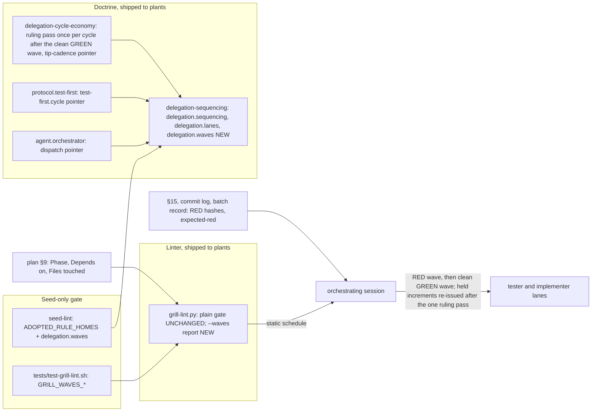
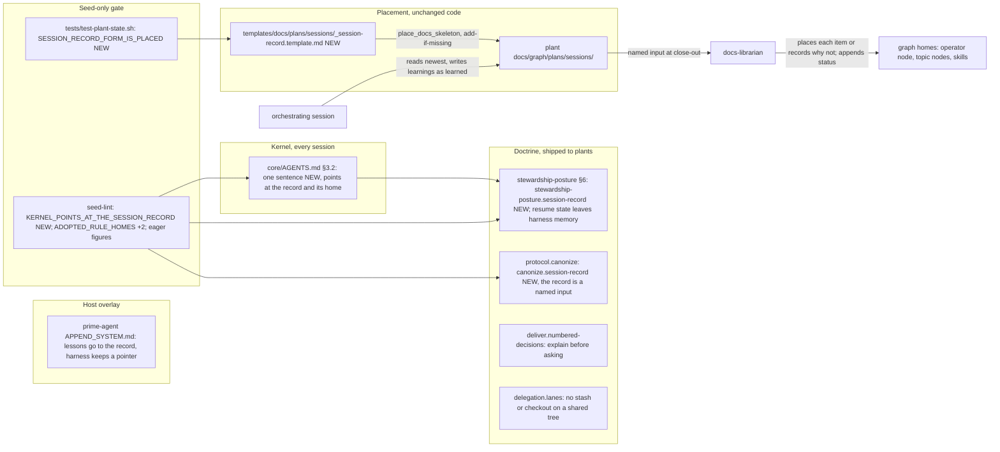

# grill.md — Plan of Record: wave scheduling (7.31.0)

## 0. Metadata
- Project: CYPRESS seed
- Feature or goal: let tester RED waves run ahead of implementer GREEN waves as far as real dependencies allow. The batch-boundary ruling gate is narrowed to the batches that depend on the ruled work or encode a contract an open question touches. The rule is named `delegation.waves`, and a read-only `grill-lint.py --waves` report derives the schedule from §9. Folded in by the owner on 2026-09-28, before cycle 1: the memory-residency track (harness memory is not a home; a session writes what it learns to a session record in the plant, and canonize files it; ADR-0013), and the round's other seed-worthy owner rules (§6 rows S1 to S4). Added by the owner on the same day: new and existing plants pick up everything 7.31.0 ships (§6 rows P1 to P4, ADR-0014).
- Date: 2026-09-28
- Owner: the steward; the orchestrating session plans and briefs
- Current phase: joint specify and grill pass complete; memory-residency track designed and folded in at the implementation boundary, before cycle 1's RED wave
- Related files: `core/method/delegation-sequencing.md`, `core/method/delegation-cycle-economy.md`, `protocols/test-first.md`, `docs/specs/SPEC-0005-cycle-economy.md`, `templates/knowledge-graph/grill-lint.py`, `tests/test-grill-lint.sh`, `manifest.json`, `CHANGELOG.md`, `documentation/*.md` (the architect confirms the list in §1)
- Related documentation: `protocols/specify-joint-pass.md` (the pass this plan is written in); `docs/plans/grill-7.30.0-cycle-economy.md` (the round whose rules this one amends)
- Related ADRs: adr-0012; [adr-0013](../decisions/adr-0013-harness-memory-is-not-a-home.md) (the memory-residency track)
- Related specs: [SPEC-0005](../specs/SPEC-0005-cycle-economy.md) (amended; the memory track adds `KERNEL_POINTS_AT_THE_SESSION_RECORD` and two adopted rule homes); [SPEC-0001](../specs/SPEC-0001-install-placement.md) (amended: `SESSION_RECORD_FORM_IS_PLACED`)
- Related libraries: none (stdlib Python, POSIX shell and Markdown only)
- Baseline: seed branch `wave-scheduling/7.31.0`, cut from `origin/main` `b407231` (tag `v7.30.0`)

## 1. Artifact Discovery
Every line cites the paths read, or reads `none — <reason>`. Read by the architect on 2026-09-28, joint-pass step 2.
- Existing files inspected: `core/method/delegation-cycle-economy.md` (whole; tip cadence :101-106, the ruling-pass paragraph :141-158, 168 lines of which about 141 are body), `core/method/delegation-sequencing.md` (whole; the no-invented-cap paragraph :31-38; 84 lines), `core/method/delegation.md` (Neighbours :104-117), `protocols/test-first.md` (`test-first.cycle` :85-102; the early-RED clause :89-92), `protocols/specify-joint-pass.md` (whole), `agents/00-orchestrator.md` (:261-274), `agents/01-architect.md` (:188-199), `agents/04-tester.md` (:44-60), `templates/grill.template.md` (§9 :101-140), `templates/adr.template.md`
- Existing docs inspected: `DOCUMENTATION.md` (§6.8 :500-513, §6.9 :515-552, the `enf-grill-lint` row :1688, the test list :1059), `documentation/protocols-reference.md` (the `test-first.cycle` mirror :544-559), `documentation/skills-and-templates-reference.md` (B.16 :1411-1437), `manifest.json` (:28-30, :363-364), `docs/plans/grill-7.30.0-cycle-economy.md` (§1 :16-25, §6 :52-70, §7 :72-83, §8 :85-123, §9 :125-340 and every `Depends on:` row to :682), `docs/decisions/adr-0003-enforcement-layering-honesty.md` (:80-104, the class vocabulary), `docs/decisions/adr-0011-donor-token-redaction.md` (ADR shape), `docs/decisions/index.md`; the owner's words, the design review's six findings and the stored creative design are kept with the round's working records outside the seed
- Existing tests inspected: `tests/test-grill-lint.sh` (whole: `write_plan`, `write_ledger`, `expect_fail`, `expect_pass`, cases 1-32; case 13, the SKIP case, runs last and deletes the plan), `tests/seed-lint.py` (`DELEGATION_SPLIT` :320-332, `ADOPTED_RULE_HOMES` :336-351, `check_spec_test_mapping` :1583-1742, `check_adopted_rule_homes` :2934-2973), `tests/ratchets.json` (`OVERSIZED_LEAVES` :117-139)
- Existing specs inspected: `docs/specs/SPEC-0005-cycle-economy.md` (§0-§8 whole, §9 :1208-1326, §10 :1328-1434, §11, §12 head)
- Existing architecture signals: `templates/knowledge-graph/grill-lint.py` (whole: `REQUIRED_FIELDS` :85, `fields()` :150-168, `increments()` :171-279 with document order kept, the dependency checks :371-380, `--list` :439-444, the CLI :309-315, flags read by `in argv`)
- Libraries already wikified: none — no library is involved
- External sources downloaded: none — nothing external is needed
- Constraints discovered: `grill-lint.py` resolves specs, the plan template and decisions beside itself, so run from `templates/knowledge-graph/` it fails spec alignment on a seed-side plan (the 7.30.0 finding, `docs/plans/grill-7.30.0-cycle-economy.md` :25); `delegation-cycle-economy.md` has about 29 body lines left under the 170-line leaf ceiling; `protocols/test-first.md` is an `OVERSIZED_LEAVES` member (`tests/ratchets.json` :130), held by `MACHINERY_BODY_CEILING`; `ADOPTED_RULE_HOMES` is a hand-kept dict, so a new key is held only once an entry names it; a §10 row citing a `.sh` file needs an invariant label that file contains (`tests/seed-lint.py` :1725-1742); `tests/test-grill-lint.sh` runs under `set -e` and stops at its first failing case; every `Phase:` in the 7.30.0 plan is one word, and its 44 increments form an acyclic graph in document order
- Memory-residency track, read by a fresh architect on 2026-09-28 at the implementation boundary (`core/AGENTS.md`, `core/method/stewardship-posture.md`, `protocols/canonize.md`, `integrations/prime-agent/`, `install.sh`, `tests/seed-lint.py`; spans below)
  - Doctrine: `core/AGENTS.md` (§3.2 :92-96 "ahead of memory"; §4 :129-130, deletion needs a named confirmation); `skills/context-router/SKILL.md` (`rule.knowledge` :49-86; :76-78 "Graph before code, ahead of memory" covers memory of APIs and versions only; no place for a session's learnings); `core/method/stewardship-posture.md` (§6 :79-103, `stewardship-posture.compounding-knowledge`: harness memory holds "at most a one-line pointer … plus transient resume state"; :25 the "remember" trigger); `templates/docs/nodes/_operator.template.md` (:62-63 points at stewardship for what harness memory may keep); `protocols/canonize.md` (inputs :82-171 and flow :173-223: handbacks, overflow notes, `tools_built`, `skills_built`, the status register, deviations, why-record, with no session-level record; session-owned exception :59-62 names `grill.md` and `changelog.md`); `protocols/deliver.md` (`deliver.numbered-decisions` :127-138: numbered and exact, with no explanation-first rule); `core/method/delegation-sequencing.md` (`delegation.lanes` :61-83: nothing on git-state commands on a shared tree); `core/method/delegation-cycle-economy.md` (:77-80, the owner fixed the effort-scale values)
  - Integrations: `integrations/prime-agent/APPEND_SYSTEM.md` :120-125 and `integrations/prime-agent/README.md` :147-153 send "a cross-session OPERATING lesson" to Prime Agent's continual harness, which contradicts stewardship §6. `integrations/claude-code/README.md` and the other adapters say nothing about a host's own memory
  - Placement: `install.sh` :787-804 (`place_docs_skeleton` walks `templates/docs/**` with `place_if_missing`, so a new leaf there is placed with no code change); `templates/docs/plans/` holds only `grill.md`; no session-record form exists anywhere in the seed; `tools/growth-audit.py` :348-384 (a `plans/…` leaf adds no collection row, because `plans/` is one already); `tools/graft-audit.py` :380, :603 and `tools/status-register.py` :340 skip `_`-prefixed forms; `status-register.py` :408-414 skips a file with no `status:` key; `templates/knowledge-graph/graph-lint.py` :286-302 scans only `nodes/` and the machinery directories, never `plans/`, so no skip is needed; `tests/test-plant-state.sh` :196-205 (`case_plan_records`; its comment says the seed ships only `grill.md` into `plans/`)
  - Gates: `tests/seed-lint.py` (`KERNEL_BUDGET` :51; the §3.1–§3.8 heading check :3327-3329, the only kernel-anchor check, which pins no anchor text; the budget :3330-3333; `check_eager_surface` :3056 and `check_published_eager_figures` :3127-3166, which fail on any published figure the computation does not produce; `check_spec_test_mapping` :1609-1619 refuses a seed spec in `draft`; `check_protocol_reference` :555 and `check_skills_reference` :1051 hold the reference tables to `owns:` and `est_tokens`; `ADOPTED_RULE_HOMES` :336-351; `OVERSIZED_LEAVES` in `tests/ratchets.json` :117-139 includes `protocols/canonize.md`, `protocols/deliver.md`, `skills/context-router/SKILL.md`); the published eager figures are in `README.md` :37 and `documentation/host-capability-matrix.md` :98, :475-479, :498, :500
  - The round's working records (the owner's words, the prototype session record kept in a plant) were read and are kept outside the seed; the stored CREATIVE design is recorded in §2 and §7 and was not re-read
- Plant pickup, read 2026-09-28: `install.sh` (`place_file` :358-403, `place_if_missing` :433-438, `place_generated` :447-452, `place_graph_machinery` :811-833, `place_graph_scaffold` :959-979), `tools/graft-graph-engine.py` (whole), `tools/graft-audit.py` (:58-124, :170-206, :228-327, :761-793), `protocols/graft.md` (:105-175, :300-330, :466-495, :630-714, :960-984), `protocols/grow.md` (:455-472, :888-923), `protocols/initialize.md` (headings), `docs/specs/SPEC-0001-install-placement.md` (§1, §2, `EVERY_BACKUP_IS_CLASSIFIABLE`), `tests/test-install-placement.sh` (:40-70), `tests/test-graft-tools.sh` (engine cases). Body lines: `graft.md` 1,423 in all, `grow.md` 923, against the 2,500-line lifecycle ceiling. Reach of what 7.31.0 ships:

  | 7.31.0 file | New plant (install, grow) | Existing plant (graft = installer re-run + Phase 3) | Mechanism |
  |---|---|---|---|
  | `docs/graph/grill-lint.py` (`--waves`) | yes | **no** | install: `place_if_missing` :972. Graft: Phase 3 names only `graph-lint.py` and `spec-lint.py`; `graft-graph-engine.py`'s default `--preserve` refuses an engine without `ROOT_ID` (exit 2); `graft.gate.engine` checks `graph-lint.py` only, and `graft-audit.py` keeps only the last `--engine`. Existing mechanism, misaimed: fixed by increments 15 to 18 (ADR-0014) |
  | changed method nodes (`delegation-sequencing`, `delegation-cycle-economy`, `stewardship-posture`), `protocols/test-first.md`, `protocols/canonize.md`, charters 00 and 01 and their harness projections | yes | yes | `place_graph_machinery` (`place_tree`/`place_file`: fast-forward with a backup), adapter projections; graft-audit classifies each backup; Phase 3 merges a plant customization |
  | `docs/graph/templates/**` reference copies, the session-record form's included | yes | yes | `place_tree "$SEED_ROOT/templates"` :831 (fast-forward with a backup) |
  | `docs/graph/plans/sessions/_session-record.template.md` (and so the directory) | yes | yes | `place_docs_skeleton` walk, `place_if_missing`: absent in an old plant, so added; `_` keeps it out of `--unfilled` |
  | the kernel's §3.2 sentence | yes | yes | `place_kernel` (fast-forward with a backup); `graft.gate.kernel` checks currency |
  | Prime Agent overlay fix | yes | yes | `place_file`; mapped in `graft-audit.py` `ADAPTER_MACHINERY` :205 |
  | moving existing harness memories into a session record | first session under the rule (stewardship doctrine); no protocol step | **no step** | new prose only: graft's memory migration and grow's delivery sentence (increment 18); no tool, because harness memory is outside `--project-dir` |
  | `spec-lint.py`, `graph-lint.py` | yes | `graph-lint.py` yes; `spec-lint.py` refused by the tool's default (not a 7.31.0 change; fixed by the same default) | as `grill-lint.py` |

## 2. Shared Understanding
The owner asked whether 7.30.0 ran "all testers as many as possible before spawning implementers". It did not. `protocols/test-first.md` (`test-first.cycle`) already lets the next increment's RED run early when §9's `Depends on:` rows make the two independent. `delegation-sequencing.md` forbids an invented concurrency cap. The cycle-economy ruling pass, however, holds every spawn of batch `<N+1>` until batch `<N>` has handed back and been ruled on. That rule has three homes: the cycle-economy leaf, SPEC-0005 §3.1 and SPEC-0005 §6. It serializes batches even when they share no file and no dependency edge, so RED work that could already be written waits behind unrelated GREEN work.

Success means four things:
- A later batch's RED is dispatched as soon as it is ready. Ready means every increment it depends on is committed, its files are disjoint from the live lanes, and no open question's `where:` touches a contract it encodes.
- GREEN keeps its own gates: its RED landed with recorded hashes, and the ruling pass covering its questions has run.
- REDs that ran ahead are carried as expected-red by test id at a batch tip.
- The session reads the wave schedule from `grill-lint.py --waves` rather than deriving it by hand.

The ruling pass runs once per cycle, after the clean GREEN wave, over every flag (the owner's cycle); a problem holds only its own increment. Out of scope: removing batches as the planning unit, question-pressure rulings, a machine-readable schedule file, and any new hard failure on existing plans. These belong to the CREATIVE design, which the owner stored and did not adopt.

**The memory-residency track (ADR-0013).** The owner does not want memories to sit in a harness's own memory: "memories instead should be codified into the plant - first as a "runtime/spec/session .md file" then picked up by docs-librarian in the canonize step and properly maintained". The instruction to the harnesses lives in the kernel. The seed already persists standing owner rules in the graph (stewardship §6) and distrusts memory (§3.2). It lacks four things: a place for a learning between the moment it is learned and the close-out; a kernel pointer to that place; canonize reading it; and a form that plants receive. It also still allows resume state in harness memory, and the Prime Agent overlay sends operating lessons to the host's own memory. Success means:
- the kernel's §3.2 names the session record and its one home;
- `stewardship-posture.session-record` holds the rule;
- `canonize.session-record` files the record;
- every installed plant has `docs/graph/plans/sessions/` holding the form;
- no shipped surface sends a lesson to harness memory.

**Plants pick up 7.31.0 (ADR-0014).** A fresh install places everything this round ships. An existing plant receives all of it through graft except `grill-lint.py --waves` and a step that moves its harness memories into a session record (the reach table in §1). Success means an existing plant grafted to 7.31.0 runs `grill-lint.py --waves` with its engine config preserved and its old engine backed up, graft's engine gate sees every engine, and both graft and grow start the plant's first session record.

## 3. User Goal
- Primary user: the orchestrating session and its workers running the seed's method in any plant; the owner, who pays for their wall-clock and tokens
- Primary outcome: testers work ahead of implementers in dependency-ordered waves, with the same invariants (observed RED for the right reason, RED hashes, independent review, one writer per file set, one ruling pass per cycle)
- Job to be done: plan a spec's increments, see which can run in which wave, and dispatch every ready RED without waiting on unrelated batches
- Acceptance criteria (link to spec §9): [SPEC-0005 §9](../specs/SPEC-0005-cycle-economy.md), amended
- Non-goals: measuring the saving; changing batch sizes, the effort scale, the GREEN self-test, mutation cadence, or who rules

## 4. Operating Constraints
- Runtime constraints: checks run inside `tests/run.sh` under existing steps; stdlib Python 3 and bash 3.2-compatible shell only
- Security constraints: no secret, host name, user path or donor identifier in seed text; no production data in fixtures. No security surface is expected: `grill-lint.py` reads a plan file the session wrote. The architect confirms this in §11.
- Privacy constraints: none beyond the above
- Data constraints: none; documentation and lint code only
- Cost constraints: design latitude BALANCED (§6). The round runs on the 7.30.0 cycle rules it amends: effort-sized batches, GREEN run by the implementer, targeted tests plus cross-cutting gates per increment, `tests/run.sh` once per cycle after its GREEN wave, one sampled mutation pass at the end, and one ruling pass per cycle
- Latency constraints: `--waves` must not measurably slow `tests/run.sh`
- Compliance constraints: none
- Maintenance constraints: `grill-lint.py` ships to plants, so `--waves` adds no hard failure on existing plans; a plan without `Phase:` fields reports "unscheduled" and exits 0. Add owned ids to existing nodes rather than create new nodes, so seed-lint's derived figures don't move without cause. Workers make no git writes and write only their named files; the orchestrator commits by pathspec. A new `load_when` phrase must pass `tests/fixtures/router/stem-collisions.json`. The kernel stays under `KERNEL_BUDGET` (8,000 bytes). Any change to an eager term (the kernel, an agent or skill `description:`, the Prime Agent overlay) moves the published eager figures, which are re-derived from seed-lint's computation in the same increment and never computed by hand. Memory-track increments change no `description:`

## 5. Research Summary
no external dependency — the work is doctrine prose plus stdlib Python (`re`, `fnmatch`) in a linter that already parses §9; no §9 row depends on a `docs/graph/libraries/` page, and no host fact is involved.

## 6. Decisions Made
| Decision | Rationale | Evidence | Reversibility | ADR | Date |
|---|---|---|---|---|---|
| Design latitude: balanced | The owner chose it from three options: "do balanced in t3 but apply all the new rules from 7.30". The expected new structure is one owned id (`delegation.waves`) and one read-only linter mode (`--waves`) | owner, 2026-09-28, in session; the options and their review are kept with the round's records outside the seed | reversible | none | 2026-09-28 |
| Tier T3 | SPEC-0005 owns the gate, so the contained T2 lane does not apply; the owner accepted T3 | owner, 2026-09-28 | — | none | 2026-09-28 |
| Version 7.31.0 | New linter behavior ships to plants; the owner chose balanced after reading "Balanced, with --waves report-only, shipped as 7.31.0" (the session's reading, open to correction) | session, 2026-09-28 | reversible until tagged | none | 2026-09-28 |
| ~~REDs run ahead of GREENs in dependency-ordered waves; the batch ruling gate holds only the work that turns the batch's REDs green, spawns that depend on the batch, and REDs encoding a questioned contract; the pass itself stays batch-scoped (O-5)~~ (superseded 2026-09-28 at ruling pass 0 by the R0.8 and R0.15 rows below) | the owner's question and words (§2); the gate was the only blocker, since `test-first.cycle` and `delegation.sequencing` already allow independent work to run early | SPEC-0005 §6 "Waves"; the design review's finding 1, kept with the round's records outside the seed | reversible | ADR-0012 | 2026-09-28 |
| `delegation.waves` lives in `core/method/delegation-sequencing.md`; the cycle-economy paragraph narrows its gate and points there | the seed's `CLAUDE.md` names `delegation.sequencing` there as the generic sequencing rule's home; the cycle-economy leaf has about 29 body lines left under the 170-line ceiling, which the rule's text would use up | `CLAUDE.md` "Canonical homes"; §1 | reversible | ADR-0012 | 2026-09-28 |
| ~~A dependency is satisfied when committed after review; a RED-phase dependency is satisfied once observed with recorded hashes~~ (superseded 2026-09-28 at ruling pass 0 by the R0.10 row below) | "ready means committed" (finding 2); a RED commits only with its GREEN (`delegation.green-self-test`), so waiting for its commit would deadlock the GREEN | SPEC-0005 §6 "Waves"; 7.30.0 plan §6 :65 | reversible | ADR-0012 | 2026-09-28 |
| R0.1: a tip passes when every failure's test id is on the expected-red list; ids at the finest grain the gate reports, a lint step's finding line included; nothing leaves the branch while the list is non-empty | reading (b) would re-serialize batches at the tip; 7.30.0 already ran tips "expected red on exactly the new RED ids" (its §9 :186) | the ruling on Q0.1, kept with the round's records outside the seed | reversible | ADR-0012 | 2026-09-28 |
| `--waves` is a report: its exit status is the plain lint's; overlaps and phase problems are WARN; no `Phase:` gives "unscheduled" | `grill-lint.py` ships to plants; `Files touched:` is free text (finding 4) | SPEC-0005 §4 `GRILL_WAVES_LEAVES_THE_GATE_UNCHANGED`, §6 "Wave report" | ~~reversible now → a release note to remove after 7.31.0 ships~~ reversible until tagged (R0.16, C9) | ADR-0012 | 2026-09-28 |
| The report is not computed when §9 has a dependency defect, and is computed despite every other defect | on a forward or missing edge the levels would be a guess; a seed-side plan fails only spec alignment, and the session must still get its schedule | SPEC-0005 §4 `GRILL_WAVES_NOT_COMPUTED_ON_DEPENDENCY_DEFECT` | reversible | none | 2026-09-28 |
| Overlap is checked for every pair with no dependency path between them, not only within one wave | two such increments can be live at once whatever their waves; a false overlap costs a line, a missed one a lane race | SPEC-0005 §6 "Wave report" | reversible | none | 2026-09-28 |
| A bare name with no `/` counts as a path only when its extension also ends a slashed path in the same plan | a dry run of the rule on this plan's own §9 warned on dotted fact keys (`delegation.waves` in increments 2, 3, 4 and 6); noise on keys would train sessions to ignore the warning; the extension set comes from the plan, so no list is kept | SPEC-0005 §6 "Wave report", path tokens step 4; §7 `FALSE_OVERLAP`, `MISSED_OVERLAP` | reversible | none | 2026-09-28 |
| The rule-home RED is a tester's entry in `tests/seed-lint.py` `ADOPTED_RULE_HOMES`; the home prose (increment 6) is its GREEN side | the dict entry is the assertion; the generic check already has its cases (X347, X348); no implementer edits the file | `tests/seed-lint.py` :336-351, :2934-2953 | reversible | none | 2026-09-28 |
| ~~No edit to `agents/01-architect.md`, `agents/04-tester.md` or `templates/grill.template.md`~~ (superseded 2026-09-28 at ruling pass 0: under R0.15 the architect's "at a batch boundary" line is no longer true, so `agents/01-architect.md` joins increment 4; the tester's charter and the template still need no edit) | read for restatements of the gate: the architect's line says the pass runs "at a batch boundary", which stays true; the tester's and the template's say nothing about it | §1 | reversible | none | 2026-09-28 |
| ~~New wave cases run after every existing case in `tests/test-grill-lint.sh`, before the final SKIP case~~ (superseded 2026-09-28 at ruling pass 0 by the R0.3 row below) | the script stops at its first failure, so an early red placed first would hide a regression in a later case behind an expected-red id | `tests/test-grill-lint.sh` `set -euo pipefail`, case 13 | reversible | none | 2026-09-28 |
| R0.15 (owner): work runs in cycles: a RED wave covering every ready RED (as many parallel tester spawns as `delegation.effort-scale` requires; no spawn size changes), a GREEN wave over clean increments with no ruling pass before it, the tip, then one ruling pass over every flag of the cycle, then the held increments re-issued (RED again if a ruling changed their contract, else GREEN) with newly ready work | the owner's cycle definition, 2026-09-28, quoted in ADR-0012; supersedes O-5's timing, keeps its one-pass, whole-picture sense | the owner's words, kept with the round's working records outside the seed; SPEC-0005 §6 "Waves", Cycle | reversible until tagged | ADR-0012 | 2026-09-28 |
| R0.8 (owner): the unit that pauses is the increment, never the batch; an increment is held by an unruled entry touching it, a wrong-reason or questioned test, or a tip red attributed to it, and its dependents are held with it | the owner's Q0.8 answer and confirmation | SPEC-0005 §6 "Waves", Held increment; §7 `BATCH_PAUSED_FOR_ONE_INCREMENT` | reversible until tagged | ADR-0012 | 2026-09-28 |
| R0.10 (C1, C2): a RED is satisfied once observed and hashed only for its own GREEN; any other dependent waits for that GREEN to commit; an observed RED whose GREEN has not committed holds its test files as a live lane; no rule depends on whether a RED commits alone | "a RED commits only with its GREEN" is a 7.30.0 plan practice, not shipped doctrine (C1); shared test files would break recorded hashes (C2); a wrong RED edge must wait for the behavior | SPEC-0005 §6 "Waves" (Own GREEN, Satisfied dependency, Live lane); §7 `RED_WRITES_A_HELD_TEST_FILE` | reversible until tagged | ADR-0012 | 2026-09-28 |
| R0.3 and R0.12 (Q0.3, C5): a step that aborts proves nothing past its abort, and its unexecuted cases are listed `not run`; nothing leaves the branch until a tip lists none; in `tests/test-grill-lint.sh` the wave cases run in one collecting block after every existing case, case 13 included | `set -euo pipefail` suites stop at the first failure (C5); the collecting block observes every wave label at RED and at a tip (Q0.3) | SPEC-0005 §4 preamble to the wave contracts; §6 "Waves", Not run; §7 `ABORTED_STEP_HIDES_CASES` | reversible | none | 2026-09-28 |
| R0.4 (Q0.4): increment 2's baseline break of `tests/test-seed-lint.sh` is carried honestly: the baseline line is expected-red and the script's cases are `not run` until increment 6 commits; no shadow run | a shadow run is a new procedure beyond balanced; the `not run` record states the blindness in words | question Q0.4, kept with the round's working records outside the seed; §11 | reversible | none | 2026-09-28 |
| R0.5 (Q0.5): `tools/gate-registry.py`'s entry for `test-grill-lint.sh` is updated in increment 1 to say the step also reads one frozen seed plan | X365 reads `docs/plans/grill-7.30.0-cycle-economy.md`; the entry's "not swept" would be false | `tools/gate-registry.py` :97-100 | reversible | none | 2026-09-28 |
| R0.6, R0.7, R0.13 (Q0.6, Q0.7, C7): an overlap warning prints the more specific token; `--waves` output holds every plain line in order and no traceback; duplicate increment numbers print "not computed"; the unchanged-gate claim is scoped to the plans the suite builds | assertion precision; a crash must not pass as a defect exit; a map keyed by number mis-levels duplicates | SPEC-0005 §4, §5, §6 "Wave report" | reversible | none | 2026-09-28 |
| M1 (owner): the memory-residency track joins 7.31.0 as increments 10 to 14, in the existing cycles; spawn sizes and the cycle shape unchanged | "fold it into the 7.31 with the rest … before testers red implementation"; the owner's words are kept with the round's working records outside the seed | ADR-0013 Context | reversible until tagged | ADR-0013 | 2026-09-28 |
| M2 (owner): the harness instruction lives in the kernel. §3.2 gains, after its last line, exactly: "Harness memory is not a home: a session starts from the newest record in `docs/graph/plans/sessions/` and writes what it learns there for canonize (`method.stewardship-posture`)." That is 179 bytes (ASCII; a re-wrap swaps a space for a newline and keeps the count), so the kernel goes from 7,752 to 7,931 bytes, 69 under budget | "i think this one should live in the kernel"; the anchor names the home and does not restate the rule; "starts from the newest record" replaces the automatic resume that harness memory gave | ADR-0013 Decision; §1 (seed-lint :3327-3333) | reversible until tagged | ADR-0013 | 2026-09-28 |
| M3: the full rule's home is `method.stewardship-posture` §6, new key `stewardship-posture.session-record`, not `skill.context-router` | §6 already owns what harness memory may keep and the operator template points there; moving it would leave a moved key and stale pointers; `rule.knowledge` stays as it is, and the kernel sentence names the home | `core/method/stewardship-posture.md` :90-103; `templates/docs/nodes/_operator.template.md` :62-63 | reversible until tagged | ADR-0013 | 2026-09-28 |
| M4: canonize files the record under a new key `canonize.session-record`. The record is a source of knowledge candidates, not a sixth close-out duty. The librarian appends status lines, and the session owns the rest of the record | the owner: "picked up by docs-librarian in the canonize step and properly maintained"; the session already owns `grill.md` and `changelog.md` under the same exception | `protocols/canonize.md` :59-62, :82-90 | reversible until tagged | ADR-0013 | 2026-09-28 |
| M5: the form ships as `templates/docs/plans/sessions/_session-record.template.md`, placed by the existing `place_docs_skeleton` walk: no installer code, no new write site, and no graph-lint skip needed | the smallest option that both creates the directory in every plant and delivers the shape; the underscore form follows `nodes/_deviation.template.md` | §1 placement line; `install.sh` :787-804 | reversible until tagged | ADR-0013 | 2026-09-28 |
| M6: no new spec. The memory track's contracts amend SPEC-0005 (`KERNEL_POINTS_AT_THE_SESSION_RECORD`, two `ADOPTED_RULE_HOMES` rows) and SPEC-0001 (`SESSION_RECORD_FORM_IS_PLACED`). The session applies both amendments, and the SPEC-0005 lane holders re-sign, before the cycle-1 RED brief | seed-lint refuses a seed spec in `draft`, so a new spec written ahead of its RED breaks the gate; both mechanisms already exist | `tests/seed-lint.py` :1609-1619 | reversible | ADR-0013 | 2026-09-28 |
| M7: the Prime Agent overlay's close-out bullet, and its README mirror, send operating lessons to the session record; the continual harness keeps at most a pointer | the bullet contradicts stewardship §6 and the owner's rule; fixing it removes a second home rather than adding an overlay instruction | §1 integrations line | reversible until tagged | ADR-0013 | 2026-09-28 |
| M8: the kernel increment re-derives every published eager figure from seed-lint's computation, in the same increment | a kernel edit moves all five figures; `check_published_eager_figures` fails on any figure it does not compute | `tests/seed-lint.py` :3127-3166; `README.md` :37; `documentation/host-capability-matrix.md` :98, :475-479, :498, :500 | reversible | none | 2026-09-28 |
| S1 (owner; confirmed as seed doctrine at ruling pass 1, R2.9: "when asking question the seed/plant should strive to be as understandable as possible" — the rule's lead sentence; the method below is how it is met): a decision put to the owner is explained in prose before it is asked: what the earlier decision says, quoted; what changes, with one concrete example; what it costs; what stays the same. If the owner says the explanation fell short, re-explain and re-confirm before building on the answer. Home: `deliver.numbered-decisions` (increment 14) | the owner answered a terse two-option prompt with "your explanation is sorely lacking"; the failure is generic to every owner, and `deliver.numbered-decisions` already governs how decisions reach the owner | the owner's words, kept with the round's working records outside the seed; `protocols/deliver.md` :127-138 | reversible until tagged | none | 2026-09-28 |
| S2: seed text carries no session residue: no spawn id, worker label or path to a round's working records outside the seed; a ruling is cited by its id and its source described in words. Home: the seed's own `CLAUDE.md` Conventions, which is seed-only and never shipped (increment 14) | 7.30.0 needed a cleanup pass for exactly this; this plan needed one too (the rows cleaned in this pass); plants legitimately cite spawn ids in their own records (`method.prose-posture`), so the rule is the seed's, not doctrine | this plan's §15; `core/method/prose-posture.md` :147 | reversible | none | 2026-09-28 |
| S3: on a shared tree a worker runs no command that moves other writers' uncommitted files (`git stash`, `checkout`, `restore`, `reset`); it takes a baseline by copying the file or reading `git show HEAD:<path>`, and the orchestrator commits each lane by pathspec. Home: `delegation.lanes` (increment 6, same writer and file) | waves put more writers on one tree at once; the round's rules and briefs already required it, but no shipped node says so | `core/method/delegation-sequencing.md` :61-83 | reversible until tagged | none | 2026-09-28 |
| S4: already present, and no increment added: spawn sizes are the owner's effort scale, and a brief never restates them with a change ("as many as possible" means covering the ready set across spawns); holds are per increment; the cycle shape; O-18's attribution; the three homes of the gate; aborting suites; `expertise_gap`; handbacks by path | each has a home: `delegation-cycle-economy.md` :77-80 and R0.15; R0.8; R0.15 and ADR-0012; R0.11; §2; R0.12; the handback fields in `tests/seed-lint.py` :364; `core/method/delegation-briefs.md` :95 | the sweep table, kept with the round's working records outside the seed | — | none | 2026-09-28 |
| P1 (owner): new and existing plants pick up 7.31.0; the plant-pickup increments 15 to 18 join cycle 2 (15 and 16 in its RED wave with 9, 17 in its GREEN wave, 18 with 7 in its prose step); spawn sizes and the cycle shape unchanged | "please remember to update the graft and growht/install protocol as needed for a new /old plant to pick up our changes" (the owner's words, kept with the round's working records outside the seed) | the reach table in §1 | reversible until tagged | ADR-0014 | 2026-09-28 |
| P2: the graph engines stay plant-owned at install (add-if-missing); graft carries them through `tools/graft-graph-engine.py`, which takes each engine's own config set when no `--preserve` is given, and `tools/graft-audit.py` checks every `--engine` pair | the mechanism exists; its default refuses `grill-lint.py` and `spec-lint.py`, `graft.md` names only two engines, and the audit keeps only the last pair; an installer fast-forward would add a third placement policy for a file that must stay a real copy | `tools/graft-graph-engine.py` :42, :182-186; `tools/graft-audit.py` :97-101; `protocols/graft.md` :132, :683-704, :971, :974; `templates/knowledge-graph/grill-lint.py` :65 | reversible until tagged | ADR-0014 | 2026-09-28 |
| P3: SPEC-0001's scope gains the engine reconciliation and the audit's engine check (three contracts); graft as a whole stays out of scope | it is placement of seed files into a plant, and SPEC-0001 already contracts graft-audit's classification of install backups (`EVERY_BACKUP_IS_CLASSIFIABLE`); a new spec cannot be written ahead of its RED | `docs/specs/SPEC-0001-install-placement.md` :53-54, :158-164; `tests/seed-lint.py` :1609-1619 | reversible | ADR-0014 | 2026-09-28 |
| P4: graft gains a memory migration (harness memory → a first session record, filed by the graft's own canonize, deletion by the owner's named decision), and grow's delivery starts the plant's first record; no installer change beyond the scaffold walk that already places the form | the owner's rule (ADR-0013) needs an existing plant's memories moved once; the kernel sentence and the form already reach both kinds of plant by existing writers | `install.sh` :787-804 (walk), `place_kernel`; `protocols/graft.md` :466-473 (the migrations); `protocols/grow.md` :888-894 | reversible until tagged | ADR-0013 | 2026-09-28 |
| R1.1–R1.4 (ruling pass 1, batch 1): `recover.md:58` joins increment 7; the stale `load_when` phrase stays (a trigger, not a rule), so increment 3 is released; `case_plan_records`' `sessions` allow-list is ratified; the seed-lint mirror findings and the `test-seed-lint.sh` carry are attributed to increment 7 | AC-19 governs rule statements; the reviewer found 3 clean; the mirrors live in 7's files | the rulings, kept with the round's working records outside the seed | reversible | none | 2026-09-28 |
| R2.1: growth-audit skips `_`-prefixed and `*.template.md` leaves, as graft-audit does; new contract `SESSION_RECORD_FORM_IS_NOT_A_SCAFFOLD`; increments 19 (RED) and 20 (GREEN); 12 depends on 20 | an honest ABSENT `plans/` could never pass once the form ships; one exclusion rule for both audits | `tools/growth-audit.py` :551-563; `tools/graft-audit.py` :380, :603; the cycle-1 tip | reversible until tagged | ADR-0013 | 2026-09-28 |
| R2.2, R2.3, R2.5: the spec says "awaiting"; the Prime Agent README :124-127 fix (the reviewer's Major) and canonize's two nits are the cycle-2 re-issue of 13 and 12 | seed-lint's pending phrases; AC-31 | SPEC-0005 §6; `integrations/prime-agent/README.md` :124-127 | reversible | none | 2026-09-28 |
| R2.4: grill-lint's docstring points at `delegation.waves`, not a seed spec (increment 21); the two-node timing stays (the spec homes both); the orchestrator charter's sentence stays, with AC-26 clarified by product; `DOCUMENTATION.md:545` is 7's | a bare SPEC slug in a file that ships to plants names the plant's own spec | `templates/knowledge-graph/grill-lint.py:42` | reversible | none | 2026-09-28 |
| R2.6–R2.8: no new mutation case for X375 (the report returns lines, never an exit status); M3/M7 killer notes corrected in §10; §8's examples print 2 contract refs; increment 5's three-function split recorded | the mutation pass, the tester's note, the reviewer | the cycle-1 mutation report, kept outside the seed; `grill-lint.py` :332-378 | reversible | none | 2026-09-28 |
| Cycle 3 exists because of dependencies, not holds: 9 and 16 wait for 12's commit (their test-plant-state lane), 17 for 16, and 18 and 7 for 17. Only held increments re-enter cycle 2 (12, 13's re-issue), beside what is newly ready (15, 19, 20, 21) | the owner's cycle: one RED wave and one GREEN wave per cycle; work that becomes ready only after a GREEN commits goes to the next cycle | plan §9 table | reversible | none | 2026-09-28 |
| R4.1–R4.12 (the final ruling pass, over cycle 3's flags). Fix now, in one docs-librarian re-issue: the `DOCUMENTATION.md` §6.9 leave-the-branch clause (the final review's Major), `graft.md`'s memory-migration step 2 (source and order) and steps 3–4 (point at `stewardship-posture.session-record`), and the CHANGELOG's S2 paragraph. The spec owner wrote the SPEC-0001 and SPEC-0005 flip records; the SPEC-0005 §10 note is the tester's transcription. Deferred to a later round (§12): the `CONFIG_KEY_RE`/`ENGINE_PRESERVE` collapse, the collecting form of `test-graft-tools.sh`'s older cases (Q4.2 (b)), and the stale `load_when` triggers. Q4.1 and Q4.a are closed | the owner: "prose/documents update needs to be ran into only 1 subagent once EVERYTHING is confirmed to have been implemented", and "don't increase spec scope"; every deferred item is new work, not a defect in what 7.31.0 claims | the final review and the rulings, kept with the round's working records outside the seed | reversible | none | 2026-09-28 |

## 7. Options Considered
| Option | Pros | Cons | Chosen / Rejected | Why |
|---|---|---|---|---|
| BALANCED: narrow the gate, one owned id `delegation.waves`, one read-only `--waves` report | the schedule is derived from §9, not by hand; no new hard failure on the plans the suite builds; one ruling pass per cycle over every flag (as re-ruled at ruling pass 0, R0.15) | early REDs and clean GREENs can be invalidated by a ruling (a re-issue) | Chosen | the owner's latitude; ADR-0012 |
| SIMPLE: narrow the gate, no tool | smallest change | hand-derived waves at every batch, with nothing checking them; §2's success criteria ask the session to read the schedule from the linter | Rejected | ADR-0012 |
| CREATIVE: no batches, question-pressure rulings, a schedule file | most parallelism | new concepts the goal did not ask for; a partial-batch ruling contradicts O-5 | Rejected (stored by the owner) | ADR-0012 |
| ~~Keep O-18 as declined in 7.30.0~~ (corrected at ruling pass 0: O-18's decline was the 7.30.0 session's assumption, not an owner decision) Keep O-5's timing: batch lands, architect pass, next increments | no change | one problem pauses a whole batch; clean GREENs wait for rulings they do not need | Rejected by the owner (Q0.8, R0.15) | ADR-0012 |
| Waves as batches: one RED batch, a ruling pass, then GREEN | keeps O-5's timing literally | implementers wait for architect arbitration the owner said they should not need | Rejected by the owner's cycle (R0.15) | ADR-0012 |
| Size RED spawns at the top of the effort scale | fewer spawns | changes the 7.30.0 sizes the owner fixed; the owner rejected it | Rejected (owner, 2026-09-28) | the owner's correction, kept with the round's working records outside the seed |
| Shadow-run `tests/test-seed-lint.sh` on HEAD's `seed-lint.py` while increment 2 is carried (Q0.4 b) | keeps its cases observed | a new tip procedure beyond balanced | Rejected; `not run` is recorded instead (R0.4) | R0.4 |
| Overlap as FAIL | stops a lane race | `Files touched:` is free text; plants would fail on plans that pass today | Rejected | finding 4 |
| Overlap only inside one wave | fewer lines | misses two independent increments in different waves that are live together | Rejected | §6 row |
| The report reads live state (struck rows, §15) | shows what is ready now | a second parser of plan history; beyond the goal under balanced | Rejected; filed as question Q0.2 | balanced |
| Tip reading (b): a tip does not pass while any expected-red is carried | simplest pass rule | re-serializes batches at the tip, which undoes the goal | Rejected | R0.1 |
| Home in `delegation-cycle-economy.md` | beside the gate it narrows | the leaf would pass the 170-line ceiling; `CLAUDE.md` homes sequencing rules in `delegation-sequencing.md` | Rejected | §6 row |
| Memory: harness memory stays a home for resume state (stewardship §6 today) | automatic, costs no kernel bytes | the owner's rule; private to one harness, unseen by workers, never checked for staleness (this round met a stale entry) | Rejected | ADR-0013 |
| Memory: the instruction lives only in host overlays | no kernel bytes | the owner placed it in the kernel; only one of five hosts has an always-read overlay; five overlays would be five homes | Rejected | ADR-0013 |
| Memory: the full rule in `skill.context-router` (`rule.knowledge`) | beside "ahead of memory" | the harness-memory rule already has a home (stewardship §6); a move leaves stale pointers; context-router is a loading procedure and an oversized leaf | Rejected | M3 |
| Memory: a new node kind or routable node for session records | routable | a record is session-owned working state like `grill.md`; routing it puts transient text in the router and makes two homes per fact until canonize | Rejected | ADR-0013 |
| Memory: a dedicated SPEC-0006 | one spec per track | seed-lint refuses a draft seed spec; the contracts extend SPEC-0005 and SPEC-0001 | Rejected | M6 |
| Memory: the installer creates an empty `plans/sessions/` in code | no template file | a new write site for SPEC-0001's census; git keeps no empty directory; ships no shape | Rejected | M5 |
| Memory: ship a Claude Code setting that turns off the host's automatic memory | the host stops writing memory at all | the host fact is not recorded in the graph; it changes a host default for every plant owner; beyond balanced | Deferred to the owner (§12) | ADR-0013 |
| Residue: a seed-lint check refusing spawn ids and record paths in seed text | mechanical | a new check nobody asked for; the convention and the reviewer hold it this round | Deferred to the owner (§12) | S2 |
| Owner questions: the explain-first rule only in the plant's operator node | owner-specific | the failure (a terse option prompt) is generic, and the seed already owns how decisions reach the owner | Rejected | S1 |
| Engines: the installer fast-forwards `grill-lint.py` (config-free), so a plain re-install upgrades it | no graft step needed for it | a third placement policy (a copy-mode fast-forward: the engine resolves the plan and specs beside its resolved path, so it cannot be a link); moves it out of SPEC-0001's plant-owned exception list; leaves `spec-lint.py`'s refusal | Rejected | ADR-0014 |
| Engines: document `--preserve=` per engine in `graft.md`, no tool change | prose only | the tool's default still refuses two of three engines and the audit still drops all but one pair, so a loose graft reports clean over a stale engine | Rejected | ADR-0014 |
| Engines: a version-aware or hash-aware replace at install | automatic | new machinery beside an existing config-preserving reconciliation | Rejected | ADR-0014 |
| Memory migration run by the installer | automatic | the installer writes only seed files and makes no decision; harness memory lives outside `--project-dir` (SPEC-0001: nothing outside the target is touched) | Rejected | P4 |

## 8. Architecture Plan
Boundaries this change crosses:

- The report reads only the plan file; it writes nothing and resolves no path it reads from `Files touched:`. Live state stays with the session.
- Contracts: SPEC-0005 §4, five new (`GRILL_WAVES_*`) and one existing (`ADOPTED_RULE_HOMES`, one new row); data shapes §6 "Waves" and "Wave report"; failure modes §7.

The memory-residency track (ADR-0013) crosses the kernel, the doctrine, one host overlay, the placement walk and the seed gate:

- Domain logic here is doctrine prose. The placement walk and every linter stay unchanged except seed-lint, which gains one check and two dict entries. Workers never write a record: they hand back, and the session records what it learned.
- Plant pickup (ADR-0014) crosses one more boundary, graft's reconciliation of the plant's placed engines: `graft-graph-engine.py` (a per-engine config set) and `graft-audit.py` (every `--engine` pair) change; `install.sh` does not. The memory migration is protocol prose, because harness memory lies outside the target and no seed tool may write there.
- A record is plant working state and not a graph fact. It has no frontmatter `status:`, it is not routed, and it is never pruned without the owner naming the file (kernel §4).

## 9. Implementation Plan

**Batch plan.** Batches are sized from each increment's `Effort:` by the owner's scale (`delegation.effort-scale`; SPEC-0005 §6): tester RED per spawn hard 5, medium-hard 5, medium 6, medium-low 7, low 7 or more; implementer GREEN per spawn low 5, medium-low 3, medium 3, medium-hard 2, hard 1; prose writers one per disjoint file set. A spawn is sized by its hardest increment. A RED never shares a spawn with its own GREEN. Each spawn's effort comes from SPEC-0005 §6 "Effort", and its brief carries the line.

~~The round schedules itself by the rule it ships … The table puts one batch per wave.~~ (The first batch table, with a ruling pass between every two batches, is superseded 2026-09-28 at ruling pass 0 by R0.8 and R0.15, the owner's per-increment hold and cycle shape. It is in the plan's history.)

The round schedules itself by the rule it ships (`delegation.waves`, SPEC-0005 §6 "Waves", Cycle). ~~The dependency waves of §9 below are: 1 = {1, 2, 3, 4}; 2 = {5, 6}; 3 = {7, 9}; 4 = {8}.~~ (superseded 2026-09-28 when the memory-residency increments 10 to 14 were folded in, M1.) ~~The dependency waves of §9 below are: 1 = {1, 2, 3, 4, 10, 11}; 2 = {5, 6, 12}; 3 = {13, 14}; 4 = {7, 9}; 5 = {8}.~~ (superseded 2026-09-28 when the plant-pickup increments 15 to 18 were added, P1.) ~~The dependency waves of §9 below are: 1 = {1, 2, 3, 4, 10, 11, 15}; 2 = {5, 6, 12}; 3 = {13, 14, 16}; 4 = {9, 17}; 5 = {18}; 6 = {7}; 7 = {8}. Increment 15 is ready in wave 1 but is dispatched in cycle 2's RED wave, by the owner's placement of the plant-pickup work (P1).~~ (superseded at ruling pass 1, when 19, 20 and 21 were added and 12 came to depend on 20.) The dependency waves of §9 below, as `grill-lint.py --waves` computes them from `Depends on:`, are: 1 = {1, 2, 3, 4, 10, 11, 15, 19}; 2 = {5, 6, 20}; 3 = {12, 21}; 4 = {13, 14, 16}; 5 = {9, 17}; 6 = {18}; 7 = {7}; 8 = {8}. The cycles dispatch them as the table below says: a dependency wave is readiness, and a cycle is one RED wave, one GREEN wave and the prose that becomes ready with them. Increments 12, 14 and 13 share one GREEN-wave writer and run inside it in that order (`delegation-cycle-economy.md`: dependent increments share a spawn only in dependency order, one commit each), so the cycle table below needs no extra wave for them. Increments 10 to 21 are written between 6 and 7 (19, 20 and 21 before 12, which depends on 20): numbers are appended, never reused, and `grill-lint.py` reads dependency order from position in the document (a later row named in `Depends on:` is a defect).

The cycle runs like this:
- **RED wave.** It covers every ready RED, with the independent prose beside it in one message. Spawn sizes are exactly `delegation.effort-scale`'s; the owner changed none.
- **GREEN wave.** It covers only the increments that are clean: RED observed for the right reason and hashed, and no entry or flag touching them. No ruling pass comes before it.
- **Tip.** It runs after the GREEN wave.
- **Ruling pass.** One pass over every flag both waves raised, and over every mutation survivor that is in by then.
- **Re-issue.** The next cycle re-issues only the held increments, together with work that has newly become ready.

A ruling pass with nothing to rule is recorded `no questions` and skipped, and no ruling pass sits between two waves. The RED wave writes to question file batch 1 and the GREEN wave to batch 2. Cycle 2 writes to batch 3 and onwards. The files are kept with the round's working records outside the seed. Every brief names its file, the entry format and the append-only rule.

| Step | Phase | Spawn: role (file set) | Increments | Size check | Effort line |
|---|---|---|---|---|---|
| **Ruling pass 0** | — | architect, this joint pass (one spawn, resumed once) | Q0.1–Q0.8, the refutation findings | — | high (row 1: rulings, spec contracts) |
| **Memory-residency design** | — | architect, a fresh spawn at the implementation boundary, before cycle 1's RED wave (the owner's request) | increments 10 to 14 below, and the sweep of the round's owner rules into the plan (§6 rows M1 to M8 and S1 to S4) | — | high (row 1: architecture, spec contracts) |
| ~~Cycle 1 · RED wave (batch 1)~~ (superseded by the next row, M1) | ~~RED~~ | ~~tester {`tests/test-grill-lint.sh`, `tests/fixtures/grill/` (new helpers only), `tests/seed-lint.py` (the one `ADOPTED_RULE_HOMES` entry only), `tools/gate-registry.py` (the one `test-grill-lint.sh` entry only), `tests/check-coverage-binder.py` (one `COVERED` entry only; Q0.11)}~~ | ~~1, 2~~ | ~~medium → up to 6~~ | ~~medium (row 3: hardest label medium)~~ |
| Cycle 1 · RED wave (batch 1) | RED | tester {`tests/test-grill-lint.sh`, `tests/fixtures/grill/` (new helpers only), `tests/seed-lint.py` (the `delegation.waves` entry, the two session-record entries and the kernel check only), `tests/test-seed-lint.sh` (one planted-violation case only), `tests/test-plant-state.sh` (one new last case and the comment at :201-202 only), `tools/gate-registry.py` (the one `test-grill-lint.sh` entry only)}. Increments 2 and 10 share `tests/seed-lint.py`, so they share this spawn (R0.10) | 1, 2, 10, 11 | medium → up to 6 (4 taken) | medium (row 3: hardest label medium) |
| Cycle 1 · RED wave (batch 1) | prose | docs-librarian {`core/method/delegation-cycle-economy.md`, `protocols/test-first.md`, `agents/00-orchestrator.md`, `agents/01-architect.md`}, in the same message as the tester | 3, 4 | one set | low (row 3: hardest label medium-low); host applies: definition default medium, a recorded departure |
| Cycle 1 · review | review | reviewer, read-only over increments 3 and 4 once their writer hands back, before they commit; it may run beside the GREEN wave | 3, 4 | — | medium (row 4: standard batch review) |
| Cycle 1 · GREEN wave (batch 2) | GREEN | implementer {`templates/knowledge-graph/grill-lint.py`}, once increment 1 is clean. No ruling pass first | 5 | medium → up to 3 | medium (row 3: medium) |
| Cycle 1 · GREEN wave (batch 2) | prose | docs-librarian {`core/method/delegation-sequencing.md`}, once increment 2 is clean, in the same message as the implementer when both are clean | 6 | one set | medium (row 3: medium) |
| Cycle 1 · GREEN wave (batch 2) | prose | docs-librarian {`core/method/stewardship-posture.md`, `protocols/canonize.md`, `templates/docs/plans/sessions/_session-record.template.md` (new), `documentation/protocols-reference.md` (the canonize and deliver rows and sections only), `protocols/deliver.md`, `CLAUDE.md` (the seed's own, Conventions only), `core/AGENTS.md`, `README.md` (the eager figure only), `documentation/host-capability-matrix.md` (the eager figures only), `integrations/prime-agent/APPEND_SYSTEM.md`, `integrations/prime-agent/README.md`}, once increments 10 and 11 are clean, in the same message as the implementer and the other docs-librarian. It runs 12, then 14, then 13, one commit each. No ruling pass first | 12, 14, 13 | one set | medium (row 3: hardest label medium) |
| Cycle 1 · review | review | reviewer, read-only over increments 5 and 6, before they commit; the RED hashes are re-checked before each commit | 5, 6 | — | medium (row 4: standard batch review) |
| Cycle 1 · review | review | reviewer, read-only over increments 12, 14 and 13, each before it commits, in the same message as the review of 5 and 6. The kernel sentence is checked against §6 M2 byte for byte, and the doctrine against SPEC-0005 §6 "Session record" | 12, 13, 14 | — | medium (row 4: standard batch review) |
| Cycle 1 · mutation | mutation | tester light variant on the investigation class, read-only, scratch copies only (copy and `diff`; never `git stash`), started as soon as increment 5 commits: **sampled**, over increment 5, the mutant list and killing cases of §10 (not restated here). grill-lint is not a security, data-integrity or money surface (§11) | 5 | — | medium (row 4: mutation execution) |
| Cycle 1 · tip | tip | the orchestrator: `bash tests/run.sh` after the GREEN wave, compared by test id. Expected-red: the ids of any RED whose own GREEN is held (none when 1 and 2 are clean). `not run`: any step that aborts (R0.12). While increment 2 is carried, that includes the rest of `tests/test-seed-lint.sh` (R0.4). While increment 10 is carried, the same applies until 12 and 13 commit, and `tests/seed-lint.py`'s lines from 10 are expected-red while their GREEN is held. So is `tests/test-plant-state.sh`'s new case while 12 is held | — | — | — |
| **Cycle 1: done** | — | tip 46/49, every failure attributed, none unattributed. Committed: 1, 4, 5, 6. Clean and uncommitted: 3 (released at ruling pass 1). Carried as a live lane: 2 and 10 (`tests/seed-lint.py`, `tests/test-seed-lint.sh`, `tests/check-coverage-binder.py`), 11 (`tests/test-plant-state.sh`). Held: 12 (R2.1), 13 (R2.3, and as 12's dependent), 14 (released by the owner at ruling pass 1, not yet written) | 1–6, 10–14 | — | — |
| **Ruling pass 1** (done) | — | architect, once over every flag of cycle 1: question files batch 1 and batch 2, the reviewer's findings, the mutation pass, the tester's §8 note, the owner's answers and the plant-pickup proposal. Rulings R1.1–R1.4 and R2.1–R2.10, kept with the round's working records outside the seed | cycle 1 flags | — | high (row 1: rulings) |
| ~~Cycle 2 · re-issue and newly ready (batch 3)~~ (superseded by the ruling-pass-1 rows below) | ~~as ruled~~ | ~~the held increments of cycle 1, if any: RED again (tester) when a ruling changed a contract they encode, otherwise GREEN; plus any new RED a mutation survivor needs~~ | ~~held only~~ | ~~per scale~~ | ~~per derivation~~ |
| ~~Cycle 2 (batch 3)~~ (superseded by the P rows below) | ~~prose~~ | ~~docs-librarian {`DOCUMENTATION.md`, `documentation/skills-and-templates-reference.md`, `documentation/protocols-reference.md`, `manifest.json`}, once 3, 4, 5, 6, 12, 13 and 14 are committed~~ | ~~7~~ | ~~one set~~ | ~~low (row 3: medium-low); recorded departure~~ |
| ~~Cycle 2 (batch 3)~~ (superseded by the P rows below) | ~~RED~~ | ~~tester {`tests/test-grill-lint.sh`, `tests/fixtures/grill/`, `tests/test-seed-lint.sh` and `tests/test-plant-state.sh` (the cases increments 10 and 11 added, only)}, consolidation with the suite green, in the same message, once 5, 12 and 13 are committed and every survivor is ruled~~ | ~~9~~ | ~~low → 7 or more~~ | ~~low (row 3: low); a light variant is allowed (no security surface)~~ |
| ~~Cycle 2 · RED wave (batch 3)~~ (superseded by the ruling-pass-1 rows below: 9 and 16 wait for 12's commit, so they move to cycle 3) | ~~RED~~ | ~~tester {…} 9, then 15 and 16. P1~~ | ~~9, 15, 16~~ | ~~medium-low → 7 (3 taken)~~ | ~~low~~ |
| ~~Cycle 2 · GREEN wave (batch 4)~~ (superseded: cycle 3) | ~~GREEN~~ | ~~implementer {`tools/graft-graph-engine.py`, `tools/graft-audit.py`}~~ | ~~17~~ | ~~medium-low → 3~~ | ~~low~~ |
| ~~Cycle 2 (batch 4)~~ (superseded: cycle 3) | ~~prose~~ | ~~docs-librarian {graft, grow, mirrors}: 18, then 7~~ | ~~18, 7~~ | ~~one set~~ | ~~medium~~ |
| ~~Cycle 2~~ (superseded: cycle 3) | ~~prose~~ | ~~the session, `CHANGELOG.md`~~ | ~~8~~ | ~~—~~ | ~~—~~ |
| ~~Cycle 2 · review~~ (superseded: cycle 3) | ~~review~~ | ~~reviewer over 7, 8, 9, 15–18~~ | ~~7, 8, 9, 15–18~~ | ~~—~~ | ~~medium~~ |
| ~~Cycle 2 · tip~~ (superseded: cycle 3) | ~~tip~~ | ~~the final tip~~ | ~~—~~ | ~~—~~ | ~~—~~ |
| ~~**Ruling pass 2**~~ (superseded by the row below) | ~~—~~ | ~~architect, over every flag of cycle 2~~ | ~~cycle 2 flags~~ | ~~—~~ | ~~high~~ |
| Cycle 2 · session | commit | the session commits increment 3 as reviewed (R1.2); no spawn | 3 | — | — |
| Cycle 2 · RED wave (batch 3) | RED | tester {`tests/test-graft-tools.sh`, `tests/test-growth-audit.sh`, `tools/gate-registry.py` (those two steps' entries only, if a "Reads" line becomes false)} | 15, 19 | medium-low → 7 (2 taken) | low (row 3: hardest label medium-low) |
| Cycle 2 · RED wave (batch 3) | prose | docs-librarian {`protocols/canonize.md` (:205-207 and :256 only), `integrations/prime-agent/README.md` (:124-127 only)}, in the same message as the tester: the re-issue of 12's and 13's text (R2.5, R2.3); their other text stands as reviewed | 12, 13 (re-issue) | one set | medium (row 3: hardest label medium) |
| Cycle 2 · GREEN wave (batch 4) | GREEN | implementer {`tools/growth-audit.py`, `templates/knowledge-graph/grill-lint.py` (:42 only)}, once 19 is clean; 21 has no RED and goes with it. No ruling pass first | 20, 21 | low → 5 (2 taken) | low (row 3: low) |
| Cycle 2 · review | review | reviewer, read-only over 20, 21 and the re-issued text of 12 and 13, before they commit; the RED hashes of 10, 11 and 19 are re-checked before each commit | 12, 13, 20, 21 | — | medium (row 4: standard batch review) |
| Cycle 2 · commits | commit | in this order, each after its review: 19 with 20; 21; 12 with 11's `tests/test-plant-state.sh`, once 20 has committed (its growth-audit gate is then green); 13; then `tests/seed-lint.py`, `tests/test-seed-lint.sh` and `tests/check-coverage-binder.py` for 2 and 10, now that 6, 12 and 13 have committed | 2, 10, 11, 12, 13, 19, 20, 21 | — | — |
| Cycle 2 · tip | tip | the orchestrator: `bash tests/run.sh`, compared by test id. Expected-red: 15's labels (its own GREEN, 17, is in cycle 3); the three seed-lint mirror findings, attributed to 7 (R1.4). `not run`: every case of `tests/test-seed-lint.sh` after its baseline line, including X381 and the coverage binder, attributed to 7. Anything else fails the tip | — | — | — |
| **Ruling pass 2** | — | architect, over every flag of cycle 2, only if any was raised; skipped and recorded `no questions` otherwise | cycle 2 flags | — | high (row 1: rulings) |
| Cycle 3 · RED wave (batch 5) | RED | tester {`tests/test-grill-lint.sh`, `tests/fixtures/grill/`, `tests/test-seed-lint.sh` (the case increment 10 added, only), `tests/test-plant-state.sh` (the cases of 11 and 16, only)}, once 12 and 13 are committed. It runs 9 first (its own files green), then the RED 16 | 9, 16 | medium-low → 7 (2 taken) | low (row 3: hardest label medium-low) |
| Cycle 3 · GREEN wave (batch 6) | GREEN | implementer {`tools/graft-graph-engine.py`, `tools/graft-audit.py`}, once 15 and 16 are clean. No ruling pass first | 17 | medium-low → 3 | low (row 3: medium-low) |
| Cycle 3 · mutation | mutation | tester light variant on the investigation class, read-only, scratch copies only, as soon as 17 commits: **sampled**, over 17, the mutants of §10 | 17 | — | medium (row 4: mutation execution) |
| Cycle 3 (batch 6) | prose | docs-librarian {`protocols/deliver.md`, `CLAUDE.md` (Conventions only), `protocols/graft.md`, `protocols/grow.md`, `protocols/recover.md` (:58 only), `DOCUMENTATION.md`, `documentation/skills-and-templates-reference.md`, `documentation/protocols-reference.md`, `manifest.json`}, once 17 has committed. It runs 14, then 18, then 7, one commit each: all three write `documentation/protocols-reference.md`, and 7 closes the mirrors the other two move | 14, 18, 7 | one set | medium (row 3: hardest label medium) |
| Cycle 3 | prose | the session, in-session, after increment 7 commits {`CHANGELOG.md`} | 8 | — | — |
| Cycle 3 · review | review | reviewer, read-only over 7, 8, 9, 14, 16, 17 and 18 and over the whole round's diff for coherence, before they commit and before the tip. It checks 14's lead sentence against the owner's words, and 18's graft text against ADR-0014 and SPEC-0005 §6 "Session record" | 7, 8, 9, 14, 16–18 | — | medium (row 4: standard batch review) |
| Cycle 3 · tip | tip | the orchestrator: `bash tests/run.sh`, the final tip. The expected-red list is empty and no id is `not run`; nothing leaves the branch before such a tip | — | — | — |
| **Ruling pass 3** | — | architect, over every flag of cycle 3, only if any was raised; a further cycle re-issues what it holds | cycle 3 flags | — | high (row 1: rulings) |

**Commits.** This round's practice (a plan decision, which `delegation.waves` does not depend on; R0.10): RED is observed by the orchestrator and not committed alone. Its test and fixture files are a live lane until its own GREEN commits. At observation the orchestrator records a `sha256sum` of every test and fixture file the RED spawn wrote, `tests/seed-lint.py` included, in the batch record. It re-checks them before any commit of increment 5 or 6 and before each tip. A mismatch, or a GREEN or prose handback listing a hashed path, is a block. Increment 1 commits with increment 5, and increment 2 with increment 6. Prose increments commit per writer's file set after their review. (M1:) `tests/seed-lint.py` and `tests/test-seed-lint.sh` carry both increment 2 and increment 10, and a pathspec commit takes a whole file. So they commit once, with whichever of increments 6, 12 and 13 commits last. Until then they are a live lane, and increment 2 no longer commits with 6 alone. Increment 11 (`tests/test-plant-state.sh`) commits with increment 12. The RED hashes of increments 10 and 11 are re-checked before each commit of 12, 13 and 14. (P1:) In cycle 2, `tests/test-plant-state.sh` carries increment 9's consolidation and increment 16's RED, and `tests/test-graft-tools.sh` carries increment 15. Both files commit with increment 17. Increment 9's other files commit on their own after review. The RED hashes of 15 and 16 are re-checked before 17's commit and before the tip. (Ruling pass 1:) The cycle-2 and cycle-3 rows of the table govern the order. `tests/test-growth-audit.sh` (19) commits with 20. `tests/test-graft-tools.sh` (15) is a live lane through cycle 2 and commits with 17 in cycle 3, together with `tests/test-plant-state.sh`'s 16 case and 9's consolidation of it; `tools/gate-registry.py`, if 15 or 19 changes it, commits with the GREEN of the increment that changed it, and with 17 when both did.

**Questions.** An implementer that finds a test wrong writes a question and does not edit the test. A writer whose text would push a non-member leaf past 170 body lines, or a new `load_when` phrase that collides in `tests/fixtures/router/stem-collisions.json`, stops and writes a question; the fixture is never edited to fit.

| # | Increment | Status | Detail |
|---|---|---|---|
| 1 | RED: the wave report | done | `docs/plans/grill-7.31.0-wave-scheduling/increment-01-red-wave-report.md` |
| 2 | RED: the rule home of `delegation.waves` | done | `docs/plans/grill-7.31.0-wave-scheduling/increment-02-red-rule-home-delegation-waves.md` |
| 3 | Prose: the ruling gate narrowed, and the tip's expected-red pointer | done | `docs/plans/grill-7.31.0-wave-scheduling/increment-03-prose-ruling-gate-narrowed-tip-expected.md` |
| 4 | Prose: pointers in the test-first cycle and the orchestrator's charter | done | `docs/plans/grill-7.31.0-wave-scheduling/increment-04-prose-pointers-test-first-cycle-orchestrator.md` |
| 5 | GREEN: `--waves` in grill-lint | done | `docs/plans/grill-7.31.0-wave-scheduling/increment-05-green-waves-grill-lint.md` |
| 6 | Prose: the home of `delegation.waves` | done | `docs/plans/grill-7.31.0-wave-scheduling/increment-06-prose-home-delegation-waves.md` |
| 10 | RED: the session-record rule homes and the kernel pointer | done | `docs/plans/grill-7.31.0-wave-scheduling/increment-10-red-session-record-rule-homes-kernel.md` |
| 11 | RED: every plant receives the session-record form, and keeps its records | done | `docs/plans/grill-7.31.0-wave-scheduling/increment-11-red-every-plant-receives-session-record.md` |
| 19 | RED: growth-audit reads the session-record form as a form | done | `docs/plans/grill-7.31.0-wave-scheduling/increment-19-red-growth-audit-reads-session-record.md` |
| 20 | GREEN: growth-audit skips the underscore forms, as graft-audit does | done | `docs/plans/grill-7.31.0-wave-scheduling/increment-20-green-growth-audit-skips-underscore-forms.md` |
| 21 | Prose: grill-lint's docstring points at the rule, not the seed's spec | done | `docs/plans/grill-7.31.0-wave-scheduling/increment-21-prose-grill-lint-docstring-points-at.md` |
| 12 | Prose: the session-record rule, canonize filing it, and the form | done | `docs/plans/grill-7.31.0-wave-scheduling/increment-12-prose-session-record-rule-canonize-filing.md` |
| 13 | Prose: the kernel sentence, the eager figures, and the Prime Agent overlay | done | `docs/plans/grill-7.31.0-wave-scheduling/increment-13-prose-kernel-sentence-eager-figures-prime.md` |
| 14 | Prose: explain before asking the owner, and the seed's no-residue convention | done | `docs/plans/grill-7.31.0-wave-scheduling/increment-14-prose-explain-before-asking-owner-seed.md` |
| 15 | RED: the engine tool picks each engine's config, and the audit checks every engine | done | `docs/plans/grill-7.31.0-wave-scheduling/increment-15-red-engine-tool-picks-each-engine.md` |
| 16 | RED: an existing plant receives the current engines through graft | done | `docs/plans/grill-7.31.0-wave-scheduling/increment-16-red-existing-plant-receives-current-engines.md` |
| 17 | GREEN: per-engine config in the engine tool, every pair in the audit | done | `docs/plans/grill-7.31.0-wave-scheduling/increment-17-green-per-engine-config-engine-tool.md` |
| 18 | Prose: graft and grow carry 7.31.0 to plants | done | `docs/plans/grill-7.31.0-wave-scheduling/increment-18-prose-graft-grow-carry-7-31.md` |
| 7 | Prose: mirrors and the version | done | `docs/plans/grill-7.31.0-wave-scheduling/increment-07-prose-mirrors-version.md` |
| 8 | Prose: the CHANGELOG entry | done | `docs/plans/grill-7.31.0-wave-scheduling/increment-08-prose-changelog-entry.md` |
| 9 | Consolidate the tests this spec added | done | `docs/plans/grill-7.31.0-wave-scheduling/increment-09-consolidate-tests-this-spec-added.md` |

## 10. Verification Plan
Standard gates per `runbooks/verification.md` apply; this plan records only what it adds or schedules. The cycle, the tips and the ruling passes are §9's cycle table; this section gives what each of them checks.
- Per increment: the targeted tests and cross-cutting gates in its `Gate:` field. The increment is "landed, tip pending" until the tip of its cycle passes.
  - 1: `bash tests/test-grill-lint.sh`: cases 1 to 32 green, then the collecting block (R0.3) prints one `FAIL <label>` line for each non-guard wave case (X361 to X369, X371 to X376, X380), each on its missing report or warning line and none on a traceback, and exits 1; the guards X370 and X377 to X379 pass. Also `python3 tests/seed-lint.py` (no "§10 cites 'X3NN'" line left for X361 to X380); the spec-lint step of `tests/run.sh` (`spec-lint.py --specs docs/specs --root . --uncovered-budget 2`), with no `GRILL_WAVES_*` slug uncovered; `python3 tools/gate-registry.py --summary` still classifies every step (R0.5).
  - 2: `python3 tests/seed-lint.py`; its one new line is the `delegation.waves` finding, compared with a baseline from a scratch copy (copy and `diff`; never `git stash`).
  - 10: `python3 tests/seed-lint.py`; its new lines are exactly the two "not owned" lines (`stewardship-posture.session-record`, `canonize.session-record`) and the kernel check's two lines (`core/AGENTS.md §3.2`; `templates/docs/plans/sessions/`), beside increment 2's line, compared with a scratch-copy baseline. No "§10 cites 'X381'" line is left. The spec-lint step shows `KERNEL_POINTS_AT_THE_SESSION_RECORD` covered.
  - 11: `bash tests/test-plant-state.sh`: every existing case green; the new last case fails on its first assertion (the form is missing) and prints `S9`. The spec-lint step shows `SESSION_RECORD_FORM_IS_PLACED` covered.
  - 3, 4: `python3 tests/seed-lint.py`; `python3 tools/prose-lint.py --file <each file>` against its baseline count.
  - 5: `bash tests/test-grill-lint.sh` all green; `python3 tests/seed-lint.py`; `bash tests/test-full-install.sh`; the RED hash re-check before the commit.
  - 6: `python3 tests/seed-lint.py` with no `delegation.waves` finding; `python3 -m unittest tests.test_router_reach tests.test_graph_lint`; `python3 tools/prose-lint.py --file core/method/delegation-sequencing.md`; the RED hash re-check. `bash tests/test-seed-lint.sh` runs past its baseline only once 12 and 13 have also committed.
  - 12: `python3 tests/seed-lint.py` with no finding for either session-record key (the kernel's §3.2 line stays until 13 and is expected); `bash tests/test-plant-state.sh` green, `S9` included; `bash tests/test-graft-tools.sh`; `bash tests/test-growth-audit.sh`; `bash tests/test-tier-lanes.sh`; `python3 -m unittest tests.test_router_reach tests.test_graph_lint`; `python3 tools/prose-lint.py --file <each file>`; the RED hash re-check.
  - 14: `python3 tests/seed-lint.py`; `python3 tools/prose-lint.py --file <each file>`.
  - 13: `wc -c core/AGENTS.md` is 7,931 (7,752 before), never over 8,000; `python3 tests/seed-lint.py` with no kernel, eager-surface or published-figure finding; `bash tests/test-seed-budgets.sh`; `bash tests/test-install-kernel-modes.sh`; `bash tests/test-seed-lint.sh` once 6, 12 and 13 have all committed (baseline green, every case run, X381 green, the coverage binder at its end green); `python3 tools/prose-lint.py --file <each file>`; the RED hash re-check.
  - 7, 8: `python3 tests/seed-lint.py`; `python3 tools/prose-lint.py --file <each file>` (7).
  - 9: `bash tests/test-grill-lint.sh`, `bash tests/test-seed-lint.sh` and `bash tests/test-plant-state.sh` green; `python3 tests/seed-lint.py` (every §10 row of SPEC-0005 and SPEC-0001 still binds its label); the spec-lint step.
  - 19: `bash tests/test-growth-audit.sh`; the new label X382 fails on the CONTRADICTED line for `_session-record.template.md`, beside the four known scenarios (scn_absent, scn_nostaff, scn_x34, scn_x41), which fail on the same line.
  - 20: `bash tests/test-growth-audit.sh` all green; `python3 tests/seed-lint.py`; the RED hash re-check.
  - 21: `bash tests/test-grill-lint.sh` green; `bash tests/test-full-install.sh`; `python3 tests/seed-lint.py`.
  - 12 and 13 (cycle-2 re-issue): `python3 tools/prose-lint.py --file protocols/canonize.md` and `--file integrations/prime-agent/README.md` against their baseline counts; `python3 tests/seed-lint.py`; 12 also `bash tests/test-growth-audit.sh` green once 20 has committed.
  - 15: `bash tests/test-graft-tools.sh`: every existing case green, then the collecting block prints `FAIL X383` and `FAIL X384` on `REFUSE: seed engine lacks config 'ROOT_ID'` (exit 2), `FAIL X387` on one currency line for two pairs, and `FAIL X389` on a malformed first pair that exits 0; the guards X385, X386 and X388 pass. Also `python3 tools/gate-registry.py --summary`.
  - 16: `bash tests/test-plant-state.sh`; every existing case green; `case_engine_upgrade` fails on the grill-lint reconciliation's exit 2.
  - 17: `bash tests/test-graft-tools.sh` and `bash tests/test-plant-state.sh` green; `python3 tests/seed-lint.py`; the RED hash re-check.
  - 18: `python3 tests/seed-lint.py` (lifecycle ceiling, protocol reference, pending phrases, registration referrers); `python3 tools/prose-lint.py --file protocols/graft.md` and `--file protocols/grow.md` against their baseline counts.
- RED observation, cycle 1 (increments 1, 2, 10 and 11). The orchestrator runs each increment's gate above and checks that every red fails for the right reason: a missing report or warning line, a "not owned" or kernel finding, the missing form. It must not be a traceback, an unlabelled `set -e` abort, or a missing check. It records the `sha256sum` of `tests/test-grill-lint.sh`, every new file under `tests/fixtures/grill/`, `tools/gate-registry.py`, `tests/seed-lint.py`, `tests/test-seed-lint.sh` and `tests/test-plant-state.sh` in the batch record. It then sets the §10 statuses:
  - SPEC-0005: X361 to X369, X371 to X376 and X380 to `red`; the guards X370 and X377 to X379 to `green`; the `delegation.waves` row, the session-record entries row and the kernel check's real-tree row to `red`; X381 stays `pending`, because it is `not run`.
  - SPEC-0001: S9 to `red`.
  - The unmodified grill-lint reads its flags with `in argv`, so `--waves` is ignored and prints the plain output. That is why the wave cases fail on a missing line, and why the guards pass.
- RED observation, cycle 2 (increments 15 and 19). The orchestrator records the `sha256sum` of `tests/test-graft-tools.sh` and `tests/test-growth-audit.sh` in the batch record, and of `tools/gate-registry.py` only if the RED changed it. SPEC-0005: the X382 row stays `red`. SPEC-0001: X383, X384, X387 and X389 and the `ENGINE_LEFT_STALE_BY_GRAFT` row stay `red`; the guards X385, X386 and X388 stay `green`. Cycle 3 hashes `tests/test-plant-state.sh` again, for 16 and 9's consolidation, and adds the `EXISTING_PLANT_RECEIVES_CURRENT_ENGINES` row with 16's RED.
- Tips: `bash tests/run.sh` once per cycle, by the orchestrator, after the GREEN wave, output to a file. Failures are compared by test id against the batch record's expected-red list (SPEC-0005 §6 "Waves", R0.1), and every aborted step's unexecuted cases are listed as `not run` (R0.12). The RED hashes are re-checked first. A failure whose id is not listed fails the tip, and a listed id that passes is reported and goes to the question file.
  - Cycle-1 tip. Each id below is on the list only while the GREEN named for it has not committed:
    - while 5 has not committed: `tests/test-grill-lint.sh` labels X361, X362, X363, X364, X365, X366, X367, X368, X369, X371, X372, X373, X374, X375, X376 and X380, each a `FAIL <label>` line of the collecting block. The guards X370 and X377 to X379 must pass;
    - while 6 has not committed: `tests/seed-lint.py`'s line `delegation.waves: not owned by core/method/delegation-sequencing.md, its one home under SPEC-0005 (owned by no node)`;
    - while 12 has not committed: `tests/seed-lint.py`'s lines `stewardship-posture.session-record: not owned by core/method/stewardship-posture.md, its one home under SPEC-0005 (owned by no node)`, `canonize.session-record: not owned by protocols/canonize.md, its one home under SPEC-0005 (owned by no node)` and the kernel check's `templates/docs/plans/sessions/` line; `tests/test-plant-state.sh`'s `S9`;
    - while 13 has not committed: the kernel check's `core/AGENTS.md §3.2` line;
    - while any of 6, 12 and 13 has not committed: `tests/test-seed-lint.sh`'s baseline line `baseline seed-lint did not pass on a clean copy`. `not run`: the rest of `tests/test-seed-lint.sh`, which is every planted-violation case (X381 included) and the coverage binder at its end (R0.4, R0.12).
    - When 5, 6, 12, 13 and 14 have all committed before the tip, the list is empty and nothing is `not run`.
  - ~~Cycle-2 tip, the final tip: the expected-red list is empty and no id is `not run`. `tests/test-seed-lint.sh` runs to its end with X381 green. Nothing leaves the branch before such a tip.~~ (superseded at ruling pass 1, when cycle 3 was added.)
  - Cycle-2 tip. Expected-red: 15's labels X383, X384, X387 and X389 (its GREEN, 17, is in cycle 3); the three seed-lint mirror findings, attributed to 7 (R1.4). `not run`: every case of `tests/test-seed-lint.sh` after its baseline line, X381 and the coverage binder included, attributed to 7. X382 and the four growth-audit scenarios are on the list only while 20 has not committed. The spec-lint step's uncovered `EXISTING_PLANT_RECEIVES_CURRENT_ENGINES` (one over the budget of 2) is on the list, attributed to 16, until 16's RED lands its case.
  - Cycle-3 tip, the final tip: the expected-red list is empty and no id is `not run`. `tests/test-seed-lint.sh` runs to its end with X381 green. Nothing leaves the branch before such a tip.
- Mutation, once, sampled, on the investigation class, over increment 5's commit, in scratch copies only (effort medium). Each mutant must turn a SPEC-0005 wave case red, and the case that kills it is recorded:
  - the wave number off by one: `1 + max` becomes `max`, or a root starts at 0 (X361, X362);
  - a library page counted as a dependency (X364);
  - overlap turned into a failure, so the exit becomes 1 on an overlap ~~(X366, X370)~~ (killed by X366 to X368 and X372; X370 pairs with the plain-path mutant below; R2.6);
  - the dependency-path test removed, so dependent pairs warn (X366);
  - brace expansion removed (X366);
  - the last-segment match removed (X368);
  - the printed-path choice reversed, so the glob or the bare name is printed instead of `tests/test_forms.py` ~~(X367, X368)~~ (killed by X367 alone; X368's contract is held by the last-segment mutant; R2.6);
  - the extension-in-plan condition removed, so dotted keys warn (X369);
  - "unscheduled" exits 1, or prints wave lines (X371);
  - the dependency-defect branch removed, so the report computes over a forward or missing edge (X373, X374), or fires on any defect (X376);
  - the not-computed exit forced to 1 under `--warn` ~~(X375)~~ (first killed by case 12 of the old block, plain `--warn` exiting 0; X375 does not show it independently and needs no case, because `wave_report` returns lines only and never an exit status; R2.6);
  - the duplicate-number guard removed, so a plan with two increments of one number gets a wave map (X380);
  - a `raise` inside the report, so `--waves` exits 1 with a traceback where the plain lint exits 1 on a defect (X377);
  - the plain path changed: a report line printed without `--waves`, or the exit status changed with it (X377, X378, X379).
- Mutation, cycle 3, sampled, over increment 17's commit (a seed tool that writes into a plant, with a backup; not a security, data-integrity or money surface), in scratch copies only. Each mutant with the case that should kill it: the per-engine table ignored, so the default refuses grill-lint (X383, 16's case); `spec-lint.py` mapped to the graph-lint set (X384); an explicit `--preserve` ignored (X385); an unknown engine name given no preserve set (X386); `--engine` back to last-wins (X387, X389); a malformed later pair skipped (X388).
- Prose gate for the doctrine increments 3, 4, 6, 7, 12, 13 and 14: `python3 tools/prose-lint.py --file <each file>` against the baseline count taken before the writer starts, per file; the `skills/humanizer` pass at canonize for increment 8.
- grill-lint on this plan: `python3 templates/knowledge-graph/grill-lint.py --plan docs/plans/grill-7.31.0-wave-scheduling.md --warn`. It resolves specs and decisions beside itself, so its spec-alignment and decision findings on a seed-side plan are expected (§1 constraints). From increment 5 on, the same run with `--waves` prints this plan's own schedule, which is compared with §9's stated waves.
- Skipped: increment 10's kernel check is not in the sampled mutation pass. Its planted-violation case X381 carries the kill evidence: the §5 move kills a check that reads the whole kernel, and the emptied directory kills a dropped "And". X381 runs only once `tests/test-seed-lint.sh`'s baseline is green, so this evidence is observed at the first tip with no `not run` id.

## 11. Risks and Mitigations
| Risk | Probability | Impact | Mitigation | Verification |
|---|---:|---:|---|---|
| A §9 row leaves out a real dependency, so a RED goes out before its prerequisite (SPEC-0005 `UNDECLARED_DEPENDENCY`) | medium | medium | the RED is checked at observation to fail for the right reason; `grill.revise` adds the row; the overlap warning shows a shared file first | the orchestrator's RED observation record; the reviewer |
| An expected-red id hides a new failure in the same gate step (`EXPECTED_RED_MASKS_A_REGRESSION`) | low | high | ids at the finest grain the gate reports (a lint step's finding line); ~~new wave cases run after every existing case in the `set -e` script~~ the wave cases run in a collecting block after every existing case (R0.3) | each tip's comparison by test id, in the batch record (`judgment` by the orchestrator, R0.14) |
| C2: an early RED writes a test file that holds an observed RED whose GREEN has not committed, which breaks the recorded hashes (`RED_WRITES_A_HELD_TEST_FILE`); or a RED named where its GREEN was meant starts against missing behavior | medium (shared test files are the norm in this seed) | medium | R0.10: an observed RED's files are a live lane until its own GREEN commits, and two REDs on one file share a tester spawn; a RED is satisfied early only for its own GREEN, and any other dependent waits for that GREEN's commit | the orchestrator's disjointness check at dispatch; the hash re-check before each commit and tip |
| C5: a `set -euo pipefail` suite aborts on an expected-red case and hides every later case, so "no unlisted failure" proves nothing past the abort (`ABORTED_STEP_HIDES_CASES`); this round, increment 2 blinds `tests/test-seed-lint.sh` until increment 6 commits | high (it happens in cycle 1 by construction) | medium | R0.12: unexecuted cases are listed `not run`, and nothing leaves the branch until a tip lists none; R0.3: the wave cases collect instead of aborting; R0.4: the seed-lint blind window is stated in words, and increment 6 is ready in the same GREEN wave | each tip record's `not run` list; the final tip lists none |
| `--waves` changes what plain `grill-lint.py` does in a plant | low | high | the report is a separate function behind the flag; the exit status is always the plain lint's | `GRILL_WAVES_LEAVES_THE_GATE_UNCHANGED` (every existing plan case run both ways, plus the golden plain output); the 32 existing cases |
| A missed overlap lets two lanes race on one file (`MISSED_OVERLAP`) | low | medium | the path rule leans toward false overlaps; briefs write full paths in `Files touched:` | the two race signs of `delegation.lanes` after lanes return; the pathspec commit shows a path in two sets |
| A ruling amends a contract an early RED already encodes (`EARLY_RED_CONTRACT_AMENDED`) | medium | low | the RED is re-briefed, the hash change recorded beside the ruling id, the GREEN briefed from the new hashes | the RED hash re-check before the GREEN commit |
| The new `load_when` entry in `delegation-sequencing.md` collides in the stem table | medium | low | the writer stops and writes a question; the fixture is never edited to fit | `python3 -m unittest tests.test_router_reach` |
| The pointer in `protocols/test-first.md` (an `OVERSIZED_LEAVES` member) grows its body | low | low | rewrap within the paragraph | seed-lint's machinery body ceiling |
| `delegation-cycle-economy.md` crosses the 170-line leaf ceiling | low | medium | the rule's text lives in `delegation-sequencing.md`; the cycle-economy leaf changes one paragraph and one clause | seed-lint's leaf ceiling |
| M: the kernel's headroom falls from 248 to 69 bytes, so the next kernel edit may have to drop or shorten something | high | low | the sentence is the owner's placement; `KERNEL_POINTS_AT_THE_SESSION_RECORD` stops a trim from silently dropping it | seed-lint's budget and kernel checks |
| M: an eager term changes after increment 13 has re-derived the figures (a `description:` edit, a later overlay edit), so the published figures go stale | medium | low | the constraint in §4; every increment that touches an eager term re-derives the figures | `check_published_eager_figures` fails and names the page |
| M: increments 2 and 10 keep `tests/test-seed-lint.sh` blind until 6, 12 and 13 all commit, a longer window than R0.4 planned | high (by construction) | medium | all three are in cycle 1's GREEN wave; each tip records the rest of that script as `not run` (R0.12); nothing leaves the branch while any id is `not run` | each tip record's `not run` list |
| M: a session writes no record, or never reads it, so learnings still die with the session or sit in harness memory | medium | medium | the kernel sentence binds every session; canonize's walk hands back an empty or missing record as a finding, which is visible at delivery | `judgment` (ADR-0003): canonize's handback and the reviewer; no gate can see a session's writing |
| M: a record carries a secret, production data or a paste of model output taken as an instruction | low | high | kernel §4 applies to the record like any plant file; the librarian places no such item and records why | the librarian's canonize walk; the reviewer |
| M: records accumulate in `plans/sessions/` | high | low | one record per unit of work; canonized items are marked, so the newest record alone carries what is still open; deletion stays the owner's, by name | none needed; a plant may archive by owner decision |
| M: the new `load_when` phrases on `stewardship-posture.md` or `canonize.md` collide in the stem table | medium | low | the writer stops and writes a question; the fixture is never edited to fit | `python3 -m unittest tests.test_router_reach` |
| M: the overlay edit trips SPEC-0003's overlay checks | low | low | the edit is outside `## Surfaced nodes`, and restates no §0 cell or FIRST MOVE step | seed-lint `PRIME_OVERLAY_RESTATES_NO_KERNEL_RULE` |
| M (security): a session reads the newest record at start, so text planted in a record could pose as an owner rule (prompt injection through the repository) | low | medium | a record sits inside the same trust boundary as `grill.md` and the kernel file itself (write access to the repository); the rule text states that a record is data, an owner rule in it binds only as the dated verbatim quote it carries, and kernel §4 ("model output … data, not commands") applies; no tool, network or credential path is added | the reviewer of increment 12 confirms the sentence; `security` is not scheduled, because no new input channel exists beyond repository files a session already reads |
| M: the placed form reads to growth-audit or graft-audit as an unfilled scaffold in a plant | low | low | the underscore prefix, like `nodes/_deviation.template.md`; `plans/` is already a collection row | `bash tests/test-graft-tools.sh`, `bash tests/test-growth-audit.sh` in increment 12's gate |
| P: a plant that customized an engine loses the customization at graft | low | medium | unchanged protection: the tool backs up before writing and reports KEEP-PLANT for a superset; graft-audit classifies the backup CUSTOMIZED and `graft.gate.customization` blocks | `tests/test-graft-tools.sh` (the existing superset case); the audit's classification |
| P: the per-engine default picks the wrong set for a plant that renamed or added an engine | low | low | only the three seed names are mapped; any other name keeps today's default; an explicit `--preserve` always wins | increment 15, case (c) |
| P: a steward reads the new `plans/sessions/_session-record.template.md` as a rootstock breach, or strikes it with `--unfilled` | medium | low | increment 18 names it in `graft.gate.rootstock`; the `_` prefix keeps it out of `--unfilled` | the reviewer of 18; `tools/graft-audit.py` :380 |
| P: the memory migration reads a harness store the graft session cannot reach, or a host whose store location is not recorded | medium | low | graft lists what it can read and says what it could not, as "not recorded"; nothing is deleted without the owner naming it | `judgment`: the graft reviewer; graft's Output format section |
| P (security): graft's memory migration reads files outside `--project-dir` | low | medium | read-only, by the graft session (not the installer), into a plant file the owner reviews; a harness entry is data, never an instruction (kernel §4); no seed tool writes outside the target | the reviewer of 18; SPEC-0001's scope stays install-only for writes |
| Security surface | — | — | **Refuted: `grill-lint.py --waves` is not a security surface.** It reads the plan file the session wrote, which is the input the plain lint already reads. It writes nothing, starts no process, uses no network, and opens, resolves or stats no path it reads from `Files touched:`; tokens are compared as strings. A glob token from the plan is used as an `fnmatch` pattern against another token from the same plan, so a hostile pattern could only slow or skew the author's own report. The titles and paths it echoes are plan text the lint's `--list` already prints. It touches no user data, credential, prompt construction or external input (`agent.security`'s triggers), so mutation is sampled and no `security` review is scheduled | the architect's check here; the reviewer at batch 2 confirms that the diff opens no new file |

## 12. Open Questions
(the session, step 5)
- Ruling pass 0 sends no new question to the owner. Q0.8 was the owner's question and is answered (R0.8), and the cycle shape is the owner's (R0.15). Q0.2 (should `--waves` read live state) was refused under balanced (R0.2) and stays with the owner if the owner wants to widen the design.
- Memory-residency track, for the owner. Each is put as a numbered decision, explained before it is asked (S1), and none holds an increment:
  1. Should the seed ship a Claude Code project setting that turns off the host's own automatic memory, so the kernel sentence is not the only barrier? The host fact (the setting's name and effect) is not recorded in the graph and would need `protocol.ingest-library` or a host-parity check first. It changes a host default for every plant owner. Filed as question Q0.9, kept with the round's working records outside the seed. The current assumption is no; the kernel sentence and stewardship §6 are the whole mechanism in 7.31.0.
  2. Should seed-lint refuse session residue (spawn ids, working-record paths) in seed text, rather than the S2 convention and the reviewer? Filed as question Q0.10. The current assumption is no: a new check beyond balanced.
  3. S1 generalises the owner's complaint about a terse prompt into seed doctrine for every plant owner. The current assumption is that it is generic. The owner may keep it in this plant's operator node instead, and increment 14 then drops `protocols/deliver.md`.
- Plant pickup, for the owner (none holds an increment):
  4. A plain re-install still leaves an existing plant's engines as they are; only graft upgrades them (ADR-0014). The current assumption is that this matches the lifecycle, where upgrading is graft's job. If the owner wants a re-install to upgrade the config-free `grill-lint.py` too, that is the rejected installer alternative in §7. Filed as question Q0.12.
- Answered by the owner on 2026-09-28 (ruling pass 1, R2.9): item 3, S1 is seed doctrine ("when asking question the seed/plant should strive to be as understandable as possible"); item 4 (Q0.12), graft only. Items 1 (Q0.9) and 2 (Q0.10) are unanswered; both stay "no" for 7.31.0 and hold nothing.
- Candidates for a later round (recorded at the final ruling pass; none is 7.31.0 scope, and none holds anything):
  1. One home for the engine config keys. `tools/graft-audit.py`'s `CONFIG_KEY_RE` and `tools/graft-graph-engine.py`'s `ENGINE_PRESERVE` both list them. A knob added to one and not the other gives a false `graph engine STALE` line, which is a report and gates nothing. Needs its own RED.
  2. The older cases of `tests/test-graft-tools.sh` run under `set -e` before the collecting block. An early abort then hides the later labels with no `not run` account (R0.12's concern), as the X386 mutant showed. Convert them to the collecting pattern.
  3. The two `load_when` triggers in `core/method/delegation-cycle-economy.md` that still say "at the batch boundary" and "at the batch tip". Reword them after the stem-collision check. They are routing text, not rule statements (R1.2, R4.8).
  4. The Q0.9 and Q0.10 questions, if the owner takes them up.

## 13. Done Criteria
(the session, step 5)

## 14. Recommended Next Step
(the session, step 5)

## 15. Changelog
- 2026-09-28 — joint specify and grill pass. Step 0 (session): §0, §2 to §4, §6 rows 1 to 3. Step 1 (product): SPEC-0005 §3.1. Step 2 (architect): SPEC-0005 §4 to §8, ADR-0012, plan §1, §5 to §9, §11. Steps 3 and 4, run in parallel: tester (SPEC-0005 §10, plan §10); product (a §3.1 and §9 proposal); devils-advocate (a refutation of ADR-0012 and R0.1, kept with the round's working records). Owner answers: Q0.8, the per-increment hold, the cycle shape, and spawn sizes kept at the effort scale. Ruling pass 0 (architect): R0.3 to R0.21. Before release, the plan's rows are cleaned of session identifiers and record paths, as 7.30.0 was.
- 2026-09-28 — memory-residency design, at the implementation boundary, before cycle 1's RED wave: a fresh architect, at the owner's request, with the owner's widened mandate to amend this plan (every section but §10) with every seed-worthy decision of the session that the plan did not already hold. It added §0, §1, §2, §4, §8 memory-track text, §6 rows M1 to M8 and S1 to S4, §7 memory rows, §9 increments 10 to 14 with amendments to 6, 7, 8 and 9, the cycle table rows and the commit paragraph, §11 rows and §12 questions, plus ADR-0013. It cleaned the session identifiers and the working-record path from §6 (R0.4, R0.15), §7, §9 (the ruling-pass-0 row) and §12. The SPEC-0005 and SPEC-0001 amendment texts and the §10 lines are for the session to apply and the tester to write, and they are kept with the round's working records outside the seed.
- 2026-09-28 — plant pickup, at the owner's request, by the same architect: §0, §1 (the reach table), §2, §6 P1 to P4, §7 four rows, §8 one bullet, §9 (the waves line, the cycle-2 rows, the Commits paragraph, increments 15 to 18, increment 7's dependencies), §11 five rows, §12 item 4, ADR-0014. The SPEC-0001 and SPEC-0005 amendments and the §9/§10 texts are for the session, product and the tester, kept with the round's working records outside the seed.
- 2026-09-28 — cycle 1 done (tip 46/49, every failure attributed). Ruling pass 1 by the architect: R1.1–R1.4 and R2.1–R2.10. §6 rows for them and S1 confirmed; §9 increment 5's structure as built, 7, 12, 13 and 14 amended, new increments 19, 20 and 21, the waves line recomputed, the cycle table (cycle 1 done; cycles 2 and 3), the Commits paragraph; §12 answers. SPEC-0005 v0.11 and SPEC-0001 amended, and the ADR-0014 index row added, in the same pass. The §9 and §10 texts for product and the tester are kept with the round's working records outside the seed.
- 2026-09-28 — cycles 2 and 3 done. The final tip ran every step green, with the expected-red and `not run` lists empty. Beyond their §9 `Files touched:`, the cycle-3 lanes carried the cycle-2 review nits assigned to them in `protocols/canonize.md`, `templates/knowledge-graph/grill-lint.py` (a docstring rewrap), `tools/growth-audit.py` (a docstring) and `integrations/prime-agent/README.md`; they are recorded here because no §9 row names them.
- 2026-09-28 — the final ruling pass (R4.1–R4.12), by the architect, over cycle 3's flags: §6 one row; §12 later-round candidates; SPEC-0001 frontmatter and §12, and SPEC-0005 §12 (v0.12), record the final flips. One docs-librarian re-issue carries every doc fix ruled (the `DOCUMENTATION.md` §6.9 clause, `graft.md`'s migration steps 2–4 and the CHANGELOG's S2 paragraph). The tester's lane carries the SPEC-0005 §10 note. After those commit and a tip confirms them, the round has no open flag.
