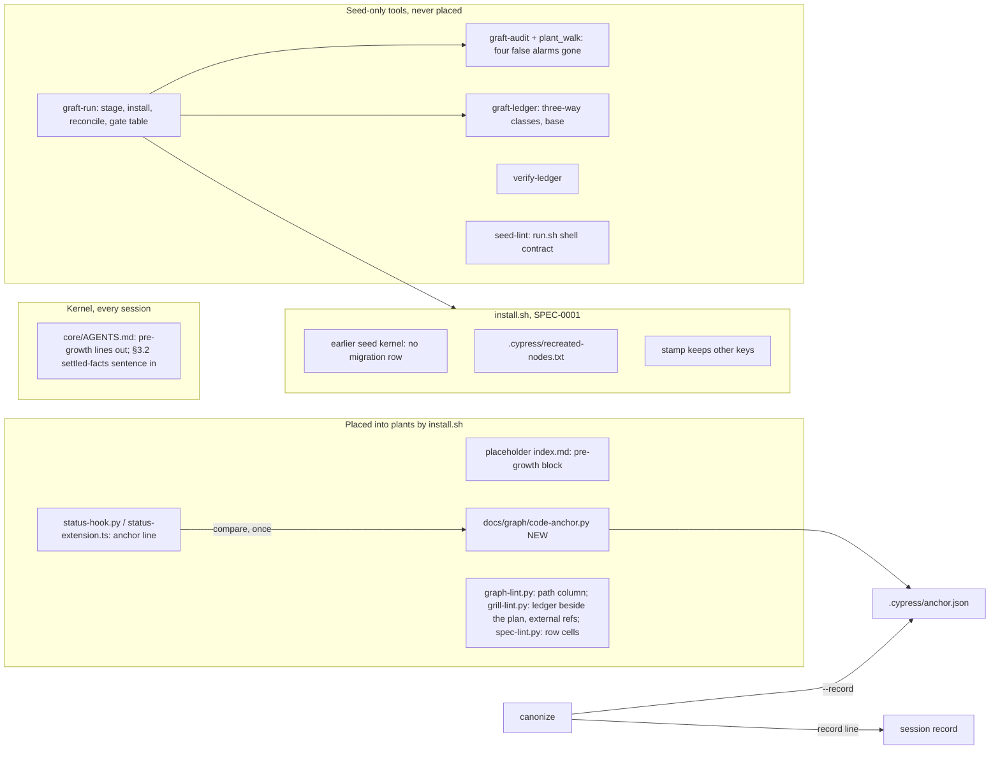

# grill.md: Plan of Record: harvest round 7.32.0

## 0. Metadata
- Project: CYPRESS seed
- Feature or goal: fold back into the seed what the 7.31.0 graft of a real plant taught, under the owner's rules R1 to R7 (§2): tools that print what a graft worked out by hand (T1 to T3, C1 to C4), installer fixes behind SPEC-0001 (D1, D2, D2s), grill-lint and spec-lint fixes that serve seed and plants alike (G1 to G3, decision 9), less seed-only text loaded in every plant session (8a, 8b, 8c'), the settled-facts doctrine with a code-fact anchor checked once per session (R5, R6, item F), and a handful of protocol and record fixes (A2, A3, B1, D3 to D6)
- Date: 2026-09-28
- Owner: the steward; the orchestrating session plans, briefs and commits
- Current phase: joint specify and grill pass complete (increment 1); cycle 1 not started
- Related files: `install.sh`, `core/AGENTS.md`, `templates/knowledge-graph/{grill-lint,spec-lint,graph-lint}.py`, `templates/knowledge-graph/index.md`, `tools/{graft-audit,growth-audit}.py`, `integrations/claude-code/status-hook.py`, `integrations/prime-agent/{status-extension.ts,APPEND_SYSTEM.md}`, `protocols/{graft,harvest,grow,canonize}.md`, `skills/context-router/SKILL.md`, `templates/prompts/graph-session-bootstrap.md`, `tests/run.sh`, `tests/seed-lint.py`
- Related documentation: `protocols/specify-joint-pass.md` (the pass this plan was written in); `protocols/harvest.md` (the round's flow and its gates G1 to G11); `docs/plans/grill-7.31.0-wave-scheduling.md` (the round this one follows)
- Related ADRs: [ADR-0015](../decisions/adr-0015-cross-repository-decision-references.md), [ADR-0016](../decisions/adr-0016-stamp-carries-keys-it-does-not-own.md), [ADR-0017](../decisions/adr-0017-pre-growth-pointers-leave-the-kernel.md), [ADR-0018](../decisions/adr-0018-code-fact-freshness-anchor.md), [ADR-0019](../decisions/adr-0019-no-opus-version-table-in-the-seed.md), [ADR-0020](../decisions/adr-0020-a-plans-ledger-lives-beside-it.md), all `proposed`; ADR-0002 gains an amendment (increment 24)
- Related specs: [SPEC-0001](../specs/SPEC-0001-install-placement.md) (five pending contracts, two pending failures); [SPEC-0003](../specs/SPEC-0003-per-prompt-injection.md) (fourteen pending contracts, three pending failures, one pending baseline amendment)
- Related libraries: none (stdlib Python, bash 3.2 and Markdown only)
- Baseline: seed branch `harvest/7.32.0`, cut from `main` at `04995da` (the v7.31.0 release notes commit); the full gate ran green there, 49 steps

## 1. Artifact Discovery
Every line cites the paths it rests on. Read by the architect on 2026-09-28, joint-pass step 2.
- Existing files inspected: `install.sh` (`place_file` :358, `record_instruction_migration` :454-556, `sweep_orphaned_instruction_backups` :558-576, `place_kernel` :589-700 with the `deviated` test :649-674, `place_graph_scaffold` :959-1000 with the placeholder index :997, `report_recreated_nodes` :2052-2076, `write_seed_stamp` :2214-2345); `core/AGENTS.md` (7,931 bytes; FIRST MOVE :5-17 with the pre-growth fallback :15-17; §3.2 :92-97; §5 :150-158); `templates/knowledge-graph/index.md` (7,972 bytes; `grown: false` frontmatter); `templates/knowledge-graph/grill-lint.py` (whole: `HERE`, `PLAN`, `SPECS`, `DECISIONS` :66-71; `INDEX_PATH_RE` :88; `ADR_REF_RE` :93; `increments()` :195-303 with the containment check :239-251; the decision check :539-546; alignment :548-564; `--waves` :379-437); `templates/knowledge-graph/spec-lint.py` (`LIVE_STATUSES` :70, `CONTRACT_RE` :83, coverage :394-510); `integrations/claude-code/status-hook.py` (whole); `integrations/claude-code/route-hook.py` (`parse_suggestion` :219-242, the entry-line parse by first token); `integrations/prime-agent/status-extension.ts` (whole; `pi.exec` with an argument array); `integrations/prime-agent/APPEND_SYSTEM.md` (the two version tables :35-83); `agents/multi-agent-architect.md` (:56)
- Existing docs inspected: `CLAUDE.md` (Gates, Canonical homes, Conventions); `protocols/specify-joint-pass.md`; `protocols/grill.md` (`grill.increment-shape`, `grill.press`, `grill.plan-approval`); `templates/grill.template.md`; `skills/spec-author/SKILL.md` (the sign-off rule, promotion with the RED); `core/method/delegation-sequencing.md` (`delegation.waves`); `core/method/delegation-cycle-economy.md` (`delegation.effort-scale`, the question file, the ruling pass); `agents/01-architect.md`; `protocols/graft.md` (Phase 7 gate table :980-1040); `docs/decisions/adr-0014-graft-reconciles-every-graph-engine.md` (shape); `docs/decisions/index.md`; `docs/plans/grill-7.31.0-wave-scheduling.md` (§0 to §9, increment 1; §6 rows M6 and P3, the tip record at its §10 :576); the round's proposal, triage, scout reports and the graft's run record, kept with the round's working records outside the seed
- Existing tests inspected: `tests/run.sh` (the step list :151-303; the spec-lint step :184 and its budget line :183); `tests/seed-lint.py` (`SPEC_UNCOVERED_BUDGET` :147, `check_spec_test_mapping` :1586-1640 with the refusal of a `draft` seed spec :1612-1622, the bootstrap identity check :3400-3429); `tests/ratchets.json`; `tests/test-grill-lint.sh`, `tests/test-spec-lint.sh`, `tests/test-graft-tools.sh`, `tests/test-bound-hook.sh` (helpers and collecting blocks only)
- Existing specs inspected: `docs/specs/SPEC-0001-install-placement.md` (whole); `docs/specs/SPEC-0003-per-prompt-injection.md` (§0 to §4 head, the reset contracts, `BRIEF_TEMPLATES_BYTE_IDENTICAL` :517-525, §5, §6 head, §10 rows, §12 tail); `docs/specs/SPEC-0005-cycle-economy.md` (contract list; `TEMPLATE_CHANGE_UNDER_SPEC_0003` :1462-1471)
- Existing architecture signals: `spec-lint.py` counts a `### Contract:` heading in a live spec as coverage debt the moment it exists, and `check_spec_test_mapping` refuses a seed spec in `draft`, so a new contract can be neither live nor draft before its RED; `grill-lint.py` resolves specs and decisions beside itself and reads increments only under `plans/grill/`; the route hook reads an entry line's id as its first token, so a path column after the id parses unchanged
- Libraries already wikified: none: no library is involved
- External sources downloaded: none: nothing external is needed
- Constraints discovered: at `d6fb5bf` the 7.31.0 spec amendments put `spec-lint.py` at 4 uncovered against a budget of 2 (measured on a scratch export of that commit), which that round carried as expected-red; the kernel has 69 bytes left under `KERNEL_BUDGET`; `BRIEF_TEMPLATES_BYTE_IDENTICAL`'s verify command already differs from its 7.27.0 baseline (SPEC-0005 records it as held for the owner); `check_published_eager_figures` fails on any published eager figure the computation does not produce, so every change to the kernel, a `description:` or the Prime Agent overlay moves a figure that only the docs increment may write; the plant's routing-cost record (decisions 2 to 4 still open with the owner) fixes three assumptions the anchor must share: fail toward inclusion, no new hook event, and no dedup across a spawn

## 2. Shared Understanding
The owner's rules for this round, verbatim (2026-09-28):

- R1: "first, you need to distingush between changes that are mechanical/functional to the seed and those that will be part of a grown plant" / "grill is also someething that lives in both"
- R2: "things that are about the seed should never be installed on the plant unless there is an absolute need. we can't waste lines of prompts loaded for things that are only about the seed" / "protocols like harvest growth are fine to be in the plant, if those are activatred by the user and not being loaded at every session" / "those 980 might prompt thinking and investigating and loading/generating more context than necessary"
- R3: "one of the scopes of this project is to reduce the need for a model to have to think and figure out things because we already provide solutions and information ourselves from a stable, durable and grounded source on disk"
- R4: "this is a project design principle. those principles need to translate to plant once grown. everything is for the plants, not for the seed. the seed is the instructions to grow the best, most effective plant possible for a project"
- R5: "models should not reason on facts already provided/present in their context because we already establish them through growth and the docs/graph (unless the files/information regarding on-disk code is stale - but a fact regarding a language, a best pratice, a bug etc should not be rediscovered or checked)"
- R6: "the creation of a stale files mechanical tool would mean more context duplicated for a tool called at each file access. instead we should keep track of each branch repo/commit at canonize and compare it at the beginning of a task and check for on-disk wip and/or/if the branch or the commit has changed since the last session we initiated with a plant"
- R7: "scrap the opus version selection table. if you need to use opus, from now on use opus 5-5 (5.5) or opus 4.6 for extremely light/low effort authoring that you don't feel confident should be handled by sonnet."

The owner ratified the scope on 2026-09-28 ("go. accepted. implement"): every item of the round's proposal, decisions 1 to 10 and 12 as recommended, decision 11 withdrawn ("no don't create a new mechanical"). Each item keeps its class: S seed machinery that never ships; I installer behaviour under SPEC-0001; P plant-bound text, loaded on routing or by the user; P' plant-owned once placed; B lives in both.

What each item gives a grown plant (R4), and where it lands:

| Item | Class | What a grown plant gains | Increments |
|---|---|---|---|
| T1, T2 graft ledger and printed base | S | a graft that classifies by command, with its base printed | 10, 34, 46 |
| T3 graft run driver | S | the mechanical half of a graft in one command, on a stage | 11, 35, 46 |
| C1 to C4 graft-audit and growth-audit false alarms | S | a graft audit that reports only what needs a steward | 9, 12, 32, 33 |
| D1 earlier seed kernel is no migration | I | no empty migration row after an upgrade | 13, 36 |
| D2 the whole re-created list in a file | I | a gate whose evidence is complete | 14, 37, 46 |
| D2s the stamp keeps keys it does not own | I | stamp annotations that survive installs | 15, 38 |
| 8a pre-growth pointers leave the kernel | I and P | fewer kernel bytes in every session | 16, 40, 43 |
| 8b growth roles say what they are for | P | fewer always-listed bytes | 21 |
| 8c' Opus tables leave the Prime Agent overlay | P | fewer overlay bytes, no stale version table | 22 |
| gate for 8: measured cost | S | evidence the cuts did not cost turns | 19, 48 |
| G1 external decision references | B | a plan that can cite another repository honestly | 3, 26 |
| G2 row cell count in spec-lint | B | a malformed §10 row is caught | 5, 28 |
| G3 the seed's plans are ledgers, linted | B | the ledger rule enforced where the seed plans itself | 1, 2, 25, 47, 49 |
| decision 9 the router prints file paths | B | no session searches for a node file | 6, 29 |
| R5 settled facts; F the code anchor | P | no re-derived facts; one check per session for code facts | 7, 8, 17, 30, 31, 39, 40, 44, 45 |
| A3, D6, D4a graft and harvest rules | P | three rules the graft had to find | 20 |
| B1 tool-smith sections | P | a complete charter | 23 |
| A2 the composition rule points at its home | P' | one phrasing of the rule | 42 |
| D3 ADR-0002's invariant | S | a decision record that cannot go stale by count | 24 |
| D4b the gate holds its own shell contract | S | a gate that cannot pass by dropping its flags | 18, 41 |
| D5 ledger verification tool | S | provable ledger conversions | 4, 27 |
| decision 7 older plans converted | S | the seed's plans all follow one rule | 47 |
| R3, R5 as a seed principle | S | the manifest and README say it once | 52 |
| Owner's tester rule (2026-09-28) | P | a tester that stops at a confirmed red and asks instead of prototyping | 54 |
| Owner's latitude rule (2026-09-28) | P | a session that names the design latitude with its reason, as it names a tier, and asks only when in doubt | 55 |
| C3 widened (cycle 1 ruling pass) | S | a graft audit that also names the projection of a plant's own skill and the Copilot view of its own agent | 57, 58 |
| F hardened (cycle 1 ruling pass) | P | a steady anchor test, the once-per-session rule under test, a shorter session-start wait, and one frontmatter reader | 56, 59 to 62 |

Success means every item above lands with its gate green, the round adds no byte to any always-loaded plant surface (the kernel, the Prime Agent overlay and the always-listed descriptions all shrink or hold), and a plant receives the round at install or at its next graft. Out of scope: anything not in the ratified proposal; the routing redesign, whose decisions 2 to 4 are still the owner's; any staleness tool or lint (decision 11, withdrawn); Codex and Copilot, which are frozen.

## 3. User Goal
- Primary user: the sessions and workers that run in a grown plant, and the steward who grafts plants and pays for their tokens
- Primary outcome: less model work to reach the same answer, because the seed ships the answer: a tool that prints it or a fact at a known path (R3)
- Job to be done: start a session knowing which facts are settled and which code moved; run a graft whose mechanical steps are commands; keep seed-only text out of every plant session
- Acceptance criteria (link to spec §9): SPEC-0001 §9 and SPEC-0003 §9 gain their criteria with each promotion (§13 here lists them until then)
- Non-goals: the routing redesign; per-file freshness checks; new node kinds, agents or gates beyond the ones listed; any change to Codex or Copilot

## 4. Operating Constraints
- Runtime constraints: stdlib Python 3 and bash 3.2 syntax; every hook exits 0; the anchor adds one subprocess at session start and none per prompt
- Security constraints: no secret, host name, user path or donor identifier in seed text; fixtures are synthetic; the anchor file is written atomically, never through a symlink, and `.cypress/` is never created by a tool that reads it; `tools/graft-run.py` never writes inside the plant root
- Privacy constraints: none beyond the above
- Data constraints: `.cypress/seed.json` keys the installer does not own are carried byte-equal in value (ADR-0016)
- Cost constraints: design latitude SIMPLE (§6). The round runs on the 7.30.0 and 7.31.0 cycle rules: effort-sized batches, GREEN run by the implementer, targeted tests plus the cross-cutting gates each increment names, `tests/run.sh` once per cycle after its GREEN wave, one mutation pass at the end, one ruling pass per cycle
  - Plan approval (`grill.plan-approval`), 2026-09-28: the owner ratified the scope before this pass and has not yet seen this plan. Levers this plan uses: model classes (default: Opus-class work on `anthropic/claude-opus-5-5`, Opus 4.6 only for extremely light authoring, Sonnet 4.6 or newer for sonnet-class work, per R7); effort per spawn (default: `delegation.effort-scale` as the owner fixed it); spawn limit (default: none recorded, so every ready unit goes out together); mutation sample (default: mandatory on the installer and anchor increments, sampled elsewhere)
  - Owner-only prerequisites: (a) the measured-cost runs of increments 19 and 48 spend tokens on the owner's host account and need the owner's choice of plant, prompts and run count (§12 questions 1 and 2), status open; (b) tags for the releases that have none, which T2's base lookup prefers (increment 10 tests both paths; pushing tags is a publish), status open; (c) the `v7.32.0` tag push after increment 53, status open
- Latency constraints: the session-start hook waits at most `ANCHOR_TIMEOUT` for the anchor
- Compliance constraints: none
- Maintenance constraints: add zero bytes to any always-loaded plant surface (R2); `KERNEL_BUDGET` and `EAGER_BUDGET` move only down; docs, mirrors, `CHANGELOG.md` and the manifest bump are written once, at the end, by one writer (increment 52); workers make no Git writes and write only their named files; the orchestrator commits by pathspec; a new `load_when` phrase must pass `tests/fixtures/router/stem-collisions.json`; seed text carries no session residue (`CLAUDE.md` Conventions)

## 5. Research Summary
no external dependency: the work is stdlib Python, bash, Markdown and the Git command line the seed already calls in its tools; no §9 row depends on a `docs/graph/libraries/` page, and the one host fact relied on (each first-class host's session-start hook exists and injects text) is read from the seed's own hook code (§1).

## 6. Decisions Made
| Decision | Rationale | Evidence | Reversibility | ADR | Date |
|---|---|---|---|---|---|
| Design latitude: simple | The owner ratified an itemized proposal and asked for it to be implemented, not redesigned; the smallest design that meets each item, and anything outside the items goes to the question file | the session's recorded reason: the owner's ratification (2026-09-28, §2) names items and decisions, and gives no latitude word; §12 question 7 asks the owner to confirm | reversible | none | 2026-09-28 |
| Tier T3 | install.sh, two specs and the kernel change | `CLAUDE.md`; kernel §0 | not applicable | none | 2026-09-28 |
| Version 7.32.0 | new behaviour ships to plants | the proposal's round name | reversible until tagged | none | 2026-09-28 |
| Decision 1: a plan may cite another repository's decision as `<name>:ADR-NNNN`; grill-lint reports it as external | a correct citation failed, and a colliding bare number passed | the 7.31.0 graft's engine reconciliation record, kept outside the seed | reversible | ADR-0015 | 2026-09-28 |
| Decision 2: the stamp carries every key it does not own | the code dropped keys its own comment promised to keep | `install.sh` :2221-2226, :2317-2336 | reversible now → expensive once tools rely on carried keys | ADR-0016 | 2026-09-28 |
| Decision 3: ADR-0002 states its invariant and points at the roster's home | a count in prose is a fact with two homes | `docs/decisions/adr-0002-bounded-delegation-hybrid.md` :78; `CLAUDE.md` Gates | reversible | none | 2026-09-28 |
| Decision 4: keep the narrow porcelain form in harvest G5 and graft's rootstock gate, with the reason written beside each; add the run.sh meta-gate | the two gates check different things than grow's write-scope gate | `protocols/harvest.md` G5; `protocols/graft.md` :1007; `protocols/grow.md` :327 | reversible | none | 2026-09-28 |
| Decision 5: ship the ledger verification tool, seed-side | a ledger conversion must be provable byte for byte | the graft's hand-written proof, kept outside the seed | reversible | ADR-0020 | 2026-09-28 |
| Decision 6: a corrected plant fact is kept as one dated line of history | the owner's ruling | the proposal | reversible | none | 2026-09-28 |
| Decision 7: convert the 7.30.0 and 7.31.0 plans verbatim, proven by decision 5's tool | the owner's ledger rule applies to the seed's own plans | the plans' sizes: 44 and 21 inline increments | reversible (the tool rebuilds the monolith) | ADR-0020 | 2026-09-28 |
| Decision 8: 8a, 8b and 8c' now, gated by measured cost | seed-only text in always-loaded surfaces prompts investigation (R2) | a survey of the plant's session history, kept outside the seed; `core/AGENTS.md` :15-17, :156-158 | reversible | ADR-0017, ADR-0019 | 2026-09-28 |
| Decision 9: `graph-lint.py --plan` prints each node's file path beside its id | measured sessions spent 3 to 5 turns finding node files | the plant's routing-cost record | reversible | none | 2026-09-28 |
| Decision 10: the graft run driver (T3) lands this round | the owner's choice over deferring it | the proposal | reversible | none | 2026-09-28 |
| ~~Decision 11: a staleness lint~~ (withdrawn by the owner 2026-09-28: "no don't create a new mechanical") | not built | the owner's words | not applicable | none | 2026-09-28 |
| Decision 12: adopt the code anchor (F) this round, behind SPEC-0003 and a RED on the hook output | R6 | the proposal's v6 section | reversible | ADR-0018 | 2026-09-28 |
| A1: a contract this round adds is written in a pending block of its spec, under a `####` heading that neither `spec-lint.py` nor `grill-lint.py` reads, and becomes a `### Contract:` in the commit that lands its RED | the brief forbids breaking spec-lint coverage today; a live contract without a test is coverage debt at once, and `check_spec_test_mapping` refuses a `draft` seed spec, so neither of the two existing forms works | §1 constraints; `tests/seed-lint.py` :1612-1622; `spec-lint.py` :394-510 | reversible | none | 2026-09-28 |
| A2: this plan names each pending contract in `SPEC-NNNN/SLUG` form; until its RED lands, `grill-lint.py` reports it as a contract the spec does not declare, one line per pending contract, and those lines are this plan's expected findings | the plan stays traceable by slug; the finding disappears exactly when the contract goes live; the gate step that lints this plan (increment 49) comes after every promotion | §10 | reversible | none | 2026-09-28 |
| A3: T3 owes no new spec | it writes only a stage outside the plant root and refuses a stage inside it; every write into a plant copy is the installer's or the engine tool's, both under SPEC-0001; its numbers are the audit tools' own | `CLAUDE.md` Canonical homes: a spec is owed when a new surface writes into a plant; the 7.31.0 plan's rows M6 and P3 made the same call | reversible now → a spec is owed if the driver ever writes into a plant | none | 2026-09-28 |
| A4: the anchor's write and read are SPEC-0003's, not a new spec | SPEC-0003 already owns the state a hook writes into a plant (the ledger) and the session-start hook; a new spec could not be written ahead of its RED either | SPEC-0003 §2; `tests/seed-lint.py` :1612-1622 | reversible | ADR-0018 | 2026-09-28 |
| A5: the anchor is written by one placed tool, `docs/graph/code-anchor.py`, not by the librarian by hand and not inside a hook | R3: a model must not work out branches and hashes; one home for the file format serves both canonize and the hooks | ADR-0018 | reversible | ADR-0018 | 2026-09-28 |
| A6: the anchor records a content hash for each uncommitted path | "no new uncommitted work" (R6) cannot be told from a list of paths alone; the hash errs toward checking | ADR-0018, alternatives | reversible | ADR-0018 | 2026-09-28 |
| A7: D1 compares a replaced kernel with every revision `core/AGENTS.md` has had in the seed checkout, and falls back to today's behaviour when there is no Git history | no new seed file to keep in step; the fallback files work that turns out empty, never loses an instruction | `install.sh` :571, :650-651 | reversible | none | 2026-09-28 |
| A8: D2's list file is overwritten by every run that writes the stamp | the file always describes the last run; nothing accumulates | SPEC-0001 pending §6 | reversible | none | 2026-09-28 |
| A9: C3 is a fix to the code under an existing contract, not a new class | the projection of a plant-owned agent is a backup the installer made, and `EVERY_BACKUP_IS_CLASSIFIABLE` already forbids UNMAPPED for it; "a named exclusion" covers the new class | SPEC-0001 `EVERY_BACKUP_IS_CLASSIFIABLE` | reversible | none | 2026-09-28 |
| A10: one shared walk, `tools/plant_walk.py`, for graft-audit and growth-audit | two callers today had the same defect | the triage of the round, kept outside the seed | reversible | none | 2026-09-28 |
| A11: the tests of T1, T2 and T3 go into `tests/test-graft-tools.sh`, the anchor's into `tests/test-bound-hook.sh`, and the ledger tool's into `tests/test-grill-lint.sh` | existing gate steps, so only increment 49 edits `tests/run.sh` | `tests/run.sh` :185, :207, :208 | reversible | none | 2026-09-28 |
| A12: docs once (owner rule): the published eager figures and the manifest's tool catalog are written only in increment 52; the seed-lint lines they leave red are expected-red at every tip before it, attributed to increment 52 | the owner's rule is explicit; the cost is a longer expected-red list | the owner's rules for the round, kept outside the seed; §12 question 4 | reversible | none | 2026-09-28 |
| Design latitude: simple, classified by the session under the owner's latitude rule of 2026-09-28 (increment 55; the first row of this table stays as the earlier record) | the scope is fully ratified and itemized, and each later answer of the owner chose the smallest change: decision 11 withdrawn ("no don't create a new mechanical"), option A for the stamp, the tester rule. The request leaves no doubt, so the owner is not asked | the owner's ratification and answers of 2026-09-28 (§2); the owner's rule: "the 3 values needs to be present and those postures/modes need to go akin to Tiers mode - need to be engaged based on request/tone/what we are trying to accomplish - or when in doubt asked to use at the beginning of the spec definition/request" | reversible | none | 2026-09-28 |

## 7. Options Considered
| Option | Benefits | Costs | Risks | Outcome |
|---|---|---|---|---|
| New contracts written live ahead of their RED (the 7.31.0 form) | the plan lints clean today | spec-lint over its budget from the first commit until the last RED | a coverage gate taught to read red as normal | Rejected (A1) |
| New contracts in a draft SPEC-0006 | spec-lint's own draft rule | `check_spec_test_mapping` refuses a draft seed spec | a red seed-lint for the whole round | Rejected (A1, A3) |
| A staged `docs/graph/` layout to lint seed plans | no grill-lint change | lints a rewritten copy, not the plan | the copy drifts | Rejected (ADR-0020); used once, for this pass's own gate, before increment 25 exists (§10) |
| The anchor inside `status-register.py` | no new placed tool | two responsibilities in one tool | the register's scan and Git calls fail together | Rejected (ADR-0018) |
| The anchor ignored by Git, local to each clone | no commit noise | a clone at the canonize commit has no anchor | every fresh clone starts unverified | Rejected: the anchor sits beside the stamp and is committed with the graph it describes |
| Prior kernels listed in a seed file of hashes (D1) | no Git needed at install | one more file every release must update | a missed update files empty rows | Rejected (A7) |
| Eager figures updated inside each increment that moves them (the 7.31.0 practice) | green tips | breaks the owner's docs-once rule | none technical | Rejected by the owner's rule; §12 question 4 asks again |

## 8. Architecture Plan
Boundaries this round crosses:

- The anchor tool is the one home of the anchor's format: canonize writes through it, the hooks read through it, and a host with no hook reads the line canonize put in the session record.
- Contracts: SPEC-0001 and SPEC-0003, pending blocks of §4, with their failures and §6 shapes. Everything else in §9 is a contained change on a surface no spec owns, authorized by its RED and the why in its row.
- Reach. New plants: everything that ships, at install. Existing plants, at their next graft: the kernel, the placed tools and hooks (fast-forwarded with a backup), the protocol and charter text, the engines through `tools/graft-graph-engine.py` (ADR-0014); the anchor at their next canonize, and until then the not-recorded line; the pre-growth block never, because their index is plant-owned and already grown.

## 9. Implementation Plan

This plan is a ledger from its first increment (the owner's rule; ADR-0020). The index below is the whole of §9's increments; each row's file holds the block with every field `grill-lint.py` requires. Numbers are document order, which is dependency order, and they are never reused.

**Waves.** `grill-lint.py --waves` computes them from the `Depends on:` fields; the figure is not restated here, so it cannot drift (the report of this pass carries the run). Two REDs that write one test file or one spec never depend on each other: one tester spawn holds both, and the report's overlap warnings for them are expected and are resolved by the lanes below (`delegation.lanes`).

**Lanes.** One writer per file set; a set stays a live lane from its RED's observation until the last GREEN of the set commits.

| Lane | Files | Increments, in order |
|---|---|---|
| L1 tester | `tests/test-grill-lint.sh`, `tests/fixtures/grill/`, `tests/test-spec-lint.sh`, `tests/test-seed-lint.sh` | 2, 3, 4, 5, 18 |
| L2 tester | `tests/test_graph_lint.py`, `tests/test-bound-hook.sh`, `docs/specs/SPEC-0003-per-prompt-injection.md` | 6, 7, 8 |
| L3 tester | `tests/test-graft-tools.sh`, `tests/test-growth-audit.sh` | 9, 10, 11, 12 |
| L4 tester | `tests/test-install-kernel-modes.sh`, `tests/test-install-adoption.sh`, `tests/test-plant-state.sh`, `tests/test-full-install.sh`, `docs/specs/SPEC-0001-install-placement.md` | 13, 14, 15, 16, 17 |
| L5 implementer | `templates/knowledge-graph/grill-lint.py`, `tools/verify-ledger.py` | 25, 26, 27 |
| L6 implementer | `templates/knowledge-graph/spec-lint.py`, `templates/knowledge-graph/graph-lint.py`, `tests/seed-lint.py` | 28, 29, 41 |
| L7 implementer | `tools/code-anchor.py`, `integrations/claude-code/status-hook.py`, `integrations/prime-agent/status-extension.ts` | 30, 31 |
| L8 implementer | `tools/graft-audit.py`, `tools/plant_walk.py`, `tools/growth-audit.py` | 32, 33 |
| L9 implementer | `tools/graft-ledger.py`, then `tools/graft-run.py` | 34 (cycle 2), then 35 (cycle 3, a batch of one) |
| L10 implementer | `install.sh` | 36, 37, 38 (cycle 1), then 39 (cycle 2) |
| P1 docs-librarian | `protocols/graft.md`, `protocols/harvest.md`, `agents/tool-smith.md`, `docs/decisions/adr-0002-bounded-delegation-hybrid.md`, `docs/decisions/index.md` | 20, 23, 24 |
| P2 docs-librarian | `agents/growth-orchestrator.md`, `agents/growth-scout.md`, `agents/seed-installer.md`, `integrations/prime-agent/APPEND_SYSTEM.md`, `agents/multi-agent-architect.md` | 21, 22 (after 19) |
| P3 docs-librarian | `core/AGENTS.md`, `templates/knowledge-graph/index.md`, `templates/docs/nodes/_expertise.template.md`, `protocols/grow.md` | 40, then 42 and 43 |
| P4 docs-librarian | `protocols/canonize.md`, `templates/docs/plans/sessions/_session-record.template.md`, `skills/context-router/SKILL.md`, `templates/prompts/*.md`, `docs/specs/SPEC-0003-per-prompt-injection.md` (after L2 commits) | 44, 45 |
| P5 docs-librarian | `protocols/graft.md` (after P1), `docs/plans/grill-7.30.0-cycle-economy*`, `docs/plans/grill-7.31.0-wave-scheduling*` | 46, 47 |
| G session | `tests/run.sh`, `tools/gate-registry.py` | 49 |
| M measurement | none in the seed | 19, 48 |
| P6 docs-librarian | `agents/04-tester.md`, `protocols/test-first.md` | 54 |
| P7 docs-librarian | `protocols/specify-joint-pass.md`, `core/method/tiers.md` | 55 |
| L11 tester | `tests/test-bound-hook.sh`, `docs/specs/SPEC-0003-per-prompt-injection.md` (after P4 commits, and after the session writes the §6 amendment of increment 60) | 56, 59, 60 |
| L3 tester, again | `tests/test-graft-tools.sh` (still the live lane L3 file), `docs/specs/SPEC-0001-install-placement.md` (§10 rows and one §12 line) | 57 |
| L8 implementer, again | `tools/graft-audit.py` | 58 |
| L7 implementer, again | `integrations/claude-code/status-hook.py`, `integrations/prime-agent/status-extension.ts`, `tools/code-anchor.py` | 61, 62 |

**Cycles.** A cycle is one RED wave, one GREEN wave over the clean increments, the tip, and one ruling pass over every flag both waves raised (`delegation.waves`). Spawn sizes are `delegation.effort-scale`'s. Every Opus-class spawn runs on `anthropic/claude-opus-5-5` (R7).

| Step | Phase | Spawn (lane) | Increments | Size check | Effort line |
|---|---|---|---|---|---|
| Cycle 0 · measurement | measure | a Sonnet worker with a shell, once the owner answers §12 questions 1 and 2 | 19 | n/a | medium |
| Cycle 1 · RED wave | RED | tester L1 ∥ tester L2 ∥ tester L3 ∥ tester L4, in one message | 2 to 18 | L1 medium-low to medium, 5 of 6; L2 medium-hard, 3 of 5; L3 hard, 4 of 5; L4 medium, 5 of 6 | each spawn at its hardest label |
| Cycle 1 · prose | prose | docs-librarian P1, beside the testers | 20, 23, 24 | one set | low |
| Cycle 1 · GREEN wave | GREEN | implementers L5 ∥ L6 ∥ L7 ∥ L8 ∥ L10, each once its REDs are clean | 25 to 33, 36 to 38, 41 | L5 medium, 3 of 3; L6 medium-low, 3 of 3; L7 medium-hard, 2 of 2; L8 medium-hard, 2 of 2; L10 medium, 3 of 3 | each spawn at its hardest label |
| Cycle 1 · prose | prose | docs-librarian P2 (after 19), P3 (40, after 16 is clean and 19 is done) | 21, 22, 40 | one set each | medium |
| Cycle 1 · tip and ruling pass | n/a | the orchestrator runs `bash tests/run.sh`; the architect rules once over the cycle's flags | n/a | n/a | high for the ruling pass |
| Cycle 2 · GREEN and prose | GREEN, prose | L9 (34), L10 (39), P3 (42, 43), P4 (44, 45), P5 (47), M (48) | 34, 39, 42 to 45, 47, 48 | L9 medium-hard, 1 of 2; L10 low, 1 of 5 | each at its label |
| Cycle 2 · from the cycle 1 ruling pass | RED, then GREEN; prose | tester L11 (56, 59, 60) ∥ tester L3 (57) ∥ docs-librarian P6 (54) ∥ P7 (55); then implementers L8 (58) ∥ L7 (61, 62) | 54 to 62 | L11 low, 3 of 7; L3 medium-low, 1 of 7; L8 medium-low, 1 of 3; L7 low, 2 of 5; P6 and P7 one set each | each spawn at its hardest label; 62 lands before the mutation pass below |
| Cycle 2 · mutation | mutation | tester, read-only, scratch copies only: mandatory over `install.sh` (36 to 39) and `tools/code-anchor.py` (30), sampled over the rest | n/a | n/a | medium |
| Cycle 3 · GREEN and prose | GREEN, prose | L9 (35, a batch of one: hard), then P5 (46) and G (49) | 35, 46, 49 | L9 hard, 1 of 1 | hard for 35 |
| Cycle 4 | RED, prose | tester (50), then the harvest gates (51) with an independent Opus reviewer, then one docs writer (52), then the final tip (53) | 50 to 53 | n/a | medium |

**Commits.** A RED is observed by the orchestrator, hashed, and committed with its own GREEN, never alone. A spec promotion lands in the commit that lands its RED's test file (`verify.status-evidence`); because a pathspec commit takes a whole file, `docs/specs/SPEC-0001-install-placement.md` commits once, with the last GREEN of lane L4's REDs (39), and `docs/specs/SPEC-0003-per-prompt-injection.md` with the last of lane L2's (31). `tests/test-growth-audit.sh` commits with 33, and `tests/test-graft-tools.sh` with 35, the last GREEN of the REDs written into it. Prose commits per writer's file set after its review.

**Questions.** A worker that meets an ambiguity appends to the batch's question file, kept with the round's working records outside the seed, and moves on. An implementer that finds a test wrong writes a question and does not edit the test.

| # | Increment | Status | Detail |
|---|---|---|---|
| 1 | This pass: the plan as a ledger, the pending spec amendments, ADR-0015 to ADR-0020 | written; commits before cycle 1 | `docs/plans/grill-7.32.0-harvest/increment-01-this-pass.md` |
| 2 | RED: grill-lint reads a seed-side ledger plan | planned | `docs/plans/grill-7.32.0-harvest/increment-02-red-grill-lint-seed-ledger.md` |
| 3 | RED: grill-lint reports a qualified decision reference as external | planned | `docs/plans/grill-7.32.0-harvest/increment-03-red-grill-lint-external-decisions.md` |
| 4 | RED: the ledger verification tool proves a conversion byte for byte | planned | `docs/plans/grill-7.32.0-harvest/increment-04-red-verify-ledger.md` |
| 5 | RED: spec-lint refuses a table row whose cell count differs from its header | planned | `docs/plans/grill-7.32.0-harvest/increment-05-red-spec-lint-row-cells.md` |
| 6 | RED: the router prints each node's file beside its id, and the route hook keeps it | planned | `docs/plans/grill-7.32.0-harvest/increment-06-red-plan-paths.md` |
| 7 | RED: the code anchor is recorded at canonize and compared once per session | planned | `docs/plans/grill-7.32.0-harvest/increment-07-red-code-anchor.md` |
| 8 | RED: both session-start hooks inject the anchor line | planned | `docs/plans/grill-7.32.0-harvest/increment-08-red-hooks-inject-anchor.md` |
| 9 | RED: graft-audit stops raising four false alarms | planned | `docs/plans/grill-7.32.0-harvest/increment-09-red-graft-audit-false-alarms.md` |
| 10 | RED: the graft ledger classifies each machinery file three ways and prints the graft's base | planned | `docs/plans/grill-7.32.0-harvest/increment-10-red-graft-ledger.md` |
| 11 | RED: one command stages a graft and prints its gate table | planned | `docs/plans/grill-7.32.0-harvest/increment-11-red-graft-run.md` |
| 12 | RED: growth-audit skips nested plant copies and symlinked subtrees | planned | `docs/plans/grill-7.32.0-harvest/increment-12-red-growth-audit-prune.md` |
| 13 | RED: a kernel identical to an earlier seed kernel files no migration row | planned | `docs/plans/grill-7.32.0-harvest/increment-13-red-prior-kernel.md` |
| 14 | RED: the full re-created list is written to a file | planned | `docs/plans/grill-7.32.0-harvest/increment-14-red-recreated-list.md` |
| 15 | RED: the stamp keeps keys the installer does not own | planned | `docs/plans/grill-7.32.0-harvest/increment-15-red-stamp-keys.md` |
| 16 | RED: the pre-growth pointer sits in the placeholder index, not the kernel | planned | `docs/plans/grill-7.32.0-harvest/increment-16-red-pre-growth-pointer.md` |
| 17 | RED: the installer places the code-anchor tool and writes no anchor | planned | `docs/plans/grill-7.32.0-harvest/increment-17-red-anchor-tool-placed.md` |
| 18 | RED: seed-lint fails when tests/run.sh drops its shell contract | planned | `docs/plans/grill-7.32.0-harvest/increment-18-red-run-sh-shell-contract.md` |
| 19 | Prose: the measured-cost baseline, before any always-loaded change lands | planned (owner-only prerequisite, §4) | `docs/plans/grill-7.32.0-harvest/increment-19-measure-baseline.md` |
| 20 | Prose: graft and harvest carry three small rules | planned | `docs/plans/grill-7.32.0-harvest/increment-20-prose-graft-harvest-rules.md` |
| 21 | Prose: the three growth roles say only what they are for | planned | `docs/plans/grill-7.32.0-harvest/increment-21-prose-growth-role-descriptions.md` |
| 22 | Prose: the Opus version tables leave the Prime Agent overlay | planned | `docs/plans/grill-7.32.0-harvest/increment-22-prose-opus-table-removed.md` |
| 23 | Prose: the tool-smith charter gains its two missing sections | planned | `docs/plans/grill-7.32.0-harvest/increment-23-prose-tool-smith-sections.md` |
| 24 | Prose: ADR-0002 states its invariant and points at the roster's one home | planned | `docs/plans/grill-7.32.0-harvest/increment-24-prose-adr-0002-invariant.md` |
| 25 | GREEN: grill-lint reads a plan's ledger beside it and takes its spec and decision homes from flags | planned | `docs/plans/grill-7.32.0-harvest/increment-25-green-grill-lint-seed-ledger.md` |
| 26 | GREEN: grill-lint reports qualified decision references as external | planned | `docs/plans/grill-7.32.0-harvest/increment-26-green-grill-lint-external-decisions.md` |
| 27 | GREEN: the ledger verification tool | planned | `docs/plans/grill-7.32.0-harvest/increment-27-green-verify-ledger.md` |
| 28 | GREEN: spec-lint checks each table row against its header | planned | `docs/plans/grill-7.32.0-harvest/increment-28-green-spec-lint-row-cells.md` |
| 29 | GREEN: graph-lint prints each node's file beside its id | planned | `docs/plans/grill-7.32.0-harvest/increment-29-green-plan-paths.md` |
| 30 | GREEN: the code-anchor tool | planned | `docs/plans/grill-7.32.0-harvest/increment-30-green-code-anchor.md` |
| 31 | GREEN: the session-start hooks inject the anchor line | planned | `docs/plans/grill-7.32.0-harvest/increment-31-green-hooks-inject-anchor.md` |
| 32 | GREEN: graft-audit without the four false alarms, and one shared walk | planned | `docs/plans/grill-7.32.0-harvest/increment-32-green-graft-audit.md` |
| 33 | GREEN: growth-audit walks through the shared walk | planned | `docs/plans/grill-7.32.0-harvest/increment-33-green-growth-audit-prune.md` |
| 34 | GREEN: the graft ledger tool | planned | `docs/plans/grill-7.32.0-harvest/increment-34-green-graft-ledger.md` |
| 35 | GREEN: the graft run driver | planned | `docs/plans/grill-7.32.0-harvest/increment-35-green-graft-run.md` |
| 36 | GREEN: the installer recognises every earlier seed kernel | planned | `docs/plans/grill-7.32.0-harvest/increment-36-green-prior-kernel.md` |
| 37 | GREEN: the installer writes the whole re-created list | planned | `docs/plans/grill-7.32.0-harvest/increment-37-green-recreated-list.md` |
| 38 | GREEN: the installer carries the stamp's other keys | planned | `docs/plans/grill-7.32.0-harvest/increment-38-green-stamp-keys.md` |
| 39 | GREEN: the installer places the code-anchor tool | planned | `docs/plans/grill-7.32.0-harvest/increment-39-green-anchor-tool-placed.md` |
| 40 | Prose: the kernel sheds its pre-growth lines and states the settled-facts rule; the placeholder index carries the pointer | planned | `docs/plans/grill-7.32.0-harvest/increment-40-prose-kernel-and-placeholder.md` |
| 41 | GREEN: seed-lint holds tests/run.sh to its shell contract | planned | `docs/plans/grill-7.32.0-harvest/increment-41-green-run-sh-shell-contract.md` |
| 42 | Prose: the expertise composition rule points at its one home | planned | `docs/plans/grill-7.32.0-harvest/increment-42-prose-composition-rule.md` |
| 43 | Prose: grow removes the pre-growth block and names why it establishes facts | planned | `docs/plans/grill-7.32.0-harvest/increment-43-prose-grow.md` |
| 44 | Prose: canonize records the anchor and the session record carries its line | planned | `docs/plans/grill-7.32.0-harvest/increment-44-prose-canonize-anchor.md` |
| 45 | Prose: the settled-facts rule in its owning node and in every brief | planned | `docs/plans/grill-7.32.0-harvest/increment-45-prose-settled-facts-doctrine.md` |
| 46 | Prose: graft points at the tools that now do its mechanical steps | planned | `docs/plans/grill-7.32.0-harvest/increment-46-prose-graft-tools.md` |
| 47 | Prose: the 7.30.0 and 7.31.0 plans become ledgers, verbatim | planned | `docs/plans/grill-7.32.0-harvest/increment-47-prose-convert-plans.md` |
| 48 | Prose: the measured-cost gate for decision 8 | planned (owner-only prerequisite, §4) | `docs/plans/grill-7.32.0-harvest/increment-48-measure-after.md` |
| 49 | GREEN: the gate lints the active round plan | planned | `docs/plans/grill-7.32.0-harvest/increment-49-green-gate-lints-the-plan.md` |
| 54 | Prose: a tester's RED spawn writes the test, confirms the red, and hands back | planned | `docs/plans/grill-7.32.0-harvest/increment-54-prose-tester-red-only.md` |
| 55 | Prose: the session classifies the design latitude the way it classifies a tier | planned | `docs/plans/grill-7.32.0-harvest/increment-55-prose-latitude-classified.md` |
| 56 | RED: the anchor fixture leaves no background Git writer and matches a placed plant | planned | `docs/plans/grill-7.32.0-harvest/increment-56-red-anchor-fixture.md` |
| 57 | RED: graft-audit classes every projection of a plant-owned node, and the contract rows bind | planned | `docs/plans/grill-7.32.0-harvest/increment-57-red-plant-owned-projections.md` |
| 58 | GREEN: graft-audit names the plant-owned skill projection and Copilot agent view | planned | `docs/plans/grill-7.32.0-harvest/increment-58-green-plant-owned-projections.md` |
| 59 | RED: only the session-start hooks run the code anchor | planned | `docs/plans/grill-7.32.0-harvest/increment-59-red-anchor-once-per-session.md` |
| 60 | RED: the session-start wait for the anchor is one value, 5 s, in every home | planned | `docs/plans/grill-7.32.0-harvest/increment-60-red-anchor-timeout.md` |
| 61 | GREEN: the session-start hooks wait 5 s for the anchor | planned | `docs/plans/grill-7.32.0-harvest/increment-61-green-anchor-timeout.md` |
| 62 | GREEN: the code-anchor tool reads `repo:` through the one frontmatter reader | planned | `docs/plans/grill-7.32.0-harvest/increment-62-green-anchor-one-reader.md` |
| 50 | Consolidate the tests this round added | planned | `docs/plans/grill-7.32.0-harvest/increment-50-consolidate-tests.md` |
| 51 | Prose: the harvest's integrity gates G1 to G11 | planned | `docs/plans/grill-7.32.0-harvest/increment-51-harvest-integrity-gates.md` |
| 52 | Prose: docs once, at the end, by one writer | planned | `docs/plans/grill-7.32.0-harvest/increment-52-docs-once.md` |
| 53 | Prose: the final tip and the status pass | planned | `docs/plans/grill-7.32.0-harvest/increment-53-final-tip.md` |

Note, 2026-09-28, cycle 1 ruling pass: increments 54 to 62 sit before 50 in this index, because 50 to 53 close the round and depend on them. From 54 on, an increment's number is not its position; the index order is still the dependency order `grill-lint.py` reads.

## 10. Verification Plan
The standard gates hold (`CLAUDE.md` Gates: `bash tests/run.sh`, and `python3 tools/gate-registry.py --summary` for what each step reads). This plan diverges in six places:

- The plan's own lint, before increment 49: `grill-lint.py` cannot lint this plan in place until increment 25 lands. Until then it runs through a staged layout outside the seed: a copy of `templates/knowledge-graph/grill-lint.py`, of `docs/specs/`, `docs/decisions/` and `templates/grill.template.md` into a scratch `docs/graph/`; this plan copied to `plans/grill.md` with each index row's leaf directory rewritten to `plans/grill/`; and the leaves copied to `plans/grill/`. The only rewrite is that path prefix. Expected findings: one line per pending contract, naming every increment that cites it (A2), and nothing else. From increment 25 on it runs in place with `--plan`, `--specs` and `--decisions`, and from increment 49 on the gate runs it.
- Pending contracts: a pending contract has no row in its spec's §10 and no coverage entry until its RED lands; each RED increment's gate includes `spec-lint.py --specs docs/specs --root . --uncovered-budget 2` staying within budget, which proves the promotion and its test landed together.
- Expected-red lines at each tip until increment 52 (A12): seed-lint's published-figure lines once 21, 22 or 40 has landed, and its manifest catalog line for `tools/code-anchor.py` once 39 has, if that check names it. Each is listed by its finding line in the batch record and attributed to increment 52. Nothing leaves the branch before the final tip (53) lists none.
- Mutation: one pass after cycle 2 (`delegation.mutation-at-end`), mandatory with at least one mutant per increment for the data-integrity surfaces: `install.sh` (36 to 39: the history walk skipped; a prior-kernel match taken as a deviation; the list file truncated at ten; an unknown key dropped; an unparseable stamp overwritten without a backup; the tool not placed) and `tools/code-anchor.py` (30: an excluded path not excluded; the hash compare dropped; a symlink followed; a partial write; the quiet line printed on a Git failure). Sampled elsewhere.
- Measured cost for decision 8 (increments 19 and 48): turns, cumulative tokens and routing confident-wrong on fixed prompts, before and after, as the owner set it. Byte budgets stay as gates too, but they are not the acceptance test for 8.
- The harvest's gates G1 to G11 (increment 51): run with the donor-plant check that the plant is byte-identical to its snapshot taken before the harvest.

## 11. Risks and Mitigations
| Risk | Probability | Impact | Mitigation | Owner | Verification |
|---|---:|---:|---|---|---|
| 8b's shorter descriptions raise `agent-lint --eval` confident-wrong, as the 7.28.0 trims did | medium | medium | each description keeps the words its golden rows route on; the writer runs `--eval` before handing back | docs-librarian, reviewer | increment 21's gate; increment 48 |
| The path column (decision 9) adds bytes to every full injection | high | low | paths are about 25 bytes per entry; increment 48 measures turns, which the paths are meant to cut | architect | increment 48 |
| The anchor's Git calls are slow on a large repository and the session start waits | low | medium | every Git call has a timeout; the hook waits at most `ANCHOR_TIMEOUT` and then prints the not-checked line | implementer | STATUS_HOOK_ANCHOR_FAILURE_FAILS_TOWARD_INCLUSION |
| The anchor reports "nothing moved" when code did move (errs away from checking) | low | high | the content hash of each uncommitted path; a missing or odd anchor gives the not-recorded line; the mandatory mutation pass | tester | the anchor cases; §10 mutation |
| A worker never sees the anchor line and trusts a stale code fact | medium | medium | bootstrap step 4 tells a worker to check code facts unless its brief carries a quiet anchor line; the orchestrator pastes the line into briefs | docs-librarian | increment 45 review |
| The kernel sentence plus 8a's cut leaves the kernel over budget | low | high | the sentence is written into ADR-0018; the net must fall below 7,931 bytes | reviewer | increment 40's gate |
| D1's Git history walk behaves differently on macOS bash 3.2 | medium | medium | bash 3.2 syntax only; the gate runs on both platforms in CI | implementer | `.github/workflows/gate.yml` run on the branch |
| G2's row check flags an existing seed or plant spec | medium | low | the tester measures the rule on the seed's specs and on one plant before GREEN; a finding goes to the question file | tester | increment 5 |
| Pending references keep this plan's lint red longer than planned | medium | low | increment 49 depends on every promotion; the expected lines are listed | orchestrator | increment 49 |
| The docs-once rule leaves seed-lint red at every tip for most of the round | high | low | the lines are expected-red by id; §12 question 4 | orchestrator | each tip record |
| T3's staged run writes into the plant by mistake | low | high | refusal of a stage inside the plant root; a byte checksum of the plant before and after in its RED; the mutation pass samples it | tester | increment 11 |
| The Prime Agent extensions' upward walk (`findTool` in `status-extension.ts`, the same seven-level walk in `route-extension.ts`) has no plant-root boundary, unlike the Python hooks' `_is_plant_root`; a session in a checkout nested under another plant can read that plant's anchor | low | medium | carried to a later round, found by the cycle 1 ruling pass: the walk predates this round, one fix must cover both extensions with one RED, and the gate has no TypeScript runtime (SPEC-0003 records a structural strength for these files); outside this round's ratified items under simple latitude | architect | a later round's plan |

## 12. Open Questions
| # | Question | Why it matters | Current assumption | How to resolve | Owner | Pinned by |
|---:|---|---|---|---|---|---|
| 1 | Which grown plant, and which copy of it, does the measured-cost gate run on? | the only grown plant at hand is the owner's own; measuring a staged copy of it is not a test fixture, but it is the owner's data | a staged copy outside the plant root, read-only toward the plant | **do-not-guess**: the owner names it | owner | increments 19, 48 |
| 2 | Which prompts, how many runs, and what token budget for the measurement? | cost is paid on the owner's host account | the four prompts of increment 19, three runs each | **do-not-guess**: the owner answers at plan approval | owner | increments 19, 48 |
| 3 | Does the owner want the releases that have no tag tagged now? | T2's base lookup prefers a tag and falls back to content lineage | the tool ships both paths; no tag is pushed without the owner | the owner decides; pushing tags is a publish | owner | increment 10 |
| 4 | Keep docs-once for the eager figures, or let each increment that moves a figure re-derive it (the 7.31.0 practice)? | docs-once keeps seed-lint red at every tip until increment 52 | docs-once, as the owner ruled for this round | the owner answers at plan approval | owner | §10 |
| 5 | The brief asked for a draft SPEC-0006 if T3 or the anchor owed a spec; this pass ruled that neither does (A3, A4), and a draft seed spec would fail `check_spec_test_mapping` in any case | the owner may still want a separate spec for the anchor | no SPEC-0006 | the owner confirms or asks for one, which then lands with its RED as `active` | owner | §6 A3, A4 |
| 6 | Pending contracts in a `####` block (A1) are a new practice for the seed; should `spec-author` and `verify.status-evidence` name it for amendments to a live spec? | without a written rule the next round may return to the 7.31.0 form | this round only; no doctrine change (simple latitude) | the owner decides whether a later round writes it down | owner | §6 A1 |
| 7 | Is the design latitude simple? | every ruling this round is held to it | simple, the session's reading of "go. accepted. implement" | the owner confirms at plan approval | owner | §6 |
| 8 | Should the anchor file be committed with the graph (this plan) or ignored per clone? | a committed anchor gives every clone at the canonize commit a quiet line; an ignored one starts every clone unverified | committed, beside the stamp | the owner confirms | owner | ADR-0018 |
| 9 | F adds one line to every session's start; R2 counts always-loaded bytes | R6 asked for exactly this line, so the plan reads R6 as the specific rule | the line is R6's and is not counted against R2 | the owner confirms | owner | ADR-0018 |
| 10 | Copilot runs `status-hook.py` through `.claude/settings.json`, so a frozen host gets the anchor line | ADR-0009 says frozen hosts get nothing new | allowed: no Copilot file changes, and the hook stays fail-open on its envelope | the owner confirms | owner | SPEC-0003 pending block |
| 11 | `BRIEF_TEMPLATES_BYTE_IDENTICAL` moves its baseline in increment 45; SPEC-0005 already holds that contract's drift for the owner | moving a contract's baseline is a change the owner rules on | R5's ratification covers it | the owner confirms | owner | increment 45 |

## 13. Done Criteria
- Every increment in §9 is done or struck with a dated reason; the final tip (increment 53) is green with no expected-red line and no `not run` id.
- Every pending contract of SPEC-0001 and SPEC-0003 is a `### Contract:` with a green §10 row; `spec-lint.py` over `docs/specs` is within its budget.
- `grill-lint.py` lints this plan in place from `tests/run.sh` and passes.
- The kernel is smaller than 7,931 bytes and carries the §3.2 sentence of ADR-0018 byte for byte; `EAGER_BUDGET` did not rise.
- The measured-cost gate (increment 48) shows no metric worse than its baseline beyond the spread of the baseline's runs.
- The harvest's gates G1 to G11 pass, the donor plant is untouched, and the docs, `manifest.json` 7.32.0 and the `CHANGELOG.md` entry are written once.

## 14. Recommended Next Step
Show the owner this plan for approval (`grill.plan-approval`) with §4's three prerequisites and §12's questions, then enter `test-first` for cycle 1's RED wave.

## 15. Changelog
- 2026-09-28: joint specify and grill pass (increment 1), by the architect on the owner's ratified scope. Written: this plan as a ledger of 53 increments; the pending blocks of SPEC-0001 (five contracts, two failures) and SPEC-0003 (fourteen contracts, three failures, one baseline amendment); ADR-0015 to ADR-0020, `proposed`; six rows in `docs/decisions/index.md`. Gates: `tests/seed-lint.py` PASS; `spec-lint.py` over `docs/specs` unchanged at 2 of 128 live contracts uncovered; prose-lint on every file written; grill-lint through the staged layout of §10, with the pending-reference lines as its only findings.
- 2026-09-28: cycle 1 ruling pass, by the architect, after the cycle 1 tip (45 of 49 steps green; the four red steps all on the expected list). Added: 54 (the owner's tester rule; its one home is the tester charter, and test-first points at it), 55 (the owner's latitude rule; this round's latitude restated as simple under it, §6), 56 to 62 from the cycle's flags (the anchor fixture, the plant-owned projections with bindable X labels, the once-per-session guard, a 5 s anchor wait, one frontmatter reader for the anchor tool); lanes P6, P7, L11 and three second visits; one cycle 2 row; one §11 row (the extensions' walk, carried). Changed leaves: 47 (Gate), 50 and 51 (Depends on). Landed at that tip, with the tip still pending: 2 to 8, 12 to 18, 20, 23 to 33, 36 to 39, 41; the REDs of 9 to 11 wait for 35 in `tests/test-graft-tools.sh`.
