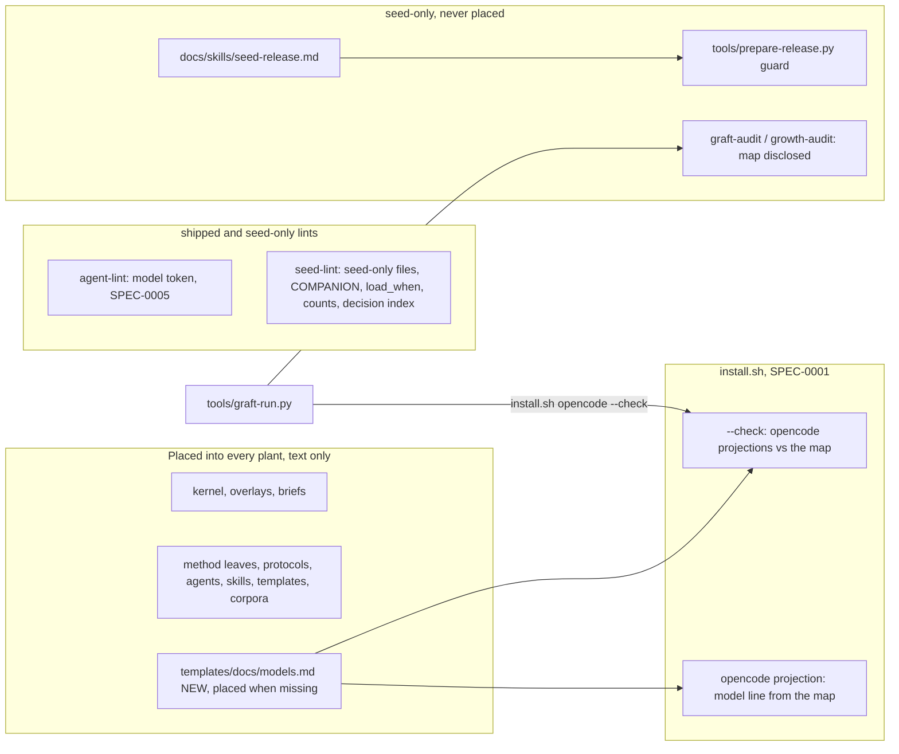

# grill.md: Plan of Record: round 7.35.0, positive voice

## 0. Metadata
- Project: CYPRESS seed
- Feature or goal: a seed-wide re-evaluation of every prompt the seed ships: each prohibition becomes the right move and its reason, bolted-on lists fold into the sections that own their rules, stale facts are corrected; plus what the analysis surfaced: a seed-only release skill, a plant-owned model map that works on Claude Code, Prime Agent and opencode, and the lint that keeps the docs aligned
- Date: 2026-09-30
- Owner: the steward; the orchestrating session plans, briefs and commits
- Tier: T3. Protocol: `protocol.grill`, entered after the analysis and the rewrite lanes (§15 says why)
- Current phase: every increment is done; the post-review fix pass is applied and the full gate is green (45 steps); next is `docs/skills/seed-release.md` step 5 onward: stage the release notes, commit, canonize in the steward plant, deliver, publish on the owner's go-ahead
- Related files: `install.sh`, `tests/seed-lint.py`, `tests/test-seed-lint.sh`, `integrations/claude-code/agent-lint.py`, `tools/graft-audit.py`, `tools/growth-audit.py`, `tools/prepare-release.py`, `templates/docs/models.md`, `docs/skills/seed-release.md`, `tests/run.sh`
- Related documentation: `skills/holistic-editing/SKILL.md` (the method of every rewrite); `core/method/engineering-posture.md` §8 (the voice rule's home); `docs/plans/grill-7.32.0-harvest.md` (the previous plan the gate linted)
- Related ADRs: [ADR-0021](../decisions/adr-0021-seed-only-procedures-stay-home.md), [ADR-0022](../decisions/adr-0022-the-plant-model-map.md), both `proposed`; ADR-0022 supersedes [ADR-0019](../decisions/adr-0019-no-opus-version-table-in-the-seed.md) in part
- Related specs: [SPEC-0001](../specs/SPEC-0001-install-placement.md) (six new contracts, one Given narrowed); [SPEC-0003](../specs/SPEC-0003-per-prompt-injection.md) (BRIEF_TEMPLATES_BYTE_IDENTICAL takes in the COMPANION block); [SPEC-0005](../specs/SPEC-0005-cycle-economy.md) (AGENT_DECLARES_MODEL_CLASS, one rule-home row)
- Related libraries: none (Markdown, bash and stdlib Python only)
- Baseline: seed `main` at `7b219d7` (the 7.34.0 release), clean; the full gate green there, 45 steps

## 1. Artifact Discovery
Every line cites the paths it rests on. The per-file evidence of the analysis is in the lane findings, kept with the round's working records outside the seed.
- Existing files inspected: every file of the eight rewrite lanes (increments 4 to 11 list them); `install.sh` (`project_agents`, `place_docs_skeleton`, `install_opencode`, `agent_projection_for`, the `--check` branch); `integrations/claude-code/agent-lint.py`; `tools/graft-run.py` (`check_projection`, `check_scaffolds`); `tools/graft-audit.py` (`audit_unfilled`); `tools/growth-audit.py` (`required_collections`, `lint_collections`, the projection check); `tools/prepare-release.py`; `templates/knowledge-graph/grill-lint.py`
- Existing docs inspected: `CLAUDE.md` (Conventions, Release); `skills/holistic-editing/SKILL.md`; `skills/adr-writer/SKILL.md`; `skills/grill-planner/SKILL.md`; `templates/grill.template.md`; `protocols/graft.md` (the gate table, `graft.gate.scaffolds`); `core/method/delegation-model-classes.md`; `docs/decisions/index.md`; `docs/plans/grill-7.32.0-harvest.md` and its ledger
- Existing tests inspected: `tests/run.sh` (the `ACTIVE_PLAN` step); `tests/test-seed-lint.sh` (the table runner and its baseline assertion); `tests/test_agent_lint.py` (`agent_md`, `LintEffortTests`); `tests/test-full-install.sh`; `tests/test-install-placement.sh` (M9 `is_generated`); `tests/test-install-adoption.sh` (D3, D4); `tests/test-graft-tools.sh` (the `--unfilled` cases); `tests/test_prepare_release.py`
- Existing specs inspected: `docs/specs/SPEC-0001-install-placement.md` (whole); `docs/specs/SPEC-0003-per-prompt-injection.md` (BRIEF_TEMPLATES_BYTE_IDENTICAL, §10, §12); `docs/specs/SPEC-0005-cycle-economy.md` (AGENT_DECLARES_EFFORT, §6 "Adopted rule homes", §7, §9 to §12)
- Existing architecture signals: the opencode projection is the one host projection a plant file can change after install (the map), so it stops being verbatim and needs its own drift check; `grill-lint.py` requires every contract of a spec the plan names to appear in some increment, so the final tip lists every contract of SPEC-0001, SPEC-0003 and SPEC-0005
- Libraries already wikified: none: no library is involved
- External sources downloaded: the research scout's graded sources on positive and negative instruction phrasing, kept with the round's working records outside the seed; nothing is placed in the seed
- Constraints discovered: routing text (`description:`, `routing_triggers:`, `title:`, `load_when:`) feeds the router eval, which has no slack, so it stays frozen this round; the kernel byte budget and the eager figures move only down; `check_published_figures` and `check_reference_tables` go red whenever a lane moves a figure, until the doc pass (increment 24) re-derives them

## 2. Shared Understanding
The owner's instructions for this round, verbatim (2026-09-30):

1. "let's make a seed wide prompt re-evaluation. consider the holistic protocol, and then i want you to analyze and go in depth regarding refactoring/rewriting accumulated cruft/bolts on and expecially rephrasing anywere that it's sensible and best pratice turning a "dont do this" into a "Do it this way cause it's the right way" - from negative statements patterns to positive statements patterns."
2. "let's use this chance to correct anything that is stale and fix the prompts while we're at it. when everything is done give me a list of things i should be deciding upon"
3. Wording precedent (2026-09-28): "don't use specific "never" use "testers ONLY do this""

The owner's rulings on the ten decisions the analysis raised (2026-09-30), in the session's reading; his words are kept with the round's working records outside the seed:

| Ruling | What it settles | Where it lands |
|---|---|---|
| D1 | reference docs keep their walkthroughs and are kept current, by a seed-only release skill that calls canonize and leaves canonize unchanged | increments 12, 24; ADR-0021 |
| D2 | lint keeps the brief companion bullets aligned, or they point at one home | increments 14, 19 |
| D3 | the owner is the holder of the human-prose doctrine, named in `LICENSE.upstream` | the doc pass (increment 24) |
| D4, D5 | host-key handling and root login by public key only, in the corpora | lane L9 (increment 11) and the follow-up (increment 13) |
| D6 | the "unsecured lane" is defined as a release branch | lane L9 |
| D7 | a found bug is marked for a fix and the user told; no test asserts the bug; the implementer fixes it and the same test runs again | lanes L2, L4, L6, L9; increment 18 follows it |
| D8 | a retracted fact is struck with a dated correction, one home in holistic-editing | lane L6 |
| D9 | a model policy that works on Claude Code, Prime Agent and opencode, with any provider | ADR-0022; increments 10, 15, 16, 20, 21 |
| D10 | house style for frontmatter, with two named exceptions | lane L7 |

The session's rulings on the architect's first findings (S1 to S6, 2026-09-30) are §6 rows.

Success means every increment in §9 lands with its gate green, the always-loaded surfaces shrink or hold, and a plant receives the round at install or at its next graft. Out of scope: routing text (a later round with a re-baselined eval); items still with the owner (§12).

## 3. User Goal
- Primary user: every session and worker in a grown plant, which reads the seed's machinery text as instructions; and the steward, who releases the seed and grafts plants
- Primary outcome: instructions that name the right move and its reason, one home per rule, no stale facts; one place to say which model each host runs
- Job to be done: follow a protocol without inferring the rule from a list of prohibitions; run agents only on the models the plant defines, on any of the three maintained hosts; release the seed with every doc current
- Acceptance criteria (link to spec §9): SPEC-0001 AC-14 to AC-18; SPEC-0005 AC-33; SPEC-0003's BRIEF_TEMPLATES_BYTE_IDENTICAL criterion as amended
- Non-goals: routing text; the eval corpora; Codex and Copilot, which are frozen; any change the owner has not ruled on (§12)

## 4. Operating Constraints
- Runtime constraints: bash 3.2 syntax and stdlib Python 3; every hook exits 0
- Security constraints: no secret, host name, user path or donor identifier in seed text; test fixtures are synthetic; `--check` writes nothing into a plant
- Privacy constraints: none beyond the above
- Data constraints: a plant's filled `docs/graph/models.md` is plant-owned; the installer places it only when missing and never rewrites it
- Cost constraints: the round runs on the cycle rules of `delegation.effort-scale` and `delegation.waves`: RED for the whole tooling wave first, then GREEN over the clean REDs, `tests/run.sh` once at the tip, one mutation pass at the end; batch work, no micro-loops (the owner's rule)
- Latency constraints: none
- Compliance constraints: none
- Maintenance constraints: the voice rule's one home is `method.engineering-posture` §8; the docs, published figures, manifest bump and CHANGELOG entry are written once, by the doc pass (increment 24); workers make no Git writes and write only their named files; seed text cites a ruling by its id and describes its source in words, with no session identifier and no path to the round's working records (`CLAUDE.md` Conventions)

## 5. Research Summary
no external dependency: the round is Markdown, bash and stdlib Python the seed already runs; no §9 row depends on a `docs/graph/libraries/` page. The one external input, the research scout's graded evidence on positive versus negative instruction phrasing, informed the voice rule and is not a dependency; it is kept with the round's working records outside the seed. The host facts ADR-0022 relies on (opencode reads `provider/model`, an agent file wins over an inline `opencode.json` key, Claude Code reads the four aliases) are recorded in `core/method/delegation-model-classes.md` and ADR-0022.

## 6. Decisions Made
| Decision | Rationale | Evidence | Reversibility | ADR | Date |
|---|---|---|---|---|---|
| Tier T3 | machinery text in every plant, two new tools behaviours, three specs | `CLAUDE.md`; kernel §0 | not applicable | none | 2026-09-30 |
| Design latitude: simple | the owner asked for a rewrite of what exists and ruled item by item | the owner's instructions and rulings (§2) | reversible | none | 2026-09-30 |
| The voice rule has one home, `method.engineering-posture` §8; prose-posture and delegation-briefs point at it | three partial homes before the round | the analysis; lane L2 | reversible | none | 2026-09-30 |
| Routing text stays frozen; its negatives are listed for a later routing round | the router eval has no slack | the constraints report | reversible | none | 2026-09-30 |
| Seed-only procedures stay home: the release skill and `tools/prepare-release.py` never reach a plant, held by seed-lint | owner ruling D1: "it will be seed-only and on this plant for convenience" | the release design | reversible | ADR-0021 | 2026-09-30 |
| The plant's model map, `docs/graph/models.md`, names the model each host runs for a class and an effort; agents name the class | owner ruling D9 | the model design | reversible | ADR-0022 | 2026-09-30 |
| S1: build `install.sh opencode --check`; the recorded failure OPENCODE_PROJECTION_DRIFT_UNCHECKED becomes the contract OPENCODE_CHECK_DETECTS_DRIFT | a pickup that reports "none drifted" after checking nothing is a green that asserts nothing (`rule.verify`); this reverses the design's "no `--check` now" on that evidence | `tools/graft-run.py` `check_projection`; `install.sh`'s `--check` branch | reversible | ADR-0022 | 2026-09-30 |
| S2: the round has a seed plan of record, this ledger, and `tests/run.sh` lints it | `rule.grill` requires one for a T3 round | `docs/plans/grill-7.32.0-harvest.md` was the last plan the gate linted | reversible | none | 2026-09-30 |
| S3: the `model:` token set is `opus`, `sonnet`, `haiku`, `inherit`, every alias Claude Code accepts; `haiku` reads the `investigation | low` row, `inherit` gets no model line | a plant agent pinned to either keeps passing after its graft; a full id belongs in the map | SPEC-0005 AGENT_DECLARES_MODEL_CLASS; SPEC-0001 §6 | reversible | ADR-0022 | 2026-09-30 |
| S4: an unfilled model map is a disclosed row at `graft.gate.scaffolds`, not a blocker; growth-audit reports it without failing | an unfilled row already means "inherit and say so" | ADR-0022; `tools/graft-audit.py` `audit_unfilled` | reversible | ADR-0022 | 2026-09-30 |
| S5: `core/method/release-posture.md` grows by twelve body lines; it sits in `OVERSIZED_LEAVES`, so it passes | accepted as is | `tests/seed-lint.py` `OVERSIZED_LEAVES` | reversible | none | 2026-09-30 |
| S6: the `test-first.known-bug` key is added in prose with no seed-lint row | the owner: doctrine changes carry no tests | ruling D7 | reversible | none | 2026-09-30 |
| New contracts are written live ahead of their RED, as in 7.31.0 | the RED batch lands before any GREEN, and a pending block would need a second spec edit in that batch | SPEC-0001 §12; SPEC-0005 §12 | reversible | none | 2026-09-30 |
| An unfilled map row inherits the caller's model and records it; a filled row that cannot be resolved stops the spawn | children inherit by default; recording keeps it visible | the session's resolution Q3 of the model design | reversible | ADR-0022 | 2026-09-30 |

## 7. Options Considered
| Option | Benefits | Costs | Risks | Outcome |
|---|---|---|---|---|
| Accept the opencode drift gap (no `--check`) | no installer work | a graft pickup that reports a green it did not check | a hand-edited or stale `model:` line survives every graft | Rejected (S1) |
| Compare opencode projections in graft-run with the `model:` line masked | no installer change | drift of the model line itself goes unseen, which is the line the map writes | a stale model runs | Rejected: the model line is the point of the check |
| Hold `model:` to `opus` and `sonnet` only | a smaller set | every plant agent on `haiku` or `inherit` fails its next graft | owners strip valid pins | Rejected (S3) |
| Block a graft until the map is filled | forces an explicit choice | holds every plant's first graft on a choice the unfilled row already makes | owners rename the map away to pass | Rejected (S4) |
| Keep this round's plan outside the seed | no seed plan to write | no plan of record for a T3 round, and the gate lints a plan that no longer describes the tree | `rule.grill` broken where the seed plans itself | Rejected (S2) |
| Rewrite routing text this round | one voice everywhere | the eval re-baselined inside a prose round | routing regressions hidden by prose churn | Rejected: a later round |

## 8. Architecture Plan
Boundaries this round crosses:

- The model map is the one home of which model runs a class and an effort (`delegation.model-map`); the installer reads its opencode column, the Prime Agent overlay its Prime column, and Claude Code needs neither.
- Contracts: SPEC-0001 (the map's placement, the opencode projection and its check, the seed-only files), SPEC-0003 (the COMPANION block), SPEC-0005 (the model token). The rewrite lanes, the audit disclosure and the release guard are contained changes with their why in their rows.
- Reach. New plants: everything that ships, at install. Existing plants, at their next graft: the machinery text, the map template (placed when missing), the opencode projections (rewritten with a backup), the new agent-lint rule. The steward plant fills its own map at its canonize close-out, outside the seed.

## 9. Implementation Plan

This plan is a ledger (ADR-0020): the index below is the whole of §9, and each row's file holds the increment with every field `grill-lint.py` requires. Numbers are document order, which is dependency order. Increments 1 to 12 record work done before this plan existed; they are written as records, with the same fields.

**Lanes for the tooling wave.** One writer per file set.

| Lane | Files | Increments |
|---|---|---|
| T1 tester | `tests/test-seed-lint.sh` | 14 |
| T2 tester | `tests/test_agent_lint.py` | 15 |
| T3 tester | `tests/test-full-install.sh`, `tests/test-install-placement.sh`, `tests/test-install-adoption.sh` | 16 |
| T4 tester | `tests/test-graft-tools.sh`, `tests/test-growth-audit.sh`, their new fixtures | 17 |
| T5 tester | `tests/test_prepare_release.py` | 18 |
| G1 implementer | `tests/seed-lint.py` | 19 |
| G2 implementer | `integrations/claude-code/agent-lint.py` | 20 |
| G3 implementer | `install.sh` | 21 |
| G4 implementer | `tools/graft-audit.py`, `tools/growth-audit.py` | 22 |
| G5 implementer | `tools/prepare-release.py`, `tools/ratchet-lint.py`, `tests/legal-lint.py` | 23 |

**Cycle.** One RED wave (14 to 18, one tester spawn or parallel spawns, each row from the round's test plan, kept outside the seed), then one GREEN wave over the clean REDs (19 to 23, in parallel: no two share a file), then the doc pass (24), then the tip (25). Increment 13 runs beside the RED wave; it touches no test or tool file.

| # | Increment | Status | Detail |
|---|---|---|---|
| 1 | Analysis: the nine-lane review, the constraints pass and the research | done | `docs/plans/grill-7.35.0-positive-voice/increment-01-analysis.md` |
| 2 | Design: two brainstorm passes, three design passes, the owner's rulings | done | `docs/plans/grill-7.35.0-positive-voice/increment-02-design-and-rulings.md` |
| 3 | This pass: ADR-0021, ADR-0022, the spec amendments and this plan | done | `docs/plans/grill-7.35.0-positive-voice/increment-03-this-pass.md` |
| 4 | Prose: lane L1, the always-loaded surfaces and the brief templates, in the positive voice | done | `docs/plans/grill-7.35.0-positive-voice/increment-04-lane-l1-always-loaded-and-briefs.md` |
| 5 | Prose: lane L2, the method leaves under `core/method/` and `core/operating-principles.md`, in the positive voice | done | `docs/plans/grill-7.35.0-positive-voice/increment-05-lane-l2-method.md` |
| 6 | Prose: lane L3, the graft and harvest protocols, in the positive voice | done | `docs/plans/grill-7.35.0-positive-voice/increment-06-lane-l3-graft-harvest.md` |
| 7 | Prose: lane L4, the other fifteen protocols, in the positive voice | done | `docs/plans/grill-7.35.0-positive-voice/increment-07-lane-l4-other-protocols.md` |
| 8 | Prose: lane L5, the twenty agent charters, in the positive voice | done | `docs/plans/grill-7.35.0-positive-voice/increment-08-lane-l5-agents.md` |
| 9 | Prose: lane L6, the fifteen skills, in the positive voice | done | `docs/plans/grill-7.35.0-positive-voice/increment-09-lane-l6-skills.md` |
| 10 | Prose: lane L7, the templates, and the new model map template `templates/docs/models.md` (ADR-0022), in the positive voice | done | `docs/plans/grill-7.35.0-positive-voice/increment-10-lane-l7-templates.md` |
| 11 | Prose: lane L9, the agent, skill, tool and legal corpora, in the positive voice | done | `docs/plans/grill-7.35.0-positive-voice/increment-11-lane-l9-corpora.md` |
| 12 | Prose: the seed-release skill, and CLAUDE.md points at it | done | `docs/plans/grill-7.35.0-positive-voice/increment-12-seed-release-skill.md` |
| 13 | Prose: the cross-lane follow-up, one batch | done | `docs/plans/grill-7.35.0-positive-voice/increment-13-prose-follow-up.md` |
| 14 | RED: seed-lint holds the seed-only files, the COMPANION block, the reference load_when strings, the protocol count and the decision index | done | `docs/plans/grill-7.35.0-positive-voice/increment-14-red-seed-lint.md` |
| 15 | RED: agent-lint holds model: to the four aliases | done | `docs/plans/grill-7.35.0-positive-voice/increment-15-red-agent-lint-model.md` |
| 16 | RED: the opencode projection reads the model map, and --check compares it | done | `docs/plans/grill-7.35.0-positive-voice/increment-16-red-opencode-model-map.md` |
| 17 | RED: an unfilled model map is disclosed at graft, not blocked on | done | `docs/plans/grill-7.35.0-positive-voice/increment-17-red-disclosed-model-map.md` |
| 18 | RED: prepare-release refuses an entry it would cut short | done | `docs/plans/grill-7.35.0-positive-voice/increment-18-red-prepare-release-guard.md` |
| 19 | GREEN: the seed-lint checks of increment 14 | done | `docs/plans/grill-7.35.0-positive-voice/increment-19-green-seed-lint.md` |
| 20 | GREEN: agent-lint rule 6, the model token | done | `docs/plans/grill-7.35.0-positive-voice/increment-20-green-agent-lint-model.md` |
| 21 | GREEN: install.sh projects opencode agents from the map and checks them | done | `docs/plans/grill-7.35.0-positive-voice/increment-21-green-opencode-model-map.md` |
| 22 | GREEN: graft-audit and growth-audit disclose an unfilled map | done | `docs/plans/grill-7.35.0-positive-voice/increment-22-green-disclosed-model-map.md` |
| 23 | GREEN: prepare-release refuses a truncated entry; three tool docstrings follow the release pass | done | `docs/plans/grill-7.35.0-positive-voice/increment-23-green-prepare-release-guard.md` |
| 24 | Prose: the doc pass, through the seed-release skill | done | `docs/plans/grill-7.35.0-positive-voice/increment-24-doc-pass.md` |
| 25 | Prose: the final tip and the status pass | done | `docs/plans/grill-7.35.0-positive-voice/increment-25-final-tip.md` |

## 10. Verification Plan
The standard gates hold (`CLAUDE.md` Gates: `bash tests/run.sh`). This plan diverges in four places:

- Expected red until the doc pass: `check_reference_tables` and `check_published_figures` in `tests/seed-lint.py` are red from the lanes' moved figures and reference rows until increment 24; `check()` is red on `models.md`'s growth-intake finding until increment 22. Each tip record lists these lines by finding and attributes them to their increment. A seed-lint RED row whose check is red on the real tree shows its RED on a scratch export of `7b219d7` with the row applied, and says so.
- Coverage debt: `spec-lint.py` counts the six new SPEC-0001 contracts and AGENT_DECLARES_MODEL_CLASS as uncovered until increments 14 to 16 land their named cases; the budget of 2 holds again from then on.
- Mutation: one pass after the GREEN wave, read-only on scratch copies, mandatory with at least one mutant per behaviour on `install.sh` (the map parsed after a projection; a filled cell ignored; `haiku` read at the agent's effort; `--check` writing a backup; `--check` in scope without the record; an unreadable map reported in sync) and sampled over the seed-lint checks and agent-lint rule 6.
- The rewrite lanes carry no RED: their gate is the full suite at the tip, where every contract pinned to their text is re-proven (increment 25).

## 11. Risks and Mitigations
| Risk | Probability | Impact | Mitigation | Owner | Verification |
|---|---:|---:|---|---|---|
| A rewritten sentence changes a rule's meaning, not only its voice | medium | high | holistic-editing's meaning-equivalence rule; each lane reports every meaning change as a decision; the reviewer reads the lanes' diffs | reviewer | the review before the tip |
| `all --check` now fails on a plant whose opencode projections drifted, where it used to exit 0 | high | low | intended: drift is reported; the log line names the re-run that clears it | implementer | E11 |
| A plant agent with a full model id fails agent-lint after its next graft | low | medium | the failure names the agent and the value; graft reports it in its delivery | architect | SPEC-0005 AGENT_MODEL_OUTSIDE_SET_AFTER_GRAFT |
| The doc pass misses a restatement of a changed rule | medium | medium | the seed-release skill searches the human docs for each changed rule's terms and fact keys; seed-lint's reference and figure checks | docs-librarian | increment 24's gate |
| A lane's edit moves a router or eval number | low | high | routing text frozen; any lane change re-ran the router tests | orchestrator | `agent-lint --eval` and the router tests at the tip |

## 12. Open Questions
| # | Question | Why it matters | Current assumption | How to resolve | Owner | Pinned by |
|---:|---|---|---|---|---|---|
| 1 | Is a new model provider a dependency (`ingest-library`) or a line in the map? | a dependency needs a library page and a review | a map line, plus a library page only when an agent needs that provider's facts | the owner rules | owner | ADR-0022 |
| 2 | May `agent-corpus/legal.md` be deleted? | deletion needs the owner's named OK | the file stays as a pointer; its referrers point at `agents/14-legal.md` | the owner names the file | owner | lane L9 |
| 3 | The negatives left in frozen routing text (descriptions of protocols and agents) | a routing round must change them with a re-baselined eval | listed, unchanged | a later routing round | owner | §6 |
| 4 | Three release-skill readings: the ADR-0011 exception stays in `CLAUDE.md`; a version bump per round rather than per change; the version bump inside the doc-pass spawn | each is meaning-equivalent today; the owner may prefer another reading | as written in `docs/skills/seed-release.md` | the owner confirms | owner | increment 12 |
| 5 | A smoke-gated deploy stays red until its known bug is fixed, under ruling D7 | a red deploy gate blocks releases that use it | applied as ruled | the owner confirms | owner | ruling D7 |

## 13. Done Criteria
- Every increment in §9 is done or struck with a dated reason; the final tip (increment 25) is green with no expected-red line and no step `not run`.
- Every SPEC-0001, SPEC-0003 and SPEC-0005 contract this round added or amended has a `green` §10 row, and `spec-lint.py` is within its budget of 2.
- `grill-lint.py` lints this plan from `tests/run.sh` and passes.
- The kernel and the eager figures did not rise; the docs, `manifest.json` and the `CHANGELOG.md` entry are written once, by the doc pass.

## 14. Recommended Next Step
Run `docs/skills/seed-release.md` from step 5: `python3 tools/prepare-release.py`, commit on the round branch, then canonize in the steward plant and deliver. After the commit, write its SHA into SPEC-0003 §10 as the `BRIEF_TEMPLATES_BYTE_IDENTICAL` baseline. Publishing waits on the owner.

## 15. Changelog
- 2026-09-30: plan written by the architect (increment 3, second pass), after the analysis, the design and the eight rewrite lanes had run. The round started as an analysis with its records outside the seed; the session's ruling S2 gave it this plan of record, so increments 1 to 12 record work done before the plan existed, and `tests/run.sh`'s `ACTIVE_PLAN` moved here from `docs/plans/grill-7.32.0-harvest.md`.
- 2026-09-30: status pass (increment 25). Increments 3 and 13 to 25 are done. After the doc pass, three whole-diff reviews (code, doctrine, corpora and human docs) and one mutation pass ran; their fixes landed as one post-review pass: a tester strengthened the E9, E10, X393 and X394 cases and added two seed-lint rows (reordered `load_when`, an under-claimed protocol count), and one writer applied the text fixes to the specs, this plan, the seed-release skill, five doctrine files and the human docs. The full gate is green, 45 steps.
