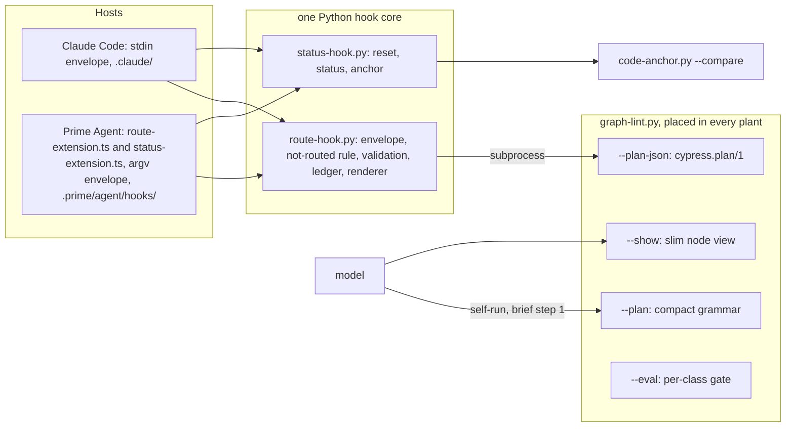

# grill.md: Plan of Record: round 7.37.0, routing and context

## 0. Metadata
- Project: CYPRESS seed
- Feature or goal: cut the tokens the routing machinery spends in a session, above all on follow-up prompts and in spawned children, and make the router's model-facing text carry resolved facts with no mechanically derivable redundancy; then improve routing quality and, if measured favourable, make the router the kernel's first move
- Date: 2026-10-01
- Owner: the steward; the orchestrating session plans, briefs and commits
- Tier: T3. Protocol: `protocol.grill`, entered after the investigation, the architecture record, the owner's rulings and one refutation pass (§15)
- Current phase: every increment is done (increment 5 covers `docs/skills/seed-release.md` steps 1 to 4: the range, the drift, the one documentation pass and the gate, plus the end measurement); the four ADRs are `accepted`; next is seed-release step 5 onward: stage the release notes, commit, canonize in the steward plant, deliver
- Related files: `templates/knowledge-graph/graph-lint.py`, `integrations/claude-code/route-hook.py`, `integrations/claude-code/status-hook.py`, `integrations/prime-agent/route-extension.ts`, `integrations/prime-agent/status-extension.ts`, `integrations/prime-agent/APPEND_SYSTEM.md`, `install.sh`, `tools/code-anchor.py`, `core/AGENTS.md`, `skills/context-router/SKILL.md`
- Related documentation: `documentation/host-capability-matrix.md` (Prime Agent residency row, eager figures); `docs/plans/grill-7.28.0-context-residency.md` (the ledger's plan); `docs/plans/grill-7.35.0-positive-voice.md` (the previous plan the gate linted)
- Related ADRs: [ADR-0024](../decisions/adr-0024-one-hook-core-per-session-residency.md), [ADR-0025](../decisions/adr-0025-compact-route-lines-json-between-programs.md), [ADR-0026](../decisions/adr-0026-node-router-ladder-and-gated-corpus.md), [ADR-0027](../decisions/adr-0027-first-move-runs-the-router.md), all `accepted` at the release pass of 2026-10-01; ADR-0024 supersedes [ADR-0010](../decisions/adr-0010-context-residency.md) in part; ADR-0027 amends a consequence of [ADR-0017](../decisions/adr-0017-pre-growth-pointers-leave-the-kernel.md) in part
- Related specs: [SPEC-0003](../specs/SPEC-0003-per-prompt-injection.md) (19 contracts added, 12 rewritten, 9 and 2 failures retired); [SPEC-0002](../specs/SPEC-0002-routing-contract.md) (the node router: 12 contracts added, 6 widened); [SPEC-0001](../specs/SPEC-0001-install-placement.md) (PRIME_HOOK_SCRIPTS_ARE_PLACED)
- Related libraries: none (stdlib Python, bash and the host's extension API the seed already uses)
- Baseline: seed `main` at `d572952` (the 7.36.0 commit)

## 1. Artifact Discovery
Every line cites the paths it rests on. The investigation reports, the architecture record and the refutation pass are kept with the round's working records outside the seed.
- Existing files inspected: `templates/knowledge-graph/graph-lint.py` (`resolve`, `main`, the `--plan` printer); `integrations/claude-code/route-hook.py` (`find_lint`, `run_router`, `parse_suggestion`, `decide`, `reminder_text`, the ledger I/O); `integrations/claude-code/status-hook.py` (`find_tool`, `reset_session_ledger`); `integrations/prime-agent/route-extension.ts`; `integrations/prime-agent/status-extension.ts` (`let shown`); `integrations/prime-agent/APPEND_SYSTEM.md` (`## Surfaced nodes`); `install.sh` (`install_prime_agent`, `adapter_dirs`, the Copilot hook copies); `core/AGENTS.md` (FIRST MOVE)
- Existing docs inspected: `docs/decisions/adr-0010-context-residency.md`; `docs/decisions/adr-0017-pre-growth-pointers-leave-the-kernel.md`; `docs/decisions/adr-0022-the-plant-model-map.md` and `docs/decisions/adr-0019-no-opus-version-table-in-the-seed.md` (the in-part supersession precedent); `docs/decisions/adr-0023-a-declarative-edit-is-proved-by-a-run.md`; `docs/decisions/index.md`; `CLAUDE.md` (Conventions); `docs/plans/grill-7.35.0-positive-voice.md` and its ledger
- Existing tests inspected: `tests/run.sh` (`ACTIVE_PLAN`); `tests/seed-lint.py` (`check_spec_test_mapping`); `templates/knowledge-graph/grill-lint.py` (the ledger and alignment checks); the file list of `tests/`
- Existing specs inspected: `docs/specs/SPEC-0003-per-prompt-injection.md` (whole); `docs/specs/SPEC-0002-routing-contract.md` (whole); `docs/specs/SPEC-0001-install-placement.md` (§0, §4 tail, §6, §9, §10, §12)
- Existing architecture signals: the Copilot hooks are byte-identical copies of the Claude Code scripts (`install.sh` `install_github_copilot`), the precedent for the Prime Agent copies; `grill-lint.py` requires every contract of a spec the plan names to appear in some increment, so the final tip names every unchanged contract of SPEC-0001, SPEC-0002 and SPEC-0003
- Libraries already wikified: none — no library is involved
- External sources downloaded: none — the host facts rest on the 7.28.0 research pass recorded in SPEC-0003 §6 and on observation of real transcripts
- Constraints discovered: the kernel budget is 8,000 bytes with 7,732 used; latency is not a target (`--plan` costs about 70 ms); out of scope by decision: a compiled index or route cache, a storage migration of canonical Markdown, a database, embeddings, event logs, any new dependency

## 2. Shared Understanding
The owner's words for this round (2026-10-01), verbatim:

1. "fast is meaningless - it's not about being fast but about being cheaper by token count wasted by the model, and redundant information if it can be gleaned mechanically. plus the issue with prime agent restating everything in full every time."
2. "the json proposal of moving things to it is only to have a more effective format to talk to an llm than markdown"
3. "the problem is not much about first prompt but subsequent prompts"

| Ruling | Words | What it settles | Where it lands |
|---|---|---|---|
| D1 | "aboslutely" | Prime Agent gets per-session residency | ADR-0024; increment 1 |
| D2 | "maybe yes. maybe the first step should be to run the graph lint instead of index.md" | the router as first move | ADR-0027; increment 4, conditional |
| D3 | "it seem an excellent idea, since node and leafs will have a header - but we need to make sure that the part were a node points to a leaf is preserved." | a slim node view that keeps every pointer | ADR-0025; increment 2 |
| O1 | "keep. an overarching rule/doctrine of this project ais that we store information into durable form into the docs/graph so that the model does not need to figure it out itself, so this falls exacfly in that scope" | the path on every route line | ADR-0025; increment 2 |

The owner let the architecture record's settled items S1 to S14 stand. The refutation pass re-sequenced the plan (§15).

Success means follow-up prompts and children stop paying for routing text a session already has, measured on real sessions as a share of total tokens and attributed per workstream; routing quality improves per class with no token claim; and the first move changes only on a measurement.

## 3. User Goal
- Primary user: every session and spawned worker in a plant, on Claude Code and Prime Agent; and the owner, who pays for the tokens
- Primary outcome: the router's text enters a session once, in the cheapest form that keeps every resolved fact, and never enters a child or a turn a person did not type
- Job to be done: route a task and read the right nodes without re-reading what the session already holds
- Acceptance criteria (link to spec §9): SPEC-0003 AC-1 to AC-19 as amended; SPEC-0002 AC-8 to AC-10; SPEC-0001 AC-19
- Non-goals: latency; changing canonical storage; semantic routing; agent frontmatter in briefs (deferred, §7)

## 4. Operating Constraints
- Runtime constraints: bash 3.2 syntax and stdlib Python 3; every hook exits 0; the extensions add no import
- Security constraints: the ledger's descriptor discipline and threat model (ADR-0010) hold on Prime Agent; argv values pass the same patterns as stdin ones; no prompt byte returns in a router document; the extensions write no file
- Privacy constraints: tests and fixtures use synthetic prompts only; real transcripts are measured by the orchestrator and never copied into the seed
- Data constraints: ledger version 1 is unchanged; `cypress.plan/1` is new and owned by its producer
- Cost constraints: the cycle rules of `delegation.effort-scale` and `delegation.waves`; batch, no micro-loops; implement first, then measure (the owner's rules)
- Latency constraints: none
- Compliance constraints: none
- Maintenance constraints: one home per fact; seed text cites rulings by id and describes the round's records in words (`CLAUDE.md` Conventions); the docs, figures, manifest bump and CHANGELOG entry are written once, by increment 5

## 5. Research Summary
no external dependency — the round is stdlib Python, bash and the Prime Agent extension API the seed already uses; no §9 row depends on a `docs/graph/libraries/` page. The host facts the Prime Agent envelope needs are in SPEC-0003 §6, three of them to be probed live before the GREEN of increment 1.

## 6. Decisions Made
| Decision | Rationale | Evidence | Reversibility | ADR | Date |
|---|---|---|---|---|---|
| Tier T3 | hooks on two hosts, the router, three specs, the kernel | kernel §0 | not applicable | none | 2026-10-01 |
| Design latitude: simple | the owner ruled each item; the architecture record and the refutation fixed the design | §2 | reversible | none | 2026-10-01 |
| One Python hook core on both first-class hosts, per-host copies, argv envelope | the Copilot precedent; one gated `decide` | ADR-0024 | reversible | ADR-0024 | 2026-10-01 |
| Children and non-human turns get no route and no status | the brief routes the task line; 79% of follow-up route characters repeated ids | ADR-0024 | reversible | ADR-0024 | 2026-10-01 |
| Models read compact lines with every path; programs read `cypress.plan/1` | JSON objects measured +17%, compact -40%; O1 | ADR-0025 | reversible | ADR-0025 | 2026-10-01 |
| `--show` drops router and spawn keys and keeps every pointer | D3; 0 pointers lost over 118 nodes | ADR-0025 | reversible | ADR-0025 | 2026-10-01 |
| Node-router tier ladder, cap, abstention by a cheap notice, gated corpus | quality per class; no token claim | ADR-0026 | reversible | ADR-0026 | 2026-10-01 |
| The FIRST MOVE changes only on a measurement | its token effect is unproven and the `index.md` read rate is disputed | ADR-0027 | reversible | ADR-0027 | 2026-10-01 |
| Sequence: the token win first, then compact and `--show`, then quality, then the first move | the refutation pass: residency and unrouted children carry about 85% of the measured saving and need neither of the others | §15 | reversible | none | 2026-10-01 |
| New contracts are written live ahead of their RED, as in 7.35.0 | one spec edit per round | the 7.35.0 precedent | reversible | none | 2026-10-01 |
| The no-signal notice names the protocol entry nodes and never `index.md` | an `index.md` read (about 5,500 tokens) costs more than the route it replaces (about 1,360) | ADR-0026 | reversible | ADR-0026 | 2026-10-01 |

## 7. Options Considered
| Option | Benefits | Costs | Risks | Outcome |
|---|---|---|---|---|
| A host-neutral core at `docs/graph/route-inject.py` | one file | a runtime file in plants that never call it; a new engine for graft | drift between plant engines | Rejected (ADR-0024) |
| A TypeScript ledger | no Python on Prime Agent | about 170 lines of descriptor-safe I/O, ungated | two `decide` copies drift | Rejected (ADR-0024) |
| The session file as the ledger | exact by construction | ungated TypeScript branch walk | reopens ADR-0010's `appendEntry` rejection | Deferred; reopens on an observed missed reset |
| Port the ledger first on the text grammar | the same saving without `--plan-json` | the echo rule and the indent defect stay; the parser is rewritten one increment later | rework | Rejected: `--plan-json` holding only what the hooks consume lands in increment 1 |
| JSON to the model | one format | +17% tokens in object form | none | Rejected (ADR-0025) |
| Drop a path the id spells | -144 cl100k per full route | the model applies a path rule | a failed read on a wrong guess | Rejected by O1 |
| No signal opens `index.md` | a full map | about 5,500 tokens per abstention | abstention costs more than routing | Rejected (ADR-0026) |
| Agent frontmatter slimmed in briefs | about 470 tokens per spawn | host-specific spawn recipes | a brief that loses a spawn key | Deferred |

## 8. Architecture Plan
Boundaries this round crosses:

- Contracts: SPEC-0003 (the views, the core, the envelopes), SPEC-0002 (the node router's ranking and its gate), SPEC-0001 (the Prime Agent placement).
- Reach. New plants: everything, at install. Existing plants: the engines through graft (ADR-0014), the hooks and extensions as placed files with backups. The steward plant receives the round at its next graft, outside the seed.

## 9. Implementation Plan

This plan is a ledger (ADR-0020): the index below is the whole of §9, and each row's file holds the increment with every field `grill-lint.py` requires. Numbers are document order, which is dependency order. Increments 1 to 3 and 4 share `graph-lint.py` and `route-hook.py`, so they run in sequence, one RED and GREEN cycle each.

| # | Increment | Status | Detail |
|---|---|---|---|
| 1 | The token win: `--plan-json`, one Python hook core, Prime Agent residency, no route in children or non-human turns | done | `docs/plans/grill-7.37.0-routing-context/increment-01-plan-json-hook-core-prime-residency.md` |
| 2 | Compact route grammar with every path, `--show`, and the code-anchor noise filter | done | `docs/plans/grill-7.37.0-routing-context/increment-02-compact-grammar-and-show.md` |
| 3 | Node-router precision and the gated node-route corpus, a quality change | done | `docs/plans/grill-7.37.0-routing-context/increment-03-node-router-precision.md` |
| 4 | The kernel FIRST MOVE runs the router, only if a measurement favours it | done | `docs/plans/grill-7.37.0-routing-context/increment-04-first-move-conditional.md` |
| 5 | Release documentation pass, end measurement and the final tip | done: `docs/skills/seed-release.md` steps 1 to 4 and the end measurement; steps 5 to 9 follow | `docs/plans/grill-7.37.0-routing-context/increment-05-doc-pass-measurement-tip.md` |

The consolidation increment is dropped: the round retires nine contracts and two failures with their cases and rewrites twelve contracts' cases in place, so no new test overlaps an older one; the tester rules on any overlap it meets at RED.

## 10. Verification Plan
The standard gates hold (`CLAUDE.md` Gates: `bash tests/run.sh`). This plan diverges in four places:

- Expected red until increment 5: `check_published_figures` on the prime-agent eager figures, which fall with the overlay section in increment 1. Each tip record lists the line and attributes it.
- Coverage debt: `spec-lint.py` counts the new contracts as uncovered from this pass until their increment's RED lands, and the rewritten ones read `pending` in §10 until their cases are rewritten.
- Host evidence that is not a gate row: the live Prime Agent probe of increment 1 and its post-GREEN live session; recorded in the increment's row ("verified in the Python core; Prime Agent host: probe evidence").
- Measurement, once per point and never as a toggle in product code: the short-session replay after increment 1 (direction of the residency claim), the replay that decides increment 4, and the end measurement of increment 5 (share of total tokens per workstream; `--eval` per class).

## 11. Risks and Mitigations
| Risk | Probability | Impact | Mitigation | Owner | Verification |
|---|---:|---:|---|---|---|
| `getSessionId()` is not available in `before_agent_start` | low | high | probe first; Prime Agent stays in full mode (I-1) and the session-file ledger reopens | orchestrator | the live probe of increment 1 |
| A child spawned without the canonical brief is not routed | medium | medium | the kernel's FIRST MOVE and its `--plan` line are the floor; the brief templates are unchanged | architect | `BRIEF_TEMPLATES_BYTE_IDENTICAL` |
| A human turn is taken for a non-human one by a marker | low | medium | the markers are leading literals of host-generated text; an off-pattern origin is routed | tester | `NON_HUMAN_TURN_NOT_ROUTED` |
| The node router abstains on rows it served before | medium | medium | per-class ratchets; contract recall has a floor; the abstain notice is cheap and actionable | data-ml | `GRAPH_EVAL_GATES_PER_CLASS` |
| The new first move raises session tokens | medium | medium | increment 4 lands only on a measurement | orchestrator | increment 4's precondition |
| A plant's `graph-lint.py` and hooks come from different seed versions | medium | low | the schema name fails loudly; graft reconciles engines | architect | `ROUTE_HOOK_READS_PLAN_JSON` |

## 12. Open Questions
| # | Question | Why it matters | Current assumption | How to resolve | Owner | Pinned by |
|---:|---|---|---|---|---|---|
| 1 | Do `getSessionId()`, the header's `rlmDepth` and the extension's own directory resolve on the live host? | residency, child suppression and hook discovery on Prime Agent | yes; each failure falls toward inclusion | the live probe before the GREEN of increment 1 | orchestrator | SPEC-0003 §11 |
| 2 | Does Claude Code's `UserPromptSubmit` envelope carry the turn's origin? | the markers could give way to a field | no; the markers hold | a probe at the RED of increment 1 | architect | SPEC-0003 §11 |
| 3 | How often does a session read `index.md`? | decides increment 4; two counts disagree (7% and up to 68%) | not settled | the replay of increment 4's precondition | orchestrator | ADR-0027 |
| 4 | `LONG_TASK_TERMS` | where a pasted brief stops being routed | above the longest corpus row; the owner-framing row has 73 terms | set at the GREEN of increment 3 from the seed corpus | data-ml | SPEC-0002 §6 |

## 13. Done Criteria
- Every increment in §9 is done or struck with a dated reason; the final tip (increment 5) is green with no expected-red line and no step `not run`.
- Every contract this round added or rewrote in SPEC-0001, SPEC-0002 and SPEC-0003 has a `green` §10 row, and `spec-lint.py` is within its budget.
- `grill-lint.py` lints this plan from `tests/run.sh` and passes.
- The end measurement reports the share of total session tokens before and after, per workstream, on the same sessions the refutation pass measured.

## 14. Recommended Next Step
Run `docs/skills/seed-release.md` from step 5: stage the release notes with `tools/prepare-release.py`, commit the round with the staged notes, close out through the steward plant's canonize, and deliver. A replay of sessions run after the release, under the precondition's strict definition of an `index.md` read, settles the one assumption ADR-0027 carries (break-even 14.2% of short Prime Agent first moves still reading `index.md`).

## 15. Changelog
- 2026-10-01: plan written by the architect, after the investigation (token map and views; routing precision and a node-route corpus; Prime Agent residency and machine output), the architecture record, the owner's rulings (D1 to D3, O1; S1 to S14 left standing), and one refutation pass. The refutation measured real transcripts: residency on Prime Agent and unrouted children carry about 85% of the token saving (injected route and status 4.5% -> 0.67% of a spawn-heavy session's tokens; follow-up route characters -73% and -59%), the compact grammar about 5%, and the router-precision and first-move changes none, since models opened about 8% of the LOAD nodes they were shown. It also found that routing an abstention to `index.md` would cost more than the route it replaced, and that an agent message delivered to an idle child is routed. The plan follows it: the token win first, `--plan-json` with it, the compact grammar and `--show` next, routing precision as a quality change with a cheap abstention notice, and the first move last and conditional.
- 2026-10-01: release pass by the architect (spawn `orchestrator.26.architect.1`). Increments 1 to 5 are done. ADR-0024 to ADR-0027 are brought in line with what shipped and flipped to `accepted`: ADR-0024 records the live probes and the -59.1% replay of the built core; ADR-0025 the `plant:` line and the inferred-entry suffix; ADR-0026 a Result section with the 74-row measurement per class; ADR-0027 the shipped FIRST MOVE (583 bytes, kernel 7,928 of 8,000), kernel §2's route-first protocol entry, and the precondition measurement with its break-even. SPEC-0003 moves to `implemented`; SPEC-0001 and SPEC-0002 stay `back-written` and SPEC-0005 `active`, each with a §12 entry. §12 answers: question 1 yes on all three host facts (increment 1's probe); question 2 stays open (SPEC-0003 §11); question 3 settled by increment 4's precondition (69% of graph-touching Prime Agent parents, 58% of Claude Code parents in a plant); question 4 `LONG_TASK_TERMS` = 100.
