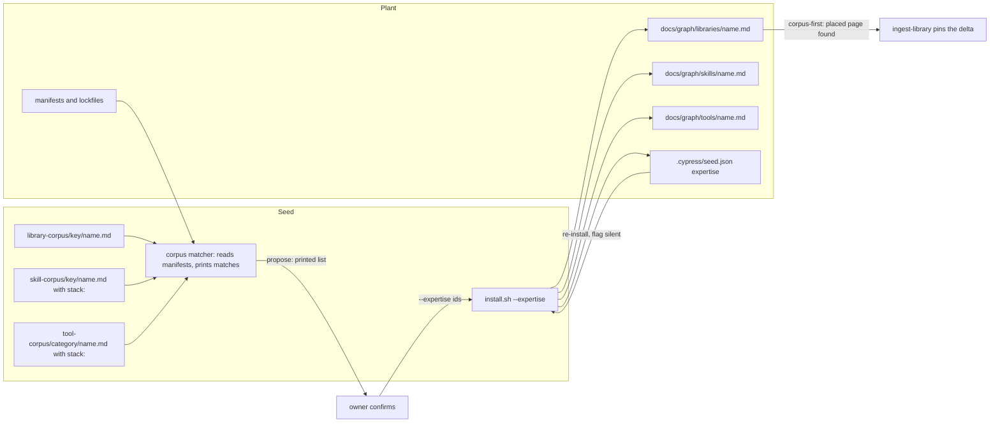

# grill.md: Plan of Record: round 8.0.0, wave A

## 0. Metadata
- Project: CYPRESS seed
- Feature or goal: land wave A of the 8.0.0 round: fix reported seed defects, wire the corpora so a stack-keyed page is admissible and reachable, and give the seed its missing delivery path, a selective placement of corpus knowledge into a plant, so a new plant pulls expertise from the seed instead of re-running a research-scout on each library
- Date: 2026-10-04
- Owner: the steward; the orchestrating session plans, briefs and commits
- Tier: T3. Protocol: `protocol.grill`, entered after the defect survey, its consolidation and the owner's decisions (§2)
- Current phase: every increment in §9 done; increment 15, the tip, closed on 2026-10-04, and increments 17 (the matcher's reach for the landed corpus), 18 (the harvest-candidate form is placed), 19 (the session-metrics reader) and 20 (the consolidation of those suites) closed on 2026-10-05. Next is the release through `docs/skills/seed-release.md`, which is not an increment of this plan
- Related files: `install.sh`, `templates/knowledge-graph/graph-lint.py`, `templates/knowledge-graph/spec-lint.py`, `templates/knowledge-graph/grill-lint.py`, `templates/knowledge-graph/_schema.md`, `templates/knowledge-graph/index.md`, `integrations/claude-code/settings.json`, `integrations/github-copilot/hooks/route.json`, `integrations/github-copilot/hooks/status.json`, `tools/growth-audit.py`, `tools/status-migrate.py`, `tools/graft-ledger.py`, `tools/graft-run.py`, `tools/graft-audit.py`, `tools/corpus-match.py`, `agents/12-devils-advocate.md`, `agents/13-ui-ux-designer.md`, `agents/14-legal.md`, `agents/multi-agent-architect.md`, `library-corpus/README.md`, `skill-corpus/README.md`, `agent-corpus/README.md`, `tool-corpus/README.md`, `protocols/grow.md`, `protocols/graft.md`, `protocols/ingest-library.md`, `tests/seed-lint.py`, `tests/test-plant-state.sh`, `tools/session-metrics.py`, `protocols/deliver.md`
- Related documentation: `docs/plans/grill-7.37.0-routing-context.md` (the previous plan the gate linted, and the shape this one follows); `docs/plans/grill-7.32.0-harvest.md` (an earlier release round)
- Related ADRs: none new. The round works under [ADR-0014](../decisions/adr-0014-graft-reconciles-every-graph-engine.md) (graft reconciles the engines), [ADR-0016](../decisions/adr-0016-stamp-carries-keys-it-does-not-own.md) (the stamp carries keys it does not own), [ADR-0020](../decisions/adr-0020-a-plans-ledger-lives-beside-it.md) (this plan is a ledger), [ADR-0021](../decisions/adr-0021-seed-only-procedures-stay-home.md) (seed-only files) and [ADR-0023](../decisions/adr-0023-a-declarative-edit-is-proved-by-a-run.md) (a declarative edit is proved by a run)
- Related specs: [SPEC-0001](../specs/SPEC-0001-install-placement.md) (the selective placement contracts, the resolved jurisdiction, the hook execution under `--check`; all declared by increment 1); [SPEC-0003](../specs/SPEC-0003-per-prompt-injection.md) (the missing-script warning, declared by increment 1); [SPEC-0002](../specs/SPEC-0002-routing-contract.md) (the agent-router contracts increment 5 re-proves at a lower ratchet); [SPEC-0006](../specs/SPEC-0006-session-metrics.md) (the session-metrics reader, a new spec declared and implemented by increment 19)
- Related libraries: none (stdlib Python and bash, as the seed already uses)
- Baseline: seed `main` at `f579efa` (the 7.37.1 commit)

## 1. Artifact Discovery
Every line cites the paths it rests on. The defect survey and its consolidated ledger are not part of the seed; this plan cites their row ids (W0-01 and on) and states each owner decision in words.
- Existing files inspected: `install.sh` (`place_legal_corpus`, `corpus_pages`, `project_skills`, the stamp writer and its owned-key list, the national-layer report, the closing NEXT STEP banner, `--check`); `templates/knowledge-graph/graph-lint.py` (`check_artifacts`, `check_libraries`, `load_nodes`, `REQUIRED_KEYS`); `templates/knowledge-graph/spec-lint.py` (`SPECS.glob("SPEC-*.md")` at both sites, `TEST_GLOBS`); `templates/knowledge-graph/grill-lint.py` (`spec_files`, the alignment check); `integrations/claude-code/settings.json` and the Copilot `route.json` and `status.json` (the `|| true` commands); `tools/growth-audit.py` (`UNGROUNDED`); `tools/graft-audit.py` (`plant_owned_node`, the `origin` reader); `library-corpus/README.md`; `skill-corpus/README.md`; `agent-corpus/README.md`; `tool-corpus/README.md`; corpus pages under `library-corpus/maven/`, `tool-corpus/ops/` and `skill-corpus/` (none carries frontmatter)
- Existing docs inspected: `protocols/grill.md` (`grill.increment-shape`); `templates/grill.template.md`; `protocols/grow.md` (the withdraw-on-evidence paragraphs); `protocols/graft.md` (Phase 4, the corpus refresh and its one-home merge rule; Phase 7); `protocols/ingest-library.md` (`ingest-library.corpus-first`); `protocols/verify-new-gates.md` and `protocols/specify.md` (`verify.status-evidence`, the `active` moment); `core/method/delegation-cycle-economy.md` (`delegation.effort-scale`); `CLAUDE.md` (Conventions, Canonical homes)
- Existing tests inspected: `tests/run.sh` (`ACTIVE_PLAN`, the prose-lint steps, the agent-lint and graph-route eval steps); `tests/ratchets.json` (`ADVERSARIAL_CONFIDENT_WRONG_BUDGET`); the file list of `tests/`, in particular `tests/test-install-placement.sh`, `tests/test-plant-state.sh`, `tests/test-graft-tools.sh`, `tests/test-growth-audit.sh`, `tests/test-status-migrate.sh`, `tests/test-spec-lint.sh`, `tests/test-grill-lint.sh`, `tests/test-prompt-hooks.sh`, `tests/test-seed-lint.sh`
- Existing specs inspected: `docs/specs/SPEC-0001-install-placement.md` (§0 to §6, the contract list, the legal-corpus contracts); `docs/specs/SPEC-0002-routing-contract.md` and `docs/specs/SPEC-0003-per-prompt-injection.md` (contract lists, the hook wiring rows); `docs/specs/SPEC-0005-cycle-economy.md` (contract list only)
- Existing architecture signals: the legal corpus is the one corpus the installer places, whole, on an explicit owner flag, recorded in the stamp and re-derived on re-install; graft Phase 4 already folds a corpus page into a plant page that exists, one home per dependency; `project_skills` projects every top-level `docs/graph/skills/*.md`, so a placed skill node is projected with no new code; `load_nodes` reads only top-level files of a machinery directory, so a placed skill must be a top-level node with node frontmatter
- Libraries already wikified: none, no library is involved
- External sources downloaded: none, the round changes seed machinery only; the corpus content waves that need upstream fetches come after it
- Constraints discovered: the kernel is at its budget and this round does not touch it; the corpus pages carry no frontmatter today, so the stack match needs a new `stack:` field (the owner's decision on stack-keyed pages, below); no record of the round may enter seed text with a plant identity (the `--forbid` vocabulary is not part of the seed)

## 2. Shared Understanding
The owner's words for this round (2026-10-04), verbatim:

> "don't import thin slices. i want to import knowledge to selectively put inside a new plant so that i don't have to re-run scout on each plant each time, but i can just pull expertise and knowledge from the seed if it's already there"

The owner's decisions this round rests on, all of 2026-10-04:

| Decision | What it settles | Where it lands |
|---|---|---|
| stack-keyed skill pages | a stack-keyed skill page lives at `skill-corpus/<library-corpus ecosystem key>/<name>.md` with a `stack:` field naming the library page(s) whose presence withdraws it | increments 8, 9, 13 |
| discipline roles | agent-corpus admits a role that owns a discipline on a stack-shaped surface, catalog only; a pure stack expert stays out | increment 8 |
| major lines | a major-line boundary of a page's own subject is not a pin | increment 8, the library-corpus admission bar |
| misnamed specs | a `specs/*.md` that does not match the naming pattern is a FAIL, "misnamed spec, not checked" | increment 3 |
| template prose | the two knowledge-graph templates are rewritten to pass prose-lint | increment 4 |
| unavailable grounding | a declared `grounding.unavailable` field | increment 6 |
| fail-open hooks | fail-open hooks stay fail-open, warn loudly on a missing script, and install and graft `--check` execute each wired hook once | increment 11 |
| harness entries with no home | harness entries with no graph home are flagged, RETIRED or ORPHAN, never deleted | increment 12 |
| library-corpus keys | library-corpus keys: `pub/` with canonical underscore ids, `galaxy/` with dotted collection names, `pypi/ansible-core`, `cli/maven`, `platform` widened to self-hosted infrastructure, `http-api/` deferred, plus a key-admission paragraph | increment 8 |
| test globs | `TEST_GLOBS` is surfaced as an owner fact at grow and graft, never widened by default | increment 9 |
| the harvest protocol | `protocols/harvest.md` is amended only once, at the end of the round; its row W1-04 is out of this wave | §7 |
| no thin slices | a corpus page lands only at the withdraw-ready bar, and the seed gains a selective placement path | increments 8, 13, 14 |

Success means: every confirmed defect is fixed RED-first; every reported defect is reproduced first and either fixed RED-first or closed "not reproduced" with the evidence; a stack-keyed skill page is admissible, lint-checked and withdrawable; and an owner can install a plant, see the corpus pages its manifests match, confirm a list, and get those pages placed with their provenance, recorded, refreshed on the next install without losing a plant edit, and found by `ingest-library` before any scout runs.

Out of scope: the corpus content itself (the library facts, the new skill, tool and agent pages: later waves); `protocols/harvest.md` (amended once, at the end of the round); a version bump and CHANGELOG entry, which the release procedure writes after the round.

## 3. User Goal
- Primary user: the owner growing or grafting a plant, and the sessions inside it that would otherwise spawn a research-scout for a library the seed already knows
- Primary outcome: corpus knowledge reaches a plant by an explicit, recorded, owner-confirmed placement, and the reported defects stop recurring
- Job to be done: start a plant on a known stack with the seed's library, skill and tool knowledge already in its graph, and keep it current on each graft
- Acceptance criteria (link to spec §9): the SPEC-0001 and SPEC-0003 acceptance criteria increment 1 adds; SPEC-0002 AC rows for the agent router as they stand
- Non-goals: automatic placement without the owner's confirmation; placing a whole corpus; merging a plant-edited page by machine; any change to `protocols/harvest.md`

## 4. Operating Constraints
- Runtime constraints: bash 3.2 syntax and stdlib Python 3; no new dependency; the installer stays non-interactive (a proposal is a printed list, a confirmation is a flag)
- Security constraints: the placement writes only under `--project-dir` (SPEC-0001 Security); a corpus id is validated against the seed's corpus before any write, so an id cannot name a path outside it
- Privacy constraints: no plant identity in any seed file, test or fixture; fixtures use synthetic manifests
- Data constraints: `.cypress/seed.json` gains one installer-owned key; every other key keeps its rule, and unknown keys still survive
- Cost constraints: the cycle rules of `delegation.effort-scale` and `delegation.waves`; batch per wave, no micro-loops
  - Plan approval (`grill.plan-approval`), pending: the plan goes to the owner before increment 1. Levers this plan uses: none defined beyond the batch sizes of `delegation.effort-scale` (default)
  - Owner-only prerequisites: none; every decision this round needs is given (§2)
- Latency constraints: none
- Compliance constraints: none
- Maintenance constraints: one home per fact; seed text states each owner decision in words, with its date; human-facing prose passes prose-lint; the release documentation pass happens once, in the release procedure

## 5. Research Summary
no external dependency — the round edits the seed's own installer, lints, hooks, tools, protocols and corpus READMEs; no §9 row depends on a `docs/graph/libraries/` page, and the corpus pages it places are content later waves author.

## 6. Decisions Made
| Decision | Rationale | Evidence | Reversibility | ADR | Date |
|---|---|---|---|---|---|
| Tier T3 | the installer, three specs, two lints, the hooks and three protocols | kernel §0 | not applicable | none | 2026-10-04 |
| Design latitude: balanced | the owner ruled the shape of each item; the selective placement leaves design inside the contract (matching, record, refresh) | §2 | reversible | none | 2026-10-04 |
| One spec edit, first: increment 1 declares every new contract of SPEC-0001 and SPEC-0003 before any RED | `specify` precedes RED; the 7.35.0 and 7.37.0 precedent | §9 increment 1 | reversible | none | 2026-10-04 |
| A reported defect's increment starts with a reproduction; one that does not reproduce is closed "not reproduced" with the evidence | the owner's rule for reported rows; a speculative fix adds code no failure justified | §2 | reversible | none | 2026-10-04 |
| Placement is propose, confirm, place: `--expertise propose` prints matches and writes nothing; `--expertise <ids>` places exactly those | the installer is non-interactive; the owner confirms the list | owner decision in §2 | reversible | none | 2026-10-04 |
| The selection is recorded in the stamp under one installer-owned key and re-applied when the flag is silent | the legal corpus's `DECISIONS_SURVIVE_SILENCE` pattern | SPEC-0001 | reversible | none | 2026-10-04 |
| A recorded page is refreshed only while its bytes equal what the installer last placed; a plant-edited page, and a page the installer never placed, is left byte-identical and named for graft Phase 4 | graft Phase 4 already owns the merge into a plant page, one home per dependency; a mechanical merge would decide what a reasoned re-integration must | `protocols/graft.md` Phase 4 | reversible | none | 2026-10-04 |
| Library and tool pages are placed as Tier-3 leaves (`docs/graph/libraries/<name>.md`, `docs/graph/tools/<name>.md`) with a provenance line; a skill page is placed as a top-level skill node whose frontmatter the corpus page carries, with `origin: corpus@<seed version>` set by the installer | `load_nodes` reads top-level machinery files as nodes; leaves need no frontmatter | `graph-lint.py` `load_nodes`, `check_libraries` | reversible | none | 2026-10-04 |
| The legal corpus keeps its whole-or-absent arm; the selective arm never touches `docs/graph/legal/` | a partial legal corpus reads as a missing instrument | SPEC-0001 `CORPUS_IS_WHOLE_OR_ABSENT` | reversible | none | 2026-10-04 |
| Manifest matching lives in one stdlib tool the installer calls from the seed, not inside `install.sh` | testable alone; the installer already exceeds the size a reader holds | §8 | reversible | none | 2026-10-04 |
| The withdraw-ready bar goes into `library-corpus/README.md` as its admission bar, in increment 8, beside the new keys | one README edit per corpus; the bar and the keys are both admission rules | owner decision in §2 | reversible | none | 2026-10-04 |
| W1-04 (`protocols/harvest.md`) is out | the owner's decision of 2026-10-04 | §2 | reversible | none | 2026-10-04 |
| Tool-corpus pages carry the same optional `stack:` field as stack-keyed skill pages, so the matcher can propose them; a tool page without it is never proposed and stays grow's judgment (§12 question 1, resolved) | the owner's selective-pull decision asks for expertise pulled from the seed, and the round plan's placement item names tool pages "whose `stack:` matches"; resolved by the orchestrator under that decision | SPEC-0001 §6 (the matcher proposes skill and tool pages through `stack:`); increment 8 writes the field into `tool-corpus/README.md` | reversible | none | 2026-10-04 |
| SPEC-0003 moves from `implemented` to `active` for the round, and back at the tip | `spec-lint.py` refuses an `implemented` spec holding a `pending` §10 row, and the new contract's row is `pending` until increment 11's RED | `templates/knowledge-graph/spec-lint.py` `shape()`; SPEC-0003 §12 | reversible | none | 2026-10-04 |

## 7. Options Considered
| Option | Benefits | Costs | Risks | Outcome |
|---|---|---|---|---|
| Place the whole library corpus, like the legal one | no matching code | every plant carries pages for stacks it does not use; the router sees them | noise in routing and growth audits | Rejected: the owner asked for selective placement |
| Place automatically from the manifests, no confirmation | one step fewer | a wrong match lands unasked | a page the plant does not need, or a misread ecosystem | Rejected: the owner confirms the list |
| Merge a plant-edited page section by section at install | refresh reaches edited pages | the installer would judge which sections are the plant's | a silent loss of a plant fact | Rejected: graft Phase 4 merges with understanding |
| A delimited corpus block inside each placed page, replaced on refresh | refresh survives plant edits outside the block | `ingest-library` restructures the page into the template's sections and the block does not survive that | a stale block the plant believes current | Rejected for this round; §12 question 3 keeps it open |
| Matching in `install.sh` | one file | a larger installer and no unit tests | a matcher nobody can test alone | Rejected (§6) |
| Land W1-04 now | the harvest protocol stops contradicting the READMEs at once | an amendment before the session review | a second amendment after it | Rejected by the owner's decision of 2026-10-04 |
| Widen spec-lint's `TEST_GLOBS` default | a black-box test dir counts at once | a default that counts non-tests | false coverage | Rejected by the owner's decision of 2026-10-04 (test globs stay an owner fact) |

## 8. Architecture Plan
Boundaries the selective placement crosses:

- Main components: the corpus matcher (one responsibility: map the plant's declared dependencies to corpus page ids, read-only); the installer's expertise arm (place, record, refresh, name what it left); the stamp key; the grow, graft and `ingest-library` steps that use them.
- Interfaces: `install.sh <host> --expertise propose|<id,...>`; the stamp key `expertise`; the corpus page id (the corpus path without `.md`).
- Data flow: manifests to matches to the owner to placement to the record; the record drives the next install.
- Error handling: an unknown id refuses before any write (preflight); a page the plant edited or owns is left and named, never an error; a matcher that cannot parse a manifest names it and proposes from the rest.
- Observability: every placed, refreshed and left page is one log line; `--check` names a recorded page that is missing or stale.
- Security posture: ids resolve inside the seed's corpus roots only; writes stay under `--project-dir`.
- Deployment model: new plants at install; existing plants at their next graft, which runs the installer.
- The defect fixes cross no new boundary: each lands in the file the defect lives in.

## 9. Implementation Plan

This plan is a ledger (ADR-0020): the index below is the whole of §9, and each row's file holds the increment with every field `grill-lint.py` requires. Numbers are document order, which is dependency order.

| # | Increment | Status | Detail |
|---|---|---|---|
| 1 | Specify the round's new contracts in SPEC-0001 and SPEC-0003, and point the gate at this plan | done | `docs/plans/grill-8.0.0-wave-a/increment-01-specify-new-contracts.md` |
| 2 | graph-lint's artifact escape check is lexical, so a symlink install stops reporting escapes | done | `docs/plans/grill-8.0.0-wave-a/increment-02-graph-lint-artifact-escape.md` |
| 3 | spec-lint and grill-lint refuse a misnamed spec; the legacy-plan report reproduced | done: W0-14 not reproduced | `docs/plans/grill-8.0.0-wave-a/increment-03-spec-discovery-and-legacy-plan.md` |
| 4 | The two knowledge-graph templates pass prose-lint, and the gate holds them | done | `docs/plans/grill-8.0.0-wave-a/increment-04-template-prose.md` |
| 5 | Router triggers sharpened and the adversarial ratchet lowered; the expertise-routing report re-tested | done: W0-16 not reproduced; ratchet lowered to 2 | `docs/plans/grill-8.0.0-wave-a/increment-05-router-triggers-and-retest.md` |
| 6 | growth-audit declares unavailable grounding; status-migrate keeps paragraphs and dates | done | `docs/plans/grill-8.0.0-wave-a/increment-06-growth-audit-and-status-migrate.md` |
| 7 | Graft tools: an honest lineage base, adapters inferred for old stamps, kept files re-checked at the end | done | `docs/plans/grill-8.0.0-wave-a/increment-07-graft-tools.md` |
| 8 | Corpus admission: stack-keyed skill pages, discipline roles, library keys and the withdraw-ready bar, with seed-lint holding them | done | `docs/plans/grill-8.0.0-wave-a/increment-08-corpus-admission.md` |
| 9 | grow's withdraw formula learns the stack-keyed path; `TEST_GLOBS` becomes an owner fact | done: W0-15 reproduced; the default kept (an owner fact) | `docs/plans/grill-8.0.0-wave-a/increment-09-grow-withdraw-and-test-globs.md` |
| 10 | The installer resolves the jurisdiction once | done | `docs/plans/grill-8.0.0-wave-a/increment-10-jurisdiction-resolved-once.md` |
| 11 | A missing hook script warns, and `--check` runs each wired hook | done | `docs/plans/grill-8.0.0-wave-a/increment-11-loud-fail-open-hooks.md` |
| 12 | Harness entries with no graph home are flagged RETIRED or ORPHAN | done: W0-12 and W0-13 reproduced; graft-run runs the hook check | `docs/plans/grill-8.0.0-wave-a/increment-12-retired-and-orphan-flags.md` |
| 13 | Selective placement: propose, place, record and refresh corpus pages | done; follow-up: the matcher's recall (scratch copies, starters, Dockerfiles, unreached pages) | `docs/plans/grill-8.0.0-wave-a/increment-13-selective-placement.md` |
| 14 | Selective placement in the flows: grow, graft and ingest-library use the placed pages | done | `docs/plans/grill-8.0.0-wave-a/increment-14-placement-in-the-flows.md` |
| 16 | The hooks detect nested stdin on any Python | done | `docs/plans/grill-8.0.0-wave-a/increment-16-hook-nesting-on-any-python.md` |
| 15 | Final tip and test consolidation | done: one overlap merged; sign-offs taken; SPEC-0001 and SPEC-0003 `implemented` | `docs/plans/grill-8.0.0-wave-a/increment-15-final-tip.md` |
| 17 | The matcher reaches the landed corpus: language declarations, the own-package list on every key, and triggers for pages with no package | done | `docs/plans/grill-8.0.0-wave-a/increment-17-matcher-reach-for-the-landed-corpus.md` |
| 18 | The harvest-candidate form is placed, and a case holds it | done: green on its first run; proved by seven mutations | `docs/plans/grill-8.0.0-wave-a/increment-18-harvest-candidate-form-is-placed.md` |
| 19 | The session-metrics reader: a placed tool judges the session-metrics block of each Tier 2 and Tier 3 delivery | done: round 2 fixed the review's findings under seven more contracts | `docs/plans/grill-8.0.0-wave-a/increment-19-the-session-metrics-reader.md` |
| 20 | Consolidation of the session-metrics and matcher suites | done: 14 and 7 tests; five SPEC-0006 contracts retired to reading rules | `docs/plans/grill-8.0.0-wave-a/increment-20-consolidation.md` |

**Delegation and parallelism.** The static schedule is `python3 templates/knowledge-graph/grill-lint.py --plan docs/plans/grill-8.0.0-wave-a.md --specs docs/specs --decisions docs/decisions --waves`; the lanes below are why it holds. Each lane is one worktree; increments in one lane run in sequence inside it, and lanes run in parallel because their files are disjoint.

| Lane | Increments | Files the lane owns | Runs |
|---|---|---|---|
| Spec | 1 | `docs/specs/SPEC-0001-install-placement.md`, `docs/specs/SPEC-0003-per-prompt-injection.md`, `tests/run.sh` (`ACTIVE_PLAN`), this plan | alone, first; it gates 4, 8, 10 and every later increment that names a new contract |
| Lints | 2, 3, then 5 | `graph-lint.py`, `spec-lint.py`, `grill-lint.py`, `tests/test_graph_lint.py`, `tests/test-spec-lint.sh`, `tests/test-grill-lint.sh`; then `agents/`, `agents/_routes.golden.tsv`, `tests/ratchets.json`, `tests/graph-routes.golden.tsv` | 2 and 3 in parallel with lane Spec; 5 after 2, because a reproduced W0-16 may edit `graph-lint.py` |
| Templates | 4 | `templates/knowledge-graph/_schema.md`, `templates/knowledge-graph/index.md`, `tests/run.sh` (two prose-lint steps) | after 1, because both edit `tests/run.sh` |
| Audit tools | 6 | `tools/growth-audit.py`, `tools/status-migrate.py`, their tests, `templates/prompts/growth-coverage-record.md` | in parallel with every lane |
| Graft tools | 7 | `tools/graft-ledger.py`, `tools/graft-run.py`, `tools/graft-audit.py`, `tests/test-graft-tools.sh`, `protocols/graft.md` | in parallel with lanes Spec, Lints and Audit tools; it opens the `protocols/graft.md` chain |
| Corpus | 8 | the four corpus READMEs, `tests/seed-lint.py`, `tests/test-seed-lint.sh`, a fixture | after 1 |
| Serial chain | 9, 10, 11, 12, 13, 14 | `protocols/grow.md`, `protocols/graft.md`, `install.sh`, `tests/test-install-placement.sh`, `tools/graft-audit.py` | one worktree, in order: 9 and 10 may run together (disjoint files), then 11, 12, 13, 14 strictly in sequence |
| Hooks | 16 | `integrations/claude-code/route-hook.py`, `integrations/claude-code/status-hook.py`, `tests/test-prompt-hooks.sh`, `docs/specs/SPEC-0003-per-prompt-injection.md` | after 11, in parallel with 12, 13 and 14 (disjoint files) |
| Tip | 15 | the test files the round added | last, after every lane merges |
| Matcher | 17 | `tools/corpus-match.py`, `tests/test_corpus_match.py`, `docs/specs/SPEC-0001-install-placement.md`, the converted `library-corpus/` pages and `library-corpus/README.md` | after 15, alone, once the new corpus pages landed |
| Harvest form | 18 | `docs/specs/SPEC-0001-install-placement.md`, `tests/test-plant-state.sh` | after 17, because both write SPEC-0001 |
| Session metrics | 19 | `tools/session-metrics.py`, `install.sh`, `manifest.json`, `tools/graft-audit.py`, `protocols/deliver.md`, `protocols/canonize.md`, `tests/test-session-metrics.sh`, `tests/fixtures/session-metrics/`, `tests/test-full-install.sh`, `tests/run.sh`, `tools/gate-registry.py`, `docs/specs/SPEC-0006-session-metrics.md` | after 18, because both touch the placement chain |
| Consolidation | 20 | `tests/test-session-metrics.sh`, `tests/fixtures/session-metrics/`, `tests/test-lint-audibility.sh`, `tests/test_corpus_match.py`, the §10 cells of SPEC-0006 and SPEC-0001 | last, after 17 and 19 |

Serialization points: `install.sh` (10, 11, 12, 13); `protocols/graft.md` (7, 9, 11, 12, 14); `protocols/grow.md` (9, 12, 14); `tests/run.sh` (1, 4, 13); `tools/graft-audit.py` (7, 12, 13); `tests/test-install-placement.sh` (11, 12, 13); `spec-lint.py` (3, 9). Each `Depends on:` below encodes one of these, so the schedule never puts two writers of one file in one wave. Only the orchestrator merges lanes; a lane hands back its diff and its gate run.

The consolidation increment is kept (increment 15): increments 2 to 13 add regression cases in eight test files, and the selective placement adds a new unit file beside `tests/test-install-placement.sh`, so overlaps are likely.

## 10. Verification Plan
The standard gates hold (`CLAUDE.md` Gates: `bash tests/run.sh`). This plan diverges in four places:

- New contracts are declared live by increment 1 ahead of their RED, so `spec-lint.py` counts them uncovered until their increment's RED lands; each tip record lists them and attributes them.
- The new contracts are written in words in this plan's increment files until increment 1 lands, because `grill-lint.py` refuses a contract slug a spec does not declare. Increment 1 rewrites them into the `SPEC-NNNN/SLUG` form in the same change, and from then on the gate holds them.
- A reported defect's reproduction is evidence, not a gate row: the increment records the command, the input and the output in its own file before any RED, or the "not reproduced" closure with the same evidence.
- Increment 13 adds a unit test file, so `tests/run.sh` gains a step and `tools/gate-registry.py` must classify it; `python3 tools/gate-registry.py --summary` is part of that increment's gate.

## 11. Risks and Mitigations
| Risk | Probability | Impact | Mitigation | Owner | Verification |
|---|---:|---:|---|---|---|
| A reported defect is fixed without a reproduction | medium | medium | each reported increment's first step is the reproduction, recorded before RED | orchestrator | the increment file's reproduction line |
| The matcher proposes a wrong page or misses one | medium | low | the owner confirms or edits the list; a miss can be named by hand | tester | the matcher's unit cases |
| A refresh overwrites a plant's edit | low | high | refresh only on a byte match with the recorded hash; everything else is left and named | architect | the plant-edited contract increment 1 declares |
| The selective arm reaches the legal corpus | low | high | the arm resolves ids under the three corpus roots only | tester | `CORPUS_IS_WHOLE_OR_ABSENT` re-run in increment 13 |
| A new seed-side tool breaks `SEED_ONLY_FILES_NEVER_PLACED`'s manifest rule | medium | low | the matcher is not placed and not in `manifest.json`'s `tools` map; increment 13 runs `seed-lint` before GREEN | implementer | `SEED_ONLY_FILES_NEVER_PLACED` |
| The misnamed-spec FAIL fails a plant whose specs directory carries a non-spec note | medium | medium | `index.md` and `README.md` are exempt; the message names the file and the rename | tester | increment 3's case |
| Lowering the adversarial ratchet widens a trigger to clear a bait row | low | medium | the rule is written into increment 5: a trigger is only sharpened; a bait row is never edited | reviewer | the held-out rows unchanged in the diff |
| `_schema.md`'s tables make the dash metric meaningless | medium | low | a narrow, recorded prose-lint exception, as the owner's decision on template prose allows | orchestrator | increment 4's gate |
| Two lanes write one shared file | medium | medium | the dependencies in §9 serialize every shared file | orchestrator | `grill-lint.py --waves` prints no overlap warning |

## 12. Open Questions
| # | Question | Why it matters | Current assumption | How to resolve | Owner | Pinned by |
|---:|---|---|---|---|---|---|
| ~~1~~ | ~~Do the tool-corpus pages carry a `stack:` field, so the matcher can propose them?~~ | ~~the owner's decision on stack-keyed pages names the field for skill pages; the round plan's placement item names tool pages "whose `stack:` matches"~~ | ~~yes: increment 8 admits the same optional field on tool pages; a page without it is never proposed and stays grow's judgment~~ (resolved 2026-10-04: yes, tool-corpus pages carry the optional `stack:` field; resolved by the orchestrator under the owner's selective-pull decision of 2026-10-04; evidence: SPEC-0001 §6 proposes tool pages through `stack:`; moved to §6 as a decision row) | ~~the owner confirms at plan approval~~ | ~~owner~~ | increment 8 |
| 2 | Do spec-lint's and grill-lint's discovery rules, graph-lint's artifact check and seed-lint's corpus checks earn a spec? | they are unspecced lints; increments 2, 3 and 8 change them in remediation mode | no new spec this round; the regression cases hold each rule | a later round's specify pass, if the owner wants one | architect | increments 2, 3 and 8 |
| 3 | Should a placed page keep its corpus layer in a delimited block, so a refresh can reach a plant-edited page? | the chosen rule leaves an edited page for graft Phase 4 | no (§7) | revisit after the first graft that meets an edited placed page | architect | increment 13 |
| ~~4~~ | ~~Does increment 12 add contracts to SPEC-0001, as a second edit of that spec this round?~~ | ~~the reported half needs a reproduction before any contract~~ | ~~only if the reproduction confirms; the edit lands with that increment's specify step, recorded in SPEC-0001 §12~~ (resolved 2026-10-04: yes; the reproduction confirmed both halves, and CHECK_FLAGS_RETIRED_HARNESS_ENTRY and CHECK_FLAGS_ORPHAN_HARNESS_ENTRY landed with increment 12's specify step, recorded in SPEC-0001 §12) | ~~increment 12's reproduction~~ | ~~orchestrator~~ | increment 12 |
| ~~5~~ | ~~Does SPEC-0001 move from `back-written` to `active` with increment 10's RED, the first RED over a new contract?~~ | ~~`verify.status-evidence` puts the promotion with the RED~~ | ~~yes; it moves to `implemented` at the tip when every §10 row is green~~ (resolved 2026-10-04: yes; it moved to `active` with increment 10's RED and to `implemented` at increment 15, every §10 contract row `green`) | ~~the tip~~ | ~~orchestrator~~ | increment 15 |

## 13. Done Criteria
- Every increment in §9 is done or struck with a dated reason; each reported defect is fixed with a RED or closed "not reproduced" with its evidence in its increment file.
- Every contract increment 1 declares has a `green` §10 row in its spec, and `spec-lint.py` is within its budget.
- `grill-lint.py` lints this plan from `tests/run.sh` and passes, with no `--waves` overlap warning.
- A fresh install over a synthetic plant with Maven and npm manifests proposes the matching pages, places a confirmed list, records it, and a second install with no flag changes nothing; an edited placed page survives a re-install byte-identical.
- `bash tests/run.sh` is green at the tip with no step `not run`.

## 14. Recommended Next Step
Run the release through `docs/skills/seed-release.md`: the version bump, the CHANGELOG entry and the one documentation pass, which restates the DOCUMENTATION.md body figures seed-lint names (increment 15's record lists them).

## 15. Changelog
- 2026-10-04: plan written by the planning author from the defect survey, its consolidated ledger, the round plan's decisions and wave A, and the owner's decisions of 2026-10-04 listed in §2. Scope: the confirmed defects W0-01 to W0-06, the reported defects W0-07 to W0-16 (reproduce first), the wiring rows W1-01, W1-02, W1-03, W1-05 and W1-06, and the new row W1-07 (selective placement). W1-04 is out by the owner's decision of 2026-10-04.
- 2026-10-04: increment 1 done (lane Spec). Contracts declared: SPEC-0001/EXPERTISE_PROPOSAL_WRITES_NOTHING, SPEC-0001/EXPERTISE_PLACES_ONLY_THE_CONFIRMED_LIST, SPEC-0001/UNKNOWN_EXPERTISE_ID_REFUSED_BEFORE_WRITING, SPEC-0001/PLACED_PAGE_CARRIES_ITS_PROVENANCE, SPEC-0001/PLACED_SKILL_IS_A_ROUTABLE_NODE, SPEC-0001/EXPERTISE_IS_RECORDED_IN_THE_STAMP, SPEC-0001/EXPERTISE_SURVIVES_SILENCE, SPEC-0001/PLANT_EDITED_PAGE_IS_LEFT_AND_NAMED, SPEC-0001/PLANT_OWNED_PAGE_IS_NEVER_REPLACED, SPEC-0001/EXPERTISE_CHECK_NAMES_MISSING_OR_STALE, SPEC-0001/JURISDICTION_RESOLVED_ONCE, SPEC-0001/CHECK_EXECUTES_EACH_WIRED_HOOK and SPEC-0003/MISSING_HOOK_SCRIPT_WARNS_AND_PASSES, with two SPEC-0001 failures (the unreadable manifest, the withdrawn recorded page). Files: both specs, `tests/run.sh` (`ACTIVE_PLAN`), this plan and its ledger (the slash form in increments 1, 10, 11, 13 and 15). Gates: `spec-lint.py` reports no shape finding and fails only on coverage, 14 uncovered against a budget of 1, as the increment's Gate expects; `seed-lint.py`, `grill-lint.py` and `grill-lint.py --waves` pass. §12 question 1 resolved (tool-corpus pages carry `stack:`) and moved to §6, with a second §6 row for SPEC-0003's move to `active`. The sign-offs the new contracts owe are listed unticked in each spec's §0.
- 2026-10-04: increment 16 added and done (lane Hooks), on a defect the orchestrator found on the untouched round base: under Python 3.14 X145 failed, because the JSON decoder raises `JSONDecodeError` where the hooks waited for `RecursionError`. It runs after increment 11, which also writes `tests/test-prompt-hooks.sh` and SPEC-0003, and increment 15 now depends on it.
- 2026-10-04: increment 15 done (lane Tip), the last increment before the release pass. Consolidation: the round's cases were surveyed against the older ones they could overlap; one overlap merged (GL-e's arm that read GL-d's output moved into GL-d, its survivor), the rest kept with a reason each in the increment file; no contract lost a case. Sign-offs: product, architect and tester reviewed, each alone and read-only, SPEC-0001's increment-12 contracts, increment 13's contract text and its follow-up's matcher rules, and SPEC-0003's missing-script contract with increment 16's amendment. Product and architect each blocked the missing-script contract (an outcome §3 did not state, and a line Copilot cannot inject); the tester blocked four clauses no case held. Every condition was fixed here in the spec text or by a case, each new case proved by a reverted mutation, and every role then signed every item. SPEC-0001 moved `active` to `implemented` and SPEC-0003 back to `implemented`, every §10 contract row `green` (§12 question 5 resolved). Done criteria (§13): every increment done, the reported defects reproduced or closed "not reproduced" with evidence; every contract increment 1 declared is `green` and `spec-lint.py` is within its budget; `grill-lint.py` passes from `tests/run.sh` and `--waves` prints no overlap warning; the synthetic Maven and npm install (propose, place, silent re-run, edited page) is M15 to M20; `bash tests/run.sh` is green except the DOCUMENTATION.md body figures seed-lint names, which the release pass restates. Left for a later round: printing the missing-script line as JSON so a Copilot session sees it, and the architect's non-blocking notes in SPEC-0001 §0.
- 2026-10-05: increment 17 added and done (lane Matcher), after this release's new corpus pages landed and the matcher left the new language, platform and scanner pages and several own sibling packages unreached. Its specify step declared SPEC-0001/LANGUAGE_DECLARATION_PROPOSES_ITS_PAGE, SPEC-0001/OWN_PACKAGE_LIST_PROPOSES_ITS_PAGE, SPEC-0001/CITED_PACKAGE_PROPOSES_NOTHING and SPEC-0001/PACKAGELESS_PAGE_PROPOSED_BY_ITS_TRIGGER, the failure OWN_PACKAGE_NAMED_ONLY_IN_PROSE, and AC-27 and AC-28. RED: five cases, 35 failing subtests; GREEN: 13 tests `OK`, two guards each proved by a reverted mutation; SPEC-0001 is `implemented` again. It runs after increment 15, which also writes SPEC-0001 and the round's test files.
- 2026-10-05: increment 18 added and done (lane Harvest form), after this release added the blank harvest-candidate form that canonize, graft's Phase 8 and the rootstock gate read at its placed path. Its specify step declared SPEC-0001/HARVEST_CANDIDATE_FORM_IS_PLACED and AC-29. S14 in `case_plan_records` was green on its first run, because the installer already placed the form, so no RED was seen on the real tree; seven mutations of a temp seed copy each failed on their own S14 message. SPEC-0001 is `implemented` again. It runs after increment 17, which also writes SPEC-0001.
- 2026-10-05: increment 19 added and done (lane Session metrics), under the owner's decision of 2026-10-05: a placed reader enforces the session-metrics block of a Tier 2 or Tier 3 delivery. Its specify step wrote SPEC-0006 with 22 contracts and AC-1 to AC-9. RED: every case failed on its own assertion before the reader existed; GREEN: `session-metrics: PASS (21 cases)` and E14, ten reverted mutations each failing a case, X413 green once the deliver node's wording landed; every SPEC-0006 §10 row is `green`.
- 2026-10-05: increment 19 round 2, after an independent review found that the reader counted lines differently from `grep -n`, and minor defects in BOM, fenced-line, dated-heading, heading-pattern and Tier-markup handling. SPEC-0006 gained seven contracts, SPEC-0006/METRICS_LINES_COUNTED_AS_GREP_DOES to SPEC-0006/METRICS_ENTRY_DATE_IS_LAST_IN_HEADING, named in the increment file. RED: six cases failed for the right reason, and three guards were green on arrival and are held by mutation; GREEN: `session-metrics: PASS (28 cases)` and E14, nine more reverted mutations. Product's sign-off on the widened spec is still owed.
- 2026-10-05: increment 20 added and done (lane Consolidation), the consolidation increment for the session-metrics and matcher suites, applied after the owner approved the tester's proposal. The session-metrics suite went from 695 to 307 lines and from 28 cases to 14, its fixture directory deleted and X415 folded into the audibility gate; the matcher suite went from 471 to 382 lines and from 13 tests to 7. Five SPEC-0006 contracts became reading rules, so increment 19 no longer names them and says why. Mutation gating of the portability gate is not part of it; it waits for an owner decision.
