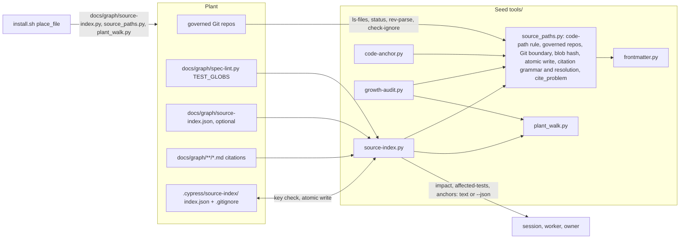

# grill.md: Plan of Record: round 8.1.0, the source index (slice 1)

## 0. Metadata
- Project: CYPRESS seed
- Feature or goal: port CodeGraph's useful mechanical derivation into the seed as one stdlib tool, `tools/source-index.py`, placed in every plant as `docs/graph/source-index.py`: a file inventory, file-to-file edges with provenance, a boundary list of what it could not resolve, and three queries (`impact`, `affected-tests`, `anchors`), with the code-path rule and the citation reading moved into one helper the existing tools share
- Date: 2026-10-07
- Owner: the steward; the orchestrating session plans, briefs and commits
- Tier: T3. Protocol: `protocol.specify-joint-pass` (spec and plan written together), then `protocol.grill`
- Current phase: joint pass step 4 closed (spawn `devils-advocate`, verdicts applied by `architect-da` with the session's rulings in §6; architect signed SPEC-0007); next is tester (SPEC-0007 §10 rows for the contracts and arms the step-3 and step-4 passes added), then the RED wave (§9)
- Related files: `tools/source-index.py` (new), `tools/source_paths.py` (new), `tools/code-anchor.py`, `tools/growth-audit.py`, `tools/plant_walk.py`, `tools/graft-audit.py`, `tools/gate-registry.py`, `install.sh`, `manifest.json`, `tests/run.sh`, `tests/test-source-index.sh` (new), `tests/test-code-anchor.sh`, `tests/test-growth-audit.sh`, `tests/test-full-install.sh`
- Related documentation: `docs/plans/grill-8.0.0-wave-a.md` (the previous plan the gate linted, and the shape this one follows); the session record of 2026-10-07, its gap reports and the review report `review-spec.md`, kept outside the seed under the seed workspace `.seed-worktrees/records-8.1.0-source-index/`
- Related ADRs: [ADR-0029](../decisions/adr-0029-source-index-is-derived-scratch.md) (proposed: the index is derived scratch); the round works under [ADR-0018](../decisions/adr-0018-code-fact-freshness-anchor.md) (the code anchor, no per-file or per-prompt staleness tool), [ADR-0021](../decisions/adr-0021-seed-only-procedures-stay-home.md) (the manifest's `tools` map equals what the installer places) and [ADR-0023](../decisions/adr-0023-a-declarative-edit-is-proved-by-a-run.md) (a declarative edit is proved by a run)
- Related specs: [SPEC-0007](../specs/SPEC-0007-source-index.md) (new, draft: every contract of this plan); [SPEC-0003](../specs/SPEC-0003-per-prompt-injection.md) (the code-anchor contracts the helper extraction must keep); [SPEC-0001](../specs/SPEC-0001-install-placement.md) (`SEED_ONLY_FILES_NEVER_PLACED`, `CODE_ANCHOR_TOOL_IS_PLACED`, the placement rules the new files follow)
- Related libraries: none (stdlib Python and Git, as the seed already uses)
- Baseline: seed `main` at `fa6eac5` (== `origin/main`), branch `experimental/source-index`

## 1. Artifact Discovery
- Existing files inspected: `tools/code-anchor.py` (`git`, `GIT_LOCATORS`, `is_code`, `NOT_CODE`, `NOISE_DIR`, `NOISE_NAME`, `content_state`, `repo_values`, `governed_repositories`, `open_anchor_dir`, `write_anchor`, `moved`, `report`); `tools/growth-audit.py` (`CITATION_RE` at 605-607, `_shape_problem`, `cite_problem` 627-669, `resolves` 672, `graph_leaf_filled`, the five `cite_problem`/`resolves` call sites, the `plant_walk` load at 157-162); `tools/plant_walk.py` (`is_foreign`, `files`); `templates/knowledge-graph/graph-lint.py` (`_task_paths` 1161, `_path_matches` 1184, `_named_paths` 1250: node file, longest `repo:` prefix with a `/`, expertise pattern, unique basename); `templates/knowledge-graph/spec-lint.py` (`TEST_GLOBS` 72-75, `test_files` 122); `install.sh` (`place_file` 389, `place_graph_scaffold` 1522-1574 with `code-anchor.py` at 1568, the `.cypress/` ignore note at 2403-2418); `tools/graft-run.py` (`copy_tree` 220, `is_machinery` 331); `tools/graft-audit.py` (`DELIVERED_TOOLS` 268-281); `tools/gate-registry.py` (the step classes, the `test-code-anchor.sh` entry); `manifest.json` (`tools` map)
- Existing docs inspected: `protocols/grill.md` (`grill.increment-shape`, `grill.press`); `templates/grill.template.md`; `templates/spec.template.md`; `templates/adr.template.md`; `core/method/delegation-cycle-economy.md` (`delegation.effort-scale`)
- Existing tests inspected: `tests/run.sh` (`ACTIVE_PLAN`, the step list); `tests/test-code-anchor.sh` (X152 to X160, X176; it copies `tools/code-anchor.py` and `frontmatter.py` into a plant's `docs/graph/`); `tests/test-growth-audit.sh` (the malformed, missing, absolute and `:999999` citation cases, the plant-walk cases); `tests/test-full-install.sh` (E6 places `code-anchor.py`, E14 runs a placed tool in a fresh plant); `tests/test-tool-help.sh` (every `__main__` tool answers `--help`); `tests/seed-lint.py` (`FRONTMATTER_COPIES`)
- Existing specs inspected: `docs/specs/SPEC-0003-per-prompt-injection.md` ("Code anchor (7.32.0)" contracts and failures); `docs/specs/SPEC-0001-install-placement.md` (`CODE_ANCHOR_TOOL_IS_PLACED`, `SEED_ONLY_FILES_NEVER_PLACED`); `docs/specs/SPEC-0007-source-index.md` (§0 to §3, as the session wrote them)
- Existing architecture signals: the seed has no source-structure model (session record, "Verified facts"); placed tools are standalone stdlib scripts that load a sibling by file path (`code-anchor.py` loads `frontmatter.py`), so a shared module is a placed sibling, not a package; `growth-audit.py` and `plant_walk.py` run from the seed and are not placed today; `.cypress/` is ignored in the seed and Vivid and tracked in this plant; graft copies `.cypress/` whole and audits none of it
- Libraries already wikified: none, no library is involved
- External sources downloaded: none kept; CodeGraph (`colbymchenry/codegraph` at `31c3328`) was read by the reference scout on 2026-10-07 and is summarized in the session record
- Constraints discovered: stdlib Python and Git only (owner, session record); `TEST_GLOBS` is an owner fact grow and graft already ask for; `tests/seed-lint.py` fails when the manifest's `tools` map differs from what `install.sh` places; `graft-audit.py` reports a placed file it cannot map as UNMAPPED unless `DELIVERED_TOOLS` names it

## 2. Shared Understanding
The owner's words (2026-10-07), verbatim:

> "ok so we need to import/implement the plan so that it's integrated organically into the cypress seed and installed/grafted into the plants correctly."

and, earlier the same day, the correction that set the direction: CodeGraph's good mechanical derivation is ported into CYPRESS as stdlib Python, not wrapped as a CodeGraph surface.

Success means: a plant answers "what depends on these files", "which tests do these files reach" and "which graph pages cite these moved files" from a derived, rebuildable index, every answer naming what it could not resolve and failing toward running more; the seed reads as if the tool had always been there (one helper holds the rules `code-anchor.py` and `growth-audit.py` already apply, and both keep their behaviour); a fresh install places the tool, and a graft rebuilds its cache.

Out of scope (SPEC-0007 §2): slice 2 (symbols, co-change history, wiring into verify, canonize and grow); read deduplication (a separate spec); and, never, tree-sitter, SQLite, a daemon, MCP, CodeGraph itself, other languages, a call graph, per-prompt use, or any automatic decision.

## 3. User Goal
- Primary user: the orchestrating session that plans and verifies a change; a worker inside a brief; a plant owner at a shell
- Primary outcome: impact, affected tests and stale-fact candidates computed in a second instead of searched by hand. Sized honestly (gap report "discovery"): a CYPRESS worker rollout makes a median 22 discovery calls; file-dependency and affected-test lookups are 4 percent of searches (576 operations, under one per rollout), and about 4.5 per rollout once file inventory and symbol lookup are counted (symbols are slice 2)
- Job to be done: before a change, know its reach; after a change, know which tests to run first and which graph facts to re-check
- Acceptance criteria (link to spec §9): SPEC-0007 §9, written by `product` in the next step
- Non-goals: choosing the tests to run, the tier, or what the graph says; replacing the full gate

## 4. Operating Constraints
- Runtime constraints: stdlib Python 3.12 or newer (the gate pins 3.12 at `.github/workflows/gate.yml` line 38; the placed `graph-lint.py` needs it) and Git; bash 3.2 syntax in `install.sh`; no new dependency
- Security constraints: read-only over repositories; never import or execute repository code; writes only `.cypress/source-index/`, descriptor-relative, no symlink followed (SPEC-0007 §5)
- Privacy constraints: no plant identity in seed files, tests or fixtures; fixtures are synthetic Git repositories built by the test
- Data constraints: the cache is derived scratch (ADR-0029); the plant config `docs/graph/source-index.json` is plant-owned and never placed
- Cost constraints: the cycle rules of `delegation.effort-scale` and `delegation.waves`; batch per wave, no micro-loops (owner)
  - Plan approval (`grill.plan-approval`): the plan was approved by the owner on 2026-10-07 in its condensed form (§2 quote); levers this plan uses: none defined beyond the batch sizes of `delegation.effort-scale` (default); the gap scouts ran on `anthropic/claude-opus-5-5` by the owner's ruling of 2026-10-07
  - Owner-only prerequisites: none for increments 1 to 13; deleting the plant copy of the records and the plant branch `experimental/source-index` waits for the owner's confirmation (kernel §4), outside this plan
  - Scoped standing grant: none asked
- Latency constraints: SPEC-0007 §5 (full build within 5 s at 5,000 files; a cached query within 1 s on the seed-sized plant)
- Compliance constraints: none
- Maintenance constraints: one home per rule (the helper); the seed reads as if the feature always existed (holistic editing); tests only for real contracts, one owner per behaviour; human-facing prose passes prose-lint and the humanizer on `CHANGELOG.md` and `README.md` only

## 5. Research Summary
no external dependency — every increment uses stdlib Python (`ast`, `json`, `hashlib`, `os`, `fnmatch`) and Git, which the seed's placed tools already use; no §9 row depends on a `docs/graph/libraries/` page. The design evidence is the seed's own source (§1) and the 2026-10-07 measurements in the session record:
- Edge yield: Python imports give 2 edges in the seed and 0 in Vivid (no Python outside `docs/`); TS/JS regex with tsconfig `paths` gives 663 internal edges, 2 unresolved, in 0.15 s on Vivid. So TS/JS is in scope and Python imports alone are not enough.
- Recall against co-change (seed, 72 commits): imports only 0.007; invoke plus path literals at depth 3, 0.80; plus the whole-tree tests always run, 0.92 (22.4 of 39 tests predicted); depth 5 adds at most 0.02. Precision 0.12 to 0.28, a lower bound. So: default depth 3, cap 5; an always-run class; never "only these".
- Bare unique basenames add 0.05 recall for 6 more tests and are the least safe edge (several `graph-lint.py`, `frontmatter.py` copies), so a basename resolves only beside its holder or at the repository root.
- Markdown mentions saturate (any input reaches about 670 files and 31 tests), so they are not dependency edges; citations are a separate relation read only by `anchors`.
- Citations: 73 to 75 percent of code citations resolve exactly; 23 percent of this plant's are ambiguous basenames; 59 percent of Vivid's cite pairs come from plans, specs and decisions, so history pages are counted, not listed.
- Whole-tree tests (a `find`, `rglob` or `git ls-files` over the root) carry 53.6 percent of the co-change truth pairs, and no link rule reaches them. Directory literals added no test recall (+0.4 predicted), but for the code that does things they are real links (`install.sh` copies whole directories). So a tree walker over a non-literal root is opaque and joins every walk as `maybe`, and a directory literal is a `maybe` link to each file under it.
- CodeGraph: impact is a reverse BFS of depth 3 at nearest depth; affected tests a BFS stopping at tests behind one shared test predicate; incremental sync drifted 4.3 percent of edges from a full rebuild (ADR-0029).

## 6. Decisions Made
| Decision | Rationale | Evidence | Reversibility | ADR | Date |
|---|---|---|---|---|---|
| Tier T3 | a new placed tool, a shared module two tools move onto, the installer, the manifest and the graft audit | kernel §0 | not applicable | none | 2026-10-07 |
| Design latitude: balanced | new structure only where the change needs it: one shared helper module and one derived cache; no concept the plan did not name | the owner, 2026-10-07: "implement the plan so that it's integrated organically into the cypress seed and installed/grafted into the plants correctly." | reversible | none | 2026-10-07 |
| (superseded below: "unchanged in behaviour" holds for messages and verdicts, and SPEC-0007 §6 "Helper" names the four interface changes) One helper, `tools/source_paths.py`, is the one home of what counts as source and how a path is named: the code-path rule, governed repositories, the Git boundary, blob hashing, the atomic write under `.cypress/`, the citation grammar and `cite_problem`; `code-anchor.py` and `growth-audit.py` move onto it unchanged in behaviour | the owner's shared-helper ruling ("organic integration"); three consumers exist once the tool lands, so the module is earned by present variation | owner approval 2026-10-07; `tools/code-anchor.py`, `tools/growth-audit.py` 597-675 | reversible | none | 2026-10-07 |
| (superseded below, the same helper-interface row) The Git boundary, content hash and atomic write move into the helper with the code-path rule, beyond the plan's "code-path rule and cited-path reading" | the tool needs the same Git call discipline and the same safe write; a second copy would be a second home for a security rule | `tools/code-anchor.py` `git`, `content_state`, `write_anchor` | reversible | none | 2026-10-07 |
| (superseded below by the owner-accepted row of 2026-10-07) `graph-lint.py` keeps its own tier-2 path rule this slice; the anchors' `repo:` claim mirrors it | the engines are placed add-if-missing and reconciled by `graft-graph-engine.py`; giving them a new sibling import is an engine-placement change the plan did not name | `install.sh` 1533; `graph-lint.py` `_named_paths` | reversible | none | 2026-10-07 |
| The helper and `plant_walk.py` are placed beside the tool in `docs/graph/` | placed tools load siblings by file path; `code-anchor.py` in a plant needs the helper, `source-index.py` needs both | `install.sh` 1532, 1568; `tools/code-anchor.py` 53-56 | reversible | none | 2026-10-07 |
| (superseded below: the key `full_suite_triggers` is renamed `global_inputs`, and `exclude` changes the test class only) Test config (owner ruling: plant-declared test roots with a seed default): the test roots are the plant's `TEST_GLOBS` in `docs/graph/spec-lint.py`, read, never copied; `docs/graph/source-index.json` adds only `exclude`, `always_run` and `full_suite_triggers`, each key replacing the seed default the tool holds | `TEST_GLOBS` is already the owner fact for where tests are, asked at grow and kept by graft; a second test-root list would be a second home that drifts | `spec-lint.py` 65-75; `graft-graph-engine.py` 55 | reversible | none | 2026-10-07 |
| (superseded below: a refused config makes every query `incomplete`) The plant config is plant-owned and never placed; a refused config sets `full_suite` | the installer must not overwrite a plant's declaration; a refused `always_run` would otherwise drop tests silently | SPEC-0007 §7 `PLANT_CONFIG_REFUSED` | reversible | none | 2026-10-07 |
| (superseded below by the owner's one-walk ruling of 2026-10-07) A reference the index cannot pin is walked as `uncertain` instead of setting `full_suite`: an opaque file (non-literal dynamic reference, unparsable file, unavailable tsconfig) joins every walk; an ambiguous module links to each candidate; an opaque test is always-run. `full_suite` is reserved for answers the walk cannot give (a trigger, an unknown input, no test declaration, a refused config, no index) | the plan's "full_suite on an unresolved edge on a reached path" made precise: an unresolved outgoing reference of a reached file hides no dependent, and an incoming one may point anywhere, so a literal rule either never fires or fires on every query | SPEC-0007 §4 `AFFECTED_UNPINNED_EDGE_IS_WALKED_UNCERTAIN`; seed `install.sh` holds no variable-only invocation (counted 2026-10-07) | reversible | none | 2026-10-07 |
| A path literal resolves beside its holder, then by `/`-suffix; a bare basename elsewhere is not an edge | suffix resolution is what lifted recall to 0.80; unique-basename edges are the least safe | §5 | reversible | none | 2026-10-07 |
| Type-only TS imports and `vi.mock` specifiers are ordinary edges, unlabelled | both name a module a test depends on; a label no consumer reads is a concept the plan did not name | gap report "languages" §5 | reversible | none | 2026-10-07 |
| (superseded below: link kinds `certain` and `maybe`, with how-found per link) Provenance values are §3's four words: `exact`, `resolved`, `derived` (every path literal), `uncertain` (query time only) | product's §3 vocabulary; CodeGraph's lesson is a label, not a score | SPEC-0007 §3, §6 | reversible | none | 2026-10-07 |
| The cache is derived scratch: `.cypress/source-index/` with a self-written `.gitignore` of `*`, keyed on schema, tool digest, config digest and each repository's HEAD and dirty digest; full rebuild on mismatch; never committed; graft carries no rule for it | ADR-0029 | ADR-0029 | reversible | [ADR-0029](../decisions/adr-0029-source-index-is-derived-scratch.md) | 2026-10-07 |
| Anchors read citations live on each query; history pages (`plans/`, `specs/`, `decisions/`) are counted, listed only with `--all` | node edits are not code, so caching them would widen the key; 59 percent of Vivid's cite pairs are history | §5 | reversible | none | 2026-10-07 |
| Placement tests live in their owner suite, `tests/test-full-install.sh` (beside E6 and E14); every other SPEC-0007 case lives in one new file, `tests/test-source-index.sh` | one strong owner per behaviour; the plan's one test file for the tool's contracts | `tests/test-full-install.sh` E6, E14 | reversible | none | 2026-10-07 |
| SPEC-0007 is planned in one slice; slice 2 (symbols, history, wiring) is a later spec revision | the owner's plan; slice 1 must be measured first | session record "Owner approval" | reversible | none | 2026-10-07 |
| Owner ruling: one walk, three link kinds, for `impact`, `affected-tests` and `anchors`. A row is `certain`, or `maybe` with the reason and line of its weakest link; what the tool cannot answer is `incomplete` with a reason and one action per query (`impact` "check by hand", `affected-tests` "run the full suite", `anchors` "review by hand"); `affected-tests` is the walk filtered by test class plus the always-run set. Supersedes the `uncertain`, provenance and `full_suite` rows above; the second walk and its test pass-through rule are gone | one concept had four signals (`full_suite`, `unavailable`, `unknown_inputs`, `truncated`) and two walks; the tool serves the project's code, not only its tests | the owner, 2026-10-07: "but i accept the three-kind rule" and "this change does not only apply to tests but also information regarding the actual repo/project code"; review B1, M11 | reversible | none | 2026-10-07 |
| Owner ruling: the helper `tools/source_paths.py` takes code-anchor's Git boundary, blob hash and atomic write with the code-path rule, and holds the one citation-resolution function whose strict plant-relative mode is `cite_problem` | one home per security rule and per resolution rule | the owner, 2026-10-07: "3 accept"; review M7 | reversible | none | 2026-10-07 |
| Owner ruling: the test roots are `TEST_GLOBS` from `docs/graph/spec-lint.py`; the optional `docs/graph/source-index.json` holds `exclude`, `always_run` and `global_inputs`. The key `full_suite_triggers` is renamed `global_inputs`: a change to such a file may affect every file, so every query is `incomplete` with reason `global-input` | the trigger list is a code fact (a tsconfig edit moves every alias), not a test rule | the owner, 2026-10-07: "2 yes ok accept"; the rename was the session's proposal, the owner answered "proceed"; review M3 | reversible | none | 2026-10-07 |
| Owner ruling: `graph-lint.py` keeps its own tier-2 path rule this slice, recorded as accepted debt; the anchors' resolution lives in the helper, and graph-lint's copy is the debt §12 question 2 pins | an engine-placement change the plan did not name | the owner, 2026-10-07: "4 yes"; review M7 | reversible | none | 2026-10-07 |
| Inputs and walk rules after review: `exclude` changes the test class only (an excluded file keeps its links); a `not-code` input is answered, never incomplete; a deleted input that a stored reference names is walked; a repository-relative input resolves under each governed root; a target in another governed repository is a `certain` link; directory literals, tree walkers and workspace package names are `maybe`; a `TEST_GLOBS` matching nothing is `incomplete`; a depth-cap cut is `incomplete` | each closes a silent drop the review found; all follow from the one-walk ruling | review M1, M2, M4, M5, M6, M8, m12 | reversible | none | 2026-10-07 |
| The helper extraction carries no SPEC-0007 contract: increments 1 and 2 are gated by the existing code-anchor and growth-audit suites, and SPEC-0007 is promoted to `active` after spawn R1 (increments 3 to 7) lands | spec-lint reads run-proved contracts only from `plans/grill.md`, so run-proved slugs here would count UNCOVERED; SPEC-0003 and the growth-audit suite already own that behaviour; all SPEC-0007 contracts go live at once | review B2, m19; `spec-lint.py` `run_proved` | reversible | none | 2026-10-07 |
| Deliberately unreadable fixture files stay opaque and join every walk as `maybe` rows; the noise is accepted this slice | a data class would be a concept the plan did not name; each such row names its reason and holder | review m21 | reversible | none | 2026-10-07 |
| Session ruling on devils-advocate (c), the owner told and not objecting, keeping the three-kind rule: the floor, the `maybe` rows every input reaches (the opaque holders and the files reached only through them), is computed by a second part of the one walk that starts at the opaque holders, and listed once, apart, after the input's `certain` rows and then its `maybe` rows; nothing is dropped, only presented | on the seed the floor was about 48 rows and 32 of 50 link-bearing tests for every input, about 95 percent of each answer, and sorting by depth interleaved it with the real rows, so `TEXT_MAX_ROWS` could cut them | devils-advocate report (c), a throwaway approximation of SPEC-0007 §6 over the seed, 2026-10-07 | reversible | none | 2026-10-07 |
| `no-code-edge` takes only test-class files of a link-bearing language (Python, shell, TS/JS) holding no link to code and no opaque record; a fixture in `json` or `other` is always-run only when declared | `TEST_GLOBS` names where test evidence lives, fixtures included: under this plant's globs 183 seed files are test class and 121 are Markdown fixtures, about 130 of which the old rule listed as always-run on every query | devils-advocate report (c), (d) | reversible | none | 2026-10-07 |
| The helper move changes code-anchor's interface in four named places, never a message or verdict: `git` takes stdin and the exit codes that are answers; `content_state` opens with `O_NOFOLLOW` and `O_NONBLOCK`, checks `fstat` before it reads and hashes in a stream (same hashes, one hashing path); the directory opener and atomic write take the root, directory parts, target name, temp prefix and refusal name; no function reads a module-global root; the predicate `relative` moves unchanged and the tool's input normalizer is a separate `plant_relative`. Supersedes the two "unchanged in behaviour" rows above | the claim "moved unchanged" was overstated against `tools/code-anchor.py` (`git` stdin `DEVNULL` and raise on any non-zero exit; `content_state` `lstat` then `read_bytes`; `write_anchor` hard-coded names; `ROOT = Path.cwd()`); `relative` there is a bool predicate, so one name would have carried two meanings | devils-advocate report (a); `tools/code-anchor.py` 103, 124-140, 189-208, 254-258, 330-360 | reversible | none | 2026-10-07 |
| The placed names `source-index.py`, `source_paths.py` and `plant_walk.py` are fixed now | `place_file` never deletes, so a later rename leaves orphans in every plant that no sweep removes | devils-advocate report (a); `install.sh` `place_file` | expensive | none | 2026-10-07 |
| The cache key holds the running Python's major.minor; the seed's Python floor is 3.12 | `ast` parses by the running grammar: the seed's `graph-lint.py` does not parse on 3.11 (line 341), so a cache read by another interpreter under an equal key would answer what neither rebuild would; SPEC-0007 §5 had mis-cited a 3.10 floor | devils-advocate report (b); `.github/workflows/gate.yml` 38; `templates/knowledge-graph/graph-lint.py` 341 | reversible | [ADR-0029](../decisions/adr-0029-source-index-is-derived-scratch.md) | 2026-10-07 |
| TS/JS extraction joins a line ending in an open `import(`, `require(` or `vi.mock(` with at most `JOIN_MAX` (3) following non-blank lines; a parser stays out | 7 of 1,980 Vivid specifiers (0.35 percent, 4 test files) sit on the line after `import(`; one-line reading made each holder a false `dynamic-nonliteral` floor row; the join stays linear | devils-advocate report (e), the TypeScript 5 `preProcessFile` scan of Vivid | reversible | none | 2026-10-07 |
| Owner ruling: a Python load by file path is a `certain` `import` link found `exact`, an arm of `LINK_PYTHON_IMPORT_CERTAIN`: `spec_from_file_location` or `run_path` over a path anchored at `__file__` (`Path(__file__)`, optional `.resolve()`/`.absolute()`, one or more `.parent`, `/` literals; or `os.path.join` over nested `os.path.dirname` of `__file__`), resolved with no probing; a missing target is `relative-no-file`; an anchored path no load call takes, or one held in a variable, stays a `path-literal`. Closes §12 question 5 | the seed's main Python dependency is such a load (`frontmatter.py`, `plant_walk.py`, `graft-audit.py` each have no `certain` dependent otherwise); the anchored form names one file whatever the working directory, so the link is as sure as a relative import; the link is a module load, so the import contract is its one owner | the owner, 2026-10-07, accepting the session's recommendation (b) on question 5 under "go implement"; `tools/code-anchor.py` 54-55, `tools/corpus-match.py` 53-54, `tools/graft-audit.py` 168-169, `tools/graft-ledger.py` 78-79 | reversible | none | 2026-10-07 |

## 7. Options Considered
| Option | Benefits | Costs | Risks | Outcome |
|---|---|---|---|---|
| Wrap CodeGraph as an optional provider | 23 node kinds, call edges, an MCP tool | TypeScript, Rust, SQLite and tree-sitter in a stdlib seed | a dependency the seed cannot carry into plants | Rejected by the owner (port, not surface) |
| Python imports only | `ast` is exact | 0 edges on Vivid, 2 in the seed | a tool with nothing to say | Rejected (§5) |
| Markdown mentions as dependency edges | the seed is 91 percent Markdown | every input reaches about 670 files | saturated, useless answers | Rejected (§5); citations are a separate `anchors` relation |
| Bare unique basename edges anywhere | +0.05 recall | +6 tests per query; ambiguous copies | wrong edges between copies | Rejected; only beside the holder or at the root |
| Test roots in the new config | one file for the tool | a second home beside `TEST_GLOBS` | the two lists drift | Rejected (§6) |
| Set `full_suite` on every unresolved reference near the walk | simple to state | fires on almost every query, or never | a flag nobody trusts | Rejected (§6); replaced by the owner's one-walk ruling of 2026-10-07 (`certain`, `maybe`, `incomplete`) |
| Refactor `graph-lint.py` onto the helper now | one copy of the `repo:` rule | an engine-placement change, graft-graph-engine reconciliation | a broken engine on graft | Deferred (§12 question 2) |
| Move `growth-audit.py`'s citation code only, leave `code-anchor.py` alone | smaller diff | the tool would copy the code-path rule and the Git boundary | two homes of a security rule | Rejected (holistic editing) |
| Incremental cache update; committed cache; SQLite; install-time cache deletion | speed; reviewability | drift, churn, a ruled-out store, a pointless deletion | stale answers | Rejected (ADR-0029) |
| A second walk for `affected-tests` that stops at tests, with a pass-through rule | CodeGraph's shape | two walks, one extra rule and contract | tests lost behind a test that is also a tool (`tests/legal-lint.py`) | Rejected (§6 one-walk ruling) |
| `exclude` removes files from the inventory | a smaller index | real dependents vanish from `impact` (Vivid's `tests/experimental/**` imports `src/`) | a missing link shown as no dependency | Rejected (§6, review M4) |
| Directory references and tree walkers are not links | the co-change study found no test recall in them | code that copies or walks a tree loses its dependents | silent drops for the code that does things | Rejected (§6, review M5) |
| Per-prompt or hook use of the queries | answers without asking | ADR-0018 withdrew per-file and per-prompt staleness tools | context cost every prompt | Rejected (SPEC-0007 §2) |

## 8. Architecture Plan
- System boundary: one placed CLI over the plant's governed Git repositories and its `docs/graph/` pages; no network, no model, no hook

- Main components: the helper (the one home of the shared rules, citation resolution included); the indexer (inventory, link extraction per language, resolution, opaque and unresolved records); the cache (key, read, rebuild, write); one reverse walk over the links at nearest depth with weakest-link chains, in two parts (the input rows, and the floor reached from the opaque holders, listed apart), filtered per query (`impact` all rows, `affected-tests` the test class plus always-run); the citation join for `anchors`
- Interfaces: the CLI and the answer document of SPEC-0007 §6; the helper's functions as module attributes, loaded by file path like `frontmatter.py`
- Data flow: Git lists files, the helper filters them by the code-path rule and `plant_walk.is_foreign`, the indexer reads each file once and resolves references against the inventory, the cache stores the sorted result, a query walks it
- Error handling: every doubt resolves toward checking more: an unpinned reference makes its holder opaque or its links `maybe`, and what the walk cannot answer makes the answer `incomplete` with a reason and the query's action; every query exits 0 (SPEC-0007 §6 "Incomplete", §7)
- Observability: the cache status line on every answer; the boundary list; `--json` for machines
- Security posture: SPEC-0007 §5 Security; the cache is untrusted input
- Deployment model: new plants at install; existing plants at their next graft, which runs the installer in the copy
- Environment parity: not applicable — no deploy chain

## 9. Implementation Plan

Increments are inline; numbers are dependency order. Two lanes run in parallel at the start because their files are disjoint: lane Helper (1, 2) and lane Tool RED (3 to 7). The GREEN increments of the tool follow both.

| Spawn | Increments | Worker | Batch rule (`delegation.effort-scale`) |
|---|---|---|---|
| R0 | 1 | `tester` | RED medium-low |
| G0 | 2 | `implementer` | GREEN medium-hard: one or two |
| R1 | 3, 4, 5, 6, 7 | `tester` | RED medium-hard: five |
| G1 | 8, 9 | `implementer` | GREEN medium-hard: two |
| G2 | 10, 11 | `implementer` | GREEN medium-hard: two |
| G3 | 12 | `implementer` | GREEN medium-low |
| P1 | 13 | one writer | prose, one file set |
| R2 | review fixes (8, 9, 10) | `tester` | RED medium-hard: one spawn, the whole fix list |
| G4 | review fixes (8, 9, 10) | `implementer` | GREEN medium-hard: one spawn, the whole fix list |

R0 and R1 may run side by side; G0 after R0; G1 after G0 and R1.

The code-review fixes (`reviewer-code`, fix list items 1 to 12) land as one RED spawn (R2: arms added to the existing cases of `tests/test-source-index.sh`, no new case) and one GREEN spawn (G4: the whole list against SPEC-0007 §6 and §7 as amended by `architect-review-fixes`), then the reviewer re-reads the diff. They add no increment: each fix sits inside increment 8, 9 or 10 and its contracts.

### Increment 1 — Characterize what the helper extraction moves
- Spec contracts: none — characterization of behaviour the helper extraction moves; SPEC-0003's code-anchor contracts and the growth-audit suite own it (§6)
- Files touched: `tests/test-code-anchor.sh` (the fixture places `tools/source_paths.py` beside `code-anchor.py` and `frontmatter.py`, as the installer will); `tests/test-growth-audit.sh` (characterization cases only)
- Tests to write (RED): up to 2 characterization cases, only for behaviour the extraction moves and no case holds today (candidates the tester rules on: `cite_problem` refusing a citation that leaves the plant through a symlink; the `:line:col` and `:a-b` suffix forms; a `repo:` that resolves outside the root being skipped); each green on arrival and proved by one reverted mutation. The placement edit is red until increment 2 lands the helper
- Behavior added: none
- Gate: `bash tests/test-growth-audit.sh` green; `bash tests/test-code-anchor.sh` red only on the missing helper file
- Rollback path: revert the test commit
- Effort: medium-low
- Phase: RED
- Depends on: none

### Increment 2 — Extract the shared helper; code-anchor and growth-audit move onto it
- Spec contracts: none — a refactor under SPEC-0003's code-anchor contracts and the growth-audit suite (§6)
- Files touched: `tools/source_paths.py` (new library module, no CLI); `tools/code-anchor.py`; `tools/growth-audit.py`; `install.sh` (one `place_file` of `source_paths.py` into `docs/graph/`, beside `code-anchor.py`); `manifest.json` (`tools` entry); `tools/graft-audit.py` (`DELIVERED_TOOLS` entry)
- Tests to write (RED): none — a refactor under existing contracts; proved by `tests/test-code-anchor.sh`, `tests/test-growth-audit.sh`, `tests/test-tool-help.sh`, `tests/test-full-install.sh` and `tests/seed-lint.py` passing with no assertion edited; the placement of `source_paths.py` is guarded by `tests/test-full-install.sh` E14, which runs the placed `code-anchor.py` in a fresh plant and fails without its sibling
- Behavior added: none observable. The moved functions take the root as a parameter and `relative` moves unchanged (SPEC-0007 §6 "Helper"); the other interface changes land in increments 8 and 9. Structure: `source_paths.py` owns one responsibility, the seed's rules for what counts as source and how a path is named (`is_code` and its constants, `repo_values`, `governed_repositories`, `git` and `GIT_LOCATORS`, `content_state`, the descriptor-relative atomic write, `CITATION_RE`, the citation suffix parse, the one citation-resolution function with `cite_problem` as its strict plant-relative mode; its docstring names route-hook's `.cypress/session/` writer as the other home of the self-ignore rule); the present variation that earns it is three consumers (`code-anchor.py`, `growth-audit.py`, `source-index.py`). Each moved name leaves its old file whole: callers call the helper, no alias is kept, and no copy of a moved constant remains
- Gate: the five runs above; `python3 tools/gate-registry.py --lint`
- Rollback path: revert the commit; no data or plant state changes
- Effort: medium-hard
- Phase: GREEN
- Depends on: increment 1

### Increment 3 — RED: the index and its cache
- Spec contracts: SPEC-0007/BUILD_INVENTORIES_THE_CODE_OF_EVERY_GOVERNED_REPOSITORY, SPEC-0007/BUILD_IS_DETERMINISTIC, SPEC-0007/CACHE_WRITTEN_SELF_IGNORED, SPEC-0007/CACHE_REUSED_WHILE_THE_KEY_HOLDS, SPEC-0007/CACHE_REBUILT_WHEN_THE_KEY_CHANGES
- Files touched: `tests/test-source-index.sh` (new; synthetic Git plants with a HOME of their own, built the way the code-anchor suite builds its plants); `tests/run.sh` (one step, and `ACTIVE_PLAN` points at this plan); `tools/gate-registry.py` (the step's entry: fixtures, representation)
- Tests to write (RED): up to 5 cases over the five contracts, with arms for the failures GIT_UNAVAILABLE, NO_GOVERNED_REPOSITORY, CYPRESS_DIR_ABSENT, CACHE_PATH_UNSAFE, CACHE_UNREADABLE, CACHE_WRITE_FAILED and CACHE_IGNORE_ALTERED where the tester judges their blast radius real; the tester names them
- Behavior added: none
- Gate: the new step fails on the missing tool, each case on its own message; `python3 tools/gate-registry.py --lint` passes
- Rollback path: revert the test commit
- Effort: medium
- Phase: RED
- Depends on: none

### Increment 4 — RED: links, opaque and unresolved records, test class
- Spec contracts: SPEC-0007/LINK_PYTHON_IMPORT_CERTAIN, SPEC-0007/LINK_SHELL_INVOCATION_CERTAIN, SPEC-0007/LINK_PATH_LITERAL_AND_DIRECTORY_ARE_MAYBE, SPEC-0007/LINK_TS_SPECIFIER_CERTAIN, SPEC-0007/UNPINNED_REFERENCE_RECORDED_WITH_ITS_REASON, SPEC-0007/TESTS_ARE_THE_PLANTS_TEST_GLOBS, SPEC-0007/PLANT_CONFIG_REPLACES_EACH_DEFAULT_KEY
- Files touched: `tests/test-source-index.sh`
- Tests to write (RED): up to 7 cases over the seven contracts, with arms for TSCONFIG_UNREADABLE, TEST_DECLARATION_UNAVAILABLE and PLANT_CONFIG_REFUSED (their incomplete records are asserted in increment 5) and for the security failures FILE_NOT_REGULAR, INPUT_EXHAUSTS_A_PARSER, DIRECTORY_LITERAL_TOO_WIDE, TSCONFIG_EXTENDS_CYCLE and GIT_PATH_ARGUMENT, where the tester judges them real; fixtures are synthetic files named in SPEC-0007 §4, never a real plant's
- Behavior added: none
- Gate: each case fails on its own message
- Rollback path: revert the test commit
- Effort: medium-hard
- Phase: RED
- Depends on: increment 3

### Increment 5 — RED: the one walk, inputs, incomplete answers and the affected-tests filter
- Spec contracts: SPEC-0007/WALK_NEAREST_FIRST_ONCE, SPEC-0007/WALK_CHAIN_IS_ITS_WEAKEST_LINK, SPEC-0007/WALK_FLOOR_LISTED_APART_AFTER_THE_INPUT_ROWS, SPEC-0007/WALK_DELETED_INPUT_REACHES_ITS_NAMERS, SPEC-0007/INPUT_FORMS_RESOLVED, SPEC-0007/WALK_INCOMPLETE_NAMES_REASON_AND_ACTION, SPEC-0007/AFFECTED_TESTS_ARE_THE_WALK_FILTERED, SPEC-0007/AFFECTED_ALWAYS_RUN_LISTED_APART, SPEC-0007/OUTPUT_CARRIES_NO_RAW_CONTROL
- Files touched: `tests/test-source-index.sh`
- Tests to write (RED): up to 9 cases over the nine contracts, with the incomplete reasons of SPEC-0007 §6 as arms of WALK_INCOMPLETE_NAMES_REASON_AND_ACTION (one per reason the tester judges real), arms for INPUT_NOT_IN_INDEX, REPOSITORY_UNREADABLE and USAGE_REFUSED, and UNSAFE_PATH_TEXT and NON_UTF8_PATH as arms of OUTPUT_CARRIES_NO_RAW_CONTROL
- Behavior added: none
- Gate: each case fails on its own message
- Rollback path: revert the test commit
- Effort: medium-hard
- Phase: RED
- Depends on: increment 4

### Increment 6 — RED: anchors
- Spec contracts: SPEC-0007/ANCHORS_NAME_CITING_PAGES_OR_UNCITED, SPEC-0007/ANCHORS_BASENAME_IS_MAYBE_AMBIGUOUS_IS_INCOMPLETE
- Files touched: `tests/test-source-index.sh`
- Tests to write (RED): up to 2 cases over the two contracts, with the `anchors` arms of WALK_INCOMPLETE_NAMES_REASON_AND_ACTION left to increment 5
- Behavior added: none
- Gate: each case fails on its own message
- Rollback path: revert the test commit
- Effort: medium
- Phase: RED
- Depends on: increment 5

### Increment 7 — RED: placement and the graft rebuild
- Spec contracts: SPEC-0007/SOURCE_INDEX_IS_PLACED, SPEC-0007/GRAFT_REBUILDS_THE_CACHE
- Files touched: `tests/test-full-install.sh` (one E case beside E6 and E14); `tests/test-source-index.sh` (one case that installs over a plant whose cache an older tool built)
- Tests to write (RED): up to 2 cases over the two contracts
- Behavior added: none
- Gate: each case fails on its own message; the E case fails only on the files increment 12 places
- Rollback path: revert the test commit
- Effort: medium-low
- Phase: RED
- Depends on: increment 6

### Increment 8 — GREEN: the index and its cache
- Spec contracts: SPEC-0007/BUILD_INVENTORIES_THE_CODE_OF_EVERY_GOVERNED_REPOSITORY, SPEC-0007/BUILD_IS_DETERMINISTIC, SPEC-0007/CACHE_WRITTEN_SELF_IGNORED, SPEC-0007/CACHE_REUSED_WHILE_THE_KEY_HOLDS, SPEC-0007/CACHE_REBUILT_WHEN_THE_KEY_CHANGES
- Files touched: `tools/source-index.py` (new: the CLI with `build`, the inventory, the key with the Python major.minor, the cache read and write through the helper); `tools/source_paths.py` and `tools/code-anchor.py`, the SPEC-0007 §6 "Helper" changes this increment needs: the directory opener and the atomic write take the root, directory parts, target name, temp prefix and refusal name (code-anchor passes `.cypress`, `anchor.json`, `.tmp-anchor-`), `mkdir` joins `DIR_FD_CALLS` so the cache directory is created relative to the `.cypress/` descriptor, and `content_state` opens with `O_NOFOLLOW` and `O_NONBLOCK`, checks `fstat` before it reads and hashes in a stream; code-anchor's messages and verdicts stand, and `tests/test-code-anchor.sh` passing with no assertion edited proves it
- Tests to write (RED): none — increment 3's cases authorize it
- Behavior added: `source-index.py build [--json]` inventories every governed repository and keeps the result in `.cypress/source-index/`; the other queries are stubs until increments 10 and 11. Structure: one CLI file with one responsibility, deriving and answering from the index; no new module beyond the helper
- Gate: increment 3's cases green; `bash tests/test-code-anchor.sh` green with no assertion edited; `tests/test-tool-help.sh`; `--help` exits 0
- Rollback path: revert; delete the scratch cache, which nothing else reads
- Effort: medium-hard
- Phase: GREEN
- Depends on: increment 2, increment 3

### Increment 9 — GREEN: links, opaque and unresolved records, test class
- Spec contracts: SPEC-0007/LINK_PYTHON_IMPORT_CERTAIN, SPEC-0007/LINK_SHELL_INVOCATION_CERTAIN, SPEC-0007/LINK_PATH_LITERAL_AND_DIRECTORY_ARE_MAYBE, SPEC-0007/LINK_TS_SPECIFIER_CERTAIN, SPEC-0007/UNPINNED_REFERENCE_RECORDED_WITH_ITS_REASON, SPEC-0007/TESTS_ARE_THE_PLANTS_TEST_GLOBS, SPEC-0007/PLANT_CONFIG_REPLACES_EACH_DEFAULT_KEY
- Files touched: `tools/source-index.py`; `tools/source_paths.py` (`git(repo, *args, input=None, ok=(0,))` takes optional stdin bytes and the exit codes that are answers, for `check-ignore --stdin -z`; the defaults keep code-anchor's calls as they are, which `tests/test-code-anchor.sh` passing with no assertion edited proves)
- Tests to write (RED): none — increment 4's cases authorize it
- Behavior added: the extractors for Python (`ast`, loads by file path included), shell and TS/JS (comment-stripped regex, with the `JOIN_MAX` line join after an open `import(`, `require(` or `vi.mock(`), the one resolution order of SPEC-0007 §6 across governed repositories, directory literals, workspace package names, tree-walk detection, the JSONC tsconfig reader, the `certain`/`maybe` links with their reasons, the opaque and unresolved records, the test class from `TEST_GLOBS` and `exclude`, the plant config
- Gate: increments 3 and 4's cases green; `bash tests/test-code-anchor.sh` green with no assertion edited
- Rollback path: revert
- Effort: medium-hard
- Phase: GREEN
- Depends on: increment 8, increment 4

### Increment 10 — GREEN: the one walk, inputs, incomplete answers and the affected-tests filter
- Spec contracts: SPEC-0007/WALK_NEAREST_FIRST_ONCE, SPEC-0007/WALK_CHAIN_IS_ITS_WEAKEST_LINK, SPEC-0007/WALK_FLOOR_LISTED_APART_AFTER_THE_INPUT_ROWS, SPEC-0007/WALK_DELETED_INPUT_REACHES_ITS_NAMERS, SPEC-0007/INPUT_FORMS_RESOLVED, SPEC-0007/WALK_INCOMPLETE_NAMES_REASON_AND_ACTION, SPEC-0007/AFFECTED_TESTS_ARE_THE_WALK_FILTERED, SPEC-0007/AFFECTED_ALWAYS_RUN_LISTED_APART, SPEC-0007/OUTPUT_CARRIES_NO_RAW_CONTROL
- Files touched: `tools/source-index.py`
- Tests to write (RED): none — increment 5's cases authorize it
- Behavior added: input normalization (`plant_relative`) and classes; the one reverse walk (nearest depth, weakest-link chains, the floor part from the opaque holders listed apart, deleted inputs named by references, the depth cap); the `incomplete` list with per-query action lines; `impact` and the `affected-tests` filter with the always-run set; the text view with its `?` replacement and the `ensure_ascii` JSON view
- Gate: increments 3 to 5's cases green
- Rollback path: revert
- Effort: medium-hard
- Phase: GREEN
- Depends on: increment 9, increment 5

### Increment 11 — GREEN: anchors
- Spec contracts: SPEC-0007/ANCHORS_NAME_CITING_PAGES_OR_UNCITED, SPEC-0007/ANCHORS_BASENAME_IS_MAYBE_AMBIGUOUS_IS_INCOMPLETE
- Files touched: `tools/source-index.py`
- Tests to write (RED): none — increment 6's cases authorize it
- Behavior added: `anchors` reads every page under `docs/graph/` through `plant_walk.files` and the helper's citation grammar and resolution function, with `certain` and `maybe` facts, every `repo:` claim, the `ambiguous-citation` record, the facts and history split and the text cap
- Gate: increments 3 to 6's cases green
- Rollback path: revert
- Effort: medium
- Phase: GREEN
- Depends on: increment 10, increment 6

### Increment 12 — GREEN: placement and the graft audit mapping
- Spec contracts: SPEC-0007/SOURCE_INDEX_IS_PLACED, SPEC-0007/GRAFT_REBUILDS_THE_CACHE
- Files touched: `install.sh` (`place_file` of `source-index.py` and `plant_walk.py` into `docs/graph/`, with the comment the neighbouring placements carry); `manifest.json` (`tools` entries); `tools/graft-audit.py` (`DELIVERED_TOOLS` entries)
- Tests to write (RED): none — increment 7's cases authorize it
- Behavior added: every install places the tool and its two siblings; graft maps their backups; a graft rebuilds the cache through the key
- Gate: increment 7's cases green; then the full gate `bash tests/run.sh` green at the tip, with `tests/seed-lint.py` (`SEED_ONLY_FILES_NEVER_PLACED`) and `grill-lint.py` on this plan passing
- Rollback path: revert; plants keep their placed copies until the next install
- Effort: medium-low
- Phase: GREEN
- Depends on: increment 7, increment 11

no consolidation: the spec's cases are planned one per contract into one new file and one placement case into its owner suite from the start, after the amendment pass cut the contract set to one walk; increment 1 adds at most two characterization cases where no case exists. Nothing the round adds overlaps an older case, so a survey would find nothing to merge. The reviewer checks this claim against the diff.

### Increment 13 — Documentation: the seed counts and describes the tool
- Spec contracts: SPEC-0007/SOURCE_INDEX_IS_PLACED
- Files touched: `CHANGELOG.md` (the 8.1.0 entry, through the humanizer), `README.md` (only where it lists placed tools, through the humanizer), `DOCUMENTATION.md` (the placed-tool inventory and the figures `tests/seed-lint.py` holds), `documentation/skills-and-templates-reference.md` (the tool's entry beside `code-anchor.py`), `templates/knowledge-graph/index.md` (only where it names the placed tools)
- Tests to write (RED): none — prose; proved by the `prose-lint.py` steps of `tests/run.sh` and `tests/seed-lint.py` passing
- Behavior added: none
- Gate: `bash tests/run.sh` green
- Rollback path: revert the prose commit
- Effort: medium-low
- Phase: prose
- Depends on: increment 12

## 10. Verification Plan
The standard gates hold (`bash tests/run.sh`). This plan diverges in four places:
- A new gate step, `tests/test-source-index.sh`, enters `tests/run.sh` with increment 3, and `tools/gate-registry.py` classifies it (fixtures, representation: synthetic Git plants, not a real one).
- The helper extraction (increments 1 and 2) carries no SPEC-0007 contract: it is gated by runs of the existing suites (`tests/test-code-anchor.sh`, `tests/test-growth-audit.sh`, `tests/test-tool-help.sh`, `tests/test-full-install.sh` E14, `tests/seed-lint.py`) with no assertion edited (`grill.increment-shape`, §6).
- One measurement after increment 12, recorded, not gated: on a temp plant that governs a clone of the seed, `affected-tests` over the seed's co-change commits with at most three sources, reported as recall against the edited tests and mean predicted count, `certain` and `maybe` rows counted apart, with three recall figures side by side: full (tests, always-run and floor), input rows only (tests and always-run, no floor) and `certain`-only; and the floor's size in rows and in tests, with the share of each answer it makes; all beside the session record's baseline (0.92 recall, 22.4 of 39 tests for path literals at depth 3 plus the always-run set). The temp plant's `docs/graph/source-index.json` declares no `always_run`: the baseline's 15 whole-tree tests are reached as opaque `maybe` rows (`walks-tree`), which is the like-for-like comparison; it declares `exclude: ["tests/run.sh"]`, so the suite runner is not counted as a test; and the SPEC-0007 §5 timings for a full build and a cached query on that plant and on a copy of Vivid. The measurement never writes into a real plant.
- SPEC-0007 stays `draft` until spawn R1 (increments 3 to 7) lands, then goes `active` with every contract RED at once. `tests/seed-lint.py` refuses a seed spec in status `draft`, so the uncommitted working tree shows that one finding through the joint pass and the RED wave; the committed tree stays green because the spec is committed only in the change that lands its RED and moves it to `active` (`protocol.specify`, as SPEC-0006 did).

## 11. Risks and Mitigations
| Risk | Probability | Impact | Mitigation | Owner | Verification |
|---|---:|---:|---|---|---|
| The extraction changes a code-anchor or growth-audit message or verdict | medium | high | characterization first (increment 1); no assertion edited in increment 2 | tester, reviewer | increment 2's gate; the reviewer reads the test diff empty |
| A plant's `code-anchor.py` runs without its new sibling (a hand-copied tool) and crashes | low | medium | the installer places both together; the hooks already print the not-checked line when the tool fails | implementer | `tests/test-full-install.sh`; SPEC-0003 `STATUS_HOOK_ANCHOR_FAILURE_FAILS_TOWARD_INCLUSION` |
| Opaque files (tree walkers, dynamic paths) and their dependents pull many `maybe` rows into every query (about 48 rows and 32 tests on the seed, the same for every input, by the devils-advocate's approximation) | high | medium | they are the floor, listed once and apart after the input's rows with its own text cap, so they never push an input row out of the view; every `maybe` row names its reason, holder and line; the measurement reports the floor's size and the recall with and without it | architect | SPEC-0007 `WALK_FLOOR_LISTED_APART_AFTER_THE_INPUT_ROWS`; §10 measurement |
| A suite runner that matches `TEST_GLOBS` (the plant's `Cypress/tests/run.sh`) is reached whenever any test is, so `tests` holds the full suite in disguise | high | low | the plant lists it under `exclude` (test class only); SPEC-0007 §8 example 2 says so | product | §10 measurement config |
| Deliberately unreadable fixtures under a test root become opaque and join every walk | medium | low | accepted noise this slice (§6); each row names `unreadable` and its holder | architect | §10 measurement |
| The self-ignore rule (inner `.gitignore` of `*`) has two writers, the helper and route-hook | low | low | the helper's docstring names route-hook's writer as the other home (ADR-0029) | implementer | reviewer reads increment 2 |
| `TEST_GLOBS` counts fixtures and non-gate directories as tests | high | low | `exclude` in the plant config; the answer never claims "only these" | product | `PLANT_CONFIG_REPLACES_EACH_DEFAULT_KEY` |
| A repository path with control characters reaches a brief through the text view | low | medium | the text view replaces them with `?` | security | SPEC-0007 `OUTPUT_CARRIES_NO_RAW_CONTROL` (§7 `UNSAFE_PATH_TEXT`) |
| The cache survives a graft and answers for the old tool | low | medium | the key holds the tool and helper digests | tester | `GRAFT_REBUILDS_THE_CACHE` |
| A new placed file breaks the manifest or graft-audit totality checks | medium | low | increments 2 and 12 add the manifest and `DELIVERED_TOOLS` entries with the `place_file` line | implementer | `tests/seed-lint.py`; `tests/test-graft-tools.sh` |
| Regex TS extraction misses a form the scouts did not see | low | medium | an independent scan matched 1,127 of 1,129 specifiers on Vivid; a second (TypeScript 5 `preProcessFile`, 1,980 specifiers) found 7 on the line after `import(`, which the `JOIN_MAX` line join reads; misses fail toward the floor | tester | `LINK_TS_SPECIFIER_CERTAIN` |
| A cache built by one Python is read by another and answers what neither rebuild would (`ast` grammar differs by version) | low | medium | the key holds the Python major.minor (ADR-0029) | tester | `CACHE_REBUILT_WHEN_THE_KEY_CHANGES` |
| The helper move changes a code-anchor message or verdict, or leaves two hashing paths | medium | high | SPEC-0007 §6 "Helper" names the four interface changes; increments 8 and 9 run the code-anchor suite with no assertion edited; one `content_state` serves both tools | implementer, reviewer | increments 8 and 9 gates; the reviewer reads the code-anchor and growth-audit test diffs empty |
| Two lanes write one file | low | medium | lanes Helper and Tool RED are disjoint; every later increment depends on both | orchestrator | `grill-lint.py --waves` prints no overlap warning |
| A crafted reference reaches Git as pathspec magic (`:(exclude)x`) or as a path outside the repository, and the one `check-ignore` call exits 128, so the whole repository reads as unreadable | low | medium | paths outside the repository are filtered first; the rest go through `--stdin -z` as `./<path>`; exit 1 is an answer | security, implementer | SPEC-0007 §7 `GIT_PATH_ARGUMENT` |
| Repository content exhausts the tool: a minified bundle, deeply nested Python or JSON, a NUL byte, a tracked file replaced by a FIFO, a `"/"` directory literal that links every holder to every file | medium | medium | `FILE_MAX_BYTES`, `DIR_LINK_MAX` and `EXTENDS_MAX` bounds; parser errors become `unreadable` or the refusal §7 names; `O_NONBLOCK` open and a regular-file check before any read | security, implementer | SPEC-0007 §7 `INPUT_EXHAUSTS_A_PARSER`, `DIRECTORY_LITERAL_TOO_WIDE`, `FILE_NOT_REGULAR`, `TSCONFIG_EXTENDS_CYCLE` |
| A symlinked page or source file makes the tool read, and echo through `reference` or a citation detail, a file outside the plant | low | medium | `O_NOFOLLOW` open, real path inside its repository, `reference` holds the specifier only, never the line | security | SPEC-0007 §7 `FILE_NOT_REGULAR`; §5 Security |
| A non-UTF-8 or bidi-override file name crashes a `--json` write or misleads a reader of a brief | low | low | `surrogateescape` decode, `ensure_ascii` output, `?` in the text view | security | SPEC-0007 `OUTPUT_CARRIES_NO_RAW_CONTROL` (§7 `NON_UTF8_PATH`, `UNSAFE_PATH_TEXT`) |
| A later slice wires `affected-tests` into verify as a gate, and an author hides a link the tool cannot see | medium | high | §5: the answer is a recommendation over cooperative code; no gate reads a test's absence as proof | security, architect | slice 2 review |

## 12. Open Questions
| # | Question | Why it matters | Current assumption | How to resolve | Owner | Pinned by |
|---:|---|---|---|---|---|---|
| 1 | Does replacing "full_suite on an unresolved edge on a reached path" with `uncertain` walking (§6) keep the owner's intent? | the owner approved the condensed plan's wording | closed 2026-10-07 by the owner's one-walk ruling (§6): `certain`, `maybe`, `incomplete` with a per-query action | answered | owner | SPEC-0007/WALK_INCOMPLETE_NAMES_REASON_AND_ACTION |
| 2 | Should `graph-lint.py` load the helper for its tier-2 path rule in slice 2? | graph-lint's copy is accepted debt beside the helper's citation resolution | no this slice (owner, §6) | slice 2's specify pass | architect | SPEC-0007/ANCHORS_NAME_CITING_PAGES_OR_UNCITED |
| 3 | Should `anchors` take code-anchor's moved list directly (`--moved`), so the §3 flow needs no copying of paths? | code-anchor prints repository-relative paths; a repository-relative input now resolves under each governed root, ambiguous when several hold it | no this slice; the wiring is slice 2 | slice 2, with the canonize wiring | architect | SPEC-0007/INPUT_FORMS_RESOLVED |
| 4 | Do the helper's moved Git boundary, content hash and atomic write fit the plan's "code-path rule and cited-path reading"? | the plan named two rules, this plan moves five | closed 2026-10-07: the owner accepted ("3 accept", §6) | answered | owner | SPEC-0007/GRAFT_REBUILDS_THE_CACHE |
| 5 | Should a sibling load by file path (`Path(__file__).resolve().parent / "frontmatter.py"`) be a `certain` link? | the seed's main Python dependency is such a load, and as a `path-literal` it is never `certain`, so `tools/frontmatter.py` has no `certain` dependent | closed 2026-10-07: yes, this slice; the owner accepted recommendation (b) (§6): a load by file path is a `certain` `import` link | answered | owner | SPEC-0007/LINK_PYTHON_IMPORT_CERTAIN |

## 13. Done Criteria
- Every increment in §9 done, or struck with a dated reason.
- Every SPEC-0007 contract has a `green` §10 row, and SPEC-0007 is `implemented`.
- `tests/test-code-anchor.sh` and `tests/test-growth-audit.sh` pass with no assertion changed from the base apart from increment 1's placement and characterization edits.
- A fresh install places `docs/graph/source-index.py`, `source_paths.py` and `plant_walk.py`, and `build` exits 0 in it.
- The §10 measurement is recorded in the deliver entry.
- `bash tests/run.sh` is green at the tip with no step `not run`, `grill-lint.py` lints this plan from `ACTIVE_PLAN`, and `--waves` prints no overlap warning.

## 14. Recommended Next Step
`tester` adds and amends the SPEC-0007 §10 rows the step-3 and step-4 passes left open (`architect-da` handback lists them) and signs; `product` reads AC-3 and AC-5 against the floor; then the session spawns R0 and R1 (§9).

## 15. Changelog
- 2026-10-07: plan written by the architect in joint pass step 2 (spawn `architect-s4b`), with SPEC-0007 §4 to §8 and ADR-0029 (proposed), from the owner-approved plan, the session record and its gap reports (languages, discovery, co-change, anchors, CodeGraph, current model). Prior spawns of the round: the gap scouts `gap-languages`, `gap-discovery`, `gap-cochange`, `gap-anchors-o`, in that order.
- 2026-10-07: amendment pass after review (`reviewer-spec`) by the architect (spawn `architect-amend`): the owner's rulings recorded in §6 (one walk with `certain`/`maybe`/`incomplete`; the helper's scope; `TEST_GLOBS` plus `docs/graph/source-index.json` with `global_inputs`; graph-lint keeps its tier-2 rule), the superseded rows marked; §12 questions 1 and 4 closed; increments re-sliced to the new contract set (the `HELPER_KEEPS_*` contracts dropped to a plan gate); §3, §5, §7, §8, §10, §11 updated.
- 2026-10-07: step-3 returns applied by the architect (spawn `architect-fix`): contract `OUTPUT_CARRIES_NO_RAW_CONTROL` added to increments 5 and 10; the seven security failure modes placed as arms in increments 3 and 4; `source_paths.py` edits named in increments 8 (`mkdir` in `DIR_FD_CALLS`) and 9 (`git` answer exit set and stdin); §10 corrected on the draft-status finding; §11 slugs updated; §14 moved on.
- 2026-10-07: devils-advocate verdicts applied by the architect (spawn `architect-da`), with the session's rulings: §6 rows for the floor, `no-code-edge` restricted to link-bearing languages, the helper's four interface changes (superseding the two "unchanged in behaviour" rows), the placed names fixed, the Python major.minor in the cache key with the 3.12 floor, and the TS/JS line join; §4 runtime floor corrected; §8 walk in two parts; increments 2, 5, 8, 9 and 10 updated (increments 8 and 9 now gated by the code-anchor suite); §10 measurement adds floor size and `certain`-only recall; §11 rows updated and added; §12 question 5; §14 moved on.
- 2026-10-07: §12 question 5 closed by the architect (spawn `architect-q5`) on the owner's acceptance of recommendation (b): §6 row for the load by file path as a `certain` link; increment 9 names it; SPEC-0007 §2, §4 (`LINK_PYTHON_IMPORT_CERTAIN`, `LINK_PATH_LITERAL_AND_DIRECTORY_ARE_MAYBE`), §6 and §8 amended. The §10 rows for X431 and X433 are the R1 tester's.
- 2026-10-07: code-review fixes planned by the architect (spawn `architect-review-fixes`): SPEC-0007 §6 and §7 state fix-list item 12 (M1, M2, M3, M6, m1 to m4, m8, m9) and §12 records the intended growth-audit change m6; §9 adds spawns R2 and G4, one RED and one GREEN for the whole fix list.
