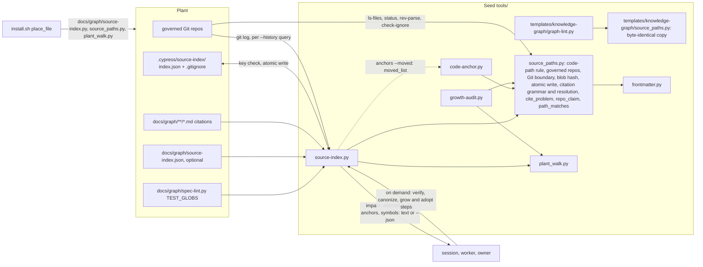

# grill.md: Plan of Record: round 8.1.0, the source index (slices 1 and 2)

## 0. Metadata
- Project: CYPRESS seed
- Feature or goal: port CodeGraph's useful mechanical derivation into the seed as one stdlib tool, `tools/source-index.py`, placed in every plant as `docs/graph/source-index.py`: a file inventory, file-to-file edges with provenance, a boundary list of what it could not resolve, and three queries (`impact`, `affected-tests`, `anchors`), with the code-path rule and the citation reading moved into one helper the existing tools share
- Date: 2026-10-07
- Owner: the steward; the orchestrating session plans, briefs and commits
- Tier: T3. Protocol: `protocol.specify-joint-pass` (spec and plan written together), then `protocol.grill`
- Current phase: implemented, awaiting owner merge and 8.1.0 release. Increments 16 to 22 landed (commits b806a35, 9026984, 0a8b539, c456299, 804fa2b, 3d80d87, 1842274, bc4dcdf, a74f267, fff5b70, 64ad578, 3413f1b, 68c970e); every §10 row green at `68c970e` (`tester-final`); SPEC-0007 `implemented`. History: slice 1 implemented (increments 1 to 13, the code-review fixes R2/G4, the slice-1 decisions R3/G5 and the second review R4/G6; the full seed gate green at `b70b0d9`). Slice 2 approved by the owner on 2026-10-07 ("slice 2 ok"), specified (`architect-slice2`), reviewed (`reviewer-slice2`), measured (measurement 2, §10), the owner's `repo:` ruling applied (option D, `architect-D`), then R7 and G8b landed (increment 20); the final review fix `review-code-4` applied at `68c970e` and signed by `tester-final`
- Related files: `tools/source-index.py` (new), `tools/source_paths.py` (new), `tools/code-anchor.py`, `tools/growth-audit.py`, `tools/plant_walk.py`, `tools/graft-audit.py`, `tools/gate-registry.py`, `install.sh`, `manifest.json`, `tests/run.sh`, `tests/test-source-index.sh` (new), `tests/test-code-anchor.sh`, `tests/test-growth-audit.sh`, `tests/test-full-install.sh`
- Related documentation: `docs/plans/grill-8.0.0-wave-a.md` (the previous plan the gate linted, and the shape this one follows); the session record of 2026-10-07, its gap reports and the review report `review-spec.md`, kept outside the seed under the seed workspace `.seed-worktrees/records-8.1.0-source-index/`
- Related ADRs: [ADR-0029](../decisions/adr-0029-source-index-is-derived-scratch.md) (proposed: the index is derived scratch); the round works under [ADR-0018](../decisions/adr-0018-code-fact-freshness-anchor.md) (the code anchor, no per-file or per-prompt staleness tool), [ADR-0021](../decisions/adr-0021-seed-only-procedures-stay-home.md) (the manifest's `tools` map equals what the installer places) and [ADR-0023](../decisions/adr-0023-a-declarative-edit-is-proved-by-a-run.md) (a declarative edit is proved by a run)
- Related specs: [SPEC-0007](../specs/SPEC-0007-source-index.md) (new, draft: every contract of this plan); [SPEC-0003](../specs/SPEC-0003-per-prompt-injection.md) (the code-anchor contracts the helper extraction must keep); [SPEC-0001](../specs/SPEC-0001-install-placement.md) (`SEED_ONLY_FILES_NEVER_PLACED`, `CODE_ANCHOR_TOOL_IS_PLACED`, the placement rules the new files follow)
- Related libraries: none (stdlib Python and Git, as the seed already uses)
- Baseline: seed `main` at `fa6eac5` (== `origin/main`), branch `experimental/source-index`

## 1. Artifact Discovery
- Existing files inspected: `tools/code-anchor.py` (`git`, `GIT_LOCATORS`, `is_code`, `NOT_CODE`, `NOISE_DIR`, `NOISE_NAME`, `content_state`, `repo_values`, `governed_repositories`, `open_anchor_dir`, `write_anchor`, `moved`, `report`); `tools/growth-audit.py` (`CITATION_RE` at 605-607, `_shape_problem`, `cite_problem` 627-669, `resolves` 672, `graph_leaf_filled`, the five `cite_problem`/`resolves` call sites, the `plant_walk` load at 157-162); `tools/plant_walk.py` (`is_foreign`, `files`); `templates/knowledge-graph/graph-lint.py` (`_task_paths` 1161, `_path_matches` 1184, `_named_paths` 1250: node file, longest `repo:` prefix with a `/`, expertise pattern, unique basename); `templates/knowledge-graph/spec-lint.py` (`TEST_GLOBS` 72-75, `test_files` 122); `install.sh` (`place_file` 389, `place_graph_scaffold` 1522-1574 with `code-anchor.py` at 1568, the `.cypress/` ignore note at 2403-2418); `tools/graft-run.py` (`copy_tree` 220, `is_machinery` 331); `tools/graft-audit.py` (`DELIVERED_TOOLS` 268-281); `tools/gate-registry.py` (the step classes, the `test-code-anchor.sh` entry); `manifest.json` (`tools` map)
- Existing docs inspected: `protocols/grill.md` (`grill.increment-shape`, `grill.press`); `templates/grill.template.md`; `templates/spec.template.md`; `templates/adr.template.md`; `core/method/delegation-cycle-economy.md` (`delegation.effort-scale`)
- Existing tests inspected: `tests/run.sh` (`ACTIVE_PLAN`, the step list); `tests/test-code-anchor.sh` (X152 to X160, X176; it copies `tools/code-anchor.py` and `frontmatter.py` into a plant's `docs/graph/`); `tests/test-growth-audit.sh` (the malformed, missing, absolute and `:999999` citation cases, the plant-walk cases); `tests/test-full-install.sh` (E6 places `code-anchor.py`, E14 runs a placed tool in a fresh plant); `tests/test-tool-help.sh` (every `__main__` tool answers `--help`); `tests/seed-lint.py` (`FRONTMATTER_COPIES`)
- Existing specs inspected: `docs/specs/SPEC-0003-per-prompt-injection.md` ("Code anchor (7.32.0)" contracts and failures); `docs/specs/SPEC-0001-install-placement.md` (`CODE_ANCHOR_TOOL_IS_PLACED`, `SEED_ONLY_FILES_NEVER_PLACED`); `docs/specs/SPEC-0007-source-index.md` (§0 to §3, as the session wrote them)
- Existing architecture signals: the seed has no source-structure model (session record, "Verified facts"); placed tools are standalone stdlib scripts that load a sibling by file path (`code-anchor.py` loads `frontmatter.py`), so a shared module is a placed sibling, not a package; `growth-audit.py` and `plant_walk.py` run from the seed and are not placed today; `.cypress/` is ignored in the seed and Vivid and tracked in this plant; graft copies `.cypress/` whole and audits none of it
- Libraries already wikified: none, no library is involved
- External sources downloaded: none kept; CodeGraph (`colbymchenry/codegraph` at `31c3328`) was read by the reference scout on 2026-10-07 and is summarized in the session record
- Constraints discovered: stdlib Python and Git only (owner, session record); `TEST_GLOBS` is an owner fact grow and graft already ask for; `tests/seed-lint.py` fails when the manifest's `tools` map differs from what `install.sh` places; `graft-audit.py` reports a placed file it cannot map as UNMAPPED unless `DELIVERED_TOOLS` names it

## 2. Shared Understanding
The owner's words (2026-10-07), verbatim:

> "ok so we need to import/implement the plan so that it's integrated organically into the cypress seed and installed/grafted into the plants correctly."

and, earlier the same day, the correction that set the direction: CodeGraph's good mechanical derivation is ported into CYPRESS as stdlib Python, not wrapped as a CodeGraph surface.

Success means: a plant answers "what depends on these files", "which tests do these files reach" and "which graph pages cite these moved files" from a derived, rebuildable index, every answer naming what it could not resolve and failing toward running more; the seed reads as if the tool had always been there (one helper holds the rules `code-anchor.py` and `growth-audit.py` already apply, and both keep their behaviour); a fresh install places the tool, and a graft rebuilds its cache.

Slice 2, the owner's words (2026-10-07), verbatim: "slice 2 ok". It ships inside 8.1.0, before the branch merges (§6, release row).

Out of scope (SPEC-0007 §2): who references a name, TS/JS class members, history across renames, a text inventory view; read deduplication and symbol excerpts (a separate spec); and, never, tree-sitter, SQLite, a daemon, MCP, CodeGraph itself, other languages, a call graph, per-prompt use, or any automatic decision.

## 3. User Goal
- Primary user: the orchestrating session that plans and verifies a change; a worker inside a brief; a plant owner at a shell
- Primary outcome: impact, affected tests and stale-fact candidates computed in a second instead of searched by hand. Sized honestly (gap report "discovery"): a CYPRESS worker rollout makes a median 22 discovery calls; file-dependency and affected-test lookups are 4 percent of searches (576 operations, under one per rollout), and about 4.5 per rollout once file inventory and symbol lookup are counted (symbols are slice 2)
- Job to be done: before a change, know its reach; after a change, know which tests to run first and which graph facts to re-check
- Acceptance criteria (link to spec §9): SPEC-0007 §9, written by `product` in the next step
- Non-goals: choosing the tests to run, the tier, or what the graph says; replacing the full gate

## 4. Operating Constraints
- Runtime constraints: stdlib Python 3.12 or newer (the gate pins 3.12 at `.github/workflows/gate.yml` line 38; the placed `graph-lint.py` needs it) and Git; bash 3.2 syntax in `install.sh`; no new dependency
- Security constraints: read-only over repositories; never import or execute repository code; writes only `.cypress/source-index/`, descriptor-relative, no symlink followed (SPEC-0007 §5)
- Privacy constraints: no plant identity in seed files, tests or fixtures; fixtures are synthetic Git repositories built by the test
- Data constraints: the cache is derived scratch (ADR-0029); the plant config `docs/graph/source-index.json` is plant-owned and never placed
- Cost constraints: the cycle rules of `delegation.effort-scale` and `delegation.waves`; batch per wave, no micro-loops (owner)
  - Plan approval (`grill.plan-approval`): the plan was approved by the owner on 2026-10-07 in its condensed form (§2 quote); levers this plan uses: none defined beyond the batch sizes of `delegation.effort-scale` (default); the gap scouts ran on `anthropic/claude-opus-5-5` by the owner's ruling of 2026-10-07
  - Owner-only prerequisites: none for increments 1 to 13; deleting the plant copy of the records and the plant branch `experimental/source-index` waits for the owner's confirmation (kernel §4), outside this plan
  - Scoped standing grant: none asked
- Latency constraints: SPEC-0007 §5 (full build within 5 s at 5,000 files; a cached query within 1 s on the seed-sized plant)
- Compliance constraints: none
- Maintenance constraints: one home per rule (the helper); the seed reads as if the feature always existed (holistic editing); tests only for real contracts, one owner per behaviour; human-facing prose passes prose-lint and the humanizer on `CHANGELOG.md` and `README.md` only

## 5. Research Summary
no external dependency — every increment uses stdlib Python (`ast`, `json`, `hashlib`, `os`, `fnmatch`) and Git, which the seed's placed tools already use; no §9 row depends on a `docs/graph/libraries/` page. The design evidence is the seed's own source (§1) and the 2026-10-07 measurements in the session record:
- Edge yield: Python imports give 2 edges in the seed and 0 in Vivid (no Python outside `docs/`); TS/JS regex with tsconfig `paths` gives 663 internal edges, 2 unresolved, in 0.15 s on Vivid. So TS/JS is in scope and Python imports alone are not enough.
- Recall against co-change (seed, 72 commits): imports only 0.007; invoke plus path literals at depth 3, 0.80; plus the whole-tree tests always run, 0.92 (22.4 of 39 tests predicted); depth 5 adds at most 0.02. Precision 0.12 to 0.28, a lower bound. So: default depth 3, cap 5; an always-run class; never "only these".
- Bare unique basenames add 0.05 recall for 6 more tests and are the least safe edge (several `graph-lint.py`, `frontmatter.py` copies), so a basename resolves only beside its holder or at the repository root.
- Markdown mentions saturate (any input reaches about 670 files and 31 tests), so they are not dependency edges; citations are a separate relation read only by `anchors`.
- Citations: 73 to 75 percent of code citations resolve exactly; 23 percent of this plant's are ambiguous basenames; 59 percent of Vivid's cite pairs come from plans, specs and decisions, so history pages are counted, not listed.
- Whole-tree tests (a `find`, `rglob` or `git ls-files` over the root) carry 53.6 percent of the co-change truth pairs, and no link rule reaches them. Directory literals added no test recall (+0.4 predicted), but for the code that does things they are real links (`install.sh` copies whole directories). So a tree walker over a non-literal root is opaque and joins every walk as `maybe`, and a directory literal is a `maybe` link to each file under it.
- CodeGraph: impact is a reverse BFS of depth 3 at nearest depth; affected tests a BFS stopping at tests behind one shared test predicate; incremental sync drifted 4.3 percent of edges from a full rebuild (ADR-0029).

## 6. Decisions Made
| Decision | Rationale | Evidence | Reversibility | ADR | Date |
|---|---|---|---|---|---|
| Tier T3 | a new placed tool, a shared module two tools move onto, the installer, the manifest and the graft audit | kernel §0 | not applicable | none | 2026-10-07 |
| Design latitude: balanced | new structure only where the change needs it: one shared helper module and one derived cache; no concept the plan did not name | the owner, 2026-10-07: "implement the plan so that it's integrated organically into the cypress seed and installed/grafted into the plants correctly." | reversible | none | 2026-10-07 |
| (superseded below: "unchanged in behaviour" holds for messages and verdicts, and SPEC-0007 §6 "Helper" names the four interface changes) One helper, `tools/source_paths.py`, is the one home of what counts as source and how a path is named: the code-path rule, governed repositories, the Git boundary, blob hashing, the atomic write under `.cypress/`, the citation grammar and `cite_problem`; `code-anchor.py` and `growth-audit.py` move onto it unchanged in behaviour | the owner's shared-helper ruling ("organic integration"); three consumers exist once the tool lands, so the module is earned by present variation | owner approval 2026-10-07; `tools/code-anchor.py`, `tools/growth-audit.py` 597-675 | reversible | none | 2026-10-07 |
| (superseded below, the same helper-interface row) The Git boundary, content hash and atomic write move into the helper with the code-path rule, beyond the plan's "code-path rule and cited-path reading" | the tool needs the same Git call discipline and the same safe write; a second copy would be a second home for a security rule | `tools/code-anchor.py` `git`, `content_state`, `write_anchor` | reversible | none | 2026-10-07 |
| (superseded below by the owner-accepted row of 2026-10-07) `graph-lint.py` keeps its own tier-2 path rule this slice; the anchors' `repo:` claim mirrors it | the engines are placed add-if-missing and reconciled by `graft-graph-engine.py`; giving them a new sibling import is an engine-placement change the plan did not name | `install.sh` 1533; `graph-lint.py` `_named_paths` | reversible | none | 2026-10-07 |
| The helper and `plant_walk.py` are placed beside the tool in `docs/graph/` | placed tools load siblings by file path; `code-anchor.py` in a plant needs the helper, `source-index.py` needs both | `install.sh` 1532, 1568; `tools/code-anchor.py` 53-56 | reversible | none | 2026-10-07 |
| (superseded below: the key `full_suite_triggers` is renamed `global_inputs`, and `exclude` changes the test class only) Test config (owner ruling: plant-declared test roots with a seed default): the test roots are the plant's `TEST_GLOBS` in `docs/graph/spec-lint.py`, read, never copied; `docs/graph/source-index.json` adds only `exclude`, `always_run` and `full_suite_triggers`, each key replacing the seed default the tool holds | `TEST_GLOBS` is already the owner fact for where tests are, asked at grow and kept by graft; a second test-root list would be a second home that drifts | `spec-lint.py` 65-75; `graft-graph-engine.py` 55 | reversible | none | 2026-10-07 |
| (superseded below: a refused config makes every query `incomplete`) The plant config is plant-owned and never placed; a refused config sets `full_suite` | the installer must not overwrite a plant's declaration; a refused `always_run` would otherwise drop tests silently | SPEC-0007 §7 `PLANT_CONFIG_REFUSED` | reversible | none | 2026-10-07 |
| (superseded below by the owner's one-walk ruling of 2026-10-07) A reference the index cannot pin is walked as `uncertain` instead of setting `full_suite`: an opaque file (non-literal dynamic reference, unparsable file, unavailable tsconfig) joins every walk; an ambiguous module links to each candidate; an opaque test is always-run. `full_suite` is reserved for answers the walk cannot give (a trigger, an unknown input, no test declaration, a refused config, no index) | the plan's "full_suite on an unresolved edge on a reached path" made precise: an unresolved outgoing reference of a reached file hides no dependent, and an incoming one may point anywhere, so a literal rule either never fires or fires on every query | SPEC-0007 §4 `AFFECTED_UNPINNED_EDGE_IS_WALKED_UNCERTAIN`; seed `install.sh` holds no variable-only invocation (counted 2026-10-07) | reversible | none | 2026-10-07 |
| A path literal resolves beside its holder, then by `/`-suffix; a bare basename elsewhere is not an edge | suffix resolution is what lifted recall to 0.80; unique-basename edges are the least safe | §5 | reversible | none | 2026-10-07 |
| Type-only TS imports and `vi.mock` specifiers are ordinary edges, unlabelled | both name a module a test depends on; a label no consumer reads is a concept the plan did not name | gap report "languages" §5 | reversible | none | 2026-10-07 |
| (superseded below: link kinds `certain` and `maybe`, with how-found per link) Provenance values are §3's four words: `exact`, `resolved`, `derived` (every path literal), `uncertain` (query time only) | product's §3 vocabulary; CodeGraph's lesson is a label, not a score | SPEC-0007 §3, §6 | reversible | none | 2026-10-07 |
| The cache is derived scratch: `.cypress/source-index/` with a self-written `.gitignore` of `*`, keyed on schema, tool digest, config digest and each repository's HEAD and dirty digest; full rebuild on mismatch; never committed; graft carries no rule for it | ADR-0029 | ADR-0029 | reversible | [ADR-0029](../decisions/adr-0029-source-index-is-derived-scratch.md) | 2026-10-07 |
| Anchors read citations live on each query; history pages (`plans/`, `specs/`, `decisions/`) are counted, listed only with `--all` | node edits are not code, so caching them would widen the key; 59 percent of Vivid's cite pairs are history | §5 | reversible | none | 2026-10-07 |
| Placement tests live in their owner suite, `tests/test-full-install.sh` (beside E6 and E14); every other SPEC-0007 case lives in one new file, `tests/test-source-index.sh` | one strong owner per behaviour; the plan's one test file for the tool's contracts | `tests/test-full-install.sh` E6, E14 | reversible | none | 2026-10-07 |
| (superseded below: the owner approved slice 2 on 2026-10-07, added to SPEC-0007 by slice) SPEC-0007 is planned in one slice; slice 2 (symbols, history, wiring) is a later spec revision | the owner's plan; slice 1 must be measured first | session record "Owner approval" | reversible | none | 2026-10-07 |
| Owner ruling: one walk, three link kinds, for `impact`, `affected-tests` and `anchors`. A row is `certain`, or `maybe` with the reason and line of its weakest link; what the tool cannot answer is `incomplete` with a reason and one action per query (`impact` "check by hand", `affected-tests` "run the full suite", `anchors` "review by hand"); `affected-tests` is the walk filtered by test class plus the always-run set. Supersedes the `uncertain`, provenance and `full_suite` rows above; the second walk and its test pass-through rule are gone | one concept had four signals (`full_suite`, `unavailable`, `unknown_inputs`, `truncated`) and two walks; the tool serves the project's code, not only its tests | the owner, 2026-10-07: "but i accept the three-kind rule" and "this change does not only apply to tests but also information regarding the actual repo/project code"; review B1, M11 | reversible | none | 2026-10-07 |
| Owner ruling: the helper `tools/source_paths.py` takes code-anchor's Git boundary, blob hash and atomic write with the code-path rule, and holds the one citation-resolution function whose strict plant-relative mode is `cite_problem` | one home per security rule and per resolution rule | the owner, 2026-10-07: "3 accept"; review M7 | reversible | none | 2026-10-07 |
| Owner ruling: the test roots are `TEST_GLOBS` from `docs/graph/spec-lint.py`; the optional `docs/graph/source-index.json` holds `exclude`, `always_run` and `global_inputs`. The key `full_suite_triggers` is renamed `global_inputs`: a change to such a file may affect every file, so every query is `incomplete` with reason `global-input` | the trigger list is a code fact (a tsconfig edit moves every alias), not a test rule | the owner, 2026-10-07: "2 yes ok accept"; the rename was the session's proposal, the owner answered "proceed"; review M3 | reversible | none | 2026-10-07 |
| (superseded below by the slice-2 helper row of 2026-10-07) Owner ruling: `graph-lint.py` keeps its own tier-2 path rule this slice, recorded as accepted debt; the anchors' resolution lives in the helper, and graph-lint's copy is the debt §12 question 2 pins | an engine-placement change the plan did not name | the owner, 2026-10-07: "4 yes"; review M7 | reversible | none | 2026-10-07 |
| Inputs and walk rules after review: `exclude` changes the test class only (an excluded file keeps its links); a `not-code` input is answered, never incomplete; a deleted input that a stored reference names is walked; a repository-relative input resolves under each governed root; a target in another governed repository is a `certain` link; directory literals, tree walkers and workspace package names are `maybe`; a `TEST_GLOBS` matching nothing is `incomplete`; a depth-cap cut is `incomplete` | each closes a silent drop the review found; all follow from the one-walk ruling | review M1, M2, M4, M5, M6, M8, m12 | reversible | none | 2026-10-07 |
| The helper extraction carries no SPEC-0007 contract: increments 1 and 2 are gated by the existing code-anchor and growth-audit suites, and SPEC-0007 is promoted to `active` after spawn R1 (increments 3 to 7) lands | spec-lint reads run-proved contracts only from `plans/grill.md`, so run-proved slugs here would count UNCOVERED; SPEC-0003 and the growth-audit suite already own that behaviour; all SPEC-0007 contracts go live at once | review B2, m19; `spec-lint.py` `run_proved` | reversible | none | 2026-10-07 |
| Deliberately unreadable fixture files stay opaque and join every walk as `maybe` rows; the noise is accepted this slice | a data class would be a concept the plan did not name; each such row names its reason and holder | review m21 | reversible | none | 2026-10-07 |
| Session ruling on devils-advocate (c), the owner told and not objecting, keeping the three-kind rule: the floor, the `maybe` rows every input reaches (the opaque holders and the files reached only through them), is computed by a second part of the one walk that starts at the opaque holders, and listed once, apart, after the input's `certain` rows and then its `maybe` rows; nothing is dropped, only presented | on the seed the floor was about 48 rows and 32 of 50 link-bearing tests for every input, about 95 percent of each answer, and sorting by depth interleaved it with the real rows, so `TEXT_MAX_ROWS` could cut them | devils-advocate report (c), a throwaway approximation of SPEC-0007 §6 over the seed, 2026-10-07 | reversible | none | 2026-10-07 |
| `no-code-edge` takes only test-class files of a link-bearing language (Python, shell, TS/JS) holding no link to code and no opaque record; a fixture in `json` or `other` is always-run only when declared | `TEST_GLOBS` names where test evidence lives, fixtures included: under this plant's globs 183 seed files are test class and 121 are Markdown fixtures, about 130 of which the old rule listed as always-run on every query | devils-advocate report (c), (d) | reversible | none | 2026-10-07 |
| The helper move changes code-anchor's interface in four named places, never a message or verdict: `git` takes stdin and the exit codes that are answers; `content_state` opens with `O_NOFOLLOW` and `O_NONBLOCK`, checks `fstat` before it reads and hashes in a stream (same hashes, one hashing path); the directory opener and atomic write take the root, directory parts, target name, temp prefix and refusal name; no function reads a module-global root; the predicate `relative` moves unchanged and the tool's input normalizer is a separate `plant_relative`. Supersedes the two "unchanged in behaviour" rows above | the claim "moved unchanged" was overstated against `tools/code-anchor.py` (`git` stdin `DEVNULL` and raise on any non-zero exit; `content_state` `lstat` then `read_bytes`; `write_anchor` hard-coded names; `ROOT = Path.cwd()`); `relative` there is a bool predicate, so one name would have carried two meanings | devils-advocate report (a); `tools/code-anchor.py` 103, 124-140, 189-208, 254-258, 330-360 | reversible | none | 2026-10-07 |
| The placed names `source-index.py`, `source_paths.py` and `plant_walk.py` are fixed now | `place_file` never deletes, so a later rename leaves orphans in every plant that no sweep removes | devils-advocate report (a); `install.sh` `place_file` | expensive | none | 2026-10-07 |
| The cache key holds the running Python's major.minor; the seed's Python floor is 3.12 | `ast` parses by the running grammar: the seed's `graph-lint.py` does not parse on 3.11 (line 341), so a cache read by another interpreter under an equal key would answer what neither rebuild would; SPEC-0007 §5 had mis-cited a 3.10 floor | devils-advocate report (b); `.github/workflows/gate.yml` 38; `templates/knowledge-graph/graph-lint.py` 341 | reversible | [ADR-0029](../decisions/adr-0029-source-index-is-derived-scratch.md) | 2026-10-07 |
| TS/JS extraction joins a line ending in an open `import(`, `require(` or `vi.mock(` with at most `JOIN_MAX` (3) following non-blank lines; a parser stays out | 7 of 1,980 Vivid specifiers (0.35 percent, 4 test files) sit on the line after `import(`; one-line reading made each holder a false `dynamic-nonliteral` floor row; the join stays linear | devils-advocate report (e), the TypeScript 5 `preProcessFile` scan of Vivid | reversible | none | 2026-10-07 |
| Owner ruling: a Python load by file path is a `certain` `import` link found `exact`, an arm of `LINK_PYTHON_IMPORT_CERTAIN`: `spec_from_file_location` or `run_path` over a path anchored at `__file__` (`Path(__file__)`, optional `.resolve()`/`.absolute()`, one or more `.parent`, `/` literals; or `os.path.join` over nested `os.path.dirname` of `__file__`), resolved with no probing; a missing target is `relative-no-file`; an anchored path no load call takes, or one held in a variable, stays a `path-literal`. Closes §12 question 5 | the seed's main Python dependency is such a load (`frontmatter.py`, `plant_walk.py`, `graft-audit.py` each have no `certain` dependent otherwise); the anchored form names one file whatever the working directory, so the link is as sure as a relative import; the link is a module load, so the import contract is its one owner | the owner, 2026-10-07, accepting the session's recommendation (b) on question 5 under "go implement"; `tools/code-anchor.py` 54-55, `tools/corpus-match.py` 53-54, `tools/graft-audit.py` 168-169, `tools/graft-ledger.py` 78-79 | reversible | none | 2026-10-07 |
| Path joins are path literals written in pieces: a Python `/` chain or `os.path.join`, a shell or TS/JS `path.join(`, `path.resolve(` or `os.path.join(`, and a shell run of `/` words (the here-document form), read as one string whose non-literal segments are variables, resolved by the path-literal order: a `maybe` `path-literal` or `directory` link, or nothing; a `__file__`/`__dirname` base is a variable lead and such a join stays `maybe` outside a load call; a variable after a named segment reads the segments before it as a directory literal; a shell word joining quoted and unquoted parts is one string (D1, D2) | 18 seed holder-target pairs and the hook-finding TS extensions were neither link nor record, so answers read complete without them (`test-code-anchor.sh` dropped silently); one rule with the shell string rule, no new `found` value; the brief's proposal, a non-literal middle segment as `opaque`, is replaced by the directory reading the shell rule already implies, because the literal prefix pins the directory and opaque holders join every answer's floor | §10 measurement D1, D2; `tests/test-code-anchor.sh` 29-31; `integrations/prime-agent/route-extension.ts` 40-42 | reversible | none | 2026-10-07 |
| A TS/JS specifier that no rule resolves or records (not relative, not `/`-led, no npm name, not scheme-led, matched by no alias, `baseUrl` or workspace package: `~/x`, `#internal`) makes its holder `opaque` with the new reason `unmapped-specifier`; a scheme-led specifier (`bun:test`, `virtual:x`) is external like `node:` (R1) | an `unresolved` record enters a walk only through its `base`, and such a specifier has none, so as a record it would still be a silent drop; it may name any file through a config the tool does not read, which is what `opaque` means | review residual R1; SPEC-0007 §6 "Walk" (`named` steps) | reversible | none | 2026-10-07 |
| The floor part of the walk has no depth bound; `depth-cap` comes from the input part alone, a file it reaches at `--depth` with a dependent neither part lists (D4) | `--depth` bounds the distance from an input, and the floor is the index's; on the llama.cpp clone the floor's cut made every answer `incomplete` ("run the full suite" whatever the input); walking it whole is one linear pass and cuts nothing. A capped floor with a "truncated" marker was rejected: it is a fourth signal beside `certain`, `maybe` and `incomplete`, which the one-walk ruling removed | §10 measurement D4; the one-walk ruling above | reversible | none | 2026-10-07 |
| Commands in host settings files (`.claude/settings.json` hook entries) are not read this slice (D3) | `json` is a link target only; one parser per host settings shape is a concept the plan did not name; stated in SPEC-0007 §2 so no reader takes the hook script's empty dependents as proof | §10 measurement D3 | reversible | none | 2026-10-07 |
| Release and sequencing: the seed branch `experimental/source-index` is not merged until every open owner decision is settled and implemented; the version is 8.1.0 and slice 2 ships inside 8.1.0, after slice 1's open decisions; no graft into any plant now | the owner sequences the release | owner, 2026-10-07: "1 not until everything i have to decide is settled and impkemented ... 3 8.1.0, dont' graft ... 7 after we did the abovve. slice 2 is still 8.1" | reversible | none | 2026-10-07 |
| Owner: slice 2 approved: (a) a definition index, (b) Git co-change history as an optional link source, (c) the on-demand wiring of verify, canonize and grow, (d) `anchors --moved`, (e) graph-lint's tier-2 path rule on the helper; it ships inside 8.1.0 and adds no graft | the plan's slice 2, after slice 1 was measured (§10) | the owner, 2026-10-07: "slice 2 ok" | reversible | none | 2026-10-07 |
| Design latitude for slice 2: balanced, as slice 1. New structure only where the slice needs it: one record (`symbol`), one opt-in answer list (`history`), one function in `code-anchor.py`, two string functions in the helper and its seed copy beside `graph-lint.py`; no other concept | the slice-1 latitude row; the owner's slice-2 approval names the five items and nothing more | SPEC-0007 §0; the owner, 2026-10-07 | reversible | none | 2026-10-07 |
| The definition query is `symbols <name>...`. Definitions are read at build from the parse the links already make and cached (`INDEX_SCHEMA` `/2`); a Python definition read by `ast` is `certain`; shell functions and TS/JS declarations, exported or not, read a line at a time after comments are blanked, are `maybe` (reason `line-reading`); every definition of a name is listed and ambiguity is no `incomplete`; a link-bearing file with an `unreadable` record makes the answer `incomplete` (`unreadable-file`). The plan named "TS/JS exports"; shell functions and non-exported TS/JS declarations are read too, because an empty answer for a name a file defines would be a silent drop under the three-kind rule | the largest index-answerable class of worker searches is inventory plus identifier lookup (up to 47 percent of searches); the seed defines 53 shell functions in `install.sh` (`place_file`, a named search target) and its TypeScript functions are not exported (`integrations/prime-agent/route-extension.ts` 38-67); a line reading can mistake a declaration inside a string, so it is never `certain` | gap report "discovery" (classes B, C; targets `place_file`, `def parse_frontmatter`, `^[a-z_]*() *{`); the 2026-10-07 seed scan: 1,975 names, 2,257 definitions, no `unreadable` record | reversible | none | 2026-10-07 |
| History: the flag is `--history` on `impact` and `affected-tests`; it is read per query from `git log --no-merges -n 500` (`HISTORY_COMMITS`) and never cached; a commit changing more than 40 inventory files (`HISTORY_MAX_FILES`) is not read; each row is `maybe`, kind and found `history`, with `together: {count, of}`; rows are listed apart in `history`, hold only files no other list holds, and are never walked; shallow or missing history is `incomplete` | the strongest single mechanical signal measured (history alone 0.85 recall, with path literals 0.97); "only adds" keeps every other list byte-equal, which a test can hold; live reading follows the anchors citations (ADR-0029: derived, nothing cached that a query can read cheaply); 40 sits above the seed's p90 commit (29 files) and below its bulk commits (185 to 396) | gap report "cochange" (H, H + C); the 2026-10-07 seed history: 169 non-merge commits, median 5 and p90 29 inventory files per commit | reversible | [ADR-0029](../decisions/adr-0029-source-index-is-derived-scratch.md) | 2026-10-07 |
| `anchors --moved` reads code-anchor's moved list through one function, `moved_list(root)`, that `code-anchor.py` gains and its `--compare` calls (its output unchanged); the tool loads `code-anchor.py` from beside itself by file path; each repository-relative path is joined to its repository, so the answer equals `anchors <those paths>`; no anchor, or an unverified repository, is `incomplete` (`moved-unavailable`, `moved-unverified`). Closes §12 question 3 | one home for "what moved"; parsing `--compare` text would read a budgeted view whose paths are joined by ", "; a `--json` on code-anchor would add a SPEC-0003 surface for one consumer | `tools/code-anchor.py` `moved`, `report`, `compare` (252-331) | reversible | none | 2026-10-07 |
| (qualified below by the owner's `repo:` ruling of 2026-10-07: `repo_kind` joins the helper, `repo_claim` takes the kind, and graph-lint's verdicts are unchanged on the seed's suites, changed in plants that hold a folder or file value without `/`, at their next graft) Graph-lint's tier-2 path rule moves onto the helper as `repo_claim(value, path)` and `path_matches(path, pattern)`, each graph-lint's code unchanged; graph-lint loads the helper from beside itself; the seed holds `templates/knowledge-graph/source_paths.py` byte-identical to `tools/source_paths.py`, checked by `tests/seed-lint.py` as the frontmatter copies are; graph-lint's messages and verdicts stay, proved by its suites with no assertion edited. `anchors` and the tool's config patterns call the same two functions. Closes §12 question 2; supersedes the slice-1 accepted-debt row | one home per resolution rule (the owner's helper ruling); in plants both files already sit in `docs/graph/`, `source_paths.py` placed on every install and graft | `templates/knowledge-graph/graph-lint.py` `_path_matches` 1184, `_named_paths` 1250-1257; `tools/source-index.py` `config_matches` 304; `tests/seed-lint.py` `FRONTMATTER_COPIES` 748 | reversible | none | 2026-10-07 |
| (superseded below by the owner's `repo:` ruling of 2026-10-07, option D: `repo: src/` and `repo: src` over a folder claim in both tools) Intended revision of a signed slice-1 contract: `anchors` takes graph-lint's `repo:` reading, so `repo: src/` (and an unnormalized value such as `./src/lib`) no longer claims; `ANCHORS_NAME_CITING_PAGES_OR_UNCITED` loses its `repo-prefix` arm, which moves to `REPO_CLAIM_READ_ALIKE_BY_ROUTER_AND_ANCHORS`, and the X445 arm is edited once, recorded in SPEC-0007 §12 as the slice-1 m6 change was | the two readings differed only on a single-segment value with a trailing `/`; graph-lint's verdicts must not change, and a root claim read as a prefix made every file of a nested repository a `maybe` fact of `repo: Cypress/` | SPEC-0007 §4, §6 "Helper", §12; this plant's `repo:` values (5 `Cypress`, 1 `Cypress/templates/`) | reversible | none | 2026-10-07 |
| The protocol wiring is prose in the protocol and skill nodes, proved by seed-lint, prose-lint and the protocol text, never a tool contract: verify takes `affected-tests` as the recommended floor of its focused gates and an `incomplete` answer as the "affected scope genuinely uncertain" row; canonize runs `anchors --moved` while assembling candidates, before the code anchor is recorded again; grow and adopt-existing give scouts `build --json`'s inventory as their file list; each runs once when its step needs it, never per prompt | the tool recommends and the protocol rules decide (owner rule); ADR-0018 withdrew per-prompt staleness tools | `protocols/verify.md` "Risk-proportional gate depth"; `protocols/canonize.md` flow steps 1 and 3; `protocols/grow.md` Phase 1; `skills/adopt-existing/SKILL.md` "Scout pass", "Refreshing an existing graph" | reversible | [ADR-0018](../decisions/adr-0018-code-fact-freshness-anchor.md) | 2026-10-07 |
| (refines the `symbols` row above for TS/JS) A TS/JS declaration counts when its line begins at column 0, or after indentation with `export`; an indented declaration without `export` defines nothing; shell functions keep any indentation | 7,258 of Vivid's 10,133 line-read declarations (72 percent) were indented `const`/`let`/`var`, function locals (`symbols res` 273 rows); the Python reader leaves locals out, so one question had two rules; shell functions inside here-documents are about 2 percent of the seed's | devils-advocate slice-2 report (b); SPEC-0007 §6 "Definitions" | reversible | none | 2026-10-07 |
| (qualifies the history row above) History stays opt-in with its guards, but its 0.85 and 0.97 recall figures are circular: the co-change truth set is "tests edited in the same commit", which history predicts by construction. Increment 22 scores history against another truth (a RED commit's tests paired with the next GREEN commit's sources, a cross-commit window) or reports it as unvalidated, and records a removal criterion before release: history adds no recall on small commits under that window | test-first puts RED and GREEN in separate commits (the seed's `tools/source-index.py`: 5 commits, no test co-changed), so the in-commit figure says nothing about this seed | devils-advocate slice-2 report (a) | reversible | none | 2026-10-07 |
| `graph-lint.py` loads the helper lazily, once per run, the first time tier 2 reads a task path; a helper that is absent, fails to load or lacks `repo_claim` or `path_matches` raises `HelperUnavailable` inside tier 2, which the router's existing catch turns into the `inference_skipped` notice while the route goes on to the next tier; no second copy of the rule and no new notice code; `sys.dont_write_bytecode` is set before both loads | `graph-lint.py` is `place_if_missing` (`install.sh` 1533) and `source_paths.py` `place_file` (1571), so a plain re-install can pair a newer helper with an older engine; an eager load would fail every routed prompt, and the route hook drops a failed router silently (`route-hook.py` 262); the notice reaches the session as a `!` line; a second copy of the rule for the fallback would be a second home | devils-advocate slice-2 report (d); security S7; `graph-lint.py` 1393-1402 (the existing tier-2 catch) | reversible | none | 2026-10-07 |
| (M2-1) The build's peak RSS is cut, not the budget restated: the cache is written compact (sorted, separators `,` and `:`, no indent) and `build` keeps no parsed cache while it derives; the 64 MB budget of SPEC-0007 §5 stands | the extract itself peaks at 42 MB on both 3.11 and 3.14; the excess is the `indent` writer (pure-Python encoder on 3.11 and older) and the old cache held across a forced derive, neither of which carries information; the index is derived scratch (ADR-0029), so its layout is free | `architect-slice2-m2` on the M2 llama.cpp clone (4,320 files): cold build 59 MB (3.14) and 81 MB (3.11), forced `build` over a usable cache 72 MB and 93 MB; the extract plus a compact dump 44 MB and 45 MB; `tools/source-index.py` `load_index`, `write_cache` | reversible | [ADR-0029](../decisions/adr-0029-source-index-is-derived-scratch.md) | 2026-10-07 |
| (M2-3) `symbols` states its scope instead of reading other trees: the answer key `not_read` (the helper's `NOT_CODE`) and `UNDEFINED_LINE` ("not read: docs/graph/, .cypress/, which are not code"); no file there is read and no `incomplete` record is added | the code-path rule has one home and makes `docs/graph/` not code; reading the placed tools would be a second inventory; an `incomplete` record on every undefined name would mark 39 to 57 percent of answers (names absent from the tree) incomplete for one 1.4 percent class | measurement 2 §2: 32 Vivid names (3.8 percent) defined only under `docs/graph/`; SPEC-0007 §4 `SYMBOLS_PYTHON_DEFINITIONS_CERTAIN`, §6 "Definitions" | reversible | none | 2026-10-07 |
| (review `reviewer-slice2`, rulings) Loop, `with`/`except ... as` and `:=` targets and augmented assignments are not definitions, stated in SPEC-0007 §6 (M2-6 is stated scope, not a gap); the X447 `symbols` newline arms stand as written | temporaries and rebindings are not the names a worker looks up; the AugAssign's first binding is already read; the argv arm is the real `fullmatch` arm and the stdin arm proves stdin names meet the same refusal | review-code-3 rulings 1 and 2; measurement 2 §2 "outside §6" classes | reversible | none | 2026-10-07 |
| Owner ruling, option D (internal brainstorm `architect-brainstorm`, decisions 1 to 4): (1) what a `repo:` value names on disk decides whether it claims paths: a directory holding `.git` or the plant root claims nothing, a regular file or a non-empty folder claims, slash or not, a value outside the plant claims nothing, and a value that names nothing is read as before (slash-less claims nothing, else a string prefix); one helper function `repo_kind(plant, value)` stats and decides the kind on the value as written, `repo_claim(name, path, kind)` stays a string function, matching case stays the caller's (the router folds, `anchors` does not), and `governed_repositories` is built on `repo_kind` with the same set; (2) graph-lint's tier-2 routing changes in plants that hold a folder or file value without `/` (llama-xtx 7 nodes, wrt-migration 3) at their next graft, the seed's suites unchanged; (3) `anchors` reports each value naming nothing on disk as `incomplete` (`repo-unresolved`) in every answer; (4) the template comment reads "one plant-relative path: a repository, a folder or a file", a `paths:` list (option E) deferred to a later round. Closes §12 question 6; supersedes the X445 revision row and qualifies the helper row above | the spelling rule (no `/` after the cut is a repository) fails on folder and file values the template allows: llama-xtx holds six slash-less folders and one slash-less file, wrt-migration two slash-less folders, so those nodes never load by path; `governed_repositories` already decides "is a repository" by disk, so one test of it now has one home; A, B and F lose to those values, C keeps two readings by design, E needs D underneath | the owner, 2026-10-07: "yes all" (decisions 1 to 4); the brainstorm's survey of every plant's `repo:` values (the seed's `frontmatter.py`, then a stat of each value); `templates/knowledge-graph/graph-lint.py` `_named_paths` 1250-1257; `tools/source_paths.py` `governed_repositories` 208-222; SPEC-0002 `GRAPH_ROUTE_NAMED_PATH_LOADS_ITS_OWNER` | reversible | none | 2026-10-07 |

## 7. Options Considered
| Option | Benefits | Costs | Risks | Outcome |
|---|---|---|---|---|
| Wrap CodeGraph as an optional provider | 23 node kinds, call edges, an MCP tool | TypeScript, Rust, SQLite and tree-sitter in a stdlib seed | a dependency the seed cannot carry into plants | Rejected by the owner (port, not surface) |
| Python imports only | `ast` is exact | 0 edges on Vivid, 2 in the seed | a tool with nothing to say | Rejected (§5) |
| Markdown mentions as dependency edges | the seed is 91 percent Markdown | every input reaches about 670 files | saturated, useless answers | Rejected (§5); citations are a separate `anchors` relation |
| Bare unique basename edges anywhere | +0.05 recall | +6 tests per query; ambiguous copies | wrong edges between copies | Rejected; only beside the holder or at the root |
| Test roots in the new config | one file for the tool | a second home beside `TEST_GLOBS` | the two lists drift | Rejected (§6) |
| Set `full_suite` on every unresolved reference near the walk | simple to state | fires on almost every query, or never | a flag nobody trusts | Rejected (§6); replaced by the owner's one-walk ruling of 2026-10-07 (`certain`, `maybe`, `incomplete`) |
| Refactor `graph-lint.py` onto the helper now | one copy of the `repo:` rule | an engine-placement change, graft-graph-engine reconciliation | a broken engine on graft | Deferred (§12 question 2) |
| Move `growth-audit.py`'s citation code only, leave `code-anchor.py` alone | smaller diff | the tool would copy the code-path rule and the Git boundary | two homes of a security rule | Rejected (holistic editing) |
| Incremental cache update; committed cache; SQLite; install-time cache deletion | speed; reviewability | drift, churn, a ruled-out store, a pointless deletion | stale answers | Rejected (ADR-0029) |
| A second walk for `affected-tests` that stops at tests, with a pass-through rule | CodeGraph's shape | two walks, one extra rule and contract | tests lost behind a test that is also a tool (`tests/legal-lint.py`) | Rejected (§6 one-walk ruling) |
| `exclude` removes files from the inventory | a smaller index | real dependents vanish from `impact` (Vivid's `tests/experimental/**` imports `src/`) | a missing link shown as no dependency | Rejected (§6, review M4) |
| Directory references and tree walkers are not links | the co-change study found no test recall in them | code that copies or walks a tree loses its dependents | silent drops for the code that does things | Rejected (§6, review M5) |
| Per-prompt or hook use of the queries | answers without asking | ADR-0018 withdrew per-file and per-prompt staleness tools | context cost every prompt | Rejected (SPEC-0007 §2) |
| Slice 2: definitions of TS/JS exports only, as the plan worded it | the narrowest reading | a name a shell file or a non-exported TS/JS declaration defines answers empty | a silent drop the three-kind rule forbids | Rejected (§6): shell functions and every TS/JS declaration, each `maybe` |
| Slice 2: history rows mixed into `dependents` and `tests` | one list | a history row could move a file out of `floor` or `always_run`, or sit beside its code row | "never removes a row" no longer testable as list equality | Rejected (§6): the apart `history` list, files no other list holds |
| Slice 2: history as a walk step, or cached in the index | wider reach; no `git log` per query | noise compounds along a chain; a cache shape for an opt-in source | a weak signal read as a chain | Rejected (§6); read live, one step |
| Slice 2: `anchors --moved` parses `code-anchor.py --compare` text, or code-anchor gains `--json` | no code-anchor change; a stable format | the text is budgeted and joins paths with ", "; a new SPEC-0003 surface for one consumer | a path with ", " misread; two shapes of one list | Rejected (§6): one function, `moved_list`, both call |
| Slice 2: `graph-lint.py` keeps its own `repo:` and pattern rules | no engine change | two homes of one rule, which already disagree on `repo: src/` | the router and `anchors` disagree on which node a path belongs to | Rejected (§6): the helper's two functions, graph-lint's verdicts kept |
| Slice 2: a text inventory view (`build --list`) for scouts | a ready list in a shell | a new output contract for what `build --json` already carries | none beyond a new surface | Deferred (SPEC-0007 §2 out of scope) |
| `repo:` read by its spelling: (A) no `/` after the cut is a repository, in both tools; (B) slice 1's two spellings; (C) the spelling in the router, a `maybe` `repo-folder` row decided by `.git` in `anchors`; (F) a lint-enforced spelling, `x/` a folder and `x` a repository; or (E) a separate `paths:` list | a pure string rule, no stat per prompt (A, B, C, F); multi-path nodes (E) | folder and file values without `/` claim nothing (A, B, C in the router); two readings of one value (B, C); a root file such as `CMakeLists.txt` has no spelling (F); a frontmatter contract change and a migration, with D still needed for legacy values (E) | nodes that never load by path in llama-xtx and wrt-migration | Rejected by the owner's ruling, option D (§6, 2026-10-07); E deferred to a later round |

## 8. Architecture Plan
- System boundary: one placed CLI over the plant's governed Git repositories and its `docs/graph/` pages; no network, no model, no hook

- Main components: the helper (the one home of the shared rules, citation resolution and, from slice 2, the `repo:` claim and path-pattern rules graph-lint calls too); the indexer (inventory, link extraction per language, resolution, opaque and unresolved records, and from slice 2 the definitions); the cache (key, read, rebuild, write); one reverse walk over the links at nearest depth with weakest-link chains, in two parts (the input rows, and the floor reached from the opaque holders, listed apart), filtered per query (`impact` all rows, `affected-tests` the test class plus always-run); the citation join for `anchors`, over named paths or code-anchor's moved list; slice 2's `symbols` lookup over the cached definitions and the opt-in history reader (one `git log` per repository holding an input, its rows listed apart)
- Interfaces: the CLI and the answer document of SPEC-0007 §6; the helper's functions as module attributes, loaded by file path like `frontmatter.py`
- Data flow: Git lists files, the helper filters them by the code-path rule and `plant_walk.is_foreign`, the indexer reads each file once and resolves references against the inventory, the cache stores the sorted result, a query walks it
- Error handling: every doubt resolves toward checking more: an unpinned reference makes its holder opaque or its links `maybe`, and what the walk cannot answer makes the answer `incomplete` with a reason and the query's action; every query exits 0 (SPEC-0007 §6 "Incomplete", §7)
- Observability: the cache status line on every answer; the boundary list; `--json` for machines
- Security posture: SPEC-0007 §5 Security; the cache is untrusted input
- Deployment model: new plants at install; existing plants at their next graft, which runs the installer in the copy
- Environment parity: not applicable — no deploy chain

## 9. Implementation Plan

Increments are inline; numbers are dependency order. Two lanes run in parallel at the start because their files are disjoint: lane Helper (1, 2) and lane Tool RED (3 to 7). The GREEN increments of the tool follow both.

| Spawn | Increments | Worker | Batch rule (`delegation.effort-scale`) |
|---|---|---|---|
| R0 | 1 | `tester` | RED medium-low |
| G0 | 2 | `implementer` | GREEN medium-hard: one or two |
| R1 | 3, 4, 5, 6, 7 | `tester` | RED medium-hard: five |
| G1 | 8, 9 | `implementer` | GREEN medium-hard: two |
| G2 | 10, 11 | `implementer` | GREEN medium-hard: two |
| G3 | 12 | `implementer` | GREEN medium-low |
| P1 | 13 | one writer | prose, one file set |
| R2 | review fixes (8, 9, 10) | `tester` | RED medium-hard: one spawn, the whole fix list |
| G4 | review fixes (8, 9, 10) | `implementer` | GREEN medium-hard: one spawn, the whole fix list |
| R3 | final decisions D1, D2, D4, R1 and the G4 fixes m2, m3, m4 (9, 10, 8) | `tester` | RED medium-hard: one spawn, every arm |
| G5 | final decisions D1, D2, D4, R1 (9, 10) | `implementer` | GREEN medium-hard: one spawn, the whole list |
| R5 | 14, 15, 16 (slice 2) | `tester` | RED medium: three |
| G7 | 17, 18 (slice 2) | `implementer` | GREEN medium-hard: two |
| G8 | 19, 20 (slice 2) | `implementer` | GREEN medium-hard: two |
| P2 | 21 (slice 2) | one writer | prose, one file set |
| M2 | 22 (slice 2) | one measuring worker | a measurement, recorded in §10 by the session |
| R6 | review `reviewer-slice2` and measurement-2 fixes (17, 19) | `tester` | RED medium-low: one spawn, three arms |
| G9 | review `reviewer-slice2` and measurement-2 fixes (17, 19) | `implementer` | GREEN medium: one spawn, the whole list |
| R7 | the `repo:` arms of 16 (owner ruling, option D) | `tester` | RED medium-low: one spawn, the X459 case and the X445 `repo:` arm |
| G8b | 20 | `implementer` | GREEN medium-hard: one |

R0 and R1 may run side by side; G0 after R0; G1 after G0 and R1.

The code-review fixes (`reviewer-code`, fix list items 1 to 12) land as one RED spawn (R2: arms added to the existing cases of `tests/test-source-index.sh`, no new case) and one GREEN spawn (G4: the whole list against SPEC-0007 §6 and §7 as amended by `architect-review-fixes`), then the reviewer re-reads the diff. They add no increment: each fix sits inside increment 8, 9 or 10 and its contracts.

The slice-1 final decisions after the §10 measurement (§6 rows of 2026-10-07: path joins D1 and D2, the unmapped specifier R1, the floor's depth D4) land the same way: one RED spawn (R3) and one GREEN spawn (G5), then the reviewer re-reads the diff, then verify re-runs the full gate and the §10 recall script once. R3 adds arms to existing cases of `tests/test-source-index.sh`, no new case: the arms of SPEC-0007 `LINK_PATH_LITERAL_AND_DIRECTORY_ARE_MAYBE` (X433), `UNPINNED_REFERENCE_RECORDED_WITH_ITS_REASON` (X435) and `WALK_FLOOR_LISTED_APART_AFTER_THE_INPUT_ROWS` (X449) as §4 now states them, and arms that pin three G4 fixes no test holds yet, each against the §6 text `architect-review-fixes` wrote: m2, a base under a foreign directory or an ungoverned nested work tree is never sent to `check-ignore`, so the repository keeps its `generated` answers (X435, failure `GIT_PATH_ARGUMENT`); m3, a repository whose listing alone fails is dropped with `repository-unreadable` naming it while the others answer (X442); m4, the key's dirty digest skips a path behind a foreign directory, so an edit there leaves the cache `reused` (X428). G4 already implements m2 to m4, so their arms are green on arrival and each is proved by one reverted mutation; the D1, D2, D4 and R1 arms are red until G5. G5 touches `tools/source-index.py` only (increments 9 and 10).

The slice-2 code review (`reviewer-slice2`, fixes 1 to 6) and measurement 2 (M2-1, M2-3, M2-6), amended into SPEC-0007 by `architect-slice2-m2`, land as one RED spawn (R6) and one GREEN spawn (G9), then the reviewer re-reads the diff; they add no increment, each fix sitting inside increment 17 or 19 and its contracts. R6 adds arms to existing cases of `tests/test-source-index.sh`, no new case: X450 (`SYMBOLS_PYTHON_DEFINITIONS_CERTAIN`) the `GRAPH_ONLY` arm, `docs/graph/tool.py` holding `GRAPH_ONLY = 1`, `undefined`, `not_read` `["docs/graph/", ".cypress/"]`, `UNDEFINED_LINE` naming both (M2-3); X458 (`ANCHORS_MOVED_WITHOUT_A_LIST_IS_INCOMPLETE`) arm (e), a placed `code-anchor.py` whose `moved_list` returns a `paths` string, `moved-unavailable` naming `docs/graph/code-anchor.py` and no input (fix 4), and arm (f), one whose `moved_list` raises its `Unrecorded` with no `ANCHOR_NAME`, `moved-unavailable` naming `.cypress/anchor.json` and no traceback (fix 3); each red on its own message. G9 touches `tools/source-index.py` only: fix 1, `NAME_RE` built from the one `_NAME` atom; fix 2, `symbols` through the shared `incomplete` sort; fix 3, the anchor subject read inside the guard; fix 4, a non-list `paths` or a non-str label or path refused as malformed; M2-3, `not_read` and `UNDEFINED_LINE` from the helper's `NOT_CODE`; M2-1, the cache written compact and `build` holding no parsed cache while it derives (SPEC-0007 §5, §6 "Cache document"). Fixes 1 and 2 and M2-1 change no answer: the existing cases (X426 byte-identical builds, X447, X450 to X453) and `tests/test-code-anchor.sh` prove them with no assertion edited, and M2-1 is proved by one re-measurement, a cold and a forced `build` on the M2 llama.cpp clone under Python 3.14 and 3.11, each at most 64 MB, recorded in §10. Fixes 5 and 6 are the spec text alone, already applied. The `repo:` round (G8b: `REPO_CLAIM_READ_ALIKE_BY_ROUTER_AND_ANCHORS`, the X445 `repo:` arm, increment 20) follows the owner's ruling on §12 question 6 and is not part of R6 or G9. The owner ruled on 2026-10-07 (option D, §6, §12 question 6 closed): R7 writes the X459 case, its arms one per kind (path, root and outside, unresolved, case) and its helper-absent arm, and edits the X445 `repo:` arm, against SPEC-0007 as `architect-D` amended it, each red on its own message; then G8b implements increment 20.

### Increment 1 — Characterize what the helper extraction moves
- Spec contracts: none — characterization of behaviour the helper extraction moves; SPEC-0003's code-anchor contracts and the growth-audit suite own it (§6)
- Files touched: `tests/test-code-anchor.sh` (the fixture places `tools/source_paths.py` beside `code-anchor.py` and `frontmatter.py`, as the installer will); `tests/test-growth-audit.sh` (characterization cases only)
- Tests to write (RED): up to 2 characterization cases, only for behaviour the extraction moves and no case holds today (candidates the tester rules on: `cite_problem` refusing a citation that leaves the plant through a symlink; the `:line:col` and `:a-b` suffix forms; a `repo:` that resolves outside the root being skipped); each green on arrival and proved by one reverted mutation. The placement edit is red until increment 2 lands the helper
- Behavior added: none
- Gate: `bash tests/test-growth-audit.sh` green; `bash tests/test-code-anchor.sh` red only on the missing helper file
- Rollback path: revert the test commit
- Effort: medium-low
- Phase: RED
- Depends on: none

### Increment 2 — Extract the shared helper; code-anchor and growth-audit move onto it
- Spec contracts: none — a refactor under SPEC-0003's code-anchor contracts and the growth-audit suite (§6)
- Files touched: `tools/source_paths.py` (new library module, no CLI); `tools/code-anchor.py`; `tools/growth-audit.py`; `install.sh` (one `place_file` of `source_paths.py` into `docs/graph/`, beside `code-anchor.py`); `manifest.json` (`tools` entry); `tools/graft-audit.py` (`DELIVERED_TOOLS` entry)
- Tests to write (RED): none — a refactor under existing contracts; proved by `tests/test-code-anchor.sh`, `tests/test-growth-audit.sh`, `tests/test-tool-help.sh`, `tests/test-full-install.sh` and `tests/seed-lint.py` passing with no assertion edited; the placement of `source_paths.py` is guarded by `tests/test-full-install.sh` E14, which runs the placed `code-anchor.py` in a fresh plant and fails without its sibling
- Behavior added: none observable. The moved functions take the root as a parameter and `relative` moves unchanged (SPEC-0007 §6 "Helper"); the other interface changes land in increments 8 and 9. Structure: `source_paths.py` owns one responsibility, the seed's rules for what counts as source and how a path is named (`is_code` and its constants, `repo_values`, `governed_repositories`, `git` and `GIT_LOCATORS`, `content_state`, the descriptor-relative atomic write, `CITATION_RE`, the citation suffix parse, the one citation-resolution function with `cite_problem` as its strict plant-relative mode; its docstring names route-hook's `.cypress/session/` writer as the other home of the self-ignore rule); the present variation that earns it is three consumers (`code-anchor.py`, `growth-audit.py`, `source-index.py`). Each moved name leaves its old file whole: callers call the helper, no alias is kept, and no copy of a moved constant remains
- Gate: the five runs above; `python3 tools/gate-registry.py --lint`
- Rollback path: revert the commit; no data or plant state changes
- Effort: medium-hard
- Phase: GREEN
- Depends on: increment 1

### Increment 3 — RED: the index and its cache
- Spec contracts: SPEC-0007/BUILD_INVENTORIES_THE_CODE_OF_EVERY_GOVERNED_REPOSITORY, SPEC-0007/BUILD_IS_DETERMINISTIC, SPEC-0007/CACHE_WRITTEN_SELF_IGNORED, SPEC-0007/CACHE_REUSED_WHILE_THE_KEY_HOLDS, SPEC-0007/CACHE_REBUILT_WHEN_THE_KEY_CHANGES
- Files touched: `tests/test-source-index.sh` (new; synthetic Git plants with a HOME of their own, built the way the code-anchor suite builds its plants); `tests/run.sh` (one step, and `ACTIVE_PLAN` points at this plan); `tools/gate-registry.py` (the step's entry: fixtures, representation)
- Tests to write (RED): up to 5 cases over the five contracts, with arms for the failures GIT_UNAVAILABLE, NO_GOVERNED_REPOSITORY, CYPRESS_DIR_ABSENT, CACHE_PATH_UNSAFE, CACHE_UNREADABLE, CACHE_WRITE_FAILED and CACHE_IGNORE_ALTERED where the tester judges their blast radius real; the tester names them
- Behavior added: none
- Gate: the new step fails on the missing tool, each case on its own message; `python3 tools/gate-registry.py --lint` passes
- Rollback path: revert the test commit
- Effort: medium
- Phase: RED
- Depends on: none

### Increment 4 — RED: links, opaque and unresolved records, test class
- Spec contracts: SPEC-0007/LINK_PYTHON_IMPORT_CERTAIN, SPEC-0007/LINK_SHELL_INVOCATION_CERTAIN, SPEC-0007/LINK_PATH_LITERAL_AND_DIRECTORY_ARE_MAYBE, SPEC-0007/LINK_TS_SPECIFIER_CERTAIN, SPEC-0007/UNPINNED_REFERENCE_RECORDED_WITH_ITS_REASON, SPEC-0007/TESTS_ARE_THE_PLANTS_TEST_GLOBS, SPEC-0007/PLANT_CONFIG_REPLACES_EACH_DEFAULT_KEY
- Files touched: `tests/test-source-index.sh`
- Tests to write (RED): up to 7 cases over the seven contracts, with arms for TSCONFIG_UNREADABLE, TEST_DECLARATION_UNAVAILABLE and PLANT_CONFIG_REFUSED (their incomplete records are asserted in increment 5) and for the security failures FILE_NOT_REGULAR, INPUT_EXHAUSTS_A_PARSER, DIRECTORY_LITERAL_TOO_WIDE, TSCONFIG_EXTENDS_CYCLE and GIT_PATH_ARGUMENT, where the tester judges them real; fixtures are synthetic files named in SPEC-0007 §4, never a real plant's
- Behavior added: none
- Gate: each case fails on its own message
- Rollback path: revert the test commit
- Effort: medium-hard
- Phase: RED
- Depends on: increment 3

### Increment 5 — RED: the one walk, inputs, incomplete answers and the affected-tests filter
- Spec contracts: SPEC-0007/WALK_NEAREST_FIRST_ONCE, SPEC-0007/WALK_CHAIN_IS_ITS_WEAKEST_LINK, SPEC-0007/WALK_FLOOR_LISTED_APART_AFTER_THE_INPUT_ROWS, SPEC-0007/WALK_DELETED_INPUT_REACHES_ITS_NAMERS, SPEC-0007/INPUT_FORMS_RESOLVED, SPEC-0007/WALK_INCOMPLETE_NAMES_REASON_AND_ACTION, SPEC-0007/AFFECTED_TESTS_ARE_THE_WALK_FILTERED, SPEC-0007/AFFECTED_ALWAYS_RUN_LISTED_APART, SPEC-0007/OUTPUT_CARRIES_NO_RAW_CONTROL
- Files touched: `tests/test-source-index.sh`
- Tests to write (RED): up to 9 cases over the nine contracts, with the incomplete reasons of SPEC-0007 §6 as arms of WALK_INCOMPLETE_NAMES_REASON_AND_ACTION (one per reason the tester judges real), arms for INPUT_NOT_IN_INDEX, REPOSITORY_UNREADABLE and USAGE_REFUSED, and UNSAFE_PATH_TEXT and NON_UTF8_PATH as arms of OUTPUT_CARRIES_NO_RAW_CONTROL
- Behavior added: none
- Gate: each case fails on its own message
- Rollback path: revert the test commit
- Effort: medium-hard
- Phase: RED
- Depends on: increment 4

### Increment 6 — RED: anchors
- Spec contracts: SPEC-0007/ANCHORS_NAME_CITING_PAGES_OR_UNCITED, SPEC-0007/ANCHORS_BASENAME_IS_MAYBE_AMBIGUOUS_IS_INCOMPLETE
- Files touched: `tests/test-source-index.sh`
- Tests to write (RED): up to 2 cases over the two contracts, with the `anchors` arms of WALK_INCOMPLETE_NAMES_REASON_AND_ACTION left to increment 5
- Behavior added: none
- Gate: each case fails on its own message
- Rollback path: revert the test commit
- Effort: medium
- Phase: RED
- Depends on: increment 5

### Increment 7 — RED: placement and the graft rebuild
- Spec contracts: SPEC-0007/SOURCE_INDEX_IS_PLACED, SPEC-0007/GRAFT_REBUILDS_THE_CACHE
- Files touched: `tests/test-full-install.sh` (one E case beside E6 and E14); `tests/test-source-index.sh` (one case that installs over a plant whose cache an older tool built)
- Tests to write (RED): up to 2 cases over the two contracts
- Behavior added: none
- Gate: each case fails on its own message; the E case fails only on the files increment 12 places
- Rollback path: revert the test commit
- Effort: medium-low
- Phase: RED
- Depends on: increment 6

### Increment 8 — GREEN: the index and its cache
- Spec contracts: SPEC-0007/BUILD_INVENTORIES_THE_CODE_OF_EVERY_GOVERNED_REPOSITORY, SPEC-0007/BUILD_IS_DETERMINISTIC, SPEC-0007/CACHE_WRITTEN_SELF_IGNORED, SPEC-0007/CACHE_REUSED_WHILE_THE_KEY_HOLDS, SPEC-0007/CACHE_REBUILT_WHEN_THE_KEY_CHANGES
- Files touched: `tools/source-index.py` (new: the CLI with `build`, the inventory, the key with the Python major.minor, the cache read and write through the helper); `tools/source_paths.py` and `tools/code-anchor.py`, the SPEC-0007 §6 "Helper" changes this increment needs: the directory opener and the atomic write take the root, directory parts, target name, temp prefix and refusal name (code-anchor passes `.cypress`, `anchor.json`, `.tmp-anchor-`), `mkdir` joins `DIR_FD_CALLS` so the cache directory is created relative to the `.cypress/` descriptor, and `content_state` opens with `O_NOFOLLOW` and `O_NONBLOCK`, checks `fstat` before it reads and hashes in a stream; code-anchor's messages and verdicts stand, and `tests/test-code-anchor.sh` passing with no assertion edited proves it
- Tests to write (RED): none — increment 3's cases authorize it
- Behavior added: `source-index.py build [--json]` inventories every governed repository and keeps the result in `.cypress/source-index/`; the other queries are stubs until increments 10 and 11. Structure: one CLI file with one responsibility, deriving and answering from the index; no new module beyond the helper
- Gate: increment 3's cases green; `bash tests/test-code-anchor.sh` green with no assertion edited; `tests/test-tool-help.sh`; `--help` exits 0
- Rollback path: revert; delete the scratch cache, which nothing else reads
- Effort: medium-hard
- Phase: GREEN
- Depends on: increment 2, increment 3

### Increment 9 — GREEN: links, opaque and unresolved records, test class
- Spec contracts: SPEC-0007/LINK_PYTHON_IMPORT_CERTAIN, SPEC-0007/LINK_SHELL_INVOCATION_CERTAIN, SPEC-0007/LINK_PATH_LITERAL_AND_DIRECTORY_ARE_MAYBE, SPEC-0007/LINK_TS_SPECIFIER_CERTAIN, SPEC-0007/UNPINNED_REFERENCE_RECORDED_WITH_ITS_REASON, SPEC-0007/TESTS_ARE_THE_PLANTS_TEST_GLOBS, SPEC-0007/PLANT_CONFIG_REPLACES_EACH_DEFAULT_KEY
- Files touched: `tools/source-index.py`; `tools/source_paths.py` (`git(repo, *args, input=None, ok=(0,))` takes optional stdin bytes and the exit codes that are answers, for `check-ignore --stdin -z`; the defaults keep code-anchor's calls as they are, which `tests/test-code-anchor.sh` passing with no assertion edited proves)
- Tests to write (RED): none — increment 4's cases authorize it
- Behavior added: the extractors for Python (`ast`, loads by file path included), shell and TS/JS (comment-stripped regex, with the `JOIN_MAX` line join after an open `import(`, `require(` or `vi.mock(`), the one resolution order of SPEC-0007 §6 across governed repositories, directory literals, workspace package names, tree-walk detection, the JSONC tsconfig reader, the `certain`/`maybe` links with their reasons, the opaque and unresolved records, the test class from `TEST_GLOBS` and `exclude`, the plant config
- Gate: increments 3 and 4's cases green; `bash tests/test-code-anchor.sh` green with no assertion edited
- Rollback path: revert
- Effort: medium-hard
- Phase: GREEN
- Depends on: increment 8, increment 4

### Increment 10 — GREEN: the one walk, inputs, incomplete answers and the affected-tests filter
- Spec contracts: SPEC-0007/WALK_NEAREST_FIRST_ONCE, SPEC-0007/WALK_CHAIN_IS_ITS_WEAKEST_LINK, SPEC-0007/WALK_FLOOR_LISTED_APART_AFTER_THE_INPUT_ROWS, SPEC-0007/WALK_DELETED_INPUT_REACHES_ITS_NAMERS, SPEC-0007/INPUT_FORMS_RESOLVED, SPEC-0007/WALK_INCOMPLETE_NAMES_REASON_AND_ACTION, SPEC-0007/AFFECTED_TESTS_ARE_THE_WALK_FILTERED, SPEC-0007/AFFECTED_ALWAYS_RUN_LISTED_APART, SPEC-0007/OUTPUT_CARRIES_NO_RAW_CONTROL
- Files touched: `tools/source-index.py`
- Tests to write (RED): none — increment 5's cases authorize it
- Behavior added: input normalization (`plant_relative`) and classes; the one reverse walk (nearest depth, weakest-link chains, the floor part from the opaque holders listed apart, deleted inputs named by references, the depth cap); the `incomplete` list with per-query action lines; `impact` and the `affected-tests` filter with the always-run set; the text view with its `?` replacement and the `ensure_ascii` JSON view
- Gate: increments 3 to 5's cases green
- Rollback path: revert
- Effort: medium-hard
- Phase: GREEN
- Depends on: increment 9, increment 5

### Increment 11 — GREEN: anchors
- Spec contracts: SPEC-0007/ANCHORS_NAME_CITING_PAGES_OR_UNCITED, SPEC-0007/ANCHORS_BASENAME_IS_MAYBE_AMBIGUOUS_IS_INCOMPLETE
- Files touched: `tools/source-index.py`
- Tests to write (RED): none — increment 6's cases authorize it
- Behavior added: `anchors` reads every page under `docs/graph/` through `plant_walk.files` and the helper's citation grammar and resolution function, with `certain` and `maybe` facts, every `repo:` claim, the `ambiguous-citation` record, the facts and history split and the text cap
- Gate: increments 3 to 6's cases green
- Rollback path: revert
- Effort: medium
- Phase: GREEN
- Depends on: increment 10, increment 6

### Increment 12 — GREEN: placement and the graft audit mapping
- Spec contracts: SPEC-0007/SOURCE_INDEX_IS_PLACED, SPEC-0007/GRAFT_REBUILDS_THE_CACHE
- Files touched: `install.sh` (`place_file` of `source-index.py` and `plant_walk.py` into `docs/graph/`, with the comment the neighbouring placements carry); `manifest.json` (`tools` entries); `tools/graft-audit.py` (`DELIVERED_TOOLS` entries)
- Tests to write (RED): none — increment 7's cases authorize it
- Behavior added: every install places the tool and its two siblings; graft maps their backups; a graft rebuilds the cache through the key
- Gate: increment 7's cases green; then the full gate `bash tests/run.sh` green at the tip, with `tests/seed-lint.py` (`SEED_ONLY_FILES_NEVER_PLACED`) and `grill-lint.py` on this plan passing
- Rollback path: revert; plants keep their placed copies until the next install
- Effort: medium-low
- Phase: GREEN
- Depends on: increment 7, increment 11

no consolidation: the spec's cases are planned one per contract into one new file and one placement case into its owner suite from the start, after the amendment pass cut the contract set to one walk; increment 1 adds at most two characterization cases where no case exists. Nothing the round adds overlaps an older case, so a survey would find nothing to merge. The reviewer checks this claim against the diff.

### Increment 13 — Documentation: the seed counts and describes the tool
- Spec contracts: SPEC-0007/SOURCE_INDEX_IS_PLACED
- Files touched: `CHANGELOG.md` (the 8.1.0 entry, through the humanizer), `README.md` (only where it lists placed tools, through the humanizer), `DOCUMENTATION.md` (the placed-tool inventory and the figures `tests/seed-lint.py` holds), `documentation/skills-and-templates-reference.md` (the tool's entry beside `code-anchor.py`), `templates/knowledge-graph/index.md` (only where it names the placed tools)
- Tests to write (RED): none — prose; proved by the `prose-lint.py` steps of `tests/run.sh` and `tests/seed-lint.py` passing
- Behavior added: none
- Gate: `bash tests/run.sh` green
- Rollback path: revert the prose commit
- Effort: medium-low
- Phase: prose
- Depends on: increment 12

### Slice 2 (owner, 2026-10-07: "slice 2 ok")

The slice adds its SPEC-0007 contracts before its RED (`protocol.specify`, a spec may grow by slice): joint-pass step 3 (product's §3 fixes and §9, tester's §10 rows, the security review) signs the slice, then R5 lands every slice-2 case red at once, G7 and G8 turn them green, the reviewer re-reads the G7 and G8 diffs, verify runs the full seed gate and M2 measures once, and canonize closes the round. A RED and its GREEN are separate spawns (`delegation.effort-scale`); each GREEN spawn runs its own cases and the slice-1 suite before it hands back.

### Increment 14 — RED: definitions and the `symbols` query
- Spec contracts: SPEC-0007/SYMBOLS_PYTHON_DEFINITIONS_CERTAIN, SPEC-0007/SYMBOLS_LINE_READ_DECLARATIONS_ARE_MAYBE, SPEC-0007/SYMBOLS_LIST_EVERY_DEFINITION, SPEC-0007/SYMBOLS_UNREADABLE_FILE_MAKES_IT_INCOMPLETE
- Files touched: `tests/test-source-index.sh` (new cases from label X450; its `INDEX_SCHEMA` constant set to `cypress.source-index/2`, a constant no assertion reads)
- Tests to write (RED): up to 4 cases, one per contract, with arms for the failures DEFINITIONS_UNREADABLE and LINE_READ_DECLARATION_IN_TEXT (a here-document line that reads like a function is a `maybe` row), the TS/JS indentation rule inside SYMBOLS_LINE_READ_DECLARATIONS_ARE_MAYBE (an indented `const local` and `function nested` are `undefined`, an indented `export function ns` inside a `namespace` is listed), and a USAGE_REFUSED arm in X447 (a name `NAME_RE` does not match whole, `a..b` and a name ending in a newline read from `-`; `--history` on `symbols`); synthetic files named in SPEC-0007 §4
- Behavior added: none
- Gate: each new case fails on its own message; every slice-1 case stays green
- Rollback path: revert the test commit
- Effort: medium
- Phase: RED
- Depends on: increment 13

### Increment 15 — RED: history links
- Spec contracts: SPEC-0007/HISTORY_ROWS_ARE_MAYBE_WITH_THEIR_COUNT, SPEC-0007/HISTORY_ONLY_ADDS, SPEC-0007/HISTORY_SHALLOW_OR_MISSING_IS_INCOMPLETE
- Files touched: `tests/test-source-index.sh`
- Tests to write (RED): up to 3 cases, one per contract, committing with fixed author and committer dates; arms for HISTORY_SHALLOW (`git clone --depth 2 file://<origin>` of the three-commit origin SPEC-0007 §4 names; a plain path clone ignores `--depth` and is not shallow), HISTORY_UNAVAILABLE (a repository with no commit) and HISTORY_BULK_COMMIT (a commit over `HISTORY_MAX_FILES`); a USAGE_REFUSED arm in X447 (`--history` on `anchors`); HISTORY_ONLY_ADDS compares every key but `history` and `cache`
- Behavior added: none
- Gate: each new case fails on its own message
- Rollback path: revert the test commit
- Effort: medium
- Phase: RED
- Depends on: increment 14

### Increment 16 — RED: the moved list and the one claim rule — done (commit b806a35)
- Spec contracts: SPEC-0007/ANCHORS_MOVED_EQUALS_THE_NAMED_PATHS, SPEC-0007/ANCHORS_MOVED_WITHOUT_A_LIST_IS_INCOMPLETE, SPEC-0007/REPO_CLAIM_READ_ALIKE_BY_ROUTER_AND_ANCHORS, SPEC-0007/ANCHORS_NAME_CITING_PAGES_OR_UNCITED
- Files touched: `tests/test-source-index.sh` (the moved and claim cases copy `tools/code-anchor.py` and `templates/knowledge-graph/graph-lint.py` into the plant's `docs/graph/` beside the tool; X445's `repo: src/` arm edited to "claims nothing", the one intended assertion edit of the slice, SPEC-0007 §12)
- Tests to write (RED): up to 3 cases, one per new contract, with arms for MOVED_LIST_UNAVAILABLE (a placed code-anchor with no `moved_list` among them), MOVED_REPOSITORY_UNVERIFIED and HELPER_ABSENT_BESIDE_GRAPH_LINT (no `source_paths.py` beside `graph-lint.py`: `--plan-json` exits 0 with the `inference_skipped` notice and no `named_path` entry through a `repo:` claim); USAGE_REFUSED arms in X447 (`--moved` beside a path; `--moved` on `impact`); and the X445 arm edit. ANCHORS_MOVED_EQUALS_THE_NAMED_PATHS compares every key but `cache`. The claim case's `repo:` arms wait for the owner's ruling (§12 question 6); ruled 2026-10-07 (option D, §6): they land in spawn R7 with X459 whole
- Behavior added: none
- Gate: each new case and the edited X445 arm fail on their own messages
- Rollback path: revert the test commit
- Effort: medium
- Phase: RED
- Depends on: increment 15

### Increment 17 — GREEN: definitions and the `symbols` query — done (commits 9026984, 804fa2b, 3d80d87)
- Spec contracts: SPEC-0007/SYMBOLS_PYTHON_DEFINITIONS_CERTAIN, SPEC-0007/SYMBOLS_LINE_READ_DECLARATIONS_ARE_MAYBE, SPEC-0007/SYMBOLS_LIST_EVERY_DEFINITION, SPEC-0007/SYMBOLS_UNREADABLE_FILE_MAKES_IT_INCOMPLETE
- Files touched: `tools/source-index.py`
- Tests to write (RED): none — increment 14's cases authorize it
- Behavior added: the definition reader in the Python, shell and TS/JS passes the links already make (SPEC-0007 §6 "Definitions"): the Python reader iterative over statement bodies, never into expressions, its `RecursionError` or `MemoryError` making the file `unreadable` with its definitions dropped beside its links; TS/JS declarations at column 0 or after `export` only; `symbols` in the cache (`INDEX_SCHEMA` `/2`) and its shape check over each `symbols` record; the `symbols` query, `NAME_RE` by `re.fullmatch`, the `unreadable-file` record, the text view (input names through the `?` replacement) and the build count line. Structure: the reader lives in `Extract` beside the link readers, no new module
- Gate: increment 14's cases green; every slice-1 case green; `tests/test-tool-help.sh`
- Rollback path: revert; the next query rebuilds a `/1` cache
- Effort: medium-hard
- Phase: GREEN
- Depends on: increment 16

### Increment 18 — GREEN: history links — done (commit 9026984)
- Spec contracts: SPEC-0007/HISTORY_ROWS_ARE_MAYBE_WITH_THEIR_COUNT, SPEC-0007/HISTORY_ONLY_ADDS, SPEC-0007/HISTORY_SHALLOW_OR_MISSING_IS_INCOMPLETE
- Files touched: `tools/source-index.py`
- Tests to write (RED): none — increment 15's cases authorize it
- Behavior added: `--history` on `impact` and `affected-tests`: one `git log --no-merges --no-renames --no-show-signature --no-color --format=/%P` per repository holding a walked input through the helper's `git`, a parentless commit (root or shallow boundary) not read, the bulk-commit rule, `together` counts, the apart `history` list, `history-shallow` (any probe output but `false`) and `history-unavailable`, `HISTORY_LINE` in the text view
- Gate: increment 15's cases green; every slice-1 case green
- Rollback path: revert
- Effort: medium
- Phase: GREEN
- Depends on: increment 17

### Increment 19 — GREEN: the moved list — done (commits 0a8b539, 804fa2b, 3d80d87)
- Spec contracts: SPEC-0007/ANCHORS_MOVED_EQUALS_THE_NAMED_PATHS, SPEC-0007/ANCHORS_MOVED_WITHOUT_A_LIST_IS_INCOMPLETE
- Files touched: `tools/code-anchor.py` (`moved_list(root)`, the per-repository moved list `--compare` prints, which `compare` now calls; its output unchanged; `read_anchor` takes the root as a parameter instead of the module `ROOT`); `tools/source-index.py` (`anchors --moved`, loading `code-anchor.py` from beside itself by file path, its load and call inside one guard that catches code-anchor's own exception classes and any other exception, `SystemExit` included)
- Tests to write (RED): none — increment 16's moved cases authorize it
- Behavior added: `anchors --moved`; `moved-unavailable`, `moved-unverified`; `MOVED_NONE_LINE`
- Gate: increment 16's moved cases green; `bash tests/test-code-anchor.sh` and `bash tests/test-prompt-hooks.sh` green with no assertion edited
- Rollback path: revert
- Effort: medium
- Phase: GREEN
- Depends on: increment 18

### Increment 20 — GREEN: graph-lint's tier-2 path rule on the helper — done (commits 1842274, bc4dcdf, a74f267, fff5b70, 64ad578, 68c970e)
- Spec contracts: SPEC-0007/REPO_CLAIM_READ_ALIKE_BY_ROUTER_AND_ANCHORS, SPEC-0007/ANCHORS_NAME_CITING_PAGES_OR_UNCITED
- Files touched: `tools/source_paths.py` (`repo_kind(plant, value)`, new under the owner's `repo:` ruling, stat only; `repo_claim(name, path, kind)`, moved from graph-lint and given the kind; `path_matches` moved unchanged; `governed_repositories` built on `repo_kind`, the same set); `templates/knowledge-graph/source_paths.py` (new, a byte-identical copy); `templates/knowledge-graph/graph-lint.py` (sets `sys.dont_write_bytecode` before its loads; loads the helper lazily from beside itself the first time tier 2 reads a path, a failed load raising `HelperUnavailable` into the existing tier-2 catch; `_named_paths` takes each distinct `repo:` value's kind once per run from the value as written, with `PLANT`, and lowercases before `repo_claim`; the expertise inference calls `path_matches`; `_path_matches` leaves); `tools/source-index.py` (`anchors` calls `repo_kind` and `repo_claim` and adds the `repo-unresolved` record with `REPO_UNRESOLVED_DETAIL`; `config_matches` calls `path_matches`); `tests/seed-lint.py` (the copy held byte-identical, beside `FRONTMATTER_COPIES`); every test fixture that copies `graph-lint.py` beside `frontmatter.py` copies `source_paths.py` too, setup only (candidates from `grep`: `tests/test_graph_lint.py`, `tests/test-prompt-hooks.sh`, `tests/test-seed-lint.sh`, `tests/test_agent_lint.py`); `manifest.json`, `tools/graft-audit.py` and the placement checks only if `tests/seed-lint.py` or `tests/test-graft-tools.sh` name the new seed file
- Tests to write (RED): none — increment 16's claim case X459 and its X445 arm, written by spawn R7 after the owner's ruling, authorize it
- Behavior added: one `repo:` claim rule, decided by what the value names on disk (the owner's option D, §6), and one path-pattern rule for the router and the tool; graph-lint's messages unchanged, its verdicts unchanged on the seed's suites and changed in plants that hold a folder or file value without `/`, at their next graft; `anchors` reports each value naming nothing (`repo-unresolved`). Structure: the two functions are the present variation's one home (three callers: graph-lint, `anchors`, the plant config)
- Gate: increment 16's claim case and X445 green; `python3 -m pytest tests/test_graph_lint.py` (or the run.sh step that runs it), `bash tests/graph-route-eval.sh`, `bash tests/test-prompt-hooks.sh`, `tests/seed-lint.py`, `tests/test-full-install.sh` and `bash tests/test-code-anchor.sh` (`governed_repositories` on `repo_kind`) green with no assertion edited; then the full gate `bash tests/run.sh` at the tip
- Rollback path: revert; a plant keeps its placed copies until the next install
- Effort: medium-hard
- Phase: GREEN
- Depends on: increment 19 and spawn R7

no consolidation: each slice-2 contract gets one case in the suite that owns the tool, `tests/test-source-index.sh`; the graph-lint suites gain fixture copies only, no case; X445 loses one arm to the new claim case instead of a second case asserting the same rule. The reviewer checks this claim against the diff.

### Increment 21 — Prose: the protocols call the tool on demand, and the seed describes slice 2 — done (commits c456299, 3413f1b)
- Spec contracts: none — prose wiring, proved by `tests/seed-lint.py`, the `prose-lint.py` steps of `tests/run.sh` and the protocol text (SPEC-0007 §2: the wiring adds no tool contract)
- Files touched: `protocols/verify.md` ("Risk-proportional gate depth": after GREEN and before the session chooses its gates, `affected-tests` is the recommended floor of the focused tests on a known affected path, the session may run more and never reads a test's absence as proof (SPEC-0007 §5); an `incomplete` answer is the "affected scope genuinely uncertain" row); `protocols/canonize.md` (flow step 1: the session runs `anchors --moved` once, before `code-anchor.py --record`, and hands its pages to the librarian as re-check candidates); `protocols/grow.md` (Phase 1 "Inventory cheaply": before the scouts are briefed, `build --json`'s `inventory` is their mechanical file list); the source-index tool node and tool card (one line: a worker asks `symbols <name>` before it searches the tree for a definition, the one place a worker learns the query exists); `skills/adopt-existing/SKILL.md` ("Scout pass" inventory; "Refreshing an existing graph" step 2: `impact` over the moved paths for the blast radius); `CHANGELOG.md` (the 8.1.0 entry, through the humanizer); `DOCUMENTATION.md`; `documentation/skills-and-templates-reference.md` (`symbols`, `--history`, `--moved`); `README.md` and `templates/knowledge-graph/index.md` only where they name the tool's queries. Each protocol line names exactly when the step calls the tool and says it runs once, never per prompt or per file access (ADR-0018 withdrew a freshness tool called at each file access)
- Tests to write (RED): none — prose
- Behavior added: none in code; the protocol steps name the queries
- Gate: `bash tests/run.sh` green; `prose-lint.py --file` on each edited protocol node, against the branch's tip; the reviewer greps hooks and host settings files for `source-index`: no match (ADR-0018)
- Rollback path: revert the prose commit
- Effort: medium
- Phase: prose
- Depends on: increment 20

### Increment 22 — Measurement: slice 1 again, symbol coverage and history recall — done (measurement recorded in SPEC-0007 §5 and plan §10; no commit)
- Spec contracts: none — a measurement, recorded in §10 and not gated (SPEC-0007 §5)
- Files touched: none in the seed; scripts and raw answers outside it, in the session's measurement directory; the session writes the figures into §10
- Tests to write (RED): none — a measurement
- Behavior added: none. Measured on temp plants only, never in a real plant: (1) the slice-1 §10 recall script re-run at the tip (full, input rows only, `certain`-only; floor size); (2) symbol coverage: the class-C identifier patterns of the discovery report's script re-read over the CYPRESS rollouts, each identifier asked of `symbols` on a temp plant over a seed clone and a copy of Vivid, reported as the share answered with a definition, the share `undefined`, and the share whose real definition lies outside what §6 "Definitions" reads; (3) history recall, scored against a truth history does not produce by construction: each RED commit's tests paired with the sources of the next GREEN commit (a cross-commit window), `affected-tests --history` on the GREEN sources, recall and mean predicted with and without the `history` list and `history` alone; the gap report's 0.85 and 0.97 are not a baseline (they score history against in-commit co-change, which it predicts by construction); if no such window can be built, history is reported as unvalidated; the removal criterion (§6) is applied and its verdict recorded; (4) the SPEC-0007 §5 timings, slice 2 included
- Gate: the figures recorded in §10 beside the slice-1 ones
- Rollback path: not applicable — nothing lands in the seed
- Effort: medium
- Phase: prose
- Depends on: increment 20

## 10. Verification Plan
The standard gates hold (`bash tests/run.sh`). This plan diverges in four places:
- A new gate step, `tests/test-source-index.sh`, enters `tests/run.sh` with increment 3, and `tools/gate-registry.py` classifies it (fixtures, representation: synthetic Git plants, not a real one).
- The helper extraction (increments 1 and 2) carries no SPEC-0007 contract: it is gated by runs of the existing suites (`tests/test-code-anchor.sh`, `tests/test-growth-audit.sh`, `tests/test-tool-help.sh`, `tests/test-full-install.sh` E14, `tests/seed-lint.py`) with no assertion edited (`grill.increment-shape`, §6).
- One measurement after increment 12, recorded, not gated: on a temp plant that governs a clone of the seed, `affected-tests` over the seed's co-change commits with at most three sources, reported as recall against the edited tests and mean predicted count, `certain` and `maybe` rows counted apart, with three recall figures side by side: full (tests, always-run and floor), input rows only (tests and always-run, no floor) and `certain`-only; and the floor's size in rows and in tests, with the share of each answer it makes; all beside the session record's baseline (0.92 recall, 22.4 of 39 tests for path literals at depth 3 plus the always-run set). The temp plant's `docs/graph/source-index.json` declares no `always_run`: the baseline's 15 whole-tree tests are reached as opaque `maybe` rows (`walks-tree`), which is the like-for-like comparison; it declares `exclude: ["tests/run.sh"]`, so the suite runner is not counted as a test; and the SPEC-0007 §5 timings for a full build and a cached query on that plant and on a copy of Vivid. The measurement never writes into a real plant.
- SPEC-0007 stays `draft` until spawn R1 (increments 3 to 7) lands, then goes `active` with every contract RED at once. `tests/seed-lint.py` refuses a seed spec in status `draft`, so the uncommitted working tree shows that one finding through the joint pass and the RED wave; the committed tree stays green because the spec is committed only in the change that lands its RED and moves it to `active` (`protocol.specify`, as SPEC-0006 did).

Measurement recorded (2026-10-07, spawn `measure-si`; seed commit `17d4539`, every plant copied under `/tmp`, nothing written into a real plant; scripts and raw answers outside the seed in the session's measurement directory):
- Seed recall, 48 co-change commits with at most three sources, `affected-tests --depth 3 --json`, the cache reused 48 of 48; the temp plant's config `{"exclude": ["tests/run.sh"]}`, no `always_run`; truth the edited tests of the 40-file set. Recall micro (macro), mean predicted in the 40-set, precision: full answer (tests, always-run, floor) 0.989 (0.996), 38.0, 0.05; input rows only (tests, always-run) 0.880 (0.883), 21.7, 0.08; tests list only 0.870, 18.7; `certain`-only 0.120, 1.4, 0.17; floor alone 0.109. Baseline recomputed on the same 48: 0.924 at 22.1, precision 0.08.
- Per answer: 1.8 `certain` and 17.8 `maybe` tests; always-run 12 (all `no-code-edge`: 5 fixtures, 4 helpers, 3 tests); floor 11 to 26 tests, 34 percent of the full answer on average; a leaf input's `impact` floor 49 rows. Floor reasons: `dynamic-nonliteral` and `walks-tree` lead.
- Misses: the full answer missed 1 pair (co-change noise with no textual link); the input rows missed 9 pairs, all caught by the floor. `test-code-anchor.sh` was never predicted: a silent drop, D1 below.
- Timings (SPEC-0007 §5, budgets held everywhere): full build 0.67 s and 47 MB on the seed plant (914 files), 0.66 s and 31 MB on Vivid (397), 3.19 s and 52 MB on a llama.cpp clone (4,320 files); a cached `impact` 0.10 s, 0.08 s and 0.46 s; the 5,000-file figure inferred at about 3.7 s and 55 MB. A plant with no Git answered `no-repository` with no cache written, as §7 `NO_GOVERNED_REPOSITORY` states.
- Sanity: Vivid `impact src/lib/env.ts` gave 27 depth-1 `certain` rows, equal to the 27 importers `git grep` finds; llama.cpp `conversion/base.py` 93 `certain` rows, equal to its 93 importers.
- Defects, each decided in §6 on 2026-10-07: D1, a segmented path join was neither link nor record (18 seed holder-target pairs); D2, the same in TS/JS (`path.join(dir, "route-hook.py")`); D3, hook commands in host settings JSON are not read (out of scope, SPEC-0007 §2); D4, on the llama.cpp clone the floor's depth cut made every answer `incomplete`; D5, a plant's test class holds fixtures, helpers and experimental suites until it sets `exclude` (§11).
- Performance note, not a defect: on Vivid the TS comment stripping is half the profiled build, and the tsconfig lookup runs once per literal, not once per directory.

Slice 2 (increments 14 to 22) keeps the standard gates and diverges in four places:
- SPEC-0007's status moved from `implemented` to `active` when slice 2 reopened it (`architect-slice2-fix`, SPEC-0007 §12; slice 1's evidence stands there), and returns to `implemented` when every slice-2 row is green after G8 (`verify.status-evidence`). Until R5 lands the slice-2 cases, the working tree shows spec-lint's uncovered findings for the ten slice-2 contracts, as the slice-1 draft did; the spec is committed with R5.
- The history figures the slice was planned on (0.85 alone, 0.97 with path literals, §6) are circular: they score history against tests edited in the same commit, which history predicts by construction. M2 scores history against a cross-commit window, or reports it as unvalidated (increment 22).
- Graph-lint's move onto the helper (increment 20) is proved by its suites with no assertion edited (fixture copies only) and by `REPO_CLAIM_READ_ALIKE_BY_ROUTER_AND_ANCHORS`; code-anchor's `moved_list` (increment 19) by `tests/test-code-anchor.sh` with no assertion edited. The one intended assertion edit is X445's `repo: src/` arm (§6).
- The wiring (increment 21) is prose, proved by seed-lint, prose-lint and the protocol text; no step of `tests/run.sh` runs the tool from a protocol.
- One measurement (increment 22, spawn M2) after G8, recorded here, not gated: the slice-1 recall again, symbol coverage over the discovery report's identifier searches, history recall with and without `--history`, and the §5 timings.

Measurement 2 recorded (2026-10-07, spawn `measure-slice2`; seed commit `c456299`, Python 3.14.7 where M1 ran 3.11; every tree copied or cloned under `/tmp`, nothing written into a real plant; scripts and raw answers outside the seed in the session's measurement directory):
- Slice-1 recall again, the same 48 co-change commits and config as M1, `affected-tests --depth 3 --json`, cache reused 47 of 48. Recall micro (macro), mean predicted in the 40-set, precision: full answer 1.000 (1.000), 40.0, 0.05 (M1 0.989 at 38.0); input rows only 0.924 (0.925), 24.0, 0.07 (M1 0.880 at 21.7); tests list only 0.913, 21.0; `certain`-only 0.120, 1.4, 0.17; floor alone 0.076, 16.0. Per answer 1.8 `certain` and 20.1 `maybe` tests, always-run 12, floor 16.2 tests (11 to 24), no `incomplete`. The input rows miss 7 pairs, all in the floor; D1's fix shows (`test-code-anchor.sh` now reached). Defect M2-2, not decided here: the full answer is the whole 40-test set in 48 of 48 answers, so only the input rows carry a selection.
- Symbol coverage, 2,340 (home, name) pairs from 2,664 class-C patterns of 657 CYPRESS rollouts (the identifier extraction and the classes below "answered" are heuristic greps): answered 18.1 percent (seed 22.6, Vivid 10.3), 22.8 percent by occurrence; of the names with a real definition in the tree, 71.0 percent answered (seed 80.6, Vivid 48.9); tool misses (a definition shape §6 reads, skipped) 0 in both plants; 23 of 23 spot-checked definitions point at a line holding the name; 0 `incomplete` records. Undefined: outside §6 6.0 percent (TS members and parameters in Vivid, shell variables and Python locals in the seed; M2-6, now stated scope in SPEC-0007 §6), only under `docs/graph/` 1.4 percent (32 Vivid names; M2-3, decided in §6), used with no definition 13.2, text only 15.6, absent from the tree 45.6 (an upper bound on non-lookups).
- History recall on a cross-commit window (RED tests paired with the next GREEN commit's sources, faithful mode at GREEN^ with GREEN's edits uncommitted), strict 25 pairs with at most three sources (55 truth pairs), micro (macro), mean predicted: input rows 0.873 (0.929), 24.8 without history, 0.891 (0.937), 25.3 with it; full 0.945 (0.969), 38.4 without, 0.964 (0.977), 39.0 with; history alone 0.018. All 30 strict pairs: input 0.889 to 0.905, full 0.952 to 0.968; loose 35: 0.901 to 0.915, 0.958 to 0.972. At the tip the history list is empty in the 40-set by construction; `HISTORY_ONLY_ADDS` held in 29 of 29 and 34 of 34 queries. Removal criterion (§6) not met: history adds recall, one truth pair (`test-tier-lanes.sh` from `route-hook.py`) in 55. Verdict: kept, marginal (M2-5); re-scored on the next round's RED/GREEN pairs.
- Timings (SPEC-0007 §5), three runs each: seed plant (914 files, 2,462 definitions) build 0.82 s, 52 MB, cached `impact` and `symbols` 0.10 s, `--history` +0.01 s, cache 2.6 MB; Vivid copy (397, 1,719) 0.78 s, 33 MB, 0.08 s, +0.00 s, 644 KB; llama.cpp clone (4,320, 15,152) 3.65 s, 69 to 70 MB (one run 58), 0.48 s, +0.01 s, 5.1 MB. Every time budget held; the 64 MB RSS budget did not (M2-1). `architect-slice2-m2` traced it on the same clone: cold build 59 MB (3.14) and 81 MB (3.11), forced `build` over a usable cache 72 MB and 93 MB, the extract alone 42 MB on both; decided in §6 as a reduction (compact cache, no parsed cache held across the derive), re-measured after G9. The graph-lint helper-load clause is not measurable before increment 20 lands (M2-4): re-measure then.
- Review `reviewer-slice2` (G7 `9026984`, G8a `0a8b539`): no critical or major finding; rulings: loop, `with`/`except ... as`, `:=` targets and augmented assignments are not definitions (upheld, stated in SPEC-0007 §6); the X447 `symbols` newline arms stand. Fix list 1 to 4 to G9 through R6, 5 and 6 applied to SPEC-0007, the nits (a TS name atom without `-`) declined: harmless, it needs invalid code to matter.

## 11. Risks and Mitigations
| Risk | Probability | Impact | Mitigation | Owner | Verification |
|---|---:|---:|---|---|---|
| The extraction changes a code-anchor or growth-audit message or verdict | medium | high | characterization first (increment 1); no assertion edited in increment 2 | tester, reviewer | increment 2's gate; the reviewer reads the test diff empty |
| A plant's `code-anchor.py` runs without its new sibling (a hand-copied tool) and crashes | low | medium | the installer places both together; the hooks already print the not-checked line when the tool fails | implementer | `tests/test-full-install.sh`; SPEC-0003 `STATUS_HOOK_ANCHOR_FAILURE_FAILS_TOWARD_INCLUSION` |
| Opaque files (tree walkers, dynamic paths) and their dependents pull many `maybe` rows into every query (about 48 rows and 32 tests on the seed, the same for every input, by the devils-advocate's approximation) | high | medium | they are the floor, listed once and apart after the input's rows with its own text cap, so they never push an input row out of the view; every `maybe` row names its reason, holder and line; the measurement reports the floor's size and the recall with and without it | architect | SPEC-0007 `WALK_FLOOR_LISTED_APART_AFTER_THE_INPUT_ROWS`; §10 measurement |
| A suite runner that matches `TEST_GLOBS` (the plant's `Cypress/tests/run.sh`) is reached whenever any test is, so `tests` holds the full suite in disguise | high | low | the plant lists it under `exclude` (test class only); SPEC-0007 §8 example 2 says so | product | §10 measurement config |
| Deliberately unreadable fixtures under a test root become opaque and join every walk | medium | low | accepted noise this slice (§6); each row names `unreadable` and its holder | architect | §10 measurement |
| The self-ignore rule (inner `.gitignore` of `*`) has two writers, the helper and route-hook | low | low | the helper's docstring names route-hook's writer as the other home (ADR-0029) | implementer | reviewer reads increment 2 |
| `TEST_GLOBS` counts fixtures and non-gate directories as tests | high | low | `exclude` in the plant config; the answer never claims "only these" | product | `PLANT_CONFIG_REPLACES_EACH_DEFAULT_KEY` |
| A plant reads `affected-tests` as a gate set before it has set `exclude`: measured 2026-10-07 (§10, D5), this plant's test class is 183 seed files with fixtures and helpers, and Vivid's holds `tests/experimental/**` and its vitest config | high | low | guidance, not a contract: when grow or a graft first places the tool in a plant, and at the canonize after a plant's first query, the steward proposes a `docs/graph/source-index.json` `exclude` for fixtures, helpers, experimental suites and the suite runner, and the owner confirms it (the config is plant-owned and never placed) | docs-librarian, steward | canonize of this round records the guidance in the plant-facing tool node |
| The floor, walked with no depth bound (§6, D4), grows on a plant with many opaque holders and their deep dependents | medium | low | it is listed apart with its own text cap and costs one linear pass; every row names its reason and holder; verify re-runs the §10 recall script after G5 and records the floor size | architect | SPEC-0007 `WALK_FLOOR_LISTED_APART_AFTER_THE_INPUT_ROWS`; verify |
| A repository path with control characters reaches a brief through the text view | low | medium | the text view replaces them with `?` | security | SPEC-0007 `OUTPUT_CARRIES_NO_RAW_CONTROL` (§7 `UNSAFE_PATH_TEXT`) |
| The cache survives a graft and answers for the old tool | low | medium | the key holds the tool and helper digests | tester | `GRAFT_REBUILDS_THE_CACHE` |
| A new placed file breaks the manifest or graft-audit totality checks | medium | low | increments 2 and 12 add the manifest and `DELIVERED_TOOLS` entries with the `place_file` line | implementer | `tests/seed-lint.py`; `tests/test-graft-tools.sh` |
| Regex TS extraction misses a form the scouts did not see | low | medium | an independent scan matched 1,127 of 1,129 specifiers on Vivid; a second (TypeScript 5 `preProcessFile`, 1,980 specifiers) found 7 on the line after `import(`, which the `JOIN_MAX` line join reads; misses fail toward the floor | tester | `LINK_TS_SPECIFIER_CERTAIN` |
| A cache built by one Python is read by another and answers what neither rebuild would (`ast` grammar differs by version) | low | medium | the key holds the Python major.minor (ADR-0029) | tester | `CACHE_REBUILT_WHEN_THE_KEY_CHANGES` |
| The helper move changes a code-anchor message or verdict, or leaves two hashing paths | medium | high | SPEC-0007 §6 "Helper" names the four interface changes; increments 8 and 9 run the code-anchor suite with no assertion edited; one `content_state` serves both tools | implementer, reviewer | increments 8 and 9 gates; the reviewer reads the code-anchor and growth-audit test diffs empty |
| Two lanes write one file | low | medium | lanes Helper and Tool RED are disjoint; every later increment depends on both | orchestrator | `grill-lint.py --waves` prints no overlap warning |
| A crafted reference reaches Git as pathspec magic (`:(exclude)x`) or as a path outside the repository, and the one `check-ignore` call exits 128, so the whole repository reads as unreadable | low | medium | paths outside the repository are filtered first; the rest go through `--stdin -z` as `./<path>`; exit 1 is an answer | security, implementer | SPEC-0007 §7 `GIT_PATH_ARGUMENT` |
| Repository content exhausts the tool: a minified bundle, deeply nested Python or JSON, a NUL byte, a tracked file replaced by a FIFO, a `"/"` directory literal that links every holder to every file | medium | medium | `FILE_MAX_BYTES`, `DIR_LINK_MAX` and `EXTENDS_MAX` bounds; parser errors become `unreadable` or the refusal §7 names; `O_NONBLOCK` open and a regular-file check before any read | security, implementer | SPEC-0007 §7 `INPUT_EXHAUSTS_A_PARSER`, `DIRECTORY_LITERAL_TOO_WIDE`, `FILE_NOT_REGULAR`, `TSCONFIG_EXTENDS_CYCLE` |
| A symlinked page or source file makes the tool read, and echo through `reference` or a citation detail, a file outside the plant | low | medium | `O_NOFOLLOW` open, real path inside its repository, `reference` holds the specifier only, never the line | security | SPEC-0007 §7 `FILE_NOT_REGULAR`; §5 Security |
| A non-UTF-8 or bidi-override file name crashes a `--json` write or misleads a reader of a brief | low | low | `surrogateescape` decode, `ensure_ascii` output, `?` in the text view | security | SPEC-0007 `OUTPUT_CARRIES_NO_RAW_CONTROL` (§7 `NON_UTF8_PATH`, `UNSAFE_PATH_TEXT`) |
| A later slice wires `affected-tests` into verify as a gate, and an author hides a link the tool cannot see | medium | high | §5: the answer is a recommendation over cooperative code; no gate reads a test's absence as proof | security, architect | slice 2 review |
| Co-change history is weak in a test-first repository: RED and GREEN land in separate commits, so a tool and its tests rarely change together (the seed's `tools/source-index.py`: 5 read commits, no test in any) | high | low | history is opt-in, `maybe`, listed apart and only adds; the code links carry the answer; the measurement reports history recall on the seed and on Vivid | architect | increment 22 |
| `graph-lint.py` now needs a usable `source_paths.py` beside it: a hand-copied engine, or the reverse skew, where a plain re-install fast-forwards the helper (`place_file`) while the engine (`place_if_missing`) keeps its older calls until a graft | medium | medium | the helper loads lazily in tier 2 alone; a failed load or call costs tier 2 for that run, and the existing `inference_skipped` notice reaches the session as a `!` line, so routing degrades visibly instead of failing every prompt; considered and not added: a seed-lint pin of the two functions' signatures, because the fallback already contains the skew and the notice names it | implementer | SPEC-0007 §7 `HELPER_ABSENT_BESIDE_GRAPH_LINT` (an arm of X459); `tests/test-full-install.sh`; `tests/test-graft-tools.sh` |
| A shallow CI checkout (`actions/checkout` with no `fetch-depth`) turns every `--history` answer `incomplete`, so an opt-in `maybe` source makes a complete code answer "run the full suite" | high | low | fails toward more, by the three-kind rule; the shallow boundary commit is never read (SPEC-0007 §6); the CI gate does not run `--history` | architect | SPEC-0007 `HISTORY_SHALLOW_OR_MISSING_IS_INCOMPLETE` |
| `symbols`, the query sized for workers, is used by no one: verify, canonize and grow are the session's steps, and no brief names the query | medium | low | increment 21 puts one line in the tool node and tool card the router loads for code lookup; after release, the discovery report's intent script is re-run and `source-index.py` calls counted by role, beside a removal criterion | docs writer (P2), steward | increment 21; a post-release measurement |
| A deep expression in a committed Python file exhausts a recursive definition reader and crashes the build | low | medium | the reader walks statement bodies with an explicit stack and never descends into expressions; a `RecursionError` or `MemoryError` makes the file `unreadable` | implementer, security | SPEC-0007 §6 "Definitions"; increment 17 |
| A line-read definition sits in a string or here-document, or a declaration the line reading cannot see (a class member) answers `undefined` | medium | low | line-read definitions are `maybe`; §6 "Definitions" names what is read; the measurement reports the share of searched identifiers defined outside it | architect | SPEC-0007 `SYMBOLS_LINE_READ_DECLARATIONS_ARE_MAYBE`; increment 22 |
| Canonize runs `anchors --moved` after `code-anchor.py --record`, so the moved list is empty and nothing is re-checked | medium | medium | the canonize prose places the query in flow step 1, before step 3 records the anchor; the empty answer prints `MOVED_NONE_LINE`, which names the anchor | docs writer (P2), reviewer | increment 21; the reviewer reads the canonize diff |
| Verify reads `affected-tests` as the set to run and skips a test an author hid from the index | medium | high | the verify prose calls it a floor, never a set; an `incomplete` answer is the uncertain-scope row; SPEC-0007 §5 says no gate reads a test's absence as proof | docs writer (P2), security | increment 21; the reviewer reads the verify diff |
| (superseded 2026-10-07 by the owner's `repo:` ruling, §6: `repo: src/` over a folder claims in both tools, and the router's verdicts change in plants that hold such values, as the owner accepted) The X445 revision (`repo: src/` no longer a claim) changes a signed contract's answer | low | low | recorded as an intended revision in SPEC-0007 §12 and §6 here; graph-lint's verdicts are the reference, so the router does not move | architect | X445 and `REPO_CLAIM_READ_ALIKE_BY_ROUTER_AND_ANCHORS` |

## 12. Open Questions
| # | Question | Why it matters | Current assumption | How to resolve | Owner | Pinned by |
|---:|---|---|---|---|---|---|
| 1 | Does replacing "full_suite on an unresolved edge on a reached path" with `uncertain` walking (§6) keep the owner's intent? | the owner approved the condensed plan's wording | closed 2026-10-07 by the owner's one-walk ruling (§6): `certain`, `maybe`, `incomplete` with a per-query action | answered | owner | SPEC-0007/WALK_INCOMPLETE_NAMES_REASON_AND_ACTION |
| 2 | Should `graph-lint.py` load the helper for its tier-2 path rule in slice 2? | graph-lint's copy is accepted debt beside the helper's citation resolution | closed 2026-10-07: yes, in slice 2 (owner: "slice 2 ok"); `repo_claim` and `path_matches` move into the helper, graph-lint's verdicts unchanged (§6) | answered | architect | SPEC-0007/REPO_CLAIM_READ_ALIKE_BY_ROUTER_AND_ANCHORS |
| 3 | Should `anchors` take code-anchor's moved list directly (`--moved`), so the §3 flow needs no copying of paths? | code-anchor prints repository-relative paths; a repository-relative input now resolves under each governed root, ambiguous when several hold it | closed 2026-10-07: yes, in slice 2 (owner: "slice 2 ok"); `anchors --moved` reads `code-anchor.py`'s `moved_list`, each path joined to its repository (§6) | answered | architect | SPEC-0007/ANCHORS_MOVED_EQUALS_THE_NAMED_PATHS |
| 4 | Do the helper's moved Git boundary, content hash and atomic write fit the plan's "code-path rule and cited-path reading"? | the plan named two rules, this plan moves five | closed 2026-10-07: the owner accepted ("3 accept", §6) | answered | owner | SPEC-0007/GRAFT_REBUILDS_THE_CACHE |
| 5 | Should a sibling load by file path (`Path(__file__).resolve().parent / "frontmatter.py"`) be a `certain` link? | the seed's main Python dependency is such a load, and as a `path-literal` it is never `certain`, so `tools/frontmatter.py` has no `certain` dependent | closed 2026-10-07: yes, this slice; the owner accepted recommendation (b) (§6): a load by file path is a `certain` `import` link | answered | owner | SPEC-0007/LINK_PYTHON_IMPORT_CERTAIN |
| 6 | How does a `repo:` value with no `/` (after its leading and trailing `/` are cut) read: (A) a repository root that claims nothing, as graph-lint reads it today; (B) A plus normalizing `./src/lib`-style values; (C) the string rule for the router, and in `anchors` a slash-less value that is not a governed repository but a plain folder gives a `maybe` fact found `repo-folder`? | three nodes in another plant name plain folders (`repo: suricata`), which A and B leave `uncited` and complete, a silent drop under the three-kind rule | closed 2026-10-07: the owner ruled option D of the internal brainstorm ("yes all", decisions 1 to 4, §6): what the value names on disk decides; SPEC-0007 amended by `architect-D` | answered | owner | SPEC-0007/REPO_CLAIM_READ_ALIKE_BY_ROUTER_AND_ANCHORS |

## 13. Done Criteria
- Every increment in §9 done, or struck with a dated reason.
- Every SPEC-0007 contract has a `green` §10 row, and SPEC-0007 is `implemented`.
- `tests/test-code-anchor.sh` and `tests/test-growth-audit.sh` pass with no assertion changed from the base apart from increment 1's placement and characterization edits.
- A fresh install places `docs/graph/source-index.py`, `source_paths.py` and `plant_walk.py`, and `build` exits 0 in it.
- The §10 measurement is recorded in the deliver entry.
- `bash tests/run.sh` is green at the tip with no step `not run`, `grill-lint.py` lints this plan from `ACTIVE_PLAN`, and `--waves` prints no overlap warning.
- Slice 2: every increment from 14 to 22 done or struck with a dated reason; every slice-2 §10 row of SPEC-0007 `green` and the spec back to `implemented`; `tests/test-code-anchor.sh` and graph-lint's suites passing with no assertion edited; the X445 arm the one intended assertion edit; the increment-22 measurement recorded in §10.

## 14. Recommended Next Step
2026-10-07, after the owner's `repo:` ruling (option D) and `architect-D`'s amendment: `product` updates SPEC-0007 §9 (the `REPO_CLAIM_READ_ALIKE_BY_ROUTER_AND_ANCHORS` criterion), `tester` the §10 rows for X459 and X445, `security` reads the new stat path, each re-signing §0; then R7 and G8b (§9). Earlier: the session asks the owner for the `repo:` ruling (§12 question 6) and meanwhile has `product` change the §3 "Slice 2" and §9 lines the `architect-slice2-fix` pass names (the TS/JS rule, the shallow boundary commit, the `cache` exception) and `tester` change the §10 rows it names, each signing §0; after the ruling, the architect amends the claim contract, then R5. History stays in the slice on the condition that M2 scores it without the circular co-change truth (§10) and applies the removal criterion (§6).

## 15. Changelog
- 2026-10-07: plan written by the architect in joint pass step 2 (spawn `architect-s4b`), with SPEC-0007 §4 to §8 and ADR-0029 (proposed), from the owner-approved plan, the session record and its gap reports (languages, discovery, co-change, anchors, CodeGraph, current model). Prior spawns of the round: the gap scouts `gap-languages`, `gap-discovery`, `gap-cochange`, `gap-anchors-o`, in that order.
- 2026-10-07: amendment pass after review (`reviewer-spec`) by the architect (spawn `architect-amend`): the owner's rulings recorded in §6 (one walk with `certain`/`maybe`/`incomplete`; the helper's scope; `TEST_GLOBS` plus `docs/graph/source-index.json` with `global_inputs`; graph-lint keeps its tier-2 rule), the superseded rows marked; §12 questions 1 and 4 closed; increments re-sliced to the new contract set (the `HELPER_KEEPS_*` contracts dropped to a plan gate); §3, §5, §7, §8, §10, §11 updated.
- 2026-10-07: step-3 returns applied by the architect (spawn `architect-fix`): contract `OUTPUT_CARRIES_NO_RAW_CONTROL` added to increments 5 and 10; the seven security failure modes placed as arms in increments 3 and 4; `source_paths.py` edits named in increments 8 (`mkdir` in `DIR_FD_CALLS`) and 9 (`git` answer exit set and stdin); §10 corrected on the draft-status finding; §11 slugs updated; §14 moved on.
- 2026-10-07: devils-advocate verdicts applied by the architect (spawn `architect-da`), with the session's rulings: §6 rows for the floor, `no-code-edge` restricted to link-bearing languages, the helper's four interface changes (superseding the two "unchanged in behaviour" rows), the placed names fixed, the Python major.minor in the cache key with the 3.12 floor, and the TS/JS line join; §4 runtime floor corrected; §8 walk in two parts; increments 2, 5, 8, 9 and 10 updated (increments 8 and 9 now gated by the code-anchor suite); §10 measurement adds floor size and `certain`-only recall; §11 rows updated and added; §12 question 5; §14 moved on.
- 2026-10-07: §12 question 5 closed by the architect (spawn `architect-q5`) on the owner's acceptance of recommendation (b): §6 row for the load by file path as a `certain` link; increment 9 names it; SPEC-0007 §2, §4 (`LINK_PYTHON_IMPORT_CERTAIN`, `LINK_PATH_LITERAL_AND_DIRECTORY_ARE_MAYBE`), §6 and §8 amended. The §10 rows for X431 and X433 are the R1 tester's.
- 2026-10-07: code-review fixes planned by the architect (spawn `architect-review-fixes`): SPEC-0007 §6 and §7 state fix-list item 12 (M1, M2, M3, M6, m1 to m4, m8, m9) and §12 records the intended growth-audit change m6; §9 adds spawns R2 and G4, one RED and one GREEN for the whole fix list.
- 2026-10-07: slice-1 final decisions by the architect (spawn `architect-final`) after the measurement (spawn `measure-si`, recorded in §10): §6 rows for path joins (D1, D2), the `unmapped-specifier` opaque reason (R1), the floor walked with no depth bound (D4) and host settings commands out of scope (D3), each stated in SPEC-0007 §2, §4, §6 and §7; §9 adds spawns R3 and G5, with the R3 arms that also pin the G4 fixes m2, m3 and m4; §11 adds the D5 `exclude` guidance for grow and canonize and the floor-size risk; §0 and §14 moved on.
- 2026-10-07: slice 1 implemented; SPEC-0007 `implemented` at `b70b0d9` with the full seed gate green (51 of 51).
- 2026-10-07: slice 2 planned by the architect (spawn `architect-slice2`) in its specify joint pass, on the owner's "slice 2 ok": §0 phase, §2 owner quote and out of scope; §6 rows for the approval, the latitude, the `symbols` query, history, `anchors --moved`, graph-lint's rule on the helper, the X445 revision and the prose wiring (the slice-1 graph-lint debt and one-slice rows marked superseded); §7 six slice-2 options; §8 diagram and components; §9 spawns R5, G7, G8, P2, M2 and increments 14 to 22; §10 slice-2 divergences; §11 six risks; §12 questions 2 and 3 closed; §13 and §14 moved on. SPEC-0007 §1, §2 and §4 to §8 gained slice 2 in the same pass.
- 2026-10-07: slice-2 review findings applied by the architect (spawn `architect-slice2-fix`), from the tester, security (S1 to S8, P1 to P10) and devils-advocate reports: SPEC-0007 back to `active` (slice 1's evidence moved to its §12); §0 phase; §6 rows for the TS/JS indentation rule, the circular history figures with a removal criterion, and the lazy helper load in graph-lint; increments 14 to 22 updated (the TS/JS arm, the `file://` depth-2 shallow clone, the `cache` exception, the guarded `--moved`, the iterative reader, the hardened `git log`, `sys.dont_write_bytecode`, the protocol lines that name when the tool runs, the `symbols` line in the tool node, the reviewer's hook grep, a non-circular history score); §10 status and history notes; §11 risk on the helper skew rewritten, three risks added; §12 question 6 (the `repo:` ruling) opened; §14 moved on.
- 2026-10-07: slice-2 review and measurement 2 applied by the architect (spawn `architect-slice2-m2`), the `repo:` ruling left open: §6 rows for M2-1 (a memory reduction, the 64 MB budget kept), M2-3 (`symbols` states its scope in `not_read` and `UNDEFINED_LINE`) and the review's rulings; §9 spawns R6 and G9 for review fixes 1 to 4, M2-1 and M2-3; §10 measurement 2 recorded; §0 phase. SPEC-0007 §3, §4, §5 and §6 amended in the same pass (its §12).
- 2026-10-07: the owner's `repo:` ruling applied by the architect (spawn `architect-D`; owner "yes all" to decisions 1 to 4 of `architect-brainstorm`, option D): §6 dated row, the X445 revision row superseded and the helper row qualified; §7 the rejected spellings and the `paths:` field; §9 spawns R7 and G8b, increment 16's note and increment 20 (`repo_kind`, `repo_claim` with the kind, `governed_repositories` on `repo_kind`, the `repo-unresolved` record, the code-anchor suite in the gate); §11 the X445 risk superseded; §12 question 6 closed; §0 phase and §14 moved on. SPEC-0007 §0, §2, §4 to §8 and §12 amended in the same pass; templates `_schema.md` and `node.template.md` state "one plant-relative path: a repository, a folder or a file".
- 2026-10-07: slice 2 and option D implemented; SPEC-0007 `implemented` with every §10 row green at `68c970e` (`tester-final`), the full gate wired into `tests/run.sh` (51 of 51). Increments 16 to 22 landed: R5 (`b806a35`); G7 increments 17 and 18 (`9026984`); G8a increment 19 (`0a8b539`); R6 and G9 review/measurement-2 fixes on increments 17 and 19 (`804fa2b`, `3d80d87`); the owner's option D plan and spec (`1842274`, `bc4dcdf`); R7 increment 20's RED (`a74f267`); G8b increment 20's GREEN (`fff5b70`); the fixture and seed-lint follow-ups (`64ad578`); P2 increment 21's prose (`c456299`, `3413f1b`); the final code-review fix `review-code-4` (`68c970e`). Increment 22's measurement is recorded in SPEC-0007 §5 and this plan's §10, with no commit of its own. §0 phase moved to implemented, awaiting owner merge and the 8.1.0 release.
