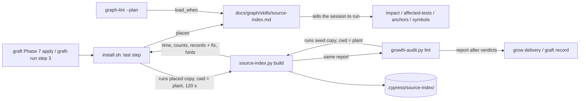

# grill.md: Plan of Record: round 8.1.2, tool surfacing (install, graft, grow)

## 0. Metadata
- Project: CYPRESS seed
- Feature or goal: make the placed source index found by topic and built in every plant once install, grow or graft has run, and make what a plant must set before trusting it visible, with the exact fix, after each of them; patch 8.1.2 over 8.1.1
- Date: 2026-10-07
- Owner: the steward; the orchestrating session plans, briefs and commits
- Tier: T3. Protocol: `protocol.specify` (SPEC-0007 grows by an 8.1.2 slice), then `protocol.grill`
- Current phase: specified by `architect-8.1.2`, rewritten on the owner's rulings of questions 2 and 3 by `architect-8.1.2b`; the owner ruled §12 questions 1, 8 and 9 on 2026-10-07 ("1 ok 2 ok 3 go"), and `architect-8.1.2c` wrote the SPEC-0001 amendment (increment 2); product signed §3 and §9; `architect-8.1.2d` applied the `security-8.1.2` lines S1 to S4 and arms A1 to A4 (security signed) and the `devils-advocate-8.1.2` changes that need no owner ruling; the owner ruled §12 questions 12 to 14, the kernel line and the cache bound on 2026-10-07, applied by `architect-8.1.2e` (SPEC-0002, SPEC-0007, ADR-0026 amendment, ADR-0029, ADR-0030); next the owner's ratification of the ADR-0026 amendment (§12 question 15), product's re-read of SPEC-0007 §3 and §9 and SPEC-0002 AC-11, tester §10, then RED
- Related files: `skills/source-index/SKILL.md` (new), `manifest.json`, `tools/source-index.py`, `tools/growth-audit.py`, `install.sh`, `tools/graft-run.py` (docstring only), `protocols/graft.md`, `protocols/grow.md`, `protocols/canonize.md`, `skills/toolcraft/SKILL.md`, the catalog template `tools/index.md` under `templates/docs/`, `documentation/source-index.md`, `docs/specs/SPEC-0001-install-placement.md`, `tests/test-source-index.sh`, `tests/test-full-install.sh`, `tests/test-growth-audit.sh`, `tests/run.sh`; since the rulings of 2026-10-07 also `templates/knowledge-graph/graph-lint.py` (`resolve()`), `skills/context-router/SKILL.md`, `tests/test_graph_lint.py`, `core/AGENTS.md`, `tests/seed-lint.py`, `tests/ratchets.json`, `docs/specs/SPEC-0002-routing-contract.md`
- Related documentation: `docs/plans/grill-8.1.0-source-index.md` (the round that built the tool; its §10 measurements); the steward plant's card `docs/graph/tools/source-index.md` (plant-written, read as evidence only)
- Related ADRs: [ADR-0026](../decisions/adr-0026-node-router-ladder-and-gated-corpus.md) (accepted; its "Amendment, 8.1.2", ratification pending, adds the seed skills a path route loads); [ADR-0030](../decisions/adr-0030-a-seed-tool-is-surfaced-by-a-seed-skill.md) (accepted 2026-10-07: a placed seed tool is surfaced by a seed skill node); [ADR-0029](../decisions/adr-0029-source-index-is-derived-scratch.md) (accepted; its "Amendment, 8.1.2", ratified 2026-10-07, records that the installer runs the build); [ADR-0021](../decisions/adr-0021-seed-only-procedures-stay-home.md) (the manifest names what the installer places)
- Related specs: [SPEC-0007](../specs/SPEC-0007-source-index.md) §4 "Surfacing (8.1.2)" (every contract of this plan but two); [SPEC-0002](../specs/SPEC-0002-routing-contract.md) `PATH_ROUTE_ADDS_SEED_SKILL_PHRASES` and `PATH_ROUTE_SKILL_ADDITION_IS_CAPPED` (the router rule of §12 question 12); [SPEC-0001](../specs/SPEC-0001-install-placement.md) (`BACKUP_BEFORE_REPLACE` and the seed-skill placement the new skill rides on, unchanged; increment 2 added §2's line for the build, an And clause in `SINGLE_WRITER` and an Except clause in `IDENTICAL_RERUN_IS_INERT`)
- Related libraries: none (stdlib Python and Git)
- Baseline: seed `main` at `e3b22be` (v8.1.1)

## 1. Artifact Discovery
- Existing files inspected: `install.sh` (`place_file` 389, `place_generated` 478, `place_graph_machinery` 1065 to 1087, which places every `skills/*/SKILL.md` as `docs/graph/skills/<name>.md`, `place_graph_scaffold` 1522 to 1586, `fill_plant_facts` 1588 onwards, the NEXT STEP banners 3226 to 3275); `manifest.json` (`tools`, `skills`, `templates`, `docs_skeleton`); `tools/graft-audit.py` (MODE 1 classes, the knowledge-overwrite flag, MODE 2 byte-identity); `tools/growth-audit.py` (`required_collections` 367, `collection_leaves` 573, `lint_collections` 1058, `VERDICTS`); `tools/graft-run.py` (steps 1 to 8); `templates/tool-page.template.md`; the catalog template `tools/index.md` under `templates/docs/`; `templates/knowledge-graph/_schema.md` ("Tiers": `tools/**` is Tier 3); `templates/knowledge-graph/graph-lint.py` (`KINDS`, `MACHINERY_DIRS`, `check_artifacts`)
- Existing docs inspected: `skills/toolcraft/SKILL.md`; `skills/context-router/SKILL.md` (frontmatter); `protocols/graft.md` (headings, Phase 7 gate table, output format); `protocols/grow.md` 630 to 660 (the Phase 2 `build --json` step); `templates/grill.template.md`; `templates/adr.template.md`
- Existing tests inspected: `tests/run.sh` (`ACTIVE_PLAN`, the spec-lint and grill-lint steps); `tests/graph-route-eval.sh` and `tests/graph-routes.golden.tsv` (the node-route corpus over a fresh install); `tests/test-source-index.sh` X430 (asserts the re-install leaves the cache and the next query rebuilds it); `tests/test-full-install.sh` E15 (asserts no `.cypress/source-index/` after an install); `tests/test-install-placement.sh` (M7's `is_installer_state`, `case_recover` over a fresh non-Git target, `tree_sig` checks); `tests/helpers/plant.sh` `plant_base` (installs into a non-Git directory); `tests/seed-lint.py` `install_write_sites` (a command that runs a tool is no write site)
- Existing specs inspected: `docs/specs/SPEC-0007-source-index.md` (§2, §4 `SOURCE_INDEX_IS_PLACED`, `REPO_CLAIM_READ_ALIKE_BY_ROUTER_AND_ANCHORS`, §6 "Incomplete", "Query answer", "CLI", §7, §10); `docs/specs/SPEC-0001-install-placement.md` (§2, §4 `SINGLE_WRITER`, `BACKUP_BEFORE_REPLACE`, the 8.0.0 expertise contracts, §6 "Selective placement")
- Existing architecture signals: the router routes Tier-2 nodes only; seed skills are placed and refreshed on every install by `place_file`; `tools/` is a growth-audit collection, so a seed page there is a substantive leaf of every plant; the steward plant routes the tool through its own `subsystem.source-index`, and `graph-lint.py --plan "find where a function is defined"` loads no node there
- Libraries already wikified: none, no library is involved
- External sources downloaded: none
- Constraints discovered: until this round the installer wrote no source-index cache (SPEC-0007 `SOURCE_INDEX_IS_PLACED`, ADR-0029 Consequences, the `manifest.json` description of `tools/source-index.py`, `documentation/source-index.md` "The installer never writes it"), each of which changes; `install.sh` writes `.cypress/seed.json` (so `.cypress/` exists) as its last write, then prints the `NEXT STEP` notices and the closing banner; `--check` and `--expertise propose` exit before any placement; macOS has no `timeout` command and `install.sh` is bash 3.2; the tool takes the plant root from its working directory; in a non-Git directory `build` exits 0 and writes nothing (`NO_GOVERNED_REPOSITORY`); `graft-run.py` runs `install.sh` on its stage (step 3, `install.log`) and growth-audit's lint (step 6, `coverage.txt`), and graft's Phase 7 applies with `install.sh` in the plant; `docs/graph/tools/index.md` and its cards are plant-owned (`skill.toolcraft`); a backup over plant-authored graph content is flagged by `graft-audit.py`; `SINGLE_WRITER` counts every in-place rewrite of a plant file; plants are read-only evidence for this round

## 2. Shared Understanding
The owner's words (2026-10-07), verbatim: "when doing graft do we create/add/update all the things the new tools need to be used and shine?", then, after the session's answer, "go do it. update graft and install/growth".

The session's answer named four gaps: no routable page for the tool in a plant, the seed-only user guides, `repo:` values that name nothing (turboquant holds six comma lists), and no prompt to write `docs/graph/source-index.json`. The owner approved (A) a seed tool card and catalog row in every plant, and (B) a checklist after install and graft, also reported by grow or growth-audit.

Success means: in any plant, a session that asks what depends on a file, which tests a change reaches, which pages cite a file or where a name is defined is routed to the tool; after an install, a grow or a graft the plant sees the build's time and counts, every `repo:` value that names nothing and the test-class hints, from one command, `source-index.py build`.

Design change from (A), put to the owner (§12 question 1, ADR-0030): a seed skill node, not a card, carries the tool, because a Tier-3 card is not routed and a seed card in `tools/` breaks growth-audit's `ABSENT` rows for that collection.

The owner's rulings on questions 2 and 3 (2026-10-07), verbatim: "2 ACTUALLY BUILD IT. a user cannot be expected to know that it needs to do things if it executes a graft/install/growth. the plant needs to be ready to go from te get-go after executing the protocols. 3 yes". Question 1 is taken as yes on the same ground (a tool no route finds is not ready), until the owner rules on ADR-0030.

Success therefore also means: after an install, a graft or a grow, the plant's cache is built (where the plant has a governed repository) and the report has been printed; every setup gap the build can detect is named in that report with the exact fix. The build does not judge whether `TEST_GLOBS` is right, only whether it matches; a pattern the plant config sets that matches no file is a hint with its fix (§12 question 14, ruled). A task that names a path a node owns loads that node and the seed skill beside it (§12 question 12, option (a), ruled), and the kernel names the tool in one line every session reads.

The owner's rulings of 2026-10-07 on questions 12 to 14 and two more items, as the session relayed them: q12 option (a), "change now"; the kernel, "1 yes add it" (`KERNEL_BUDGET` 8,000 to 8,200 bytes, one line in §5 of `core/AGENTS.md`); `CACHE_MAX_BYTES` 64 MiB to 196 MiB; q13 yes (an inventory-narrowing key is slice 3); q14 yes.

Out of scope (SPEC-0007 §2): seed cards or rows in a plant's `docs/graph/tools/`; a growth-audit verdict; an install or graft that fails or stops on the build; a flag to skip it; any tool writing a plant's config, `TEST_GLOBS` or `repo:` values; skills for the other placed tools; the seed-only user guides; editing any plant.

## 3. User Goal
- Primary user: a session in any plant; the steward after an install or graft
- Primary outcome: the tool is used when its question comes up, and its answers are trusted only once the plant's `repo:` values and test class are right
- Job to be done: find the tool by topic; have it built by the protocol that installed or grafted the plant; see the setup items and their fixes after each install, grow and graft
- Acceptance criteria (link to spec §9): SPEC-0007 §9, the 8.1.2 rows `product` adds
- Non-goals: fixing a plant's `repo:` values or test config by tool; gating a graft on a hint

## 4. Operating Constraints
- Runtime constraints: stdlib Python 3.12 or newer and Git; bash 3.2 syntax in `install.sh`; no new dependency
- Security constraints: the installer and `growth-audit.py` run the tool as `python3 -I -B`, so no plant file is imported in place of a standard module, and print its stdout only on exit 0, never its stderr (`security-8.1.2` S1, S2); `growth-audit.py` runs the seed's own `tools/source-index.py`, never plant code; the build stays read-only over repositories and writes only `.cypress/source-index/` (SPEC-0007 §5)
- Privacy constraints: synthetic fixtures only; no plant name in seed files or tests
- Data constraints: the cache stays derived scratch (ADR-0029); the plant config stays plant-owned and never placed
- Cost constraints: the batch sizes of `delegation.effort-scale`; batch per wave, no micro-loops (owner)
  - Plan approval (`grill.plan-approval`), 2026-10-07: the owner approved (A) and (B) in the session and ruled §12 questions 2 and 3; question 1 is taken as yes pending ADR-0030. Levers this plan uses: none defined beyond the batch sizes (default)
  - Owner-only prerequisites: the ratification of ADR-0030 (question 1) and of the ADR-0029 amendment (question 8), and the go for the SPEC-0001 amendment (question 9), before RED (increment 3), all given 2026-10-07; the ratification of the ADR-0026 amendment (question 15) before the router's GREEN (increment 7)
  - Scoped standing grant: none asked
- Latency constraints: `build` within SPEC-0007 §5; the install's build bounded by `INSTALL_BUILD_TIMEOUT` and growth-audit's by `GROWTH_REPORT_TIMEOUT` (120 s each); every install now spends the build's time (0.06 s on an empty plant to 3.7 s on a 4,320-file llama.cpp clone, measured cold at 3.64 s by `devils-advocate-8.1.2`); a graft spends about four builds (stage install, stage lint, apply, coverage gate)
- Compliance constraints: none
- Maintenance constraints: one home per rule (the build report and its fixes in `tools/source-index.py`; the installer and growth-audit print it, never restate it); the seed reads as if the feature always existed; tests only for real contracts; doctrine edits carry no tests of their own, the lints are their proof (`crosscut.operator-seed-rounds` in the steward plant)

## 5. Research Summary
no external dependency — every increment uses stdlib Python and Git, which the seed's tools already use; no §9 row depends on a `docs/graph/libraries/` page. The evidence is the seed's own source (§1):
- The router's tiers: `templates/knowledge-graph/_schema.md` "Tiers" puts `docs/graph/tools/**` in Tier 3, loaded only when a Tier-2 node names it.
- Growth-audit: `required_collections` makes `tools/` a collection row; `lint_collections` turns an `ABSENT` row with an authored leaf into `CONTRADICTED`.
- Placement: `place_graph_machinery` places every `skills/<name>/SKILL.md` on every run; the skill projection writes `.claude/skills/<name>/SKILL.md` with no new code.
- Precedent for a tool's usage living in a skill: `skill.humanizer` with `prose-lint.py` as its floor.

## 6. Decisions Made
| Decision | Rationale | Evidence | Reversibility | ADR | Date |
|---|---|---|---|---|---|
| Design latitude: balanced | new structure only where the change needs it: one seed skill node, one report in an existing command, one step at the end of the installer | the owner, 2026-10-07: "go do it. update graft and install/growth" | reversible | — | 2026-10-07 |
| Tier T3 | a new seed skill, a changed CLI output, the installer and growth-audit | kernel §0 | not applicable | — | 2026-10-07 |
| Owning spec: SPEC-0007, an 8.1.2 slice; SPEC-0001 gains only a pointer and an Except clause | every new behaviour is about the source index; the installer's run of it is a SPEC-0007 contract (`INSTALL_RUNS_THE_BUILD`), and SPEC-0001 keeps the placement rules it already owns | SPEC-0007 §4 "Surfacing (8.1.2)"; SPEC-0001 §2, `IDENTICAL_RERUN_IS_INERT` | reversible | — | 2026-10-07 |
| The tool's seed-owned page in a plant is a seed skill node `skill.source-index`, not a card in `docs/graph/tools/` (question 1, taken as yes) | a card is Tier 3 and not routed; a seed card breaks growth-audit's `tools/` rows; the skill is placed, refreshed, retired and projected by machinery that exists, on every install and graft | §5; ADR-0030 | reversible | [ADR-0030](../decisions/adr-0030-a-seed-tool-is-surfaced-by-a-seed-skill.md) | 2026-10-07 |
| The report has one home, `source-index.py build`: time, counts, `repo-unresolved`, the test-declaration records, one `BUILD_FIX` line under each record, two hints | the rules it reports (`repo_kind`, `TEST_GLOBS`, the config) live in the tool and its helper; a second reader would be a second home; a fix beside each record is what makes "ready to go" checkable by a reader who knows nothing | SPEC-0007 §6 "Build report", `BUILD_RECORDS_NAME_THEIR_FIX` | reversible | — | 2026-10-07 |
| The installer runs the placed `build` as its last step and prints the report (question 2, the owner: "ACTUALLY BUILD IT") | a plant must be ready after the protocol runs; graft applies with the installer, so graft gets it without a step of its own | SPEC-0007 `INSTALL_RUNS_THE_BUILD` | reversible | [ADR-0029](../decisions/adr-0029-source-index-is-derived-scratch.md) (amendment) | 2026-10-07 |
| Where: after the stamp (the last write) and before the `NEXT STEP` notices and the closing banner | every file is placed, so a build failure leaves nothing unplaced, and the report is read where the install ends; `--check`, `--expertise propose` and refusals exit earlier and run none | `install.sh` main flow, `write_seed_stamp` then the notices | reversible | — | 2026-10-07 |
| Every install that places files runs it, not only the first | a re-install or a graft can move the key (the tool, HEAD, the config), and "has a cache" is no sign the report was read; the cost is one build per install | SPEC-0007 `GRAFT_REBUILDS_THE_CACHE` as amended | reversible | — | 2026-10-07 |
| Fail-open: a failed, slow or missing build never changes the install's exit code; it prints `INSTALL_BUILD_FAILED` with the rerun command | the build is advice about a derived cache; an install that fails on it would block a graft on scratch | SPEC-0007 §7 `INSTALL_BUILD_FAILED` | reversible | — | 2026-10-07 |
| Bound and interpreter: `INSTALL_BUILD_TIMEOUT` 120 s through Python's subprocess timeout, the same `python3` the installer runs, in isolated mode (`-I -B`), stdin closed, working directory the plant root | macOS has no `timeout` command and `install.sh` stays bash 3.2; the interpreter is in the cache key, so the session's `python3` reuses the cache; `-I` stops a plant file such as `docs/graph/fnmatch.py` from shadowing a standard module the tool imports (`security-8.1.2` C1, shown on a synthetic plant) | SPEC-0007 §5 Security, §6 "Build report"; ADR-0029 key | reversible | — | 2026-10-07 |
| The installer and growth-audit print the build's stdout only on exit 0, never its stderr; the run is guarded under `set -euo pipefail` and decoded with `errors="replace"` | a traceback carries raw strings the `?` replacement never saw; a crash or an undecodable byte must not stop an install (`security-8.1.2` S2, S3) | SPEC-0007 §6 "Build report", §7 `INSTALL_BUILD_FAILED`, `SOURCE_INDEX_REPORT_UNAVAILABLE` | reversible | — | 2026-10-07 |
| `build` names each nested Git work tree inside a governed repository that no `repo:` names (`repository-unnamed`, build only), with its fix | its code is in no answer, silently, at every first install before grow writes `repo:` nodes; the root's listing already holds it (`devils-advocate-8.1.2` 1a) | SPEC-0007 §6 "Build report", §7 `REPOSITORY_UNNAMED` | reversible | — | 2026-10-07 |
| The readiness claim is "every setup gap the build can detect is named with its fix", not "no finding means ready"; the `build` `ACTION_LINE` names the setup items | an unconfirmed `TEST_GLOBS` default and a config pattern that matches nothing are not detected (`devils-advocate-8.1.2` 1b, 11) | SPEC-0007 §3, §6 "Build report"; ADR-0030 | reversible | — | 2026-10-07 |
| The installer runs the placed copy; growth-audit runs the seed's copy | after an install the two are byte-identical; growth-audit can be run against a plant whose placed copy is older (before an apply), and the seed copy runs no plant code | SPEC-0007 §6 "Build report" | reversible | — | 2026-10-07 |
| No plant, no Git, no code: the build still runs and its report names `no-repository`, `git-unavailable` or `no-test-files` with the fix; it writes nothing where there is no repository | one rule for every target; the fix is the step a person would otherwise have to know | SPEC-0007 `BUILD_RECORDS_NAME_THEIR_FIX`, §7 `NO_GOVERNED_REPOSITORY` | reversible | — | 2026-10-07 |
| Growth-audit prints the build report after its verdicts, never a verdict, running the seed's copy (question 3, the owner: "yes") | the owner named growth-audit; a report keeps the coverage gate's meaning | SPEC-0007 `GROWTH_AUDIT_PRINTS_THE_BUILD_REPORT` | reversible | — | 2026-10-07 |
| The owner's rulings of §12 questions 1, 8 and 9: ADR-0030 accepted, the ADR-0029 amendment ratified, go for the SPEC-0001 amendment | the owner, 2026-10-07: "1 ok 2 ok 3 go"; the SPEC-0001 amendment keeps its contracts true about the build's cache without a test change (increment 2) | ADR-0030 and ADR-0029 Ratification sections; SPEC-0001 §12 entry of 2026-10-07 | reversible | [ADR-0030](../decisions/adr-0030-a-seed-tool-is-surfaced-by-a-seed-skill.md), [ADR-0029](../decisions/adr-0029-source-index-is-derived-scratch.md) | 2026-10-07 |
| `graft-run.py` gets no code change | its step 3 runs the installer (so the build, kept in `install.log`) and its step 6 runs growth-audit's lint (the report, kept in `coverage.txt`); graft's Phase 7 apply prints the report in the plant itself; graft.md tells the steward where to read it | `tools/graft-run.py` docstring steps 3 and 6; `protocols/graft.md` Phase 7 | reversible | — | 2026-10-07 |
| Test-name hints read a closed list of name patterns and never gate | a name is a guess about a project's habits; the owner rules on each hint | SPEC-0007 §6 `TEST_NAME_PATTERNS` | reversible | — | 2026-10-07 |
| A plant's `repo:` values, `TEST_GLOBS` and config are corrected by people (graft Phase 6, grow's plant facts, canonize), never by a tool; the report names each with its fix | each needs a choice only the owner or an author with understanding can make | SPEC-0007 §6 `BUILD_FIX`, §7 `REPO_VALUE_UNRESOLVED` recovery | reversible | — | 2026-10-07 |
| A path route adds seed skills (§12 question 12, the owner: option (a), "change now"): when tier 2 decides, the router adds each `origin: seed` skill node whose trigger phrase the task holds, after the tier-2 entries in node-id order, at most `PATH_TIER_SKILL_CAP` (2), and none over it | three of the four `SKILL_ROUTE_TASKS` name a path a grown plant's node owns; seed skills only, tier 2 only, phrase hits only, so a plant's phrases keep the first-tier rule; over the cap none, as `STRONG_TIER_CAP` does | SPEC-0002 `PATH_ROUTE_ADDS_SEED_SKILL_PHRASES`, `PATH_ROUTE_SKILL_ADDITION_IS_CAPPED`, §6; measured on a fresh install of `373b341`: 3 of 39 golden rows route by tier 2, none holds a seed skill phrase | reversible | [ADR-0026](../decisions/adr-0026-node-router-ladder-and-gated-corpus.md) (amendment, ratification pending) | 2026-10-07 |
| The ADR-0026 change is an in-place amendment, not a new record | the ladder stands and one rule is added beside it; a superseding record would restate the ladder, a second home; ADR-0029's 8.1.2 amendment is the precedent | ADR-0026 "Amendment, 8.1.2" | reversible | [ADR-0026](../decisions/adr-0026-node-router-ladder-and-gated-corpus.md) | 2026-10-07 |
| Tier 2 counts whole: an `inferred` entry (an expertise file pattern) adds seed skills as a `named_path` one does | the owner's "a path a node owns" is the path tier; "what breaks if I change main.tf" asks the same question | SPEC-0002 §6 | reversible | — | 2026-10-07 |
| The kernel names the tool (the owner: "1 yes add it"): one line in `core/AGENTS.md` §5 naming `python3 docs/graph/source-index.py --help` and `skill.source-index`; `KERNEL_BUDGET` 8,000 to 8,200 bytes | every session reads the kernel before routing; the line is about 160 bytes, the kernel 7,928 | SPEC-0007 `KERNEL_NAMES_THE_SOURCE_INDEX`; `tests/seed-lint.py`, `tests/ratchets.json` | reversible | — | 2026-10-07 |
| No spec owns the kernel whole: the kernel line is a SPEC-0007 contract, as the session-record pointer is SPEC-0005's; the budget's one home is `KERNEL_BUDGET` in `tests/seed-lint.py`, recorded in `tests/ratchets.json`; the plant copies follow by SPEC-0001's placement, unchanged | one strong owner per behaviour: a kernel pointer belongs to the feature it points at | SPEC-0005 `KERNEL_POINTS_AT_THE_SESSION_RECORD`; SPEC-0001 `ONE_KERNEL_BODY`, `PRISTINE_PRIOR_KERNEL_IS_NOT_MIGRATION` | reversible | — | 2026-10-07 |
| The kernel line is held by two rows of seed-lint's existing `TEXT_RULES`, with no new test case | doctrine text carries no test of its own (the owner, 2026-09-30); a declarative row is proved by the run (ADR-0023); X381 already proves a `require` row fires; with about 115 bytes of headroom the line could be trimmed silently | SPEC-0007 §10 | reversible | — | 2026-10-07 |
| `CACHE_MAX_BYTES` 64 MiB to 196 MiB (the owner) | a plant over the bound rebuilds on every query; the bound is also the size of the read a cached query parses in memory, so its peak RSS near the bound is measured before release | SPEC-0007 §5, §6 | reversible | — | 2026-10-07 |
| An inventory-narrowing config key is slice-3 work (§12 question 13, the owner: yes) | recorded, not specified | SPEC-0007 §2 out of scope, §7 | reversible | — | 2026-10-07 |
| A config pattern that matches no inventory file is a build hint with a fix line (§12 question 14, the owner: yes): kind `config-pattern-unmatched`, only for patterns the plant's file sets, never a default | a typo in `always_run` leaves the always-run set short with no record; the default `global_inputs` names files most plants lack | SPEC-0007 `BUILD_HINTS_CONFIG_PATTERNS_THAT_MATCH_NOTHING`, §6 `HINT_FIX` | reversible | — | 2026-10-07 |

| The ADR-0026 "Amendment, 8.1.2" is ratified, in place, on the owner's "1 ratify" (§12 question 15); questions 16 to 18 kept, not vetoed | ADR-0026 is accepted and ratified; an amendment to it carries the owner's word, as ADR-0029's did | ADR-0026 "Amendment, 8.1.2", ratified; plan §12 questions 15 to 18 | reversible | [ADR-0026](../decisions/adr-0026-node-router-ladder-and-gated-corpus.md) | 2026-10-07 |

## 7. Options Considered
| Option | Benefits | Costs | Risks | Outcome |
|---|---|---|---|---|
| (A) seed card in `docs/graph/tools/` plus a seed block in `tools/index.md` | the owner's approved shape; a catalog row | still needs a Tier-2 node to be routed; a provenance rule, a growth-audit exclusion, a `--unfilled` block reader, a second SINGLE_WRITER exception, a backup class | every plant with an `ABSENT` `tools/` row fails its next graft gate until the exclusion lands | rejected for ADR-0030, put to the owner (§12 question 1) |
| (S) seed skill `skill.source-index` | routed by `load_when`; native host skill; no new mechanism; plant cards untouched | a sixteenth seed skill; the figures in README and the reference pages move at release | a plant skill of the same name is backed up (none known) | chosen (question 1 taken as yes) |
| Phrases on `skill.context-router` | no new node | a second subject in a node most tasks load | dilutes the knowledge rule's routing | rejected |
| A new subcommand `check` for the checklist | `build` output unchanged | a sixth verb for what `build` already computes | two commands to name | rejected: `build` is the command the owner named |
| Growth-audit verdict on report lines | forces a fix | a hint is a guess; a verdict blocks a graft on it | false blocks | rejected: report only |
| The installer only names the build (the first draft) | no install time; no cache written by an install | relies on someone reading a line and acting | the plant is not ready after the protocol | rejected by the owner (question 2) |
| The installer runs the build only when no cache exists | no time on re-installs | a re-install or graft that moved the key prints nothing, and the report is never seen again | stale advice | rejected: every install |
| The installer runs it through growth-audit, or runs the seed's copy | one runner | growth-audit is a seed-only tool that needs a coverage record; the seed's copy is not the command the report tells a person to rerun | a report whose rerun line names another file | rejected: the placed copy |
| GNU `timeout` around the build | one word in bash | absent on macOS, the CI's mac leg | the install dies on macOS | rejected: Python's subprocess timeout |
| A `--no-source-index` flag | faster test installs | a second path through every install; the owner wants the plant ready without choices | plants installed without it | rejected; test fixtures are non-Git and the build there costs milliseconds |
| `graft-run.py` prints the report after its gate table | one screen | a second reader of growth-audit's output, in a tool whose output is the gate table | an advice line read as a gate | rejected: Phase 7's apply prints it in the plant, and graft.md names the log |
| (b) skill routing by path-free phrasings only, the host's skill listing for the rest | no router change | the routed claim false in every grown plant | sessions never load the skill for a file question | rejected by the owner (§12 question 12) |
| (a) the router adds seed skill phrase hits beside a tier-2 route | the skill loads with the owning node | a SPEC-0002 change and a cap | extra nodes on a path route | chosen (the owner) |
| Over the cap, add the first `PATH_TIER_SKILL_CAP` by id | always some skill | an arbitrary pick | the wrong skill on a generic task | rejected: over the cap none, as `STRONG_TIER_CAP` |
| A new seed-lint function and case for the kernel line | a named check | a test of doctrine text | — | rejected: two `TEXT_RULES` rows (ADR-0023, the owner's rule of 2026-09-30) |
| A fix line under every hint | one shape | rewrites two `HINT_LINE`s that already carry their fix | churn in signed contracts | rejected: `HINT_FIX` only for the new kind |

## 8. Architecture Plan
- System boundary: the seed's `tools/source-index.py` (domain: the build report and its fixes), `install.sh` and `tools/growth-audit.py` (adapters that run it and print it), and one seed skill node (knowledge); no plant file is written by any of them beyond the cache a build writes
- Main components: `skills/source-index/SKILL.md` (routing and usage); `graph-lint.py` `resolve()` (the seed skills a tier-2 route adds, SPEC-0002); the kernel's §5 line; `build`'s report (§6 "Build report", `BUILD_FIX`); the installer's last step (`INSTALL_BUILD_HEAD`, `INSTALL_BUILD_FAILED`, `INSTALL_BUILD_TIMEOUT`); `growth-audit.py`'s report block
- Interfaces: `build` text view (fix lines under records) and `--json` keys `seconds` and `hints` (`ANSWER_SCHEMA` `/1`, keys added); growth-audit `--json` key `source_index_report`; the installer's output lines
- Data flow:

- Error handling: a failed or slow build prints `INSTALL_BUILD_FAILED` in the installer and `GROWTH_REPORT_FAILED` in growth-audit, and changes nothing else (SPEC-0007 §7)
- Observability: the report lines in the install output and the growth-audit output; `graft-run.py` keeps both under `<stage>/graft-run-logs/` (`install.log`, `coverage.txt`)
- Security posture: the installer runs a file it has just placed from the seed, in isolated mode (`python3 -I -B`), so it imports no plant code; growth-audit runs the seed's copy the same way; both print the build's stdout only on exit 0 and never its stderr; the build's existing guarantees hold (read-only over repositories, writes only `.cypress/source-index/`)
- Deployment model: seed release 8.1.2; plants receive it by install or graft. A fresh install places the skill, builds and prints the report; an existing plant's graft does the same at its apply, its Phase 7 growth-audit run prints the report again, and Phase 6 corrects the `repo:` values it names
- Environment parity: not applicable, no deploy chain

## 9. Implementation Plan

Increments are inline; numbers are dependency order. Increment 1 carries the slice-1 and slice-2 contracts this plan leaves as they are. The owner ruled §12 questions 1, 8 and 9 on 2026-10-07; increment 2 is written, and RED (increment 3) waits for the reviews §14 names.

| Spawn | Increments | Worker | Batch rule (`delegation.effort-scale`) |
|---|---|---|---|
| — | 1 | none | carried from the 8.1.0 plan and SPEC-0002, no spawn |
| A1 | 2 | `architect` | spec text, one file |
| R1 | 3 | `tester` | RED medium: one spawn, eleven cases and two amended ones |
| G1 | 4 | `implementer` | GREEN medium: one |
| G2 | 5, 6 | `implementer` | GREEN medium-low: two |
| G3 | 7, 8 | `implementer` | GREEN medium-low: two |
| P1 | 9 | one writer | prose, one file set |
| V1 | 10 | session | verify and one measurement |

G1, G2 and G3 may run side by side after R1: their files are disjoint. Increment 6's installer cases pass only with increment 4's fix lines; G2's gate runs after G1 lands. Increment 7's skill arm needs increment 5's skill; G3's gate runs after G2 lands. The owner's rulings of 2026-10-07 on §12 questions 12 to 14 added increments 7 and 8 and widened 3 and 4; the prose and verify increments moved to 9 and 10.

### Increment 1 — Carried: the slice-1 and slice-2 contracts, and SPEC-0002's
- Spec contracts: SPEC-0007/BUILD_INVENTORIES_THE_CODE_OF_EVERY_GOVERNED_REPOSITORY, SPEC-0007/BUILD_IS_DETERMINISTIC, SPEC-0007/CACHE_WRITTEN_SELF_IGNORED, SPEC-0007/CACHE_REUSED_WHILE_THE_KEY_HOLDS, SPEC-0007/CACHE_REBUILT_WHEN_THE_KEY_CHANGES, SPEC-0007/LINK_PYTHON_IMPORT_CERTAIN, SPEC-0007/LINK_SHELL_INVOCATION_CERTAIN, SPEC-0007/LINK_PATH_LITERAL_AND_DIRECTORY_ARE_MAYBE, SPEC-0007/LINK_TS_SPECIFIER_CERTAIN, SPEC-0007/UNPINNED_REFERENCE_RECORDED_WITH_ITS_REASON, SPEC-0007/TESTS_ARE_THE_PLANTS_TEST_GLOBS, SPEC-0007/PLANT_CONFIG_REPLACES_EACH_DEFAULT_KEY, SPEC-0007/WALK_NEAREST_FIRST_ONCE, SPEC-0007/WALK_CHAIN_IS_ITS_WEAKEST_LINK, SPEC-0007/WALK_FLOOR_LISTED_APART_AFTER_THE_INPUT_ROWS, SPEC-0007/WALK_DELETED_INPUT_REACHES_ITS_NAMERS, SPEC-0007/INPUT_FORMS_RESOLVED, SPEC-0007/WALK_INCOMPLETE_NAMES_REASON_AND_ACTION, SPEC-0007/AFFECTED_TESTS_ARE_THE_WALK_FILTERED, SPEC-0007/AFFECTED_ALWAYS_RUN_LISTED_APART, SPEC-0007/ANCHORS_NAME_CITING_PAGES_OR_UNCITED, SPEC-0007/ANCHORS_BASENAME_IS_MAYBE_AMBIGUOUS_IS_INCOMPLETE, SPEC-0007/OUTPUT_CARRIES_NO_RAW_CONTROL, SPEC-0007/SYMBOLS_PYTHON_DEFINITIONS_CERTAIN, SPEC-0007/SYMBOLS_LINE_READ_DECLARATIONS_ARE_MAYBE, SPEC-0007/SYMBOLS_LIST_EVERY_DEFINITION, SPEC-0007/SYMBOLS_UNREADABLE_FILE_MAKES_IT_INCOMPLETE, SPEC-0007/HISTORY_ROWS_ARE_MAYBE_WITH_THEIR_COUNT, SPEC-0007/HISTORY_ONLY_ADDS, SPEC-0007/HISTORY_SHALLOW_OR_MISSING_IS_INCOMPLETE, SPEC-0007/ANCHORS_MOVED_EQUALS_THE_NAMED_PATHS, SPEC-0007/ANCHORS_MOVED_WITHOUT_A_LIST_IS_INCOMPLETE, SPEC-0007/REPO_CLAIM_READ_ALIKE_BY_ROUTER_AND_ANCHORS, SPEC-0002/EVERY_NUMBER_NAMES_ITS_CORPUS, SPEC-0002/OVERLAP_IS_PUBLISHED_BESIDE_ACCURACY, SPEC-0002/HELD_OUT_STAYS_HELD_OUT, SPEC-0002/HELD_OUT_SET_MAY_NOT_BE_EMPTIED, SPEC-0002/CONFIDENT_WRONG_IS_THE_GATE, SPEC-0002/NEITHER_HELD_OUT_SET_MAY_BE_THINNED, SPEC-0002/THE_ADVERSARIAL_BUDGET_IS_RATCHETED_NOT_ZERO, SPEC-0002/ABSTENTION_IS_A_CORRECT_OUTCOME, SPEC-0002/AN_ABSOLUTE_FLOOR_IS_KEYED_TO_ITS_ROSTER, SPEC-0002/CONTRACT_ROW_ABSTENTION_IS_A_DEFECT, SPEC-0002/UNKNOWN_DOMAIN_MUST_ABSTAIN, SPEC-0002/COMPOUND_FRAGMENT_IS_WEAK_EVIDENCE, SPEC-0002/RARITY_AMPLIFIES_ONLY_A_CONFIDENT_MATCH, SPEC-0002/AN_INFLECTION_MATCHES_THE_WORD_IT_INFLECTS, SPEC-0002/A_WORD_EVERY_TASK_WRITES_CANNOT_SELECT_AN_AGENT, SPEC-0002/VACUOUS_CORPUS_IS_REFUSED, SPEC-0002/GRAPH_ROUTE_NAMED_ID_LOADS_IT, SPEC-0002/GRAPH_ROUTE_NAMED_PATH_LOADS_ITS_OWNER, SPEC-0002/GRAPH_ROUTE_PHRASE_LOADS_ITS_NODE, SPEC-0002/STRONG_TIER_OVER_CAP_FALLS_THROUGH, SPEC-0002/PROMOTION_NEEDS_A_CONTIGUOUS_PHRASE, SPEC-0002/COMPOSED_CHILD_NEEDS_ITS_OWN_PHRASE, SPEC-0002/PUNCTUATION_DOES_NOT_CHANGE_A_TERM, SPEC-0002/IDS_AND_PATHS_ARE_NOT_LEXICAL_TERMS, SPEC-0002/ONE_TERM_CANNOT_SEED_A_NODE, SPEC-0002/NO_SIGNAL_LOADS_NOTHING, SPEC-0002/LONG_TASK_ABSTAINS_WITH_NOTICE, SPEC-0002/GRAPH_EVAL_GATES_PER_CLASS, SPEC-0002/GRAPH_RATCHETS_ARE_KEYED_TO_THEIR_GRAPH
- Files touched: none
- Tests to write (RED): none — implemented and green at `68c970e` under `docs/plans/grill-8.1.0-source-index.md` increments 3 to 20; this plan changes none of them except `SOURCE_INDEX_IS_PLACED` and `GRAFT_REBUILDS_THE_CACHE`, amended for the installer's build and carried by increment 3, and `build`'s added report keeps their outputs (the count line and `ANSWER_SCHEMA` `/1`). The SPEC-0002 contracts are carried as they stand (green, but `CONTRACT_ROW_ABSTENTION_IS_A_DEFECT`, pending with no test, SPEC-0002 §11); increment 7 adds a rule beside tier 2 and changes none of them, and their tests stay green in its gate
- Behavior added: none
- Gate: their §10 rows stay green in increment 10's full gate
- Rollback path: none needed
- Effort: low
- Phase: GREEN, done in 8.1.0
- Depends on: none

### Increment 2 — SPEC-0001 amendment for the installer's build
- Spec contracts: none — spec text only: SPEC-0001's `IDENTICAL_RERUN_IS_INERT` gains an Except clause and its `SINGLE_WRITER` an And clause (census unchanged); their tests stay as they are
- Files touched: `docs/specs/SPEC-0001-install-placement.md`: §2 in scope, one line: the source-index build the installer runs as its last step, owned by SPEC-0007 `INSTALL_RUNS_THE_BUILD`; `SINGLE_WRITER`: the cache under `.cypress/source-index/` is the placed tool's own atomic write, outside the census of the installer's writes, which is unchanged; `IDENTICAL_RERUN_IS_INERT`: Except the cache, which the build replaces with equal bytes when nothing moved (SPEC-0007 `BUILD_IS_DETERMINISTIC`); changelog line
- Tests to write (RED): none — no test changes: `seed-lint`'s write-site census sees no new site (a command that runs a tool is none), and the placement suites install into non-Git targets, where the build writes nothing; increment 10's full gate proves both
- Behavior added: none
- Gate: `tests/run.sh` spec-lint and seed-lint steps green
- Rollback path: revert the commit
- Effort: low
- Phase: prose, written 2026-10-07 by `architect-8.1.2c`
- Depends on: none (§12 question 9, ruled 2026-10-07)

### Increment 3 — RED for the 8.1.2 contracts
- Spec contracts: SPEC-0007/SOURCE_INDEX_SKILL_ROUTES_ITS_FOUR_QUESTIONS, SPEC-0007/BUILD_REPORTS_ITS_TIME_AND_COUNTS, SPEC-0007/BUILD_NAMES_REPO_VALUES_THAT_NAME_NOTHING, SPEC-0007/BUILD_NAMES_TESTS_OUTSIDE_THE_TEST_CLASS, SPEC-0007/BUILD_HINTS_EXCLUDE_FOR_NON_TEST_FILES, SPEC-0007/BUILD_RECORDS_NAME_THEIR_FIX, SPEC-0007/INSTALL_RUNS_THE_BUILD, SPEC-0007/GROWTH_AUDIT_PRINTS_THE_BUILD_REPORT, SPEC-0007/GRAFT_REBUILDS_THE_CACHE (amended), SPEC-0007/SOURCE_INDEX_IS_PLACED (amended), SPEC-0007/BUILD_HINTS_CONFIG_PATTERNS_THAT_MATCH_NOTHING, SPEC-0002/PATH_ROUTE_ADDS_SEED_SKILL_PHRASES, SPEC-0002/PATH_ROUTE_SKILL_ADDITION_IS_CAPPED
- Files touched: `tests/test_graph_lint.py` (the two SPEC-0002 cases), `tests/test-source-index.sh` (the build, fix, config-hint, skill and installer cases; X430's last two checks rewritten: the re-install's output holds `Cache: rebuilt (build forced)` and the next query reports `reused`), `tests/test-full-install.sh` (E15: the `.cypress/source-index` absence check struck, the config check kept), `tests/test-growth-audit.sh` (the report case and its `SOURCE_INDEX_REPORT_UNAVAILABLE` arm), `tests/run.sh` (`ACTIVE_PLAN` to this plan), SPEC-0007 §10 file cells and labels
- Tests to write (RED): 11 cases, one per new contract above, the tester names the SPEC-0007 ones (SPEC-0002 §10 names its two); failure arms inside them as the §10 rows say (`INSTALL_BUILD_FAILED` in the installer case, `REPOSITORY_UNNAMED` in the `repo:` case, the owned-path arm of option (a) in the skill case, `PATH_ROUTE_SKILLS_OVER_CAP` in the cap case, the security arms A1 to A4); X430 rewritten, E15 trimmed; the case file's `ACTION` prefix for `build` follows the new `ACTION_LINE`; X459's case checks guarded by the case-sensitivity probe of SPEC-0007 §10
- Behavior added: none; every new case and X430 fail for the missing behaviour, not for a fixture error
- Gate: the eleven cases and X430 fail; E15 and the rest of `tests/run.sh` stay green; `SPEC-0007/KERNEL_NAMES_THE_SOURCE_INDEX` gets no case (increment 8)
- Rollback path: revert the RED commit
- Effort: medium
- Phase: RED
- Depends on: increment 2

### Increment 4 — The build report
- Spec contracts: SPEC-0007/BUILD_REPORTS_ITS_TIME_AND_COUNTS, SPEC-0007/BUILD_NAMES_REPO_VALUES_THAT_NAME_NOTHING, SPEC-0007/BUILD_NAMES_TESTS_OUTSIDE_THE_TEST_CLASS, SPEC-0007/BUILD_HINTS_EXCLUDE_FOR_NON_TEST_FILES, SPEC-0007/BUILD_RECORDS_NAME_THEIR_FIX, SPEC-0007/BUILD_HINTS_CONFIG_PATTERNS_THAT_MATCH_NOTHING
- Files touched: `tools/source-index.py` (also `CACHE_MAX_BYTES` 205520896, SPEC-0007 §6)
- Tests to write (RED): none here; increment 3 holds them
- Behavior added: `build` prints `BUILD_TIME_LINE`, adds `repo-unresolved`, `repository-unnamed`, `no-test-declaration` and `no-test-files` to its `incomplete`, closes with the new `build` `ACTION_LINE`, prints a `BUILD_FIX` line under each record, and adds `hints`, the `config-pattern-unmatched` hint with its `HINT_FIX` line among them (§6 "Build report"); the answer gains `seconds` and `hints`; the cache shape is unchanged and its size bound is 196 MiB
- Gate: the six cases green; `tests/test-source-index.sh` whole green but for the increment-6 cases
- Rollback path: revert the commit
- Effort: medium
- Phase: GREEN
- Depends on: increment 3

### Increment 5 — The seed skill
- Spec contracts: SPEC-0007/SOURCE_INDEX_SKILL_ROUTES_ITS_FOUR_QUESTIONS
- Files touched: `skills/source-index/SKILL.md` (new: node frontmatter with `id: skill.source-index`, `origin: seed`, `load_when` phrases that route `SKILL_ROUTE_TASKS` and their everyday wording, a `description` for host skills; a body in the sections of `templates/tool-page.template.md` written for any plant: invocation, outputs, when to use and when not, that install, graft and growth-audit run `build` and print its report, the one-line limit of SPEC-0007 §5 (a recommendation over cooperative code; a file's absence from `dependents` or `tests` is never proof), that a session reruns it after changing `TEST_GLOBS`, the config or a `repo:` value, `docs/graph/source-index.json`, pitfalls, and the protocols that call it), `manifest.json` (`skills` entry)
- Tests to write (RED): none here; increment 3 holds it
- Behavior added: the tool is routed by topic in every plant and projected into each harness's skills, at every install and graft
- Gate: the skill case green; `graph-lint.py` and `agent-lint.py --lint` clean on a fresh install; `tests/graph-route-eval.sh` ratchets hold
- Rollback path: revert the commit
- Effort: medium-low
- Phase: GREEN
- Depends on: increment 3
- Structure added: one seed skill node; its one responsibility is how a session uses the placed source index; the variation that justifies it is real now (four questions no seed node routes)

### Increment 6 — The installer's build and growth-audit's report
- Spec contracts: SPEC-0007/INSTALL_RUNS_THE_BUILD, SPEC-0007/GRAFT_REBUILDS_THE_CACHE, SPEC-0007/SOURCE_INDEX_IS_PLACED, SPEC-0007/GROWTH_AUDIT_PRINTS_THE_BUILD_REPORT
- Files touched: `install.sh` (after `write_seed_stamp` and before the `NEXT STEP` notices: `INSTALL_BUILD_HEAD`, the placed `build` run from `$PROJECT_DIR` by `python3 -I -B` with `INSTALL_BUILD_TIMEOUT` through Python's subprocess timeout, guarded under `set -euo pipefail`, stdout decoded with `errors="replace"`, its stdout lines indented in the `log` form only on exit 0 and its stderr never printed, `INSTALL_BUILD_FAILED` on any other outcome, the exit code untouched; the usage header names the step in one line), `manifest.json` (the `tools/source-index.py` description: "the installer runs its build as its last step and prints the report" in place of "the installer writes no cache"), `tools/growth-audit.py` (the report after the verdicts, run as `python3 -I -B`, stdout only on exit 0, never stderr, `source_index_report` empty on a failure; `GROWTH_REPORT_HEAD`, `GROWTH_REPORT_FAILED`, `GROWTH_REPORT_TIMEOUT`; `--json` `source_index_report`; nothing in `--plan` or `--agents`)
- Tests to write (RED): none here; increment 3 holds them
- Behavior added: every install that places files builds the index and prints the report; the report again at every grow and graft lint
- Gate: the installer, growth-audit, X430 and E15 cases green; `tests/test-full-install.sh`, `tests/test-install-placement.sh`, `tests/test-growth-audit.sh`, `tests/test-graft-tools.sh` and `seed-lint` (no new write site) green
- Rollback path: revert the commit
- Effort: medium-low
- Phase: GREEN
- Depends on: increment 3; its installer cases also need increment 4

### Increment 7 — The router adds seed skills beside a path route
- Spec contracts: SPEC-0002/PATH_ROUTE_ADDS_SEED_SKILL_PHRASES, SPEC-0002/PATH_ROUTE_SKILL_ADDITION_IS_CAPPED, SPEC-0007/SOURCE_INDEX_SKILL_ROUTES_ITS_FOUR_QUESTIONS (its owned-path arm)
- Files touched: `templates/knowledge-graph/graph-lint.py` (`resolve()`: after a tier-2 hit, the seed skills whose phrase the task holds, `PATH_TIER_SKILL_CAP`, its docstring), `skills/context-router/SKILL.md` (the traversal it mirrors: a task naming a path also loads a seed skill whose phrase it holds), SPEC-0002 §10 statuses
- Tests to write (RED): none here; increment 3 holds them
- Behavior added: a task that names a path a node owns loads that node and, at most two, the seed skills whose phrase it holds
- Gate: the two `tests/test_graph_lint.py` cases and the skill case's owned-path arm green; `tests/test_graph_lint.py` whole green; `tests/graph-route-eval.sh` ratchets hold, no golden row edited; `tests/test-prompt-hooks.sh` (`SESSION_INJECTION_WITHIN_BUDGET`) green
- Rollback path: revert the commit
- Effort: medium-low
- Phase: GREEN
- Depends on: increment 3; the owned-path arm needs increment 5; the owner's ratification of the ADR-0026 amendment (§12 question 15)

### Increment 8 — The kernel names the tool
- Spec contracts: SPEC-0007/KERNEL_NAMES_THE_SOURCE_INDEX
- Files touched: `core/AGENTS.md` (§5, one line: "Code questions (what breaks, which tests, who cites a file, where a name is defined): `python3 docs/graph/source-index.py --help`, `skill.source-index`.", wrapped as the section wraps), `tests/seed-lint.py` (`KERNEL_BUDGET = 8_200`; two `TEXT_RULES` rows `KERNEL_NAMES_THE_SOURCE_INDEX`, section `## 5. ` to the next `## `, where " §5"), `tests/ratchets.json` (`KERNEL_BUDGET` 8200, by `tools/ratchet-lint.py --bless`, a deliberate loosening)
- Tests to write (RED): none — doctrine text and a declarative lint row, proved by the run (ADR-0023; the owner's rule of 2026-09-30); X381 already proves a `require` row fires
- Behavior added: every session of every plant reads the tool's name before routing; plants receive the kernel by install or graft (SPEC-0001 placement, unchanged)
- Gate: `seed-lint` (the kernel under `KERNEL_BUDGET`, the two rows, `check_eager_surface`), `tools/ratchet-lint.py`, `tests/test-seed-lint.sh`, `tests/test-full-install.sh` (kernel copies byte-identical) green; the eager-surface figures in `README.md` and the host matrix may stay red until the release's one documentation pass (§13)
- Rollback path: revert the commit
- Effort: low
- Phase: GREEN
- Depends on: increment 5 (the skill the line names)

### Increment 9 — Protocol, template and guide wiring
- Spec contracts: none; doctrine text, proved by the lints that already run
- Files touched: `protocols/graft.md` ("The installer is the hand that applies it": the install ends with the source-index build, which writes only the self-ignored cache; Phase 6: correct each `repo:` value the report names, one plant-relative path that exists or none; Phase 7 and the output format: a "Source index after the graft" section recording the apply install's report and what was done with each line, hints and fixes put to the owner as next steps, read on the stage from `graft-run-logs/install.log` and `coverage.txt`); `protocols/grow.md` (Phase 2's `build --json` stays; the delivery records the report of its last growth-audit run); `protocols/canonize.md` (a `repo-unresolved` record from `anchors --moved` is corrected in the same close-out); `tools/graft-run.py` (docstring steps 3 and 6 name the report in `install.log` and `coverage.txt`; no code); `skills/toolcraft/SKILL.md` and the catalog template `tools/index.md` under `templates/docs/` (one sentence each: the seed's placed tools are described by seed skills and need no catalog row; a plant may still write its own card); `documentation/source-index.md` ("The installer never writes it" becomes: the installer runs `build` as its last step and prints the report; deleting the directory stays safe)
- Tests to write (RED): none — doctrine text; proved by `seed-lint`, `graph-lint` on a fresh install and the route corpus
- Behavior added: graft, grow and canonize act on the report
- Gate: `tests/run.sh` green
- Rollback path: revert the commit
- Effort: low
- Phase: prose
- Depends on: increments 4 to 8

### Increment 10 — Verify and one measurement
- Spec contracts: every 8.1.2 contract
- Files touched: SPEC-0007 §10 statuses and status `implemented`; this plan's §10
- Tests to write (RED): none — verification
- Behavior added: none; the full gate, then an install into scratch copies of two plants (never the plants), the build time it prints and its findings recorded in §10, the gate's wall time before and after the round, and the peak RSS of a cached query over a synthetic cache near `CACHE_MAX_BYTES` recorded in SPEC-0007 §5
- Gate: `tests/run.sh` whole green; the measurements recorded
- Rollback path: none needed
- Effort: low
- Phase: prose
- Depends on: increment 9

No consolidation increment: the round adds eleven cases to four existing suites, one per contract, two lint rows, and amends two cases.

## 10. Verification Plan
Covered by the seed's standard gate, `tests/run.sh`. Two additions. Increment 10 measures the peak RSS of a cached query whose cache is near `CACHE_MAX_BYTES` (196 MiB, synthetic) and records it in SPEC-0007 §5; it is a measurement, not a gate. And increment 10 runs `install.sh` into scratch copies of two plants, a TypeScript plant and the plant with comma-list `repo:` values, and records the build time the install prints, its counts and findings, and the gate's wall time before and after the round here; it is a measurement, not a gate.

## 11. Risks and Mitigations
| Risk | Probability | Impact | Mitigation | Owner | Verification |
|---:|---:|---:|---|---|---|
| The skill's `load_when` also catches unrelated tasks and shifts the route corpus | 0.3 | 2 | the phrases name the four questions; `tests/graph-route-eval.sh` ratchets gate it | implementer | increment 5 gate |
| The test-name hints fire on a whole fixture tree and read as noise | 0.5 | 1 | counts and five paths only; one `exclude` key, even `[]`, ends the hint | architect | increment 10 measurement |
| Every install spends the build's time; a large monorepo install waits up to the bound | 0.5 | 1 | measured 0.06 s (empty) to 3.7 s (llama.cpp, 4,320 files); a graft spends about four builds; `INSTALL_BUILD_TIMEOUT` 120 s and fail-open; above the bound or `CACHE_MAX_BYTES` each query rebuilds and no setting narrows the inventory (§12 question 13: slice 3) | implementer | increment 10 measurement |
| A test that installs into a Git fixture and compares the tree, the backups or the output now meets the cache or the report | 0.4 | 2 | the placement suites install into non-Git targets (`plant_base`, `case_recover`); the cache is self-ignored and outside `placed_files`' backups; X430 and E15 are amended at RED; G2's gate runs the suites that install into Git fixtures (`test-graft-tools.sh`, `test-prompt-hooks.sh`, `test-tool-corpus.sh`) | tester | increment 6 gate |
| An old `python3` on a plant host fails the build | 0.2 | 1 | `INSTALL_BUILD_FAILED` names the exit; the install completes | implementer | the failure arm |
| A path route loads a seed skill the task did not need | 0.3 | 1 | seed skills only, phrase hits only, at most two, none over the cap; the golden corpus and its ratchets gate it | implementer | increment 7 gate |
| A cached query near the 196 MiB bound takes more memory than the host has | 0.3 | 2 | measured before release (increment 10); the bound is one constant | implementer | increment 10 measurement |
| The kernel line is trimmed later under budget pressure (about 115 bytes of headroom) | 0.2 | 2 | two `TEXT_RULES` rows fail seed-lint naming `core/AGENTS.md §5` | implementer | increment 8 gate |
| The owner vetoes the skill (question 1) | 0.2 | 3 | ADR-0030 lists the card design's extra contracts; the build report, installer and growth-audit increments stand either way | architect | the ruling |

## 12. Open Questions
| # | Question | Why it matters | Current assumption | How to resolve | Owner | Pinned by |
|---:|---|---|---|---|---|---|
| 1 | Resolved 2026-10-07: surface the tool through a seed skill; ADR-0030 accepted. The owner: "1 ok 2 ok 3 go" (item 1) | — | — | resolved | owner | SPEC-0007 SOURCE_INDEX_SKILL_ROUTES_ITS_FOUR_QUESTIONS |
| 2 | Resolved 2026-10-07: the installer runs the build. The owner: "ACTUALLY BUILD IT. a user cannot be expected to know that it needs to do things if it executes a graft/install/growth. the plant needs to be ready to go from te get-go after executing the protocols" | — | — | resolved | owner | SPEC-0007 INSTALL_RUNS_THE_BUILD |
| 3 | Resolved 2026-10-07: growth-audit runs the seed's `build` on the plant and prints the report as advice, never a verdict. The owner: "yes" | — | — | resolved | owner | SPEC-0007 GROWTH_AUDIT_PRINTS_THE_BUILD_REPORT |
| 4 | Settled, owner may veto: only the source index gets a seed skill now; `code-anchor.py`, `status-register.py`, `prose-lint.py` and the linters wait | scope | none now | veto | owner | — |
| 5 | Settled, owner may veto: a test-file name list (`test_*.py`, `*.spec.*` and the rest of `TEST_NAME_PATTERNS`) is used only for hints | a name is a guess | hints only | veto | owner | SPEC-0007 BUILD_NAMES_TESTS_OUTSIDE_THE_TEST_CLASS |
| 6 | Settled, owner may veto: the round ships as 8.1.2, as the owner set, though it adds a seed skill and changes what an install does | version label only | 8.1.2 | veto | owner | — |
| 7 | Settled, owner may veto: the seed-only user guides stay seed-only; the skill carries what a plant session needs | the guides describe the seed for its steward | unchanged | veto | owner | — |
| 8 | Resolved 2026-10-07: the ADR-0029 "Amendment, 8.1.2" is ratified, in place. The owner: "1 ok 2 ok 3 go" (item 2) | — | — | resolved | owner | SPEC-0007 INSTALL_RUNS_THE_BUILD |
| 9 | Resolved 2026-10-07: SPEC-0001 gains §2's line for the build, an And clause in `SINGLE_WRITER` and an Except clause in `IDENTICAL_RERUN_IS_INERT`, written as increment 2. The owner: "1 ok 2 ok 3 go" (item 3) | — | — | resolved | owner | SPEC-0001 IDENTICAL_RERUN_IS_INERT |
| 10 | Settled, owner may veto: every install that places files runs the build, not only the first; there is no flag to skip it | a re-install or graft can move the key; a skip flag is a second path | every install, no flag | veto | owner | SPEC-0007 INSTALL_RUNS_THE_BUILD |
| 11 | Settled, owner may veto: `graft-run.py` gets no code change; the report is in its `install.log` and `coverage.txt`, Phase 7's apply prints it in the plant, and graft.md says where to read it | a second reader of growth-audit's output in a tool whose output is the gate table | docstring only | veto | owner | — |
| 12 | Resolved 2026-10-07: option (a), "change now": when a task names a path a node owns, the router also adds the phrase-tier hits of `origin: seed` skill nodes | — | — | resolved | owner | SPEC-0002 PATH_ROUTE_ADDS_SEED_SKILL_PHRASES |
| 13 | Resolved 2026-10-07: yes, an inventory-narrowing config key (for example `inventory_exclude`) is slice-3 work; recorded, not specified | — | — | resolved | owner | — |
| 14 | Resolved 2026-10-07: yes, a config pattern that matches no inventory file is a build hint with a fix line | — | — | resolved | owner | SPEC-0007 BUILD_HINTS_CONFIG_PATTERNS_THAT_MATCH_NOTHING |
| 15 | Resolved 2026-10-07: the ADR-0026 "Amendment, 8.1.2" is ratified, in place. The owner: "1 ratify" | — | — | resolved | owner | SPEC-0002 PATH_ROUTE_ADDS_SEED_SKILL_PHRASES |
| 16 | Resolved 2026-10-07: kept, not vetoed. The owner's "1 ratify" left question 16 standing: the path tier counts whole, so an `inferred` entry adds seed skills as a `named_path` one does | — | — | resolved | owner | SPEC-0002 PATH_ROUTE_ADDS_SEED_SKILL_PHRASES |
| 17 | Resolved 2026-10-07: kept, not vetoed. The owner's "1 ratify" left question 17 standing: `PATH_TIER_SKILL_CAP` is 2 and over it no skill is added | — | — | resolved | owner | SPEC-0002 PATH_ROUTE_SKILL_ADDITION_IS_CAPPED |
| 18 | Resolved 2026-10-07: kept, not vetoed. The owner's "1 ratify" left question 18 standing: the kernel line is held by two rows of seed-lint's `TEXT_RULES`, with no new test case | — | — | resolved | owner | SPEC-0007 KERNEL_NAMES_THE_SOURCE_INDEX |

## 13. Done Criteria
- Every 8.1.2 row of SPEC-0007 §10 is green and `tests/run.sh` is green whole.
- In a fresh install, the four `SKILL_ROUTE_TASKS` load `skill.source-index`.
- A fresh install into a Git work tree ends with the build's report and a cache a following query reuses; one into a directory with no governed repository ends with the `no-repository` fix; both exit 0.
- In a fresh install with a node `repo: src`, the three `SKILL_ROUTE_TASKS` that name `src/app.py` load that node and `skill.source-index`.
- The kernel's §5 names the tool and the skill, and `core/AGENTS.md` is within `KERNEL_BUDGET` (8,200 bytes).
- The owner has ratified the ADR-0026 amendment (§12 question 15) before increment 7.
- The increment 10 measurements are recorded: §10 here, and the peak RSS near `CACHE_MAX_BYTES` in SPEC-0007 §5.
- The release procedure's one documentation pass has run (`CHANGELOG.md`, the skill count and the eager-surface figures in `README.md` and the reference pages and host matrix, `documentation/source-index.md`, the router ladder in `DOCUMENTATION.md` §5.7 and `documentation/skills-and-templates-reference.md`, and the stale "8,000-byte budget" in SPEC-0005 AC-28, whose writer the session names).

## 14. Recommended Next Step
Updated 2026-10-07 by `architect-8.1.2e`: put §12 question 15 (the ADR-0026 amendment's ratification) to the owner, with questions 16 to 18 for veto; product re-reads SPEC-0007 §3 (option (a), the kernel line, the config hint) and maps BUILD_HINTS_CONFIG_PATTERNS_THAT_MATCH_NOTHING and KERNEL_NAMES_THE_SOURCE_INDEX in §9 (AC-23's owned-path wording under option (a)), and reads SPEC-0002 AC-11; tester signs SPEC-0007 §10 and the SPEC-0002 rows; then RED (increment 3). The step below is done but for product's and tester's passes.

Earlier, by `architect-8.1.2d`: put §12 questions 12 to 14 to the owner; then product re-reads SPEC-0007 §3 and §9 (AC-23 under option (b), AC-26 for `repository-unnamed`, the readiness line before AC-23) and SPEC-0001 §3 and AC-3 (the governed-repository scope); tester signs §10 (the new arms, the `REPOSITORY_UNNAMED` row, the X459 probe); then RED (increment 3). The earlier step below is done.

Brief product (SPEC-0007 §3 and §9, and SPEC-0001 §3 and AC-3, whose "does nothing and says nothing" and "zero churn" now meet the build's report and cache), tester (SPEC-0007 §10; SPEC-0001's 2026-10-07 text, which changes no row), security and devils-advocate on SPEC-0007 "Surfacing (8.1.2)"; then RED (increment 3).

## 15. Changelog
- 2026-10-07: `architect-8.1.2f` applied the owner's ruling "1 ratify": the ADR-0026 "Amendment, 8.1.2" is ratified in place (§12 question 15 resolved), with questions 16 to 18 kept, not vetoed (all resolved); the index row for ADR-0026 updated; §6 gains a dated row recording the ratification.
- 2026-10-07: created by `architect-8.1.2` from the owner's request ("go do it. update graft and install/growth"); SPEC-0007 8.1.2 slice and ADR-0030 written; RED waits for §12 questions 1 to 3.
- 2026-10-07: rewritten by `architect-8.1.2b` on the owner's rulings of questions 2 ("ACTUALLY BUILD IT") and 3 ("yes"): the installer runs the placed `build` as its last step on every install and graft apply, fail-open and bounded; `build` prints a fix under each record; question 1 taken as yes pending ADR-0030; questions 8 (ADR-0029 amendment) and 9 (SPEC-0001 amendment) added; increments renumbered 1 to 8, with the SPEC-0001 amendment as increment 2.
- 2026-10-07: the owner ruled §12 questions 1, 8 and 9 ("1 ok 2 ok 3 go"): ADR-0030 accepted, the ADR-0029 amendment ratified, go for SPEC-0001; `architect-8.1.2c` wrote increment 2 (SPEC-0001 §2, `SINGLE_WRITER` And, `IDENTICAL_RERUN_IS_INERT` Except, §12 entry; no §10 row changed), set both ADRs' records and the index, and added the §6 row.
- 2026-10-07: `architect-8.1.2d` applied the `security-8.1.2` review (S1 the isolated run `python3 -I -B`, S2 stdout only on exit 0 and never stderr, S3 the guarded run, S4 the skill's limit line; arms A1 to A4; security signed in SPEC-0007 §0) and the `devils-advocate-8.1.2` changes that need no owner ruling (1a `repository-unnamed`, 1b the narrowed readiness claim, 3 the governed-repository scope in SPEC-0001 and SPEC-0007, 4 the measured cost and four builds per graft, 5 the reordered `no-repository` fix, 6 the recovery line, 7 the case-sensitivity probe, 11 the `build` `ACTION_LINE`); ADR-0029 and ADR-0030 revised in place with a dated note; §0, §2, §4, §6 (three rows added, one widened), §8, §9 increments 3 to 6, §11, §13 and §14 follow; §12 questions 12 to 14 added, pending owner.
- 2026-10-07: `architect-8.1.2e` applied the owner's rulings of 2026-10-07: question 12 option (a) ("change now"), SPEC-0002 `PATH_ROUTE_ADDS_SEED_SKILL_PHRASES`, `PATH_ROUTE_SKILL_ADDITION_IS_CAPPED`, §6 `PATH_TIER_SKILL_CAP`, §7 `PATH_ROUTE_SKILLS_OVER_CAP`, AC-11, ADR-0026 amended in place (ratification pending, question 15), SPEC-0007 §3 and the owned-path arm, ADR-0030; the kernel line ("1 yes add it"), SPEC-0007 `KERNEL_NAMES_THE_SOURCE_INDEX`, `KERNEL_BUDGET` 8,000 to 8,200; `CACHE_MAX_BYTES` 64 MiB to 196 MiB, the RSS measurement owed (SPEC-0007 §5, ADR-0029); question 13 slice 3, recorded; question 14, SPEC-0007 `BUILD_HINTS_CONFIG_PATTERNS_THAT_MATCH_NOTHING` and §6 `HINT_FIX`. §0, §2, §4, §6 (nine rows), §7 (five rows), §8, §9 (increments 3 and 4 widened, 7 and 8 added, prose and verify renumbered 9 and 10), §10, §11 (three rows), §12 (12 to 14 resolved, 15 pending, 16 to 18 settled), §13 and §14 follow.
