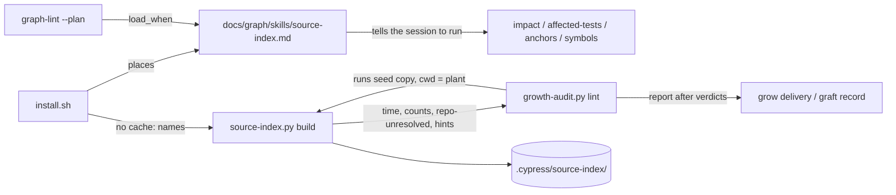

# grill.md: Plan of Record: round 8.1.2, tool surfacing (install, graft, grow)

## 0. Metadata
- Project: CYPRESS seed
- Feature or goal: make the placed source index found by topic in every plant and make what a plant must set before trusting it visible after install, grow and graft; patch 8.1.2 over 8.1.1
- Date: 2026-10-07
- Owner: the steward; the orchestrating session plans, briefs and commits
- Tier: T3. Protocol: `protocol.specify` (SPEC-0007 grows by an 8.1.2 slice), then `protocol.grill`
- Current phase: specified by `architect-8.1.2`; waiting for the owner's ruling on §12 questions 1 to 3, then product §3 and §9, tester §10, security and devils-advocate, then RED
- Related files: `skills/source-index/SKILL.md` (new), `manifest.json`, `tools/source-index.py`, `tools/growth-audit.py`, `install.sh`, `protocols/graft.md`, `protocols/grow.md`, `protocols/canonize.md`, `skills/toolcraft/SKILL.md`, the catalog template `tools/index.md` under `templates/docs/`, `tests/test-source-index.sh`, `tests/test-full-install.sh`, `tests/test-growth-audit.sh`, `tests/run.sh`
- Related documentation: `docs/plans/grill-8.1.0-source-index.md` (the round that built the tool; its §10 measurements); the steward plant's card `docs/graph/tools/source-index.md` (plant-written, read as evidence only)
- Related ADRs: [ADR-0030](../decisions/adr-0030-a-seed-tool-is-surfaced-by-a-seed-skill.md) (proposed: a placed seed tool is surfaced by a seed skill node); the round works under [ADR-0029](../decisions/adr-0029-source-index-is-derived-scratch.md) (the installer writes no cache) and [ADR-0021](../decisions/adr-0021-seed-only-procedures-stay-home.md) (the manifest names what the installer places)
- Related specs: [SPEC-0007](../specs/SPEC-0007-source-index.md) §4 "Surfacing (8.1.2)" (every contract of this plan); [SPEC-0001](../specs/SPEC-0001-install-placement.md) (unchanged: `SINGLE_WRITER`, `BACKUP_BEFORE_REPLACE` and the seed-skill placement the new skill rides on)
- Related libraries: none (stdlib Python and Git)
- Baseline: seed `main` at `e3b22be` (v8.1.1)

## 1. Artifact Discovery
- Existing files inspected: `install.sh` (`place_file` 389, `place_generated` 478, `place_graph_machinery` 1065 to 1087, which places every `skills/*/SKILL.md` as `docs/graph/skills/<name>.md`, `place_graph_scaffold` 1522 to 1586, `fill_plant_facts` 1588 onwards, the NEXT STEP banners 3226 to 3275); `manifest.json` (`tools`, `skills`, `templates`, `docs_skeleton`); `tools/graft-audit.py` (MODE 1 classes, the knowledge-overwrite flag, MODE 2 byte-identity); `tools/growth-audit.py` (`required_collections` 367, `collection_leaves` 573, `lint_collections` 1058, `VERDICTS`); `tools/graft-run.py` (steps 1 to 8); `templates/tool-page.template.md`; the catalog template `tools/index.md` under `templates/docs/`; `templates/knowledge-graph/_schema.md` ("Tiers": `tools/**` is Tier 3); `templates/knowledge-graph/graph-lint.py` (`KINDS`, `MACHINERY_DIRS`, `check_artifacts`)
- Existing docs inspected: `skills/toolcraft/SKILL.md`; `skills/context-router/SKILL.md` (frontmatter); `protocols/graft.md` (headings, Phase 7 gate table, output format); `protocols/grow.md` 630 to 660 (the Phase 2 `build --json` step); `templates/grill.template.md`; `templates/adr.template.md`
- Existing tests inspected: `tests/run.sh` (`ACTIVE_PLAN`, the spec-lint and grill-lint steps); `tests/graph-route-eval.sh` and `tests/graph-routes.golden.tsv` (the node-route corpus over a fresh install)
- Existing specs inspected: `docs/specs/SPEC-0007-source-index.md` (§2, §4 `SOURCE_INDEX_IS_PLACED`, `REPO_CLAIM_READ_ALIKE_BY_ROUTER_AND_ANCHORS`, §6 "Incomplete", "Query answer", "CLI", §7, §10); `docs/specs/SPEC-0001-install-placement.md` (§2, §4 `SINGLE_WRITER`, `BACKUP_BEFORE_REPLACE`, the 8.0.0 expertise contracts, §6 "Selective placement")
- Existing architecture signals: the router routes Tier-2 nodes only; seed skills are placed and refreshed on every install by `place_file`; `tools/` is a growth-audit collection, so a seed page there is a substantive leaf of every plant; the steward plant routes the tool through its own `subsystem.source-index`, and `graph-lint.py --plan "find where a function is defined"` loads no node there
- Libraries already wikified: none, no library is involved
- External sources downloaded: none
- Constraints discovered: the installer writes no source-index cache (SPEC-0007 `SOURCE_INDEX_IS_PLACED`, ADR-0029); `docs/graph/tools/index.md` and its cards are plant-owned (`skill.toolcraft`); a backup over plant-authored graph content is flagged by `graft-audit.py`; `SINGLE_WRITER` counts every in-place rewrite of a plant file; plants are read-only evidence for this round

## 2. Shared Understanding
The owner's words (2026-10-07), verbatim: "when doing graft do we create/add/update all the things the new tools need to be used and shine?", then, after the session's answer, "go do it. update graft and install/growth".

The session's answer named four gaps: no routable page for the tool in a plant, the seed-only user guides, `repo:` values that name nothing (turboquant holds six comma lists), and no prompt to write `docs/graph/source-index.json`. The owner approved (A) a seed tool card and catalog row in every plant, and (B) a checklist after install and graft, also reported by grow or growth-audit.

Success means: in any plant, a session that asks what depends on a file, which tests a change reaches, which pages cite a file or where a name is defined is routed to the tool; after an install, a grow or a graft the plant sees the build's time and counts, every `repo:` value that names nothing and the test-class hints, from one command, `source-index.py build`.

Design change from (A), put to the owner (§12 question 1, ADR-0030): a seed skill node, not a card, carries the tool, because a Tier-3 card is not routed and a seed card in `tools/` breaks growth-audit's `ABSENT` rows for that collection.

Out of scope (SPEC-0007 §2): seed cards or rows in a plant's `docs/graph/tools/`; a growth-audit verdict; the installer running the build; skills for the other placed tools; the seed-only user guides; editing any plant.

## 3. User Goal
- Primary user: a session in any plant; the steward after an install or graft
- Primary outcome: the tool is used when its question comes up, and its answers are trusted only once the plant's `repo:` values and test class are right
- Job to be done: find the tool by topic; see the setup items after each install, grow and graft
- Acceptance criteria (link to spec §9): SPEC-0007 §9, the 8.1.2 rows `product` adds
- Non-goals: fixing a plant's `repo:` values or test config by tool; gating a graft on a hint

## 4. Operating Constraints
- Runtime constraints: stdlib Python 3.12 or newer and Git; bash 3.2 syntax in `install.sh`; no new dependency
- Security constraints: `growth-audit.py` runs the seed's own `tools/source-index.py`, never plant code; the build stays read-only over repositories and writes only `.cypress/source-index/` (SPEC-0007 §5)
- Privacy constraints: synthetic fixtures only; no plant name in seed files or tests
- Data constraints: the cache stays derived scratch (ADR-0029); the plant config stays plant-owned and never placed
- Cost constraints: the batch sizes of `delegation.effort-scale`; batch per wave, no micro-loops (owner)
  - Plan approval (`grill.plan-approval`), 2026-10-07: the owner approved (A) and (B) in the session; the change from (A) waits for §12 question 1. Levers this plan uses: none defined beyond the batch sizes (default)
  - Owner-only prerequisites: the ruling on §12 questions 1 to 3, before RED (increment 2)
  - Scoped standing grant: none asked
- Latency constraints: `build` within SPEC-0007 §5; growth-audit's report bounded by `GROWTH_REPORT_TIMEOUT` (120 s)
- Compliance constraints: none
- Maintenance constraints: one home per rule (the build report in `tools/source-index.py`; growth-audit prints it, the installer names it); the seed reads as if the feature always existed; tests only for real contracts; doctrine edits carry no tests of their own, the lints are their proof (`crosscut.operator-seed-rounds` in the steward plant)

## 5. Research Summary
no external dependency — every increment uses stdlib Python and Git, which the seed's tools already use; no §9 row depends on a `docs/graph/libraries/` page. The evidence is the seed's own source (§1):
- The router's tiers: `templates/knowledge-graph/_schema.md` "Tiers" puts `docs/graph/tools/**` in Tier 3, loaded only when a Tier-2 node names it.
- Growth-audit: `required_collections` makes `tools/` a collection row; `lint_collections` turns an `ABSENT` row with an authored leaf into `CONTRADICTED`.
- Placement: `place_graph_machinery` places every `skills/<name>/SKILL.md` on every run; the skill projection writes `.claude/skills/<name>/SKILL.md` with no new code.
- Precedent for a tool's usage living in a skill: `skill.humanizer` with `prose-lint.py` as its floor.

## 6. Decisions Made
| Decision | Rationale | Evidence | Reversibility | ADR | Date |
|---|---|---|---|---|---|
| Design latitude: balanced | new structure only where the change needs it: one seed skill node, one report in an existing command | the owner, 2026-10-07: "go do it. update graft and install/growth" | reversible | — | 2026-10-07 |
| Tier T3 | a new seed skill, a changed CLI output, the installer and growth-audit | kernel §0 | not applicable | — | 2026-10-07 |
| Owning spec: SPEC-0007 alone, an 8.1.2 slice; SPEC-0001 unchanged | every new behaviour is about the source index; the installer's output for this tool already sits in SPEC-0007 (`SOURCE_INDEX_IS_PLACED`); the skill rides on SPEC-0001's existing seed-skill placement | SPEC-0007 §4 "Integration" | reversible | — | 2026-10-07 |
| The tool's seed-owned page in a plant is a seed skill node `skill.source-index`, not a card in `docs/graph/tools/` (pending §12 question 1) | a card is Tier 3 and not routed; a seed card breaks growth-audit's `tools/` rows; the skill is placed, refreshed, retired and projected by machinery that exists | §5; ADR-0030 | reversible | [ADR-0030](../decisions/adr-0030-a-seed-tool-is-surfaced-by-a-seed-skill.md) | 2026-10-07 |
| The checklist has one home, `source-index.py build`: time, counts, `repo-unresolved`, the test-declaration records, two hints | the rules it reports (`repo_kind`, `TEST_GLOBS`, the config) live in the tool and its helper; a second reader would be a second home | SPEC-0007 §6 "Build report" | reversible | — | 2026-10-07 |
| The installer names the build; it does not run it (pending §12 question 2) | the installer writes no cache (ADR-0029, `SOURCE_INDEX_IS_PLACED`); grow and graft run it anyway | SPEC-0007 `INSTALL_NAMES_THE_FIRST_BUILD` | reversible | — | 2026-10-07 |
| Growth-audit prints the build report after its verdicts, never a verdict, running the seed's copy (pending §12 question 3) | the owner named growth-audit; a report keeps the coverage gate's meaning; the seed copy runs no plant code and is current before the plant is | SPEC-0007 `GROWTH_AUDIT_PRINTS_THE_BUILD_REPORT` | reversible | — | 2026-10-07 |
| Test-name hints read a closed list of name patterns and never gate | a name is a guess about a project's habits; the owner rules on each hint | SPEC-0007 §6 `TEST_NAME_PATTERNS` | reversible | — | 2026-10-07 |
| A plant's `repo:` values are corrected by graft authors (Phase 6) and canonize, never by a tool | a comma list needs a choice of the one claim the node means | SPEC-0007 §7 `REPO_VALUE_UNRESOLVED` recovery | reversible | — | 2026-10-07 |

## 7. Options Considered
| Option | Benefits | Costs | Risks | Outcome |
|---|---|---|---|---|
| (A) seed card in `docs/graph/tools/` plus a seed block in `tools/index.md` | the owner's approved shape; a catalog row | still needs a Tier-2 node to be routed; a provenance rule, a growth-audit exclusion, a `--unfilled` block reader, a second SINGLE_WRITER exception, a backup class | every plant with an `ABSENT` `tools/` row fails its next graft gate until the exclusion lands | rejected for ADR-0030, put to the owner (§12 question 1) |
| (S) seed skill `skill.source-index` | routed by `load_when`; native host skill; no new mechanism; plant cards untouched | a sixteenth seed skill; the figures in README and the reference pages move at release | a plant skill of the same name is backed up (none known) | chosen, pending question 1 |
| Phrases on `skill.context-router` | no new node | a second subject in a node most tasks load | dilutes the knowledge rule's routing | rejected |
| A new subcommand `check` for the checklist | `build` output unchanged | a sixth verb for what `build` already computes | two commands to name | rejected: `build` is the command the owner named |
| Growth-audit verdict on report lines | forces a fix | a hint is a guess; a verdict blocks a graft on it | false blocks | rejected: report only |

## 8. Architecture Plan
- System boundary: the seed's `tools/source-index.py` (domain: the build report), `tools/growth-audit.py` and `install.sh` (adapters that print it or name it), and one seed skill node (knowledge); no plant file is written by any of them beyond the cache a build writes
- Main components: `skills/source-index/SKILL.md` (routing and usage); `build`'s report (§6 "Build report"); `install.sh` `FIRST_BUILD_STEP`; `growth-audit.py`'s report block
- Interfaces: `build` text view and `--json` keys `seconds` and `hints` (`ANSWER_SCHEMA` `/1`, keys added); growth-audit `--json` key `source_index_report`
- Data flow:

- Error handling: a failed or slow report prints `GROWTH_REPORT_FAILED` and changes nothing else (SPEC-0007 §7)
- Observability: the report lines in the growth-audit output, kept by `graft-run.py` under `<stage>/graft-run-logs/`
- Security posture: no plant code runs from a seed tool; the build's existing guarantees hold
- Deployment model: seed release 8.1.2; plants receive it by install or graft. How plants pick it up: a fresh install places the skill and prints the next step; an existing plant's graft places the skill (every install fast-forwards seed skills), its Phase 7 growth-audit run prints the report, and Phase 6 corrects the `repo:` values it names
- Environment parity: not applicable, no deploy chain

## 9. Implementation Plan

Increments are inline; numbers are dependency order. Increment 1 carries the slice-1 and slice-2 contracts this plan leaves as they are. RED (increment 2) waits for the owner's ruling on §12 questions 1 to 3.

| Spawn | Increments | Worker | Batch rule (`delegation.effort-scale`) |
|---|---|---|---|
| — | 1 | none | carried from the 8.1.0 plan, no spawn |
| R1 | 2 | `tester` | RED medium: one spawn, seven cases |
| G1 | 3 | `implementer` | GREEN medium: one |
| G2 | 4, 5 | `implementer` | GREEN medium-low: two |
| P1 | 6 | one writer | prose, one file set |
| V1 | 7 | session | verify and one measurement |

G1 and G2 may run side by side after R1: their files are disjoint.

### Increment 1 — Carried: the slice-1 and slice-2 contracts
- Spec contracts: SPEC-0007/BUILD_INVENTORIES_THE_CODE_OF_EVERY_GOVERNED_REPOSITORY, SPEC-0007/BUILD_IS_DETERMINISTIC, SPEC-0007/CACHE_WRITTEN_SELF_IGNORED, SPEC-0007/CACHE_REUSED_WHILE_THE_KEY_HOLDS, SPEC-0007/CACHE_REBUILT_WHEN_THE_KEY_CHANGES, SPEC-0007/GRAFT_REBUILDS_THE_CACHE, SPEC-0007/LINK_PYTHON_IMPORT_CERTAIN, SPEC-0007/LINK_SHELL_INVOCATION_CERTAIN, SPEC-0007/LINK_PATH_LITERAL_AND_DIRECTORY_ARE_MAYBE, SPEC-0007/LINK_TS_SPECIFIER_CERTAIN, SPEC-0007/UNPINNED_REFERENCE_RECORDED_WITH_ITS_REASON, SPEC-0007/TESTS_ARE_THE_PLANTS_TEST_GLOBS, SPEC-0007/PLANT_CONFIG_REPLACES_EACH_DEFAULT_KEY, SPEC-0007/WALK_NEAREST_FIRST_ONCE, SPEC-0007/WALK_CHAIN_IS_ITS_WEAKEST_LINK, SPEC-0007/WALK_FLOOR_LISTED_APART_AFTER_THE_INPUT_ROWS, SPEC-0007/WALK_DELETED_INPUT_REACHES_ITS_NAMERS, SPEC-0007/INPUT_FORMS_RESOLVED, SPEC-0007/WALK_INCOMPLETE_NAMES_REASON_AND_ACTION, SPEC-0007/AFFECTED_TESTS_ARE_THE_WALK_FILTERED, SPEC-0007/AFFECTED_ALWAYS_RUN_LISTED_APART, SPEC-0007/ANCHORS_NAME_CITING_PAGES_OR_UNCITED, SPEC-0007/ANCHORS_BASENAME_IS_MAYBE_AMBIGUOUS_IS_INCOMPLETE, SPEC-0007/OUTPUT_CARRIES_NO_RAW_CONTROL, SPEC-0007/SOURCE_INDEX_IS_PLACED, SPEC-0007/SYMBOLS_PYTHON_DEFINITIONS_CERTAIN, SPEC-0007/SYMBOLS_LINE_READ_DECLARATIONS_ARE_MAYBE, SPEC-0007/SYMBOLS_LIST_EVERY_DEFINITION, SPEC-0007/SYMBOLS_UNREADABLE_FILE_MAKES_IT_INCOMPLETE, SPEC-0007/HISTORY_ROWS_ARE_MAYBE_WITH_THEIR_COUNT, SPEC-0007/HISTORY_ONLY_ADDS, SPEC-0007/HISTORY_SHALLOW_OR_MISSING_IS_INCOMPLETE, SPEC-0007/ANCHORS_MOVED_EQUALS_THE_NAMED_PATHS, SPEC-0007/ANCHORS_MOVED_WITHOUT_A_LIST_IS_INCOMPLETE, SPEC-0007/REPO_CLAIM_READ_ALIKE_BY_ROUTER_AND_ANCHORS
- Files touched: none
- Tests to write (RED): none — implemented and green at `68c970e` under `docs/plans/grill-8.1.0-source-index.md` increments 3 to 20; this plan changes none of them, and `build`'s added report keeps their outputs (the count line and `ANSWER_SCHEMA` `/1`)
- Behavior added: none
- Gate: their §10 rows stay green in increment 7's full gate
- Rollback path: none needed
- Effort: low
- Phase: GREEN, done in 8.1.0
- Depends on: none

### Increment 2 — RED for the 8.1.2 contracts
- Spec contracts: SPEC-0007/SOURCE_INDEX_SKILL_ROUTES_ITS_FOUR_QUESTIONS, SPEC-0007/BUILD_REPORTS_ITS_TIME_AND_COUNTS, SPEC-0007/BUILD_NAMES_REPO_VALUES_THAT_NAME_NOTHING, SPEC-0007/BUILD_NAMES_TESTS_OUTSIDE_THE_TEST_CLASS, SPEC-0007/BUILD_HINTS_EXCLUDE_FOR_NON_TEST_FILES, SPEC-0007/INSTALL_NAMES_THE_FIRST_BUILD, SPEC-0007/GROWTH_AUDIT_PRINTS_THE_BUILD_REPORT
- Files touched: `tests/test-source-index.sh` (the build and skill cases), `tests/test-full-install.sh` (the next-step case), `tests/test-growth-audit.sh` (the report case and its `SOURCE_INDEX_REPORT_UNAVAILABLE` arm), `tests/run.sh` (`ACTIVE_PLAN` to this plan), SPEC-0007 §10 file cells and status `active`
- Tests to write (RED): 7 cases, one per contract above, the tester names them; failure arms inside them as §10 says
- Behavior added: none; every case fails for the missing behaviour, not for a fixture error
- Gate: the seven cases fail; the rest of `tests/run.sh` stays green
- Rollback path: revert the RED commit
- Effort: medium
- Phase: RED
- Depends on: none

### Increment 3 — The build report
- Spec contracts: SPEC-0007/BUILD_REPORTS_ITS_TIME_AND_COUNTS, SPEC-0007/BUILD_NAMES_REPO_VALUES_THAT_NAME_NOTHING, SPEC-0007/BUILD_NAMES_TESTS_OUTSIDE_THE_TEST_CLASS, SPEC-0007/BUILD_HINTS_EXCLUDE_FOR_NON_TEST_FILES
- Files touched: `tools/source-index.py`
- Tests to write (RED): none here; increment 2 holds them
- Behavior added: `build` prints `BUILD_TIME_LINE`, adds `repo-unresolved`, `no-test-declaration` and `no-test-files` to its `incomplete`, and adds `hints` (§6 "Build report"); the answer gains `seconds` and `hints`; the cache is unchanged
- Gate: the four cases green; `tests/test-source-index.sh` whole green
- Rollback path: revert the commit
- Effort: medium
- Phase: GREEN
- Depends on: increment 2

### Increment 4 — The seed skill
- Spec contracts: SPEC-0007/SOURCE_INDEX_SKILL_ROUTES_ITS_FOUR_QUESTIONS
- Files touched: `skills/source-index/SKILL.md` (new: node frontmatter with `id: skill.source-index`, `origin: seed`, `load_when` phrases that route `SKILL_ROUTE_TASKS` and their everyday wording, a `description` for host skills; a body in the sections of `templates/tool-page.template.md` written for any plant: invocation, outputs, when to use and when not, `docs/graph/source-index.json`, pitfalls, and the protocols that call it), `manifest.json` (`skills` entry)
- Tests to write (RED): none here; increment 2 holds it
- Behavior added: the tool is routed by topic in every plant and projected into each harness's skills
- Gate: the skill case green; `graph-lint.py` and `agent-lint.py --lint` clean on a fresh install; `tests/graph-route-eval.sh` ratchets hold
- Rollback path: revert the commit
- Effort: medium-low
- Phase: GREEN
- Depends on: increment 2
- Structure added: one seed skill node; its one responsibility is how a session uses the placed source index; the variation that justifies it is real now (four questions no seed node routes)

### Increment 5 — The installer's next step and growth-audit's report
- Spec contracts: SPEC-0007/INSTALL_NAMES_THE_FIRST_BUILD, SPEC-0007/GROWTH_AUDIT_PRINTS_THE_BUILD_REPORT
- Files touched: `install.sh` (the `FIRST_BUILD_STEP` lines before the closing banner, printed when the target holds no `.cypress/source-index/`), `tools/growth-audit.py` (the report after the verdicts; `GROWTH_REPORT_HEAD`, `GROWTH_REPORT_FAILED`, `GROWTH_REPORT_TIMEOUT`; `--json` `source_index_report`; nothing in `--plan` or `--agents`)
- Tests to write (RED): none here; increment 2 holds them
- Behavior added: the next step after an install; the report at every grow and graft lint
- Gate: both cases green; `tests/test-full-install.sh`, `tests/test-growth-audit.sh` and `seed-lint` (install write sites unchanged: a log line is no write) green
- Rollback path: revert the commit
- Effort: medium-low
- Phase: GREEN
- Depends on: increment 2

### Increment 6 — Protocol and template wiring
- Spec contracts: none; doctrine text, proved by the lints that already run
- Files touched: `protocols/graft.md` (Phase 6: correct each `repo:` value growth-audit's report names, one plant-relative path that exists or none; Phase 7 and the output format: a "Source index after the graft" section recording the report and what was done with each line, hints put to the owner as next steps); `protocols/grow.md` (the delivery records the report of its last growth-audit run); `protocols/canonize.md` (a `repo-unresolved` record from `anchors --moved` is corrected in the same close-out); `skills/toolcraft/SKILL.md` and the catalog template `tools/index.md` under `templates/docs/` (one sentence each: the seed's placed tools are described by seed skills and need no catalog row; a plant may still write its own card)
- Tests to write (RED): none — doctrine text; proved by `seed-lint`, `graph-lint` on a fresh install and the route corpus
- Behavior added: graft, grow and canonize act on the report
- Gate: `tests/run.sh` green
- Rollback path: revert the commit
- Effort: low
- Phase: prose
- Depends on: increments 3, 4, 5

### Increment 7 — Verify and one measurement
- Spec contracts: every 8.1.2 contract
- Files touched: SPEC-0007 §10 statuses and status `implemented`; this plan's §10
- Tests to write (RED): none — verification
- Behavior added: none; the full gate, then `build` on scratch copies of two plants (never the plants), its time and findings recorded in §10
- Gate: `tests/run.sh` whole green; the measurement recorded
- Rollback path: none needed
- Effort: low
- Phase: prose
- Depends on: increment 6

No consolidation increment: the round adds seven cases to three existing suites, one per contract.

## 10. Verification Plan
Covered by the seed's standard gate, `tests/run.sh`. One addition: increment 7 runs `build` on scratch copies of two plants, a TypeScript plant and the plant with comma-list `repo:` values, and records the time, counts and findings here; it is a measurement, not a gate.

## 11. Risks and Mitigations
| Risk | Probability | Impact | Mitigation | Owner | Verification |
|---:|---:|---:|---|---|---|
| The skill's `load_when` also catches unrelated tasks and shifts the route corpus | 0.3 | 2 | the phrases name the four questions; `tests/graph-route-eval.sh` ratchets gate it | implementer | increment 4 gate |
| The test-name hints fire on a whole fixture tree and read as noise | 0.5 | 1 | counts and five paths only; one `exclude` key, even `[]`, ends the hint | architect | increment 7 measurement |
| growth-audit takes seconds longer on a large plant | 0.5 | 1 | `GROWTH_REPORT_TIMEOUT`; the build is the measured 0.7 to 3.7 s | implementer | increment 7 measurement |
| The owner keeps the card shape (§12 question 1) | 0.3 | 3 | ADR-0030 lists the card design's extra contracts; the build report, installer and growth-audit increments stand either way | architect | the ruling |

## 12. Open Questions
| # | Question | Why it matters | Current assumption | How to resolve | Owner | Pinned by |
|---:|---|---|---|---|---|---|
| 1 | **do-not-guess.** Surface the tool through a seed skill instead of the approved card in `docs/graph/tools/` and a catalog row? | the router only follows Tier-2 nodes, so a card alone is never found; a seed card in `tools/` makes plants that recorded "no tools of our own" fail growth-audit | a seed skill `skill.source-index` (ADR-0030) | the owner's ruling | owner | SPEC-0007 SOURCE_INDEX_SKILL_ROUTES_ITS_FOUR_QUESTIONS |
| 2 | **do-not-guess.** Should the installer only name the first build, or run it? | running it writes the cache the installer never writes (ADR-0029) and adds seconds to every install; naming it relies on someone reading the line | name it; grow and graft run it through growth-audit | the owner's ruling | owner | SPEC-0007 INSTALL_NAMES_THE_FIRST_BUILD |
| 3 | **do-not-guess.** May growth-audit run the source index on the plant (it writes the plant's `.cypress/source-index/` cache) and print the report as advice, never as a verdict? | the owner named growth-audit; a verdict would block a graft on a guess | yes, advice only, the seed's copy | the owner's ruling | owner | SPEC-0007 GROWTH_AUDIT_PRINTS_THE_BUILD_REPORT |
| 4 | Settled, owner may veto: only the source index gets a seed skill now; `code-anchor.py`, `status-register.py`, `prose-lint.py` and the linters wait | scope | none now | veto | owner | — |
| 5 | Settled, owner may veto: a test-file name list (`test_*.py`, `*.spec.*` and the rest of `TEST_NAME_PATTERNS`) is used only for hints | a name is a guess | hints only | veto | owner | SPEC-0007 BUILD_NAMES_TESTS_OUTSIDE_THE_TEST_CLASS |
| 6 | Settled, owner may veto: the round ships as 8.1.2, as the owner set, though it adds a seed skill | version label only | 8.1.2 | veto | owner | — |
| 7 | Settled, owner may veto: the seed-only user guides stay seed-only; the skill carries what a plant session needs | the guides describe the seed for its steward | unchanged | veto | owner | — |

## 13. Done Criteria
- Every 8.1.2 row of SPEC-0007 §10 is green and `tests/run.sh` is green whole.
- In a fresh install, the four `SKILL_ROUTE_TASKS` load `skill.source-index`.
- The increment 7 measurement is recorded in §10.
- The release procedure's one documentation pass has run (`CHANGELOG.md`, the skill count in `README.md` and the reference pages).

## 14. Recommended Next Step
Put §12 questions 1 to 3 to the owner, then brief product (§3, §9), tester (§10), security and devils-advocate on SPEC-0007 "Surfacing (8.1.2)".

## 15. Changelog
- 2026-10-07: created by `architect-8.1.2` from the owner's request ("go do it. update graft and install/growth"); SPEC-0007 8.1.2 slice and ADR-0030 written; RED waits for §12 questions 1 to 3.
